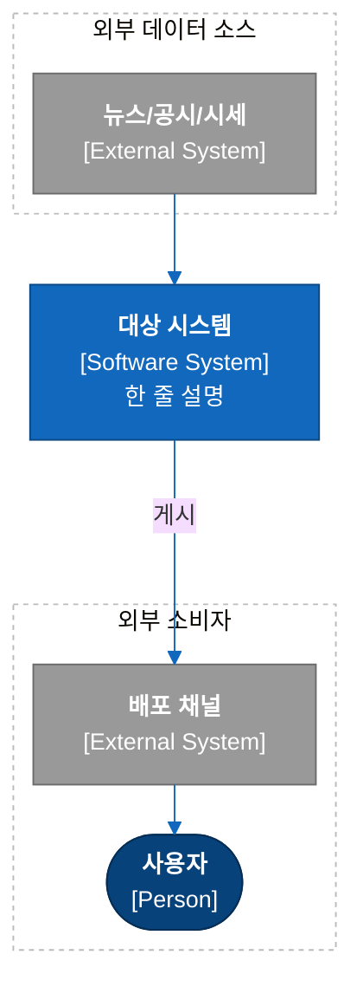
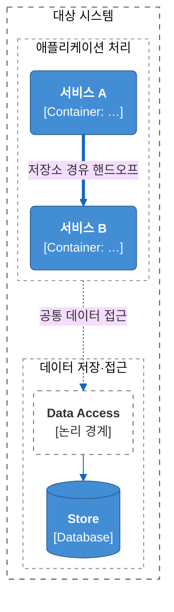
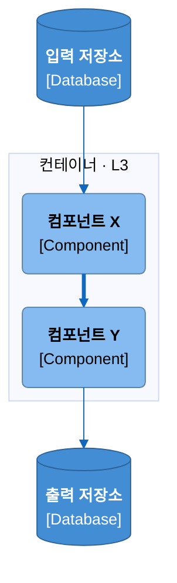
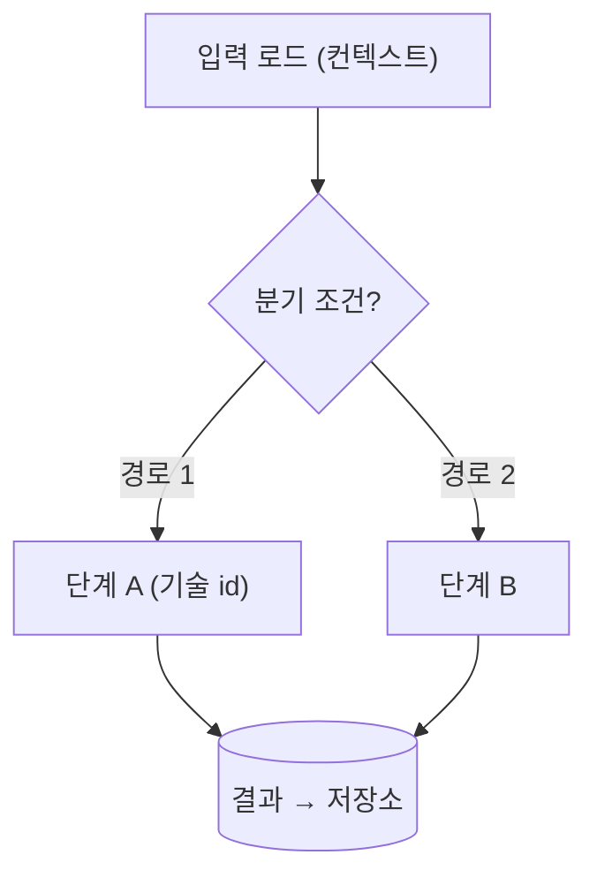

# C4 Mermaid Diagrams

Markdown 안에 넣어 그대로 렌더되는(MkDocs Material·GitHub) **C4 아키텍처 다이어그램을 Mermaid로** 그리는 규칙·색 키·템플릿의 SSOT. 이미지 파일을 만들지 않는다 — 소스가 곧 산출물이고 텍스트/git 친화적이다.

## 언제 쓰나 / 안 쓰나

- **쓴다**: 설계 문서(baseline/architecture 등) 안에 C4 L1/L2/L3 정적 뷰 또는 짝이 되는 동적(런타임) 뷰를 mermaid로 그릴 때.
- **안 쓴다**: 발표용 정밀 이미지·거대 도형세트·편집 가능한 산출물 → `drawio-skill`. 디자인된 인포그래픽/원페이저 → `svg-infographic`. 정식 UML 클래스/시퀀스 → drawio 또는 mermaid classDiagram/sequenceDiagram(이 스킬 범위 밖).

## 4개 뷰

| 뷰 | 무엇 | init 블록 | 소유 |
|---|---|---|---|
| L1 시스템 컨텍스트 | 시스템 ↔ 사람·외부 시스템 | ELK(아래) | 아키텍처 문서 |
| L2 컨테이너 | 시스템 내부 배포/실행 단위 + 저장소 | ELK(아래) | 아키텍처 문서 |
| L3 컴포넌트 | 한 컨테이너 내부 구성요소 | ELK(아래) | 각 모듈/설계 문서 |
| 동적/런타임 | 시나리오 흐름(정적 위에 겹치는 보조 뷰) | **없음**(plain) | 해당 스코프 문서 |

정적/동적은 폴더가 아니라 **문서 안의 이웃 섹션**이다(arc42 §5/§6).

## 색 & 모양 키 (고정 — C4 model 표준)

색은 장식이 아니라 **요소 종류를 인코딩**한다. 아래 hex를 바꾸지 않는다.

| 요소 | 모양(mermaid) | classDef (fill / stroke / text) |
|---|---|---|
| Person | `([...])` stadium | `person` — `#08427b` / `#052e56` / `#fff` |
| Software System (초점) | `[...]` rect | `system` — `#1168bd` / `#0b4884` / `#fff` |
| External System | `[...]` rect | `external` — `#999999` / `#6b6b6b` / `#fff` |
| Container | `[...]` rect | `container` — `#438dd5` / `#2e6295` / `#fff` |
| Database / Store | `[(...)]` cylinder | `database` — `#438dd5` / `#2e6295` / `#fff` |
| Component (L3) | `[...]` rect | `component` — `#85bbf0` / `#5d82a8` / `#000` |
| Boundary(논리 경계) | `(...)` rounded | `boundaryEl` — `#fff` / `#666` / `#333` + `stroke-dasharray:5 5` |
| Decision(동적 뷰) | `{...}` | (기본) |

**노드 라벨 규약**: `"<b>이름</b><br/>[Stereotype]<br/>한 줄 설명"` — 굵은 이름 + `[유형]` + 짧은 설명. 예: `NEWS["<b>뉴스 공급자</b><br/>[External System]"]`.

classDef 선언(맨 위, 그 뷰에서 쓰는 것만):
```
classDef person fill:#08427b,stroke:#052e56,color:#fff
classDef system fill:#1168bd,stroke:#0b4884,color:#fff
classDef external fill:#999,stroke:#6b6b6b,color:#fff
classDef container fill:#438dd5,stroke:#2e6295,color:#fff
classDef database fill:#438dd5,stroke:#2e6295,color:#fff
classDef component fill:#85bbf0,stroke:#5d82a8,color:#000
classDef boundaryEl fill:#fff,stroke:#666,color:#333,stroke-dasharray:5 5
```

## 라벨·대비·접근성 (svg-infographic 이식)

svg-infographic이 손 SVG에서 지키는 규율 중 mermaid에도 유효한 것만 가져온다. 좌표 산수·커넥터 코리도어·아이콘 원·캔버스 프리셋은 **ELK 자동배치가 대체**하므로 이식하지 않는다.

- **라벨 텍스트 예산** — 노드 라벨은 `<br/>`로 2–3줄 이내, 줄당 ~28–36 Latin자, **한글은 그 ~60%(≈18–22자)**. mermaid도 자동 줄바꿈이 없다시피 하니 긴 토큰은 미리 줄인다. 설명은 한 줄로.
- **대비(contrast)** — 진한 fill(person·system·external·container·database)은 **흰 텍스트**, 옅은 fill(component `#85bbf0`)은 **검은 텍스트**. 색 키가 이미 이 규칙을 따르며, 새 classDef를 만들 때도 이 AA 대비를 지킨다.
- **접근성** — `<title>`/`<desc>`의 mermaid 대응은 다이어그램 첫 줄 `accTitle:`·`accDescr:` 디렉티브다. 스크린리더·검색용으로 정적 뷰마다 한 줄 단다:
```
flowchart TB
    accTitle: 시스템 컨텍스트 (C4 L1)
    accDescr: 뉴스·공시·시세 소스가 설명 시스템으로 들어가 MTS로 게시된다
```
- **결론형 캡션** — 다이어그램 위/아래 한 줄은 "그림 N"이 아니라 **아키텍처 요점**을 말한다(예: "가격이 먼저 scope를 정하고 그 안에서만 이벤트를 본다"). svg의 conclusion-first title의 mermaid판.
- **역할=색(단일 토큰)** — 한 노드 = 한 semantic 색 family(fill+같은계열 stroke+대비 텍스트). classDef 하나만 고치면 전 다이어그램 recolor — svg의 단일 `<style>` 토큰 블록과 동형.

## ELK init 블록 (레이아웃 최적화 — L1/L2/L3에 필수)

기본 dagre 대신 **ELK 렌더러 + 직교 라우팅**을 강제해 박스가 겹치지 않고 엣지가 깔끔하게 꺾인다. 정적 뷰 mermaid 맨 앞에 그대로 붙인다:

```
%%{init: {
  "flowchart": { "defaultRenderer": "elk", "curve": "linear" },
  "theme": "base",
  "themeVariables": { "lineColor": "#1168bd", "textColor": "#333333", "fontSize": "14px" },
  "elk": {
    "edgeRouting": "ORTHOGONAL",
    "nodePlacementStrategy": "BRANDES_KOEPF",
    "mergeEdges": false,
    "ranksep": 90,
    "nodeSpacing": 70
  }
}}%%
```

- `defaultRenderer: elk` + `edgeRouting: ORTHOGONAL` — 직교(ㄱ자) 엣지. `curve: linear`로 곡선 제거.
- `nodePlacementStrategy: BRANDES_KOEPF` — 계층 정렬 안정화.
- `mergeEdges: false` — 엣지 합쳐 보기 흐려지는 것 방지.
- `ranksep: 90` 고정, **`nodeSpacing`은 줌 레벨에 따라: L1 `70` · L2 `60` · L3 `55`** (안으로 들어갈수록 조밀).
- **동적/런타임 뷰는 이 블록을 붙이지 않는다**(plain `flowchart TD`/`LR`).

## 엣지 어휘

| 표기 | 의미 |
|---|---|
| `-->` | 의존/관계 (라벨: `-->|"uses"|`) |
| `==>` | **주 흐름·배치 핸드오프** (굵게). 일반 의존엔 쓰지 않는다 |
| `-.->` | 선택/제안(proposed)/크로스컷 (점선, 라벨 권장: `-.->|"공통 데이터 접근"|`) |

방향: L1/L2는 `flowchart TB`, 동적 뷰는 `TD`/`LR`.

## 경계·레인 스타일

```
style SYS fill:none,stroke:#444444,stroke-dasharray:6 6      %% 시스템 경계(가장 굵은 대시)
style APP fill:none,stroke:#888888,stroke-dasharray:4 4      %% 내부 레인(처리/데이터 그룹)
style INPUTS fill:none,stroke:#bbbbbb,stroke-dasharray:3 3   %% 외부 입력/출력 그룹(가장 옅은 대시)
```
대시 굵기로 경계 위계를 표현: 시스템(6 6) > 레인(4 4) > 외부 그룹(3 3). "Data Access Boundary" 같은 논리 경계 노드는 `boundaryEl` 클래스.

## 템플릿

### L1 — 시스템 컨텍스트


### L2 — 컨테이너


### L3 — 컴포넌트 (한 컨테이너 내부)


### 동적 / 런타임 뷰 (init 없음, plain)

plain-language 라벨 + `(기술 id)` 병기, 결정은 `{...}`, 저장소 sink는 `[(...)]`. 정적 C4 위에 겹치는 보조 뷰.

## 소유권 규약

- **이 스킬**: 그리기 규칙 + 색/모양 키(범례).
- **요소 상태·기술 lineage 표**(current/제안 등): 다이어그램 안에 재서술하지 말고 owner 문서(아키텍처/모듈)의 표가 소유. 다이어그램은 그림만.
- **L3 컴포넌트·동적 흐름**: 각 컨테이너의 설계/모듈 문서가 소유.

## 작성 체크리스트

- [ ] L1/L2/L3 mermaid 맨 앞에 ELK init 블록(레벨별 `nodeSpacing` 70/60/55). 동적 뷰는 init 없음.
- [ ] 모든 노드에 classDef 지정. 라벨 = `<b>이름</b><br/>[유형]<br/>설명`.
- [ ] Person = stadium `([...])`, DB = cylinder `[(...)]`, Boundary = dashed rounded. rect로 그리지 않기.
- [ ] 색은 고정 키만. 임의 색 금지.
- [ ] 엣지 의미 일치: `-->` 의존 / `==>` 주 흐름·핸드오프 / `-.->` 선택·제안.
- [ ] 경계 대시 위계: 시스템 6 6 > 레인 4 4 > 외부 그룹 3 3.
- [ ] 상태/기술 표는 owner 문서에, 그림엔 넣지 않기.
- [ ] 라벨 텍스트 예산: 2–3줄·한글 줄당 ≈18–22자 이내(긴 토큰 축약).
- [ ] 대비: 진한 fill→흰 텍스트 / 옅은 fill→검은 텍스트.
- [ ] 정적 뷰에 `accTitle:`·`accDescr:` 1줄.
- [ ] 캡션은 요점(결론)형.
- [ ] 렌더 확인: MkDocs 포털·mermaid.live에서 라벨 overflow·엣지 라우팅·한글 tofu 육안 점검.

## 안티패턴

- init/ELK 블록 누락 → dagre로 폴백, 엣지 겹침·라우팅 악화.
- `==>`를 일반 의존에 남발(주 흐름/핸드오프 전용).
- Person/DB를 plain rect로.
- 요소 상태·기술 lineage를 다이어그램 안에 중복 서술.
- 색 키를 벗어난 임의 fill.
- 라벨 과밀(줄 넘침) 또는 대비 위반(옅은 fill에 흰 텍스트).
- 캡션이 "그림 N" 같은 라벨(요점 없음).
