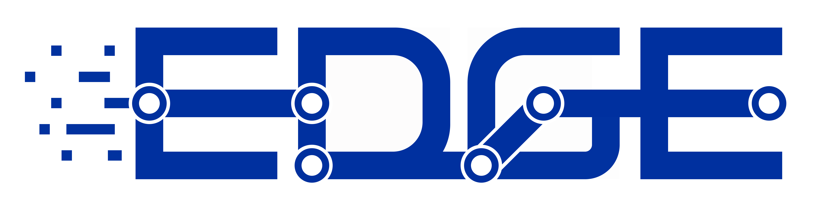

# edge

증권사 MTS 안에서 ETF 가격 변동의 이유를 공개 정보 기반 변동 요인 후보로 설명하는, 증권사가 통제 가능한 운영 인프라(B2B)입니다.

<!-- 이 README 는 쇼케이스(이력서·포트폴리오) 용도다. 저장소 구조·개발 규약은 하단 "개발 문서" 링크 참조. -->

## 1. 프로젝트 개요

### 1-1. 프로젝트 소개

MTS에는 내 종목이 오늘 왜 움직였는지 보여주는 화면이 없습니다. EDGE는 공시·뉴스·수급 같은 공개 정보를 수집·분석해 가격 변동의 요인 후보를 만들고, 증권사가 검수를 거쳐 자기 MTS에 게시합니다. 생성한 글을 그대로 내보내는 도구가 아니라, 금칙어·확신도 기준·검수 큐·감사 로그로 증권사가 노출을 통제하는 운영 인프라입니다.

납품 형태는 BYOC(Bring Your Own Cloud)입니다. 벤더가 수집·분석 플레인(control plane)을 운영하고, 서빙·검수 플레인(data plane)은 증권사 명의 클라우드 계정 안에서 돕니다. 고객(투자자) 데이터는 증권사 관리 환경 밖으로 나가지 않습니다.

### 1-2. 시스템 구성도

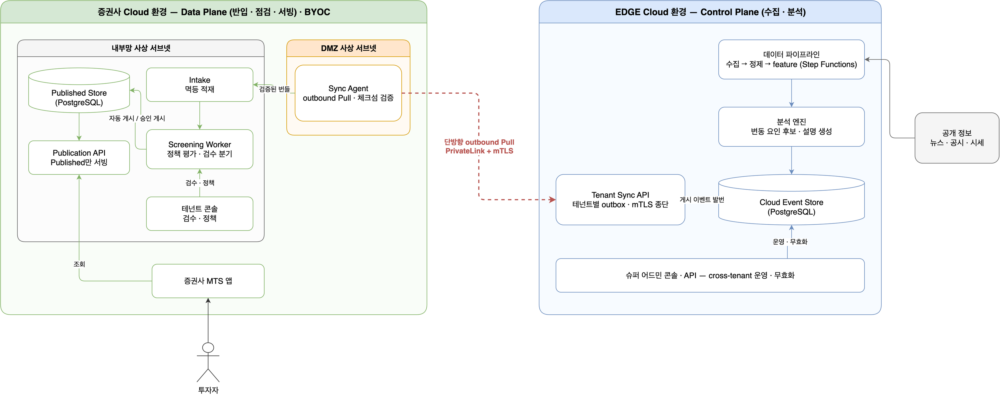

오른쪽 EDGE 환경이 공개 정보를 수집·분석해 설명을 만들면, 왼쪽 증권사 환경이 이를 받아 점검을 거쳐 MTS에 서빙합니다. 두 환경을 잇는 연결은 증권사 쪽에서 여는 단방향 Pull 하나이고, 고객 데이터는 증권사 환경 밖으로 나가지 않습니다.

아키텍처 다이어그램 전체(인터랙티브)는 [아키텍처 포털](https://alphaeveryday.github.io/edge-pages)에서 확대해 볼 수 있습니다.

### 1-3. 주요 기능 · 데모

- **MTS AI 탭 데모** — 가상 MTS 화면에서 종목 36종의 실시간 시세(증권사 공식 Open API 프록시)와 게시된 변동 요인 설명·근거 원문 링크를 확인할 수 있습니다. 실서버(EC2 데모 박스 + CloudFront)에 상시 배포되어 있습니다.
- **테넌트 콘솔** — 검수 큐(승인·반려), 정책 룰(금칙어·최소 근거 수·최소 확신도), 제공 범위(scope) 관리, 면책 문구 설정.
- **슈퍼 어드민 콘솔** — cross-tenant 게시 현황·무효화(회수), 수집 원천 관측.

데모는 [demo-mts.edgesignal.dev](https://demo-mts.edgesignal.dev)에서 로그인 없이 열립니다.

  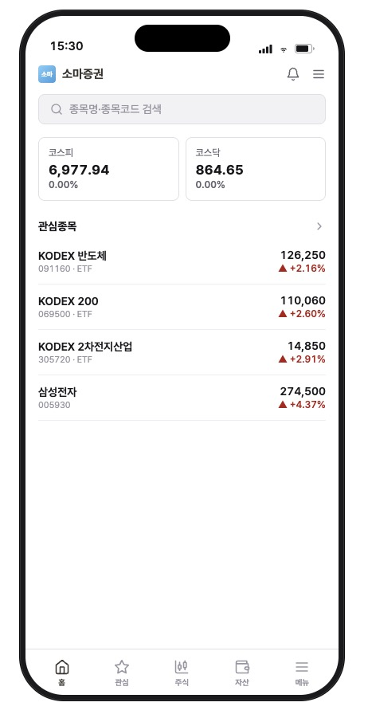
  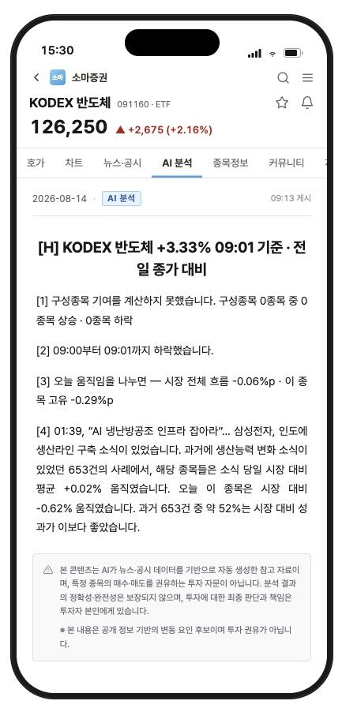

투자자가 보는 화면입니다. 종목 상세의 AI 분석 탭에서 변동 요인 설명과 그 근거를 확인하며, 계산하지 못한 항목은 계산하지 못했다고 밝힙니다.

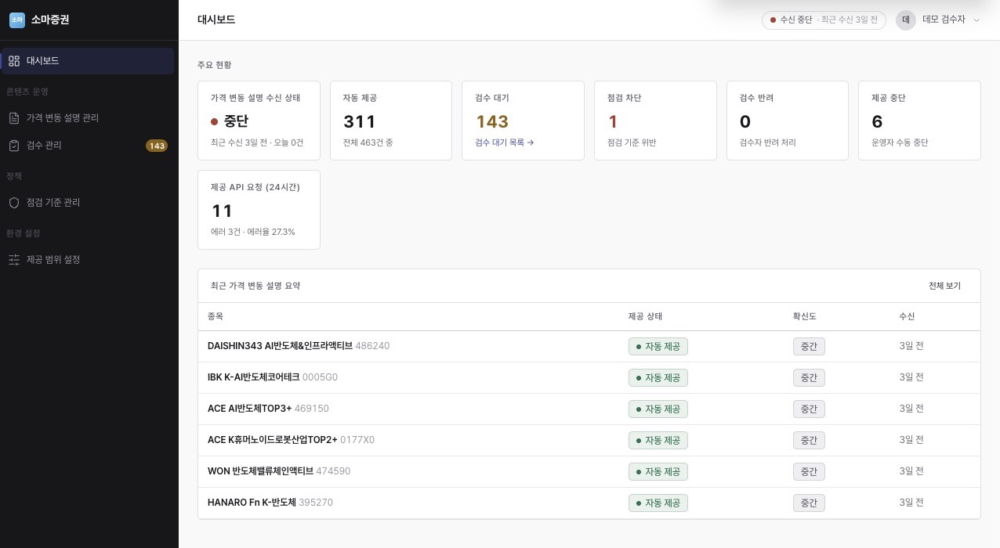

증권사 검수자가 보는 화면입니다. 자동으로 나간 건과 사람 손을 기다리는 건이 한 화면에서 잡히고, 설명이 며칠째 들어오지 않으면 수신 상태가 먼저 알립니다.

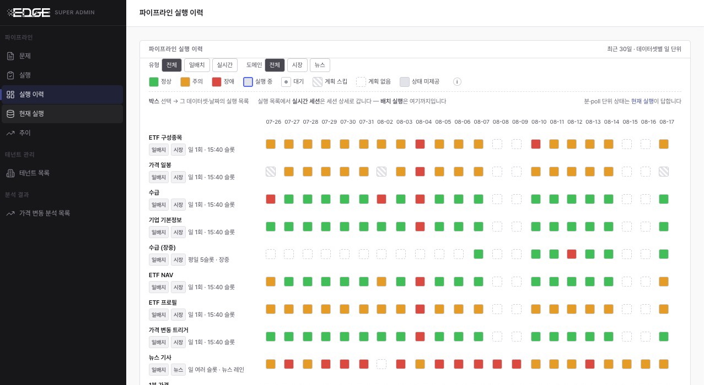

플랫폼 운영자가 보는 화면입니다. 설명의 재료가 되는 수집 레인이 그날 어떤 상태였는지 데이터셋별로 하루 한 칸씩 확인합니다.

### 1-4. 기술 스택

세 런타임을 한 저장소에서 관리하는 폴리글랏 모노레포입니다.

- **JVM** — Spring Boot 4 · Gradle 멀티모듈(앱 7 + 라이브러리 2) · Flyway · JPA/JdbcTemplate 병행
- **Node** — React 콘솔 UI 2종 + 공유 디자인 시스템(ui-kit) · pnpm workspace
- **Python** — 데이터 파이프라인 · 분석 엔진 · 온톨로지 SSOT · uv workspace
- **인프라** — AWS(ECS Fargate·Step Functions·RDS PostgreSQL·Athena/Iceberg·CloudFront) · Terraform(그린필드 IaC) · GitHub Actions

## 2. 개발 결과물

### 2-1. Information Architecture

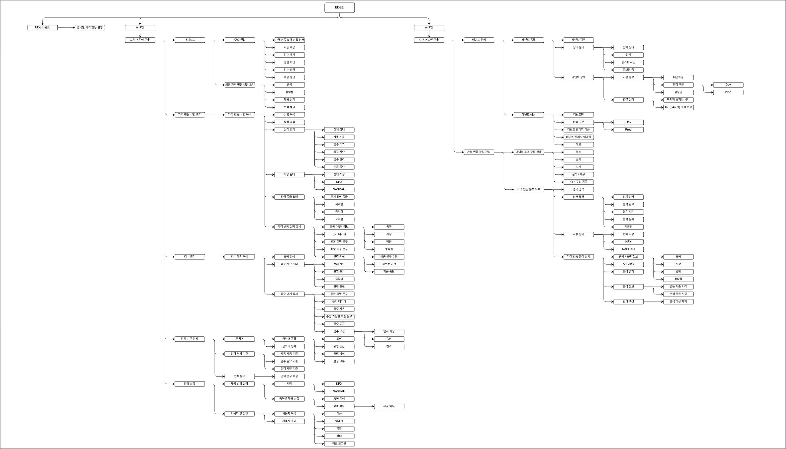

콘솔의 화면과 기능을 트리 하나로 정리한 화면 맵입니다. 왼쪽이 증권사 검수자가 쓰는 테넌트 콘솔(대시보드·설명 관리·검수·점검 기준·설정), 오른쪽이 운영자가 쓰는 슈퍼 어드민 콘솔(테넌트 관리·분석 관측)입니다.
### 2-2. Application Architecture

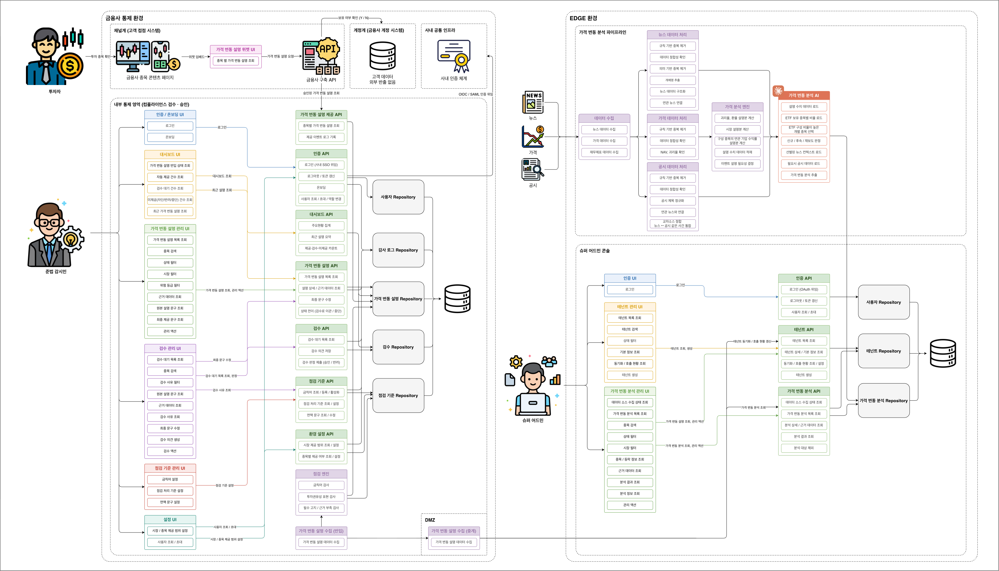

위 화면들을 UI·API·Repository 단위까지 내려 매핑한 상세도입니다. 화면의 기능 하나가 어느 API를 호출하고 어느 테이블을 읽고 쓰는지 확인할 수 있습니다.

### 2-3. System Architecture

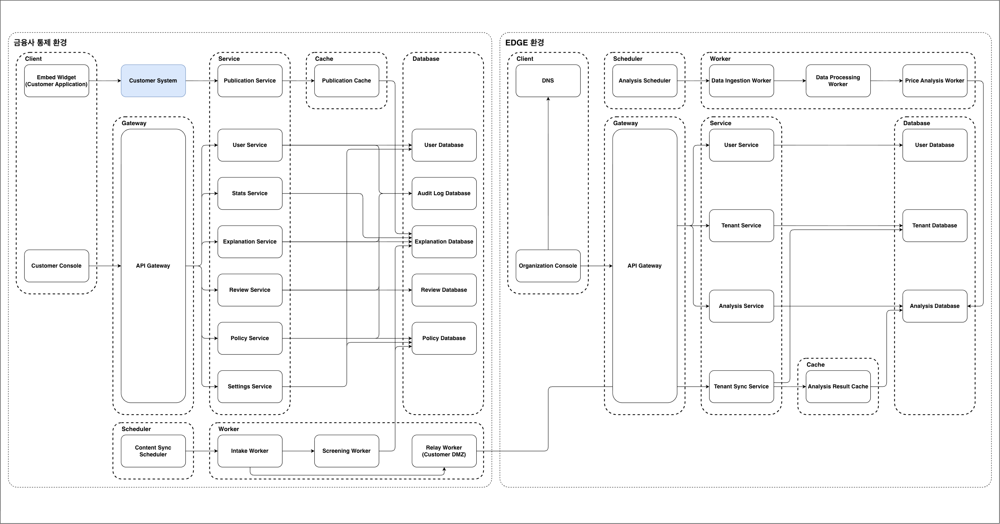

전체 시스템을 Service·Worker·Cache·DB 논리 컴포넌트 단위로 나타낸 구성도입니다. 왼쪽 증권사 통제 환경(위젯·콘솔·서빙·검수 워커)과 오른쪽 EDGE 환경(수집·분석 워커·동기화)은 동기화 경로 하나로만 이어집니다.
### 2-4. Cloud Architecture

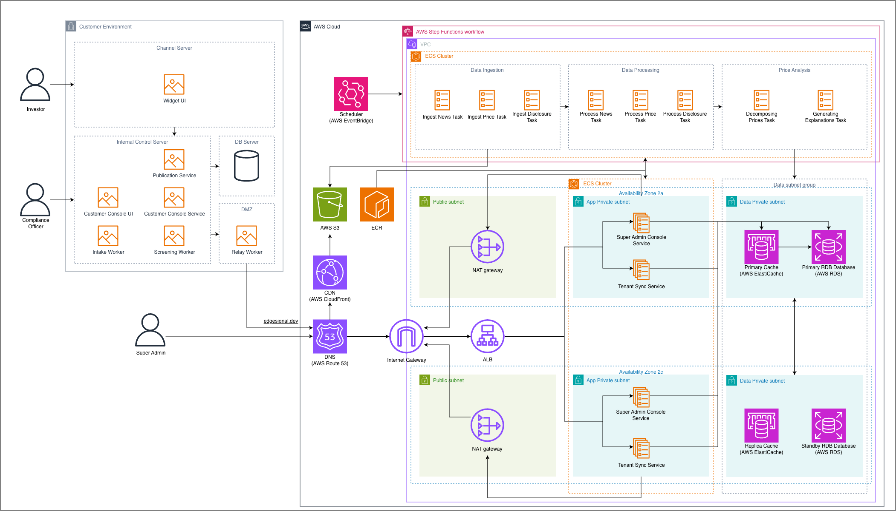

<!-- 그림은 설계 시점 단일 계정 기준 — BYOC 2계정 구도로 재작도 예정 -->

논리 컴포넌트를 실제 AWS 리소스로 배치한 인프라 구성도입니다. 서브넷을 public/앱/데이터로 분리하고 가용영역을 이중화했으며, 전체를 Terraform으로 관리합니다.

### 2-5. DB 스키마 SSOT

[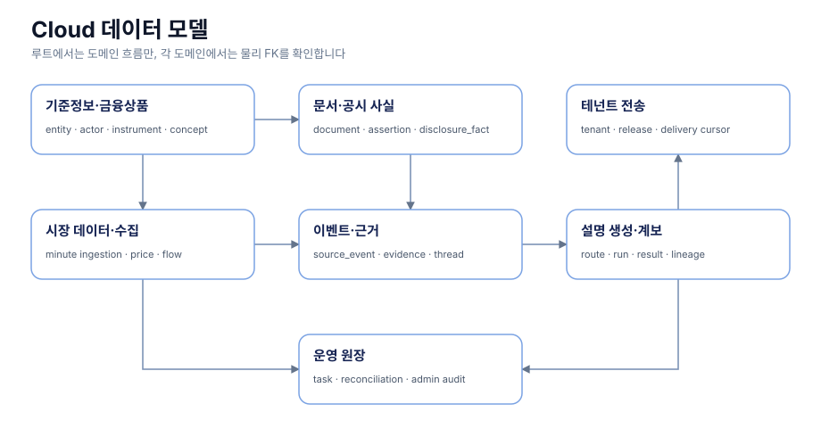](docs/data-model/README.md)

Cloud DB의 도메인 7개와 데이터 흐름입니다. 그림을 클릭하면 도메인별 상세 ERD가 열립니다. 스키마 변경은 Flyway 마이그레이션으로만 하고, CI가 이 문서 ERD를 마이그레이션에서 생성한 DBML과 대조하기 때문에 그림과 실제 DB가 어긋나면 빌드가 실패합니다.

Flyway 세트는 둘입니다. 위 그림은 Cloud 세트(71테이블)이고, 증권사 관리 환경에서 도는 On-Prem 세트(13테이블)는 [온프렘 테넌트 DB ERD](docs/data-model/onprem/) 한 장으로 봅니다. 두 세트 모두 같은 CI 대조를 받습니다.

### 2-6. 데이터 파이프라인 · 분석 엔진

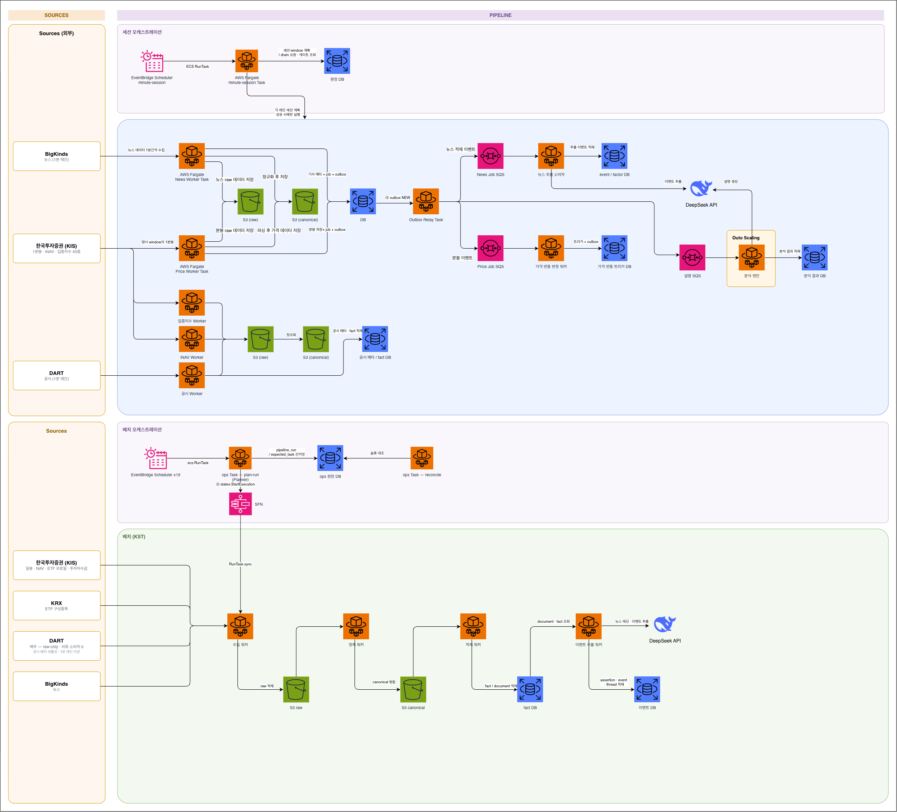

장중에는 1분 주기 파이프라인이 뉴스·시세·공시를 받아 가격 변동을 판정하고 분석 엔진이 설명을 생성합니다. 장 마감 후에는 배치 파이프라인이 하루치 데이터를 정제해 적재합니다. 스케줄러는 실행 전에 작업 목록을 DB에 기록해 두고, 기록과 실제 실행을 대조해 누락된 실행을 탐지합니다.

### 2-7. 성능 실험

API 서버를 4대로 늘리면서 Redis 도입 여부를 부하 테스트 104회로 검증했고, Redis 없이 인프로세스 캐시(Caffeine)만 쓰기로 결정했습니다.

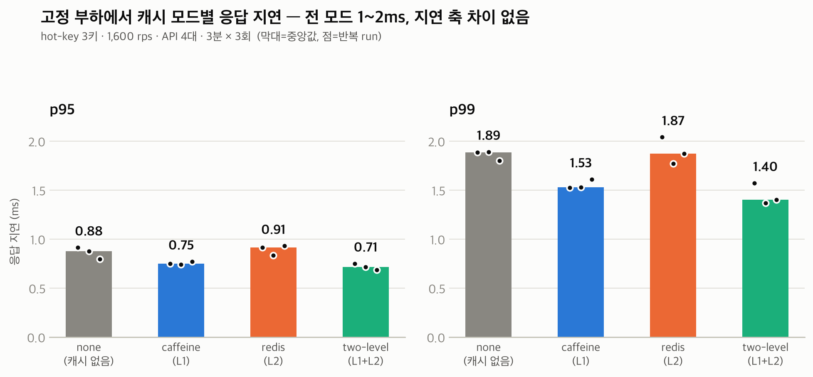

캐시 없음·Caffeine·Redis·two-level 네 구성 모두 p99 1~2ms로, 응답 지연에는 차이가 없습니다. 차이는 DB 부하에서 납니다.

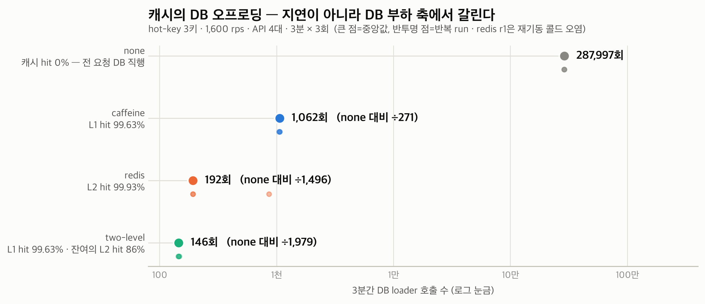

반면 조회 종목 수를 늘리면 Redis를 얹은 two-level은 캐시 미스마다 네트워크 왕복이 붙어 p99가 5배 나빠집니다(12.0ms vs 2.4ms). Caffeine 단독으로 결정한 근거입니다.

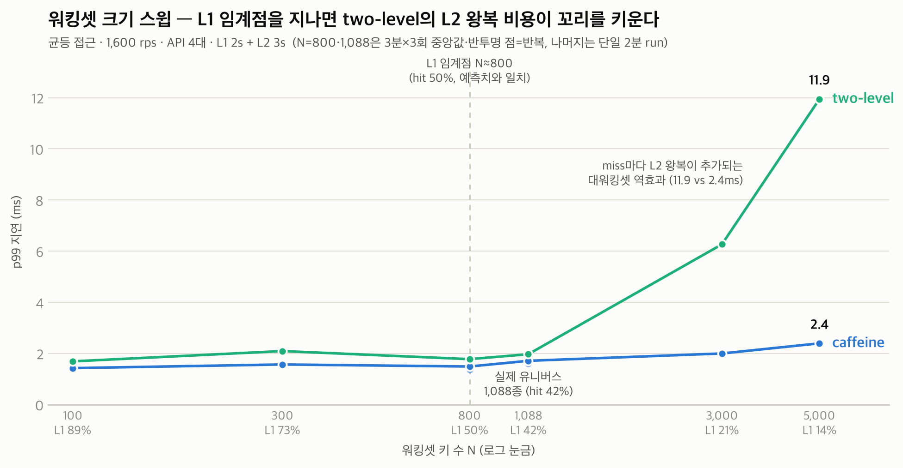

실험 설계와 상세 결과는 [기술 블로그 4부작](https://choyoungseo20.github.io)에 정리했습니다.

### 2-8. CI/CD

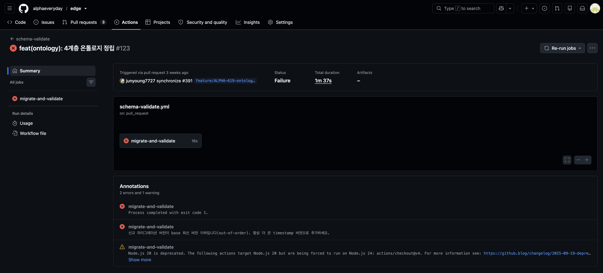

병렬로 작업하다 보면 나중에 만든 마이그레이션이 더 낮은 버전 번호로 머지되는 사고가 납니다. 위는 그 역행을 CI 게이트가 잡아낸 실제 실패 기록입니다.

- **자체 제작 게이트 3종** — PR 제목 형식(Conventional Commits), 마이그레이션 버전 순서, ERD 재생성 대조를 CI에서 검사합니다. 컨벤션을 문서로만 두지 않고 체크로 강제합니다.
- **러너 운영 이력** — GitHub-hosted에서 self-hosted 4대 자체 운영으로 전환했다가, repo public 전환 시점에 비용을 다시 따져 GitHub-hosted로 돌아왔습니다.
- **CD** — dev 머지 시 스키마 마이그레이션이 자동 적용되고, 데모 서버는 SSH 접속 없이 SSM Run Command로 배포합니다.

### 2-9. 설계 결정 기록(ADR)

설계 결정 54건을 ADR로 남겼습니다. 결정을 뒤집을 때도 기존 문서를 지우지 않고 새 ADR로 대체 근거를 기록합니다.

- [ADR-0010 하이브리드 온프렘 피벗](docs/adr/0010-hybrid-onprem-pivot.md) — 제품 방향을 바꾼 결정
- [ADR-0044 정정(CORRECTION) 전달 폐지](docs/adr/0044-correction-abolition.md) — 자기 기능을 폐지한 결정
- [ADR-0046 확신도 게이트](docs/adr/0046-confidence-gate-risk-grade-abolition.md) — 융합 산정 설계를 폐기하고 단순 AND 게이트로 회귀
- [ADR-0051 BYOC 배포 토폴로지](docs/adr/0051-byoc-deployment-topology.md) — 납품 형태 확정
- 전체: [docs/adr/](docs/adr/)

## 3. 수행 방법 · 프로젝트 관리

### 3-1. 개발 프로세스

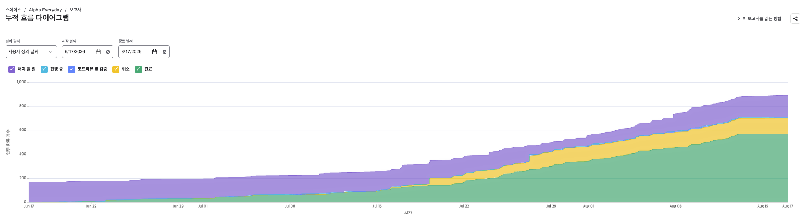

모든 기능·버그 작업은 Jira 티켓을 먼저 만들고 그 키로 브랜치를 팝니다. 컴포넌트 단위 에픽과 2주 스프린트로 운영하고, 브랜치 push와 PR 머지에 따라 보드 상태가 자동으로 넘어갑니다.

### 3-2. 형상 관리

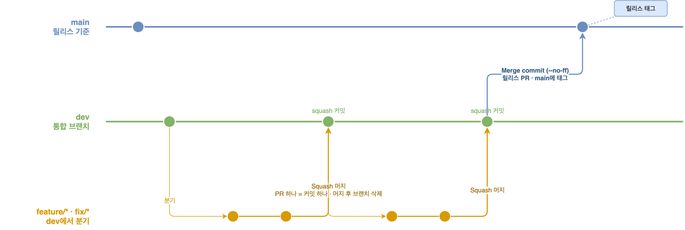

모든 작업은 `feature/fix → dev → main` 순서로만 흐릅니다. feature→dev는 Squash 머지로 PR 하나를 커밋 하나로 남기고, dev→main은 릴리스 단위의 Merge commit입니다.

### 3-3. AI 에이전트 하네스

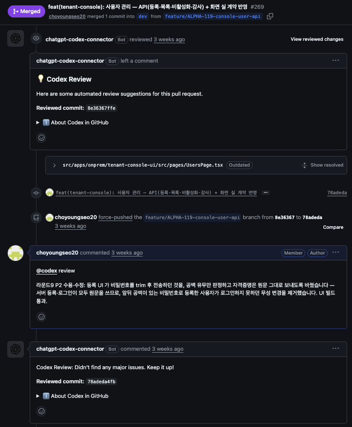

봇의 지적, 라운드 9까지 간 수용·수정 답글, 재리뷰 통과까지 리뷰 왕복이 PR에 그대로 남습니다.

에이전트(Claude Code)가 티켓 생성부터 머지까지 위 개발 프로세스를 그대로 따르도록 스킬 3종을 만들어 운영합니다.

- **pr-cycle** — 티켓 확인, 브랜치 생성, PR, 머지, 브랜치 삭제까지 작업 순서를 강제합니다.
- **edge-review** — PR 올리기 전에 코드 리뷰를 돌리고, 수용할 지적이 없어질 때까지 반복합니다.
- **docs-sync** — 코드 변경으로 낡아진 문서·주석을 찾아 갱신합니다.

원격에서는 Codex 봇이 PR을 한 번 더 리뷰하고, 지적 반영과 재리뷰 왕복이 PR에 기록으로 남습니다.

---

## 개발 문서

- [저장소 구조](docs/repo-structure.md) — 모노레포 구조·워크스페이스·모듈 역할·데이터 흐름
- [Git 컨벤션](docs/git-conventions.md) — 브랜치 전략·커밋/PR 제목·머지 정책 (SSOT)
- [docs/](docs/) — 설계 문서(context·ADR·계약·아키텍처 뷰)
