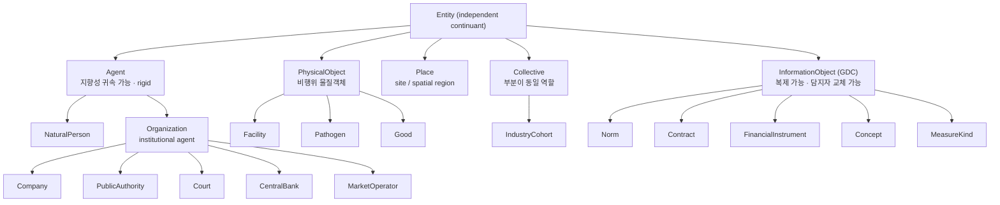

# 실체층 완전 위계 — 연구

> **방법:** `ontology-design-criteria.md`(Move 1–5). 기준은 미리 고정하지 않고 이 문제에서 도출한다.
> **근거:** 상위 온톨로지 원문(BFO 2.0 / BFO 2020 ISO-IEC 21838-2 / DOLCE WonderWeb D18 / UFO 2022 / UFO-C / SUMO / IAO / COVER / SKOS / OWL 2 NF&R) + 금융 표준 원문(FIBO Production 20260701 · OMG Commons 20250801 / LKIF-Core 1.1 / ISO 10962:2021 / ISO 10383 / ISO 17442·LEI / FIGI v30.0 / GICS 2023 / ICB / GS1 GPC / schema.org V30.0). 두 조사를 독립 수행 후 교차 검증했다.
> **수치:** 본문 모든 수치는 현행 리소스(53타입·87역할)에 대한 프로그램 실측이다.

## 0. 요약

현행 8종별은 **분류군이 아니라 적재 키 버킷**이다. 판별자 필드 이름이 `persistence_key` 인 것이 자백이고, 8종 중 4종 이름에 `OR` 가 들어간 것이 증상이다.

원인은 하나다 — **네 축이 한두 필드에 눌려 있다.**

$$\underbrace{\text{종(what it is)}}_{\text{rigid}} \;\times\; \underbrace{\text{역할(what part)}}_{\text{anti-rigid}} \;\times\; \underbrace{\text{논항역(행위의 몇 번째 논항)}}_{\text{미존재}} \;\times\; \underbrace{\text{식별 스킴}}_{\text{운영}}$$

앞 둘이 `entity_kind` 하나에 눌려 범주혼합 **19%** 를 만들고, 셋째 축이 아예 없어 남은 모호를 **판정할 수단이 없다**. 네 축을 분리하면 범주혼합은 **0%**, 잔여 모호는 47→14슬롯이 되고 그 14가 어휘 결함으로 **확정**된다.

## Move 1 — telos 와 하부목표

**telos.** 실체층은 *뉴스 사건을 걸 수 있는 동일성 축*을 제공한다. 소비자는 조립·스레딩(data-pipeline)과 인과 분석(analysis-engine)이다.

| | 하부목표 | WHY |
|---|---|---|
| G1 | 한 실체는 역할·기사와 무관하게 **하나의 정체성**을 갖는다 | 갈리면 같은 대상의 사건이 여러 스레드로 파편화된다 |
| G2 | 종별은 **적재 경로**를 결정한다 | 종별을 모르면 그 값을 무엇으로 저장할지 못 고른다 |
| G3 | 종별은 사건 안에서 **참여자를 구분**하는 데 기여한다 | 못 하면 `event_argument.entity_kind` 가 죽은 컬럼이다 |
| G4 | 실체층은 사건층 없이 성립한다(**선험적**) | 사건 참여로 실체를 정의하면 순환이고, 층 순서가 무너진다 |
| G5 | 어휘 확장이 **기존 적재를 무효화하지 않는다** | 어휘 개정은 전 코퍼스 재태깅(기사당 LLM 1콜)을 유발한다 |

**실패의 정의.** 위 다섯 중 하나라도 어기면 틀렸다. 현행은 G1·G3·G4 를 어긴다(§1).

## Move 2 — 현행 위계의 실측 진단

### 2.1 G3 위반 — `entity_kind` 는 참여자를 구분하지 못한다

엔티티 역할 슬롯 **154개 중 64개(42%)** 가 같은 타입 안에서 종별이 겹쳐 `entity_kind` 로 구분 불가. **영향 타입 25/53.**

| 종별 | 모호 슬롯 |
|---|---:|
| COMPANY_ENTITY | 27 |
| LOCATION_OR_HAZARD | 14 |
| PRODUCT_OR_CONCEPT | 11 |
| AUTHORITY_OR_RULE | 10 |
| INDEX_OR_EXCHANGE | 2 |

그중 **29슬롯(19%)은 존재론적 범주 자체가 섞인 부당한 뭉갬**이다:

| 버킷 | 섞인 범주 | 실례 |
|---|---|---|
| `AUTHORITY_OR_RULE` | 행위자 + 정보객체 + 사안 | `POLICY.COURT.RULING` 의 COURT·RULE·LEGAL_ISSUE 가 한 종별 |
| `LOCATION_OR_HAZARD` | 장소 + 물질객체 + **사건** | `EXOGENOUS.DISASTER.OCCURRENCE` 의 GEOGRAPHY·LOCATION·HAZARD |
| `PRODUCT_OR_CONCEPT` | 물질객체 + 정보객체 | `COMPANY.PRODUCT.LAUNCH` 의 PRODUCT·PRODUCT_FAMILY·TECH_NODE |

`LOCATION_OR_HAZARD` 는 **논리적 비일관**이다. BFO 2020 은 `continuant owl:disjointWith occurrent` 를 못박고 DOLCE 는 ED⟂PD, UFO 는 `a13` 으로 같은 벽을 세운다. 태풍(occurrent)과 부산(continuant)을 한 클래스에 넣으면 어느 상위 온톨로지로도 일관되지 않는다.

### 2.2 G1 위반 — 같은 대상이 역할 따라 다른 정체성을 얻는다

실행 결과다.

```
AUTHORITY  "한국거래소" → actor_inst_kr_krx   (레지스트리)
EXCHANGE   "한국거래소" → 한국거래소            (채번)      ← 정체성 분열
MARKET     "한국거래소" → 한국거래소

AUTHORITY   "공정거래위원회" → actor_auth_kr_ftc
RULE        "공정거래위원회" → 공정거래위원회     ← 기관을 규범으로 채번
COURT       "공정거래위원회" → actor_auth_kr_ftc ← 법원 자리에 규제기관 해소(오해소)
```

세 번째가 버그다. `AuthorityRegistry.resolve()` 가 `role_code` 를 게이트로만 쓰고 섹션을 좁히지 않아 AUTHORITY·COURT·CENTRAL_BANK 가 별칭 평면 하나를 공유한다.

### 2.3 G4 위반 — 코드가 종별을 도로 쪼갠다

`CLOSED_SET_ROLES`(AUTHORITY_OR_RULE 5역할 중 3개) 와 `MINTABLE_KINDS` 는 파이썬 하드코딩 frozenset 이고, 존재 이유가 오직 "종별이 잘못 묶여서"다. 종별이 옳았다면 둘 다 파생값이다.

LKIF-Core 가 그 경계의 *이유*를 설명한다 — 기관은 agent(닫힌 명부가 성립), 규범은 `norm:Norm ⊂ expression:Qualification`(계속 새로 발화됨). **레지스트리 실패는 구현 한계가 아니라 종별 오분류의 증상이다.**

부수 발견: `MINTABLE_KINDS` 의 근거 주석("persistence_key 가 `normalized_*` 인 것들")은 양방향으로 거짓이다 — PERSON 은 키가 `normalized_person_name` 인데 비채번, PRODUCT_OR_CONCEPT 는 키가 `concept_id` 인데 채번. (상류 승계 주석.)

### 2.4 표준이 내리는 판정

| 우리 구조 | 표준의 판정 | 근거 |
|---|---|---|
| ISSUER ≠ COMPANY_ENTITY | **같은 종이다.** 둘 다 `cmns-org:LegalEntity`. 상장은 `fibo-sec-sec-lst:Listing` **관계**이고 그 반대편은 회사가 아니라 증권공모 | Commons Organizations 20250801:112 · SecuritiesListings.rdf:133 · `Listing.lists → SecuritiesOffering` |
| `PubliclyHeldCompany` 를 별도 종으로? | FIBO 에 클래스는 있으나 **owl:Restriction 이 0개** — 레이블일 뿐 모델이 아니다 | CorporateBodies.rdf:213 |
| COMPANY_ENTITY 20역할 | **역할이 맞다.** `cmns-org:ServiceProvider ⊂ cmns-pts:AgentRole` — 표준도 종이 아니라 역할로 둔다. 3층 유지 | cmns-org.rdf:319 |
| `INDEX_OR_EXCHANGE` | **범주 오류.** `Exchange ⊂ cmns-sfc:Facility` vs `ReferenceIndex ⊂ ScopedMeasure`(측도) — 최상위에서 갈린다 | Markets.rdf:313 · BasketIndices.rdf:250 |
| `ISSUER.persistence_key = ticker` | **표준이 명시적으로 경고한 안티패턴.** `TickerSymbol ⊂ ReassignableIdentifier`, `identifies → (ListedSecurity ⊔ Listing)` — 회사가 아니라 증권을 식별한다 | SecuritiesIdentification.rdf:395 · IdentifiersAndIndices.rdf:102 |
| `ticker_or_normalized_name` 류 OR 키 | 표준에 없다. 항상 `cmns-dsg:isDefinedIn` 로 스킴을 명시하고 그 안에서 유일성을 보장한다 → `(scheme, value)` 쌍으로 분해 | Commons Designators |

## Move 3 — 완전 위계 (도출)

세 축을 분리한다. **축 1만이 `entity_kind` 다.**

### 축 1 — 종(Kind). rigid. "무엇인가"

첫 분기는 상위 온톨로지 셋이 공통으로 요구하는 것만 쓴다: continuant/occurrent, 그리고 담지자 고정성(IC/SDC/GDC).



87역할 전량 배치 — **중복 0, 누락 0(프로그램 검증)**.

| 종(leaf) | 역할 | 상위 근거 | 표준 근거 |
|---|---|---|---|
| `Agent/NaturalPerson` | PERSON | DOLCE APO “a human person (as opposed to legal person)” D18 Table 1 · UFO-C physical agent | `fibo-be-le-lp:LegallyCompetentNaturalPerson` |
| `Agent/Organization/Company` | ISSUER · ACQUIRER · ANALYST_FIRM · CUSTOMER · DEFENDANT · INVESTOR · MEMBER · MERGING_ENTITY · OPERATOR · PARENT · PARTNER · PARTNER_2 · PLAINTIFF · RATED_ENTITY · RATING_AGENCY · SELLER · SHAREHOLDER · SPUNOFF_UNIT · SUPPLIER · TARGET · TARGET_COMPANY | DOLCE SC “Fiat, Apple, the Bank of Italy” · UFO-C institutional agent | `cmns-org:LegalEntity` |
| `Agent/Organization/PublicAuthority` | AUTHORITY | 〃 | `cmns-rga:RegulatoryAgency`(Commons RegulatoryAgencies:99) |
| `Agent/Organization/Court` | COURT | 〃 | `fibo-fnd-law-cor:CourtOfLaw`(LegalCore.rdf:82) |
| `Agent/Organization/CentralBank` | CENTRAL_BANK | 〃 | `fibo-fbc-fct-fse:CentralBank`(:333) |
| `Agent/Organization/MarketOperator` | EXCHANGE · MARKET | DOLCE SC | ISO 10383 clause 2.1/2.2 (operating vs segment level) |
| `PhysicalObject/Facility` | FACILITY | BFO object [024-001] CU3 공학적 조립 | `cmns-sfc:Facility` |
| `PhysicalObject/Pathogen` | PATHOGEN | BFO material entity [019-BFO] · COVER Threat Object | — |
| `PhysicalObject/Good` | PRODUCT · COMMODITY | DOLCE NAPO · UFO Quantity | `fibo-fnd-pas-pas:Good` · CFI T-T |
| `Place` | GEOGRAPHY · LOCATION | BFO site/spatial region [028-001] | `cmns-loc:Country`·`Municipality`(ISO 3166) |
| `Collective/IndustryCohort` | INDUSTRY | UFO Collective(부분이 **동일** 역할) = BFO object aggregate “the restaurants in Palo Alto” [025-004] | — (§3.2 충돌 참조) |
| `InformationObject/Norm` | RULE · STANDARD | IAO directive information entity(GDC) · DOLCE NASO “a law” | LKIF `norm:Norm`(norm.ttl:430) |
| `InformationObject/Contract` | CONTRACT_OBJECT | BFO relational quality “an obligation between one person and another” | `fibo-fnd-agr-ctr:WrittenContract` |
| `InformationObject/FinancialInstrument` | DEBT_INSTRUMENT | DOLCE NASO “an asset” | `FinancialInstrument ⊂ WrittenContract` · CFI D |
| `InformationObject/Concept` | PRODUCT_FAMILY · TECH_NODE · SERVICE · PROJECT · PRODUCT_OR_SCOPE | SKOS Concept “unit of thought” §3.1 · BFO §2.6 universal 은 담론영역 밖 | GS1 GPC(제품) / **부재**(TECH_NODE·STANDARD) |
| `InformationObject/MeasureKind` | METRIC · INDICATOR · POLICY_RATE · INDEX · CURRENCY_PAIR | DOLCE `INDICATOR ⊂ PARAMETER` · BFO2 §3.11 measurement datum | `ReferenceIndex ⊂ ScopedMeasure` · `Currency ⊂ MeasurementUnit` · CFI T |

**실체층에서 퇴출되는 둘:**

| 역할 | 어디로 | 이유 |
|---|---|---|
| **HAZARD** | 4층(사건) | occurrent 다. COVER 가 Threat Event 로 명명. BFO 2.0 은 hurricane 을 material entity 예시로 들었으나 **BFO 2020 에서 그 예시가 철회**됐다(전량 검색: 2.0 1회 / 2020 0회) |
| **LEGAL_ISSUE** | 4층(situation) 또는 TEXT 속성 | 문서도 관계도 아니다. DOLCE §12.4.3 “A case in point (**situation**) is constrained by a certain norm” |

비실체 37역할(TIME 9 · VALUE 21 · TEXT 7)은 현행대로 2층·4층에 남는다.

### 현행은 과병합만이 아니라 **과분할**도 한다

신 위계 leaf 하나가 현행 두 버킷에 걸치는 곳 셋 — 같은 것을 갈라놓은 자리다.

| 신 위계 leaf | 현행에서 갈린 위치 | 판정 |
|---|---|---|
| `Agent/Organization/Company` | `ISSUER`[ISSUER] ↔ `COMPANY_ENTITY`[나머지 20역할] | 같은 종. 차이는 상장 **관계**와 키 가용성뿐(FIBO 확인) |
| `InformationObject/Norm` | `AUTHORITY_OR_RULE`[RULE] ↔ `PRODUCT_OR_CONCEPT`[STANDARD] | 법과 기술표준은 둘 다 directive information entity. 한쪽은 기관 버킷에, 한쪽은 물건 버킷에 있다 |
| `InformationObject/MeasureKind` | `INDEX_OR_EXCHANGE`[INDEX] ↔ `PRODUCT_OR_CONCEPT`[METRIC·INDICATOR·POLICY_RATE·CURRENCY_PAIR] | 전부 측도. 지수만 거래소와 한 버킷에 있는 것은 이름의 `OR` 가 만든 우연이다 |

즉 8종은 **양방향으로 틀렸다** — 다른 것을 합치고(19% 범주혼합), 같은 것을 갈랐다(위 3건).

### 축 2 — 역할(Role). anti-rigid. "사건에서 어떤 자리인가"

지금의 3층이다. **표준과 같은 방향이므로 유지한다**(`cmns-pts:AgentRole` / BFO role [061-001] / UFO RoleMixin).

바뀌는 것은 하나 — 역할의 치역이 `entity_kind` 하나가 아니라 **`Kind` 노드**를 가리킨다. `ACQUIRER → Agent/Organization/Company` 처럼 경로가 붙으면 상위 노드로의 질의(`Agent 인 참여자 전부`)가 가능해진다.

### 축 3 — 식별 스킴(Identity). "무엇으로 키를 삼는가"

현행이 종별에 눌러 담은 셋째 축. **역할에 선언하면 하드코딩 두 개가 파생값이 된다.**

| 스킴 | 뜻 | 해당 |
|---|---|---|
| `REGISTRY:<section>` | 닫힌 명부 완전일치 | AUTHORITY→`authorities,foreign_authorities` · COURT→`courts` · CENTRAL_BANK→`central_banks` · EXCHANGE/MARKET→`institutions` |
| `EXTERNAL:<scheme>` | 외부 코드 | Company→`(MIC, ticker)` 최소 |
| `MINT` | 정규화 문자열 채번 | Concept · MeasureKind · Norm · Place · Pathogen · Good |
| `NONE` | 해소하지 않는다 | 미상장 상대방 · 동명이인 |

`(scheme, value)` 쌍 형태다 — 표준이 항상 `isDefinedIn` 으로 스킴을 명시하는 것과 같다.

## Move 4 — 기준과 반-Goodhart

| 결정 | 하부목표 | 기준(검증가능) | 이유 | 반-Goodhart |
|---|---|---|---|---|
| 종을 continuant/occurrent 로 먼저 가른다 | G1·G3 | 한 종에 continuant 와 occurrent 가 **동시에 들어가지 않는다** | 스레드 축은 동일성 유지되는 것이어야 하고 사건은 축이 아니라 원소다 | **(A) 불변식.** BFO 2020 `owl:disjointWith` 로 연역. 위반은 논리적 비일관이라 게임 불가 |
| 종 ≠ 역할 | G3·G4 | 한 타입 안에서 종별이 겹치는 슬롯 중 **범주혼합은 0** | 두 회사가 한 M&A 에 나오는 것은 정상이고 그 구분은 역할의 일이다 | **(A) 불변식.** 종이 rigid, 역할이 anti-rigid — 겹침이 남더라도 종이 같기 때문임을 구조가 보증 |
| 식별 스킴을 역할에 선언 | G1·G2 | 같은 멘션이 역할에 따라 **다른 entity_id 를 얻지 않는다** | §2.2 의 한국거래소 분열이 이 기준의 반례 | **(B) 적대시험.** 레지스트리 등재 기관명을 전 역할에 넣어 단일 id 를 요구 |
| 종별 개정은 어휘 개정이 아니다 | G5 | `entity_kind` **적재값이 바뀌지 않는 이행 경로**가 존재 | 재태깅 비용이 설계를 인질로 잡으면 안 된다 | **(A) 불변식.** 1·2단계에서 역할→`entity_kind` 표를 **손대지 않고** `kind_path` 를 병렬 추가하므로 적재값 불변이 구조적으로 보장된다 |
| 산업 코호트를 개체로 | G3 | 코호트가 **사건 참여자로 등장**하는 타입이 존재하면 개체여야 한다 | `INDUSTRY.SUPPLY.CAPACITY_CHANGE` 의 anchor 가 INDUSTRY 다. Classifier 는 사건에 참여하지 못한다 | **(A) 불변식.** 참여 가능성이 곧 개체성의 정의 |

### 실측 — 기준이 실제로 개선을 낸다

| | 분류군 | 모호 슬롯 | **범주혼합 슬롯** |
|---|---:|---:|---:|
| 현행 8종별 | 8 | 64/154 (42%) | **29/154 (19%)** |
| 신 위계 leaf | 16 | 47/150 (31%) | **0/150 (0%)** |

**31% 를 0으로 만드는 것은 목표가 아니지만, 31% 가 전부 정당한 것도 아니다.** 47슬롯을 전수 분해했다.

$$47 = \underbrace{27}_{\text{정당 — 같은 종, 다른 역할}} + \underbrace{20}_{\text{역할 어휘 결함}}$$

**정당한 27** — 두 회사가 한 M&A 에 참여하는 것은 정상이고, 종이 이들을 구분해서는 **안 된다**. `[ACQUIRER, TARGET_COMPANY]` · `[PLAINTIFF, DEFENDANT]` · `[CUSTOMER, SUPPLIER]` · `[ANALYST_FIRM, RATED_ENTITY]`. 구분은 역할의 일이고 그게 축 분리의 요점이다. 이 27 을 0 으로 만들려는 시도는 역할을 종으로 위장하는 지금의 병으로 되돌아간다.

**결함인 20** — 종의 문제가 아니라 **역할 어휘 자체의 문제**다. 신 위계가 고쳐주지 않는다.

| 유형 | 타입 | 내용 |
|---|---|---|
| arity hack | `COMPANY.ALLIANCE.PARTNERSHIP` | `PARTNER_2` 는 `PARTNER` 의 2번 슬롯이다. 프로파일이 완전히 같고(types=1·identity=1·primary=1) 같은 타입에만 있다. `event_argument.group_ord` 가 이미 다중 참여자를 담으므로 번호 붙은 역할은 불필요 |
| 이중 기술 | `COMPANY.M_AND_A.MERGER` | 대칭 어휘(`MERGING_ENTITY`, required)와 비대칭 어휘(`ACQUIRER`·`TARGET_COMPANY`·`SELLER`, optional)가 한 타입에 공존한다. 같은 합병을 두 방식으로 기술할 수 있어 추출기가 무엇을 고를지 규정이 없다 |
| 동의어 | `EXOGENOUS.{CONFLICT.OUTBREAK, CONFLICT.RESOLUTION, DISASTER.OCCURRENCE, HEALTH.OUTBREAK}` | `GEOGRAPHY`(19타입) 와 `LOCATION`(8타입) 이 이 4타입에서 공존하는데 **구분 기준이 리소스·코드·문서 어디에도 없다** |
| 죽은 어휘 | `MARKET_STRUCTURE.EXCHANGE_OUTAGE` | `MARKET` 은 1타입 전용·identity 0·primary 0. `EXCHANGE` 와 같은 자리에만 나온다 |
| 미분화 | `COMPANY.PRODUCT.LAUNCH` | `PRODUCT_FAMILY`/`TECH_NODE` 경계 미선언 |

### 뿌리 — 세 층 중 관계층만 정의가 없다

| 층 | 정의 수단 | 강제 |
|---|---|---|
| 2. 속성 | `desc` | **로더가 강제** — 없으면 `{id}: desc 필수` ValueError |
| 4. 사건 | `note` — 자매 경계를 명시(`"NOT a customer-supplier contract (use CONTRACT.SIGNING)"`) | 관행 |
| **3. 관계** | **없음. 87역할에 정의 0개** — `role_bindings` 는 이름 목록뿐 | 없음 |

정의 없는 어휘는 동의어를 막을 수단이 없다. `GEOGRAPHY` 와 `LOCATION` 의 차이를 적어둔 곳이 없으니 둘 다 생겼고, 둘 다 남았고, 추출기는 매번 다시 추측한다. 다만 `desc` 는 **산문이라 강제할 수 없다** — 문서화이지 게이트가 아니다. 게이트가 되는 축은 다음 절이다.

### 더 깊은 뿌리 — 역할에 **행위 대비 논항구조**가 없다

`desc` 는 산문이라 강제할 수 없다. 진짜 빠진 것은 **역할이 행위(술어)의 몇 번째 논항인가**다.

87역할은 사실 소수의 논항역(thematic role)에 도메인 이름을 붙인 것이다 — Fillmore 격문법, PropBank Arg0–Arg4, VerbNet/FrameNet 이 쓰는 그 장치다. BFO 는 이 축이 없다: `has participant` [086-003] 가 미분화라 “참여했다”만 말하고 “어떤 자격으로”를 말하지 못한다(UpperOntology 조사 §1.3 이 지적한 relator 부재와 같은 구멍).

`ACQUIRER`=AGENT · `TARGET_COMPANY`=THEME · `SELLER`=SOURCE 를 선언하면 셋이 같은 종(Company)이어도 갈린다. **모호성 판정이 판단에서 계산으로 바뀐다.**

| 축 | 모호 케이스 | 모호 슬롯 |
|---|---:|---:|
| 종(Kind) 만 | 21 | 47/150 |
| 종 × 논항역 | 9 | 18/150 |
| 종 × 논항역(배정 정밀화) | **7** | **14/150** |

> 논항역 배정은 이 문서의 초안이며 출처가 있는 것이 아니다 — **[INFERENCE]**. 출처가 있는 것은 “논항역이라는 축이 표준 장치로 존재한다”와 “BFO 의 `has participant` 는 미분화다”까지다.

남은 7 은 논항역이 **같아서** 안 갈린다 — 즉 두 역할일 이유가 없다는 증명이다.

| 판정 | 타입 | 내용 |
|---|---|---|
| 어휘 결함 | `COMPANY.ALLIANCE.PARTNERSHIP` | `PARTNER`·`PARTNER_2` 둘 다 CO_AGENT. 대칭 행위라 **원리적으로** 못 가른다 → 역할 하나 + `group_ord` |
| 어휘 결함 | `EXOGENOUS.{CONFLICT.OUTBREAK, CONFLICT.RESOLUTION, DISASTER.OCCURRENCE, HEALTH.OUTBREAK}` | `GEOGRAPHY`·`LOCATION` 둘 다 LOCATION → 동의어 확정 |
| 어휘 결함 | `COMPANY.PRODUCT.LAUNCH` | `PRODUCT_FAMILY`·`TECH_NODE` 둘 다 SPEC |
| **프레임 경계** | `COMPANY.FINANCING.DEBT_ISSUANCE` | `ISSUER`·`RATING_AGENCY` 둘 다 AGENT — **한 타입이 두 행위를 담았다**(발행 + 신용평가). 역할 문제가 아니라 타입 문제 |

### 그 축은 이미 DB 에 있다 — `event_argument.slot`

`V202607242020` 이 이미 심어 놓았다.

```sql
ADD COLUMN slot VARCHAR(10);
CHECK (slot IS NULL OR slot IN ('subject','object','qualifier'));
COMMENT: '인과 방향 슬롯 subject/object/qualifier — 역할쌍(원고/피고 등) 방향 질의의 기질.'
```

분석엔진이 읽고 있고(`eventstore.py:154` `SELECT ea.slot`, `domain/models.py Argument.slot`), 값을 쓰는 소비자는 아직 없다.

**문제는 필드가 아니라 출처다 — LLM 이 정한다.**

```python
# assemble_events.py:270  추출 프롬프트
'"arguments":[{"role": <...>, "slot": "subject|object|qualifier", ...}]'
# assemble_events.py:477  코드는 범위만 검사
"slot": slot if isinstance(slot, str) and slot in SLOT_VALUES else None,
```

`ACQUIRER`→subject 는 기사에 의존하지 않는 결정적 사상인데 아규먼트마다 LLM 판정을 산다. 3값 중 무엇을 내도 범위검사를 통과하므로 **오류가 조용하다**. AGENTS Rule 5 위반이며, 같은 파일이 다른 곳에서는 그 원칙을 지킨다(“라벨이 메뉴에 드는지는 코드가 판정한다(Rule 5)”).

게다가 `slot` 의 **뜻이 정의돼 있지 않다.** 주석은 “인과 방향”(논항역)이라 하는데 값 이름은 `subject/object`(문법 주어/목적어)다. 한국어 제목을 본 LLM 은 문법 주어를 고를 것이고, 「A사, B사에 피소」에서 A 는 문법 주어이지만 논항역은 피행위자다. 둘이 갈리는 순간 방향 질의가 뒤집힌다.

### 앞선 “술어 결합가” 주장은 철회한다

술어 169개가 역할 메뉴를 공용하는 것은 사실이지만, **방향이 반대인 술어를 가진 4타입 전수 확인 결과 술어는 slot 을 뒤집지 않는다.**

| 타입 | 반대 술어 | slot |
|---|---|---|
| `INSIDER_TRANSACTION` | `BUY`/`SELL` | `PERSON` 양쪽 subject — 방향은 술어에만 있으면 된다 |
| `STAKE_ACQUISITION` | `ACQUIRE`/`EXIT` | `INVESTOR` subject · `TARGET_COMPANY` object 불변 |
| `PARTNERSHIP` | `FORM`/`DISSOLVE` | `PARTNER` 양쪽 co-subject |
| `PRODUCT.CERTIFICATION` | `APPROVE`/`REJECT` | `AUTHORITY` subject · `ISSUER` object 불변 |

즉 술어별 역할 메뉴는 **필요 없다**. 축은 `(타입, 역할) → slot` 이다.

### 다만 역할 전역으로도 못 넣는다 — 타입에 의존한다

| 역할 | 타입 | slot |
|---|---|---|
| `ISSUER` | `CAPITAL.DIVIDEND_DECISION` | subject (발행사가 결정) |
| `ISSUER` | `PRODUCT.CERTIFICATION` | object (기관이 인증 — 받는 쪽) |
| `ISSUER` | `OWNERSHIP.INSIDER_TRANSACTION` | qualifier (매매된 주식의 발행사) |
| `EXCHANGE` | `MARKET_STRUCTURE.EXCHANGE_OUTAGE` | subject |
| `EXCHANGE` | `CAPITAL.IPO` | qualifier (상장 장소) |
| `AUTHORITY` | `POLICY.TRADE.TARIFF_CHANGE` | subject |
| `AUTHORITY` | `M_AND_A.ACQUISITION` | qualifier (승인 주체 — 부수 조건) |

**따라서 선언 위치는 `role_bindings`(역할 전역)가 아니라 `types/*.yaml` 의 roles 블록이다.** 선언해야 할 (타입, 역할) 쌍은 **154개**. VerbNet 도 프레임별로 논항을 선언한다 — 역할 전역이 아니다.

### 판별력 실측 (현행 8종별 기준)

| 판별자 | 모호 케이스 | 모호 슬롯 |
|---|---:|---:|
| `entity_kind` 만 | 27 | 64/154 |
| `entity_kind` × `slot`(기존 3값) | 19 | 39/154 |
| `entity_kind` × 논항역(9값) | 13 | 27/154 |

**기존 3값만으로 64→39.** 스키마 변경 0, 신규 어휘 0. 9값으로 넓히면 39→27 을 더 얻지만 그건 컬럼 확장이 필요하다 — 먼저 3값을 제자리에 놓는 것이 순서다.

반-Goodhart: **(A) 불변식.** “한 타입 안에서 (종, slot) 이 모두 같은 역할 쌍은 없다”는 연역적으로 검사 가능하고, 위반은 어휘 결함이거나 프레임 경계 둘 중 하나로 **국소화된다**. `desc` 산문과 달리 게임할 수 없다.

## Move 5 — 상위 온톨로지 충돌 중재 (평균 금지)

| 충돌 | 입장 | 채택 | 이유 |
|---|---|---|---|
| 재해는 continuant 인가 | BFO 2.0 §3.5: hurricane 은 material entity ↔ BFO 2020 예시 철회 · DOLCE ED⟂PD · UFO a13 · COVER Threat Event | **occurrent** | 우리는 태풍의 궤적을 추적하지 않는다. 실체로 세우면 정규화 문자열이 축이 되어 무관한 태풍들이 한 스레드로 뭉친다. 우리가 원하는 스레드는 “태풍 스레드”가 아니라 “A사 공장 침수 스레드”다 |
| 행위자를 클래스로 세우는가 | BFO: agent 클래스 **0개**(2.0 전문 “agent” 0회, 2020 35클래스에 없음) ↔ UFO-C·DOLCE·SUMO: 세운다 | **UFO-C** | (1) rigid 정의라 “사건에 참여했으니 행위자”라는 순환을 차단 → G4 충족. (2) institutional agent 가 회사·기관·법원을 한 번에 잡는다. (3) action/non-action event 이분이 우리 EXOGENOUS 경계와 겹친다. BFO 로는 “규칙과 재해는 행위자가 아니다”를 말할 어휘가 없고, SUMO 는 다중상속인데 `entity_kind` 는 단일값이다 |
| 거래소는 조직인가 시설인가 | DOLCE SC(조직) ↔ FIBO `Exchange ⊂ cmns-sfc:Facility`(시설) | **조직** | 우리 EXCHANGE 는 **거래정지를 시행하는 주체**로 쓰인다(`used_for`: trading halt, exchange outage). 시행 주체는 시설이 아니다. FIBO 도 시행 주체는 `isManagedBy → FinancialServiceProvider`(조직)로 뺀다 — 결론이 같다. 확신도 **중간**(코퍼스에 물리적 거래소 언급이 사실상 없어 표본이 얇다) |
| 산업 코호트는 개체인가 코드인가 | FIBO/GICS: `IndustrySectorClassifier ⊂ cmns-cls:Classifier` — **속성**이다 ↔ BFO/UFO: object aggregate/Collective — **개체**다 | **둘 다. 다른 것이므로** | 두 조사가 서로 다른 질문에 답했다. ① *발행사에 붙은 GICS 코드* = 속성(2층, `isClassifiedBy`) ② *사건의 참여자로 등장하는 산업군* = 개체(1층 Collective). `INDUSTRY.SUPPLY.CAPACITY_CHANGE` 의 anchor 가 ②를 요구한다. 평균이 아니라 분해다 |
| 바스켓 없는 테마·매크로 코호트 | GICS 11/25/74/163 · ICB 11/20/45/173 전수에 **없다**(부재이지 미확인 아님) | `InformationObject/Concept` | 현행 `confidence_rule` 이 이미 “industry groups have baskets, macro groups have no basket”이라 자백했다. 구성원 없는 aggregate 는 BFO scopeNote 위반이고, 파급 로직이 조용히 빈 바스켓을 돈다 |
| 코호트에 OWL punning | OWL 2 NF&R §2.4.1 F12 | **배제** | Direct Semantics 가 두 용법을 완전 분리해 우리가 원하는 파급 전파를 주지 않는다. 절충이 아니라 무효 |

## 부수 정정 세 건

1. **`unfillable_identity` 는 저장모델 결함이 아니라 존재론적 사실이다.** TIME 역할이 `entity_id`(continuant FK)에 못 들어가는 것은 temporal region 이 **occurrent** 이기 때문이다(BFO [100-BFO]). 현행 해소안 (b) “시간값을 concept 로 등록”은 occurrent 를 GDC 로 위장하는 것이라 **틀렸다**. **(a) 비엔티티 값 슬롯 추가가 정답이다.**
2. **`ISSUER.persistence_key = ticker` 는 층위 불일치다.** ticker 는 `ReassignableIdentifier` 이고 회사가 아니라 증권을 식별한다. ISSUER 는 경영권·소송·인사 같은 **회사 사건**의 주역인데 키는 증권 식별자다. 최소 `(MIC, ticker)`, 이상적으로는 FIGI share-class 급 안정 키. KRX 단일시장이면 composite ≈ share class 로 근사된다.
3. **`REPORT_DATE` 는 죽은 어휘다.** 관계 어휘에 있으나 53타입 중 아무도 쓰지 않는다. `unfillable_identity.effective_or_report_date` 에는 나열돼 있다. 제거인지 타입 선언 누락인지는 어휘 소유자 판단.

## 이행 — 재태깅 없이 갈 수 있는 곳까지

G5(어휘 개정 = 전 코퍼스 재태깅) 때문에 순서가 중요하다. **0–2단계는 `ONTOLOGY_VERSION` 을 올리지 않고 LLM 비용이 0 이다.**

| 단계 | 상태 | 내용 | 버전 | LLM 비용 | 고쳐진 것 |
|---|---|---|---|---|---|
| **0** | ✅ 완료 | `AuthorityRegistry.resolve(mention, sections)` — 역할별 절 좁히기. 조회 키를 절 단위로 분리 | 불변 | 0 | **live 버그** — COURT+“공정거래위원회”→`actor_auth_kr_ftc` 오해소 |
| **1c** | ✅ 완료 | `role_bindings.identity` 에 역할별 `scheme`/`sections`/`mint_fallback` 선언. `CLOSED_SET_ROLES`·`MINTABLE_KINDS` 하드코딩 삭제 → 리소스 파생 | 불변 | 0 | 한국거래소 정체성 분열(EXCHANGE·MARKET 이 명부 우선) · §2.3 |
| **1** | ✅ 완료 | `slot` 을 LLM 에서 온톨로지로 이관 — `resources/relation/argument_slots_v0_1.yaml` 154쌍, `ProcessType.slot_of()`, 추출 프롬프트·스키마에서 제거, 결정적 백필 마이그레이션 | 불변 | **0** | Rule 5 위반 · 조용한 오류 |
| **1b** | ✅ 완료 | 로더 게이트 — “한 타입 안에서 (종, slot) 이 겹치는 역할 쌍 없음”. 위반은 `known_collisions` 에 사유와 함께 등재해야 통과 | 불변 | 0 | 잔여 모호가 **결함 7건으로 확정**됨(아래) |
| **2** | 미착수 | `kind_path` 를 **병렬 필드로** 추가. 기존 역할→`entity_kind` 표는 그대로 둔다 | 불변 | 0 | 상위 질의(`Agent 인 참여자`) · 범주혼합 0% 게이트 |
| **3** | 미착수 | 1b 가 확정한 어휘 결함 정리 — `PARTNER_2` 병합(`group_ord`) · `MERGING_ENTITY` 프레임 분리 · `PRODUCT_FAMILY`/`TECH_NODE` 경계 | **개정** | 해당 타입만 | 잔여 모호 |
| **3b** | 미착수 | `slot` CHECK 를 5값(`+source`,`+recipient`)으로 확장 | 불변 | 0 | `slot_arity` 면제 4건 |
| **4** | 미착수 | HAZARD·LEGAL_ISSUE 를 4층으로 이관 | **개정** | 필요 | continuant⟂occurrent 위반 |
| **5** | 미착수 | `entity_kind` 컬럼을 `kind_path` 로 대체, 8종 은퇴 | **개정** | 필요 | `OR` 이름 소멸 |

### 0·1 단계 실측 결과

게이트가 확정한 잔여 충돌 **7건** — 전부 `known_collisions` 에 사유와 함께 등재됐다.

| 사유 | 건수 | 내용 | 해소 경로 |
|---|---:|---|---|
| `vocabulary_defect` | 3 | `PARTNER`/`PARTNER_2`(arity hack) · `ACQUIRER`/`MERGING_ENTITY`(한 타입 두 프레임) · `PRODUCT_FAMILY`/`TECH_NODE`(경계 미선언) | 어휘 정리(3단계) — 어휘 개정이라 재태깅 |
| `slot_arity` | 4 | `SELLER`/`TARGET_COMPANY` ×3 · `SHAREHOLDER`/`SPUNOFF_UNIT` — SOURCE·RECIPIENT 가 3값에서 `object` 로 접힌 것 | `slot` CHECK 5값 확장(3b) — 스키마 사안, 재태깅 없음 |

`GEOGRAPHY`/`LOCATION` 은 배정 단계에서 닫혔다 — EXOGENOUS 4타입에서 `LOCATION`=발생지(subject/object), `GEOGRAPHY`=광역(qualifier)으로 **선언**했다. 동의어였던 이유가 "구분이 어디에도 적혀 있지 않아서"였으므로, 적는 것이 해법이었다. 배정 근거는 이 저장소의 판단이며 어휘 소유자 검토가 필요하다.

3–5단계는 재태깅 예산이 잡힌 창에서만. `entity_kind` 는 현재 **쓰는 소비자가 없어**(분석엔진 `eventstore` 는 select 하지 않는다) 2단계까지의 blast 가 0 이다.

### 왜 1단계가 먼저인가

`entity_kind` 재설계(2·5단계)는 읽는 소비자가 없어 **오늘 아무 이득이 없다.** `slot` 은 반대다 — 분석엔진이 이미 읽고 있고, 지금 LLM 이 채우는 값은 정의조차 모호해서(문법 주어 vs 논항역) 신뢰할 수 없다. 즉 **1단계가 유일하게 오늘 손해를 멈추는 변경**이다.

## 확신도

| 결론 | 확신도 | 근거 수 |
|---|---|---|
| 8종은 분류군이 아니라 키 버킷이다 | **높음** | 두 조사 독립 수렴 + `OR` 4/8 + 하드코딩 2개 + 실측 19% |
| `LOCATION_OR_HAZARD` 해체 | **높음** | BFO 2020 disjointness(연역) + DOLCE + UFO + COVER |
| ISSUER·COMPANY_ENTITY 통합 | **높음** | FIBO/Commons 명시 + `PubliclyHeldCompany` 무제약 |
| `AUTHORITY_OR_RULE` 3분할 | **높음** | LKIF 3원 분리 + IAO ICE + 우리 코드가 이미 경험적으로 발견 |
| MeasureKind 5역할이 2층 포인터 | **높음** | BFO2 §3.11 + DOLCE PARAMETER + FIBO ScopedMeasure 3계보 독립 수렴 |
| EXCHANGE 를 조직으로 | **중간** | DOLCE·FIBO 결론 일치하나 코퍼스 표본 얇음 |
| 코호트 2분할 | **높음** | 현행 `confidence_rule` 이 이미 자백 + GICS/ICB 전수 부재 확인 |
| 역할에 논항역 축이 빠져 있다 | **높음**(구조) / 배정안은 **[INFERENCE]** | BFO `has participant` 미분화 + PropBank·VerbNet·FrameNet 표준 장치 + 실측 47→14 |
| TECH_NODE·STANDARD·HAZARD 자체 어휘 | **높음**(부재 판정) | FIBO·GS1 GPC·LKIF 전수 검색 결과 없음 |

**확인하지 못한 것:** ISO 10962:2021 §6.14 속성표 상세(유료) · ISO 17442 조항 번호(유료) · GICS·ICB 상업 라이선스 요율 · KRX 종목코드 재사용 이력.
