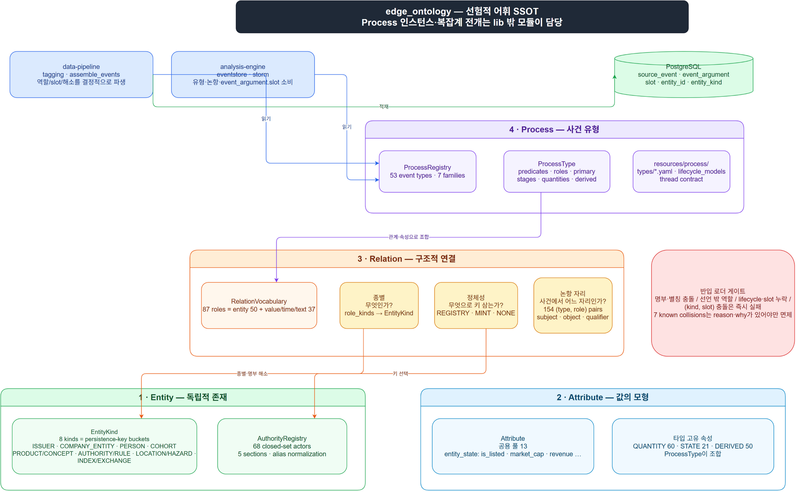

# 온톨로지 체계와 선언 규칙

## 1. 목적과 경계

`edge_ontology`는 뉴스·공시에서 **어떤 존재가 어떤 사건에 어떤 값으로 참여하는지**를
판정하는 선험적 어휘의 SSOT다. 실제 사건 인스턴스, LLM 호출, 문서 정규화, DB 적재와
스레딩 실행은 이 라이브러리 밖의 `data-pipeline`·`analysis-engine`가 맡는다.



- 세부 위계: [`ontology-data-hierarchy.drawio`](ontology-data-hierarchy.drawio) — 4페이지
  (4층 개요, 53 ProcessType, 20 lifecycle model, Relation·Entity·Attribute 축).
- 편집 원본: [`ontology-architecture.drawio`](ontology-architecture.drawio)
- 인스턴스가 아닌 **타입·역할·종별·값 모형·정체성 규칙**만 이 라이브러리에 둔다.
- 타입·역할·속성 어휘가 바뀌면 기존 코퍼스의 해석이 달라질 수 있다. 해당 경우
  `ONTOLOGY_VERSION`을 올리고 재태깅 범위를 명시한다.
- `resources/relation/`은 edge 로컬 증보다. 그 밖의 상류 리소스는
  event-ontology 확정본을 **통째로 교체**한다. 부분 발췌·현지 수정은 금지한다.

## 2. 네 층과 의존 방향

아래 층은 위 층 없이 성립한다. Python import도 이 방향을 보존한다.

| 층 | 의미 | 라이브러리 소유물 | 이 층이 모르는 것 |
|---|---|---|---|
| **1. Entity** | 독립적으로 존재하는 것 | 종별, persistence key, 닫힌 명부 | 사건 역할·어느 타입에서 쓰는지 |
| **2. Attribute** | 실체·사건이 지니는 값 | 값의 종류, 단위 계열, 계산 입력 | 실제 값·파싱 실행 |
| **3. Relation** | 실체 또는 값을 사건에 붙이는 구조적 연결 | 역할 어휘, 종별 결속, 정체성 방식, 논항 자리 | 문서의 개별 멘션 |
| **4. Process** | 시공간적 상호작용의 타입 | 사건 타입, 술어, 라이프사이클, 역할·속성 조합 | 사건 인스턴스·절차적 전개 |

```text
Entity ───────────────┐
Attribute ────────────┼──> ProcessType (사건의 선언적 조합)
Relation ─────────────┘

Process instance / extraction / storage / threading  ──> lib 밖 모듈
```

`ProcessType`은 아래 세 층을 참조하므로, 모든 층간 참조 검증은 `ProcessRegistry`가 수행한다.
하위 층은 상위 층을 import하지 않는다.

## 3. 리소스 정본과 공개 API

| 층 | 정본 리소스 | 모델·로더 | 공개 진입점 |
|---|---|---|---|
| Entity | `entity/entity_kinds_v0_1.yaml` · `entity/authority_registry_v0_1.yaml` | `EntityKind` · `AuthorityRegistry` | `load_entity_kinds()` · `load_authority_registry()` |
| Attribute | `attribute/common_features_v0_1.yaml` | `Attribute` | `load_common_attributes()` |
| Relation | `relation/role_bindings_v0_1.yaml` · `relation/argument_slots_v0_1.yaml` | `Relation` · `RelationVocabulary` | `load_relations()` |
| Process | `process/types/*.yaml` · `process/lifecycle_models_v0_1.yaml` · `process/news_thread_contract_v0_1.yaml` | `ProcessType` · `ProcessRegistry` | `load_process_registry()` |

추가 읽기 API:

| API | 계약 |
|---|---|
| `role_entity_kind(role)` | 실체 역할의 종별. 비실체·미선언 역할이면 `None` |
| `resolve_authority(role, mention)` | 역할이 선언한 명부 절에서만 이름을 해소. 다른 절을 넘나들지 않는다 |
| `concept_key(role, mention)` | 채번 가능한 역할의 정규화 키. `NONE` 또는 잡음 멘션이면 `None` |
| `ProcessType.slot_of(role)` | `(type, role)`의 결정적 논항 자리. 비참여자 역할이면 `None` |
| `load_lifecycle_models()` | lifecycle model의 정렬된 stages와 terminal states |

## 4. Entity — 종별은 적재 키 버킷이다

종별은 상위 존재론 분류표가 아니라 **어떤 키로 실체를 적재·동일시할지**의 계약이다.
`EntityKind.persistence_key`가 비면 로더는 즉시 실패한다.

| `EntityKind` | `persistence_key` | 주된 용도 |
|---|---|---|
| `ISSUER` | `ticker` | 상장사 primary role, 시총·유동성 join |
| `COMPANY_ENTITY` | `ticker_or_normalized_name` | 인수자·고객·공급사·상대방 |
| `PERSON` | `normalized_person_name` | 임원매매·인사·소송 당사자 |
| `PRODUCT_OR_CONCEPT` | `concept_id` | 제품·기술·상품·지표 |
| `COHORT` | `group_key` | 업종·테마·거시 그룹 |
| `AUTHORITY_OR_RULE` | `normalized_authority_or_rule` | 기관·법원·규칙·법적 사안 |
| `LOCATION_OR_HAZARD` | `normalized_location_or_hazard` | 장소·재난·질병·분쟁 |
| `INDEX_OR_EXCHANGE` | `normalized_index_or_exchange` | 지수·거래소·시장 |

### 닫힌 명부

`AuthorityRegistry`는 규제기관·법원·중앙은행·시장기관만 명부로 닫는다. 명부의 절은
`authorities`, `courts`, `central_banks`, `institutions`, `foreign_authorities`다.

이름 정규화는 NFKC, 공백·가운뎃점 제거, `casefold` 순서다. 명부 로더는 다음을 거부한다.

- 미지 절
- 중복 `entity_id`
- 서로 다른 실체로 향하는 같은 별칭
- `ambiguous_rejected`에 포함된 별칭의 재유입

열린 집합(제품·개념·지역·규칙)은 명부로 닫지 않는다. 채번 여부는 Entity가 아니라
Relation의 정체성 선언이 판단한다.

## 5. Attribute — 값의 출처와 계산 규칙

| kind | 선언 위치 | 의미 | 실행 책임 |
|---|---|---|---|
| `QUANTITY` | 타입별 `quantities` | 사건이 실어 온 수량 | 원문 surface를 파싱해 `event_measure`에 적재 |
| `STATE` | 공용 `entity_state` 또는 타입별 `entity_state` | 사건 시점 실체의 상태 | 외부 재무·시장 자산과 PIT join |
| `DERIVED` | 타입별 `derived` | 선언된 input의 함수 | formula를 소비하는 계산 모듈 |

`Attribute`의 필수 선언은 `desc`다. `QUANTITY`는 단위 계열(`unit_family`), 기준
(`basis`), 완결성 필수 여부(`required`)를 추가로 가질 수 있다. `DERIVED`는 반드시
`formula`와 하나 이상의 `inputs`를 가진다.

공용 속성은 전 타입이 상속하는 `entity_state` 풀이다. 타입 고유 속성은 해당
`process/types/*.yaml` 안에만 선언한다. `realized`, `post_event`, `car`, `next_day`,
`ar_` 계열 id는 사후정보 누출(PIT 위반)이므로 반입 게이트가 거부한다.

## 6. Relation — 역할 하나에는 세 독립 축이 있다

역할(`role_code`)은 관계의 이름이며, 사건 타입이 그 역할의 정의역을 제공한다. 한 역할은
아래 세 질문에 각각 답한다. 이를 하나의 분류값으로 합치지 않는다.

| 축 | 질문 | 선언 | 예 |
|---|---|---|---|
| 종별 | 그 자리에 오는 것은 **무엇인가** | `role_kinds` | `CUSTOMER → COMPANY_ENTITY` |
| 정체성 | 그것을 **무엇으로 키 삼는가** | `identity` | `COURT → REGISTRY(courts)` |
| 논항 자리 | 사건에서 **어떤 자리인가** | `argument_slots` | `(PRODUCT.CERTIFICATION, ISSUER) → object` |

### 6.1 종별과 비실체 값

`Relation`은 `entity_kind`와 `value_class` 중 정확히 하나만 가진다.

- `entity_kind`가 있으면 실체 참여자다. `event_argument.entity_id`를 가질 수 있고 slot
  선언 대상이다.
- `value_class`가 있으면 비실체 값이다. 허용값은 `TIME`, `VALUE`, `TEXT`다. 이 값은
  `entity_id`가 없으므로 `event_argument`에 적재하지 않으며, slot도 선언하지 않는다.

### 6.2 정체성 방식

| scheme | 의미 | 규칙 |
|---|---|---|
| `REGISTRY` | 닫힌 명부 완전일치 | 반드시 하나 이상의 `sections`를 선언한다 |
| `MINT` | 정규화 문자열에서 개념 키 채번 | 빈·한 글자·숫자만인 멘션은 채번하지 않는다 |
| `NONE` | 이 lib에서 해소하지 않음 | 외부 키가 오거나 동명이인 위험이 있는 역할에 사용한다 |

`REGISTRY` 역할은 선언된 절만 조회한다. 이 제한은 `COURT + "공정거래위원회"`가 기관으로
오해소되는 것을 막는다. `EXCHANGE`·`MARKET`은 `institutions`를 먼저 보고, 명부에 없는
해외 거래소·시장을 위해서만 `mint_fallback`을 사용한다. ISSUER를 채번하면 상장사가
티커 실체와 별개의 유령 개념으로 분열하므로 `ISSUER`의 기본 방식은 `NONE`이다.

### 6.3 논항 자리

`argument_slots_v0_1.yaml`은 `event_argument.slot`의 SSOT다. 현재 허용값은 다음 세 개다.

| slot | 의미 |
|---|---|
| `subject` | 사건을 일으키거나 겪는 주역 |
| `object` | 행위가 향하는 대상 |
| `qualifier` | 장소·근거·범위·규격 같은 부수 정보 |

slot은 역할 전역값이 아니라 `(event_type_code, role_code)`의 함수다. 같은 `ISSUER`도
배당결정에서는 `subject`, 제품인증에서는 `object`, 임원매매에서는 `qualifier`다. 반대로
BUY/SELL처럼 방향이 반대인 술어도 역할의 자리는 바꾸지 않으므로 술어별 slot 표는 두지
않는다.

따라서 data-pipeline은 slot을 LLM에게 묻지 않는다. 추출된 역할이 유효하면
`ProcessType.slot_of(role)`으로 값을 파생하며, 추출이 빈 경우의 anchor 폴백 행도 동일하게
파생한다.

## 7. Process — 하위 세 층의 선언적 조합

`ProcessType`은 다음을 한 사건 타입에 묶는다.

| 영역 | 필드 | 규칙 |
|---|---|---|
| 사건 고유 | `predicates` | 순서가 있으며 `[0]`이 기본 술어. 비어 있으면 거부 |
| 사건 고유 | `lifecycle_model`, `stages`, `stage_sensitive` | lifecycle model의 순서축을 사용 |
| 관계 조합 | `required_roles`, `optional_roles`, `identity_roles`, `primary_roles` | 역할은 Relation 어휘 안에 있어야 함 |
| 관계 조합 | `slots` | 실체 참여자 역할마다 정확히 하나 |
| 속성 조합 | `quantities`, `entity_state`, `derived` | 타입 고유 속성 선언 |
| 스레딩 | `identity_required`, `identity_optional`, `missing_identity_policy` | news thread contract에서 파생 |

`primary_roles`는 게이트가 고른 ticker가 맡을 수 있는 역할이다. 하나도 선언되지 않거나
참여자 역할 집합 밖이면 타입을 적재할 수 없다. 수량 역할은 Relation 역할이 아니라
Attribute이므로 관계 어휘 검사와 slot 선언 대상에서 제외한다.

라이프사이클은 `stages`의 순서축과 `terminal` 상태를 함께 선언한다. 빈 `stages`와 빈
`terminal`은 단발 사건을 뜻하며 오류가 아니다.

## 8. 반입 게이트 — 조용한 오염을 허용하지 않는 규칙

모든 로더는 불일치를 누적한 뒤 `ValueError`로 실패한다. 이는 소비자에서 NULL 또는
자유텍스트로 조용히 흘리는 것보다 앞선 반입 시점에 깨뜨리는 정책이다.

| 범위 | 실패 조건 |
|---|---|
| Entity kinds | 빈 종별 표 또는 빈 `persistence_key` |
| Authority registry | 미지 절, 중복 id, 별칭 충돌, 거부 별칭 재유입 |
| Relation vocabulary | 역할이 entity·non-entity에 중복, 미지 종별/value class, 미지 scheme, `REGISTRY`의 빈 section, `NONE`/`MINT`의 section 선언 |
| Argument slots | 빈 표, 허용값 밖 slot, `pair_count` 불일치, 사유/근거 없는 collision 면제 |
| Process references | Relation 어휘 밖 역할, 없는 lifecycle model, 빈 predicates, 빈 primary role, primary가 참여자 역할 밖 |
| Process slots | 실체 참여자 slot 누락, 비실체 역할의 stray slot, 미등재 `(entity_kind, slot)` 충돌 |
| Attributes | 타입 내 id 중복, 빈 `desc`, PIT 금지 id, `DERIVED`의 formula/inputs 누락, 미선언 input |

### `(entity_kind, slot)` 충돌 규칙

한 ProcessType 안에서 같은 종별과 같은 slot에 역할이 둘 이상이면 식별 불가다. 유일한
예외는 `argument_slots.known_collisions`에 다음 두 필드를 갖춰 등록한 경우다.

| reason | 뜻 | 닫는 방법 |
|---|---|---|
| `vocabulary_defect` | 역할이 둘일 근거가 없는 어휘 결함 | 어휘 개정 + 관련 코퍼스 재태깅 |
| `slot_arity` | 3값 slot에 SOURCE/RECIPIENT가 object로 접힌 한계 | DB CHECK와 어휘를 5값으로 확장; 재태깅 불필요 |

현재 알려진 7건은 면제가 아니라 정리 원장이다. `why` 없는 신규 면제는 허용하지 않는다.

## 9. 소비자와 DB 사상

| 소비자 | 온톨로지에서 읽는 것 | 결과 |
|---|---|---|
| `data_pipeline.tagging` | Process type·predicate·role menu | 추출 프롬프트의 폐쇄 메뉴 |
| `data_pipeline.steps.assemble_events` | `role_entity_kind`, `resolve_authority`, `concept_key`, `slot_of`, stage 메뉴 | 역할 해소·완결성·event rows의 결정적 파생 |
| `analysis_engine.eventstore` | `event_argument.slot` | slot을 포함한 event argument 소비 |
| storm experiment catalog | `load_type_definitions` | 타입 카탈로그 조회 |

| DB 열 | 정본 | 파생 방식 |
|---|---|---|
| `source_event.event_type_code` | Process type | 게이트가 허용한 유형 |
| `source_event.predicate_code` | `ProcessType.predicates` | 메뉴 값, 없으면 `[0]` 기본 술어 |
| `source_event.lifecycle_stage` | lifecycle model | 선언 메뉴 밖 값은 `NULL` |
| `event_argument.role_code` | Relation vocabulary | 메뉴 밖 역할은 해당 argument를 버림 |
| `event_argument.entity_id` | Relation identity + Entity key | 명부 해소·채번·외부 키 규칙 |
| `event_argument.entity_kind` | `Relation.entity_kind` | 해소된 참여자에만 기록 |
| `event_argument.slot` | `ProcessType.slot_of(role)` | LLM 출력이 아니라 `(type, role)`에서 결정 |
| `event_measure` | Attribute `QUANTITY` | surface는 추출, value/unit은 결정적 파서 |

## 10. 변경 규약

1. **의미 변경을 먼저 판정한다.** 타입·술어·역할·slot·종별의 해석이 달라지면 재태깅이
   필요한 어휘 변경이다. 새 코드만 추가하고 기존 해석이 동일하면 버전 개정 없이 가능하다.
2. **상류 리소스는 통째로 교체한다.** 로컬에서 일부 YAML만 고쳐 별도 방언을 만들지 않는다.
3. **Relation 로컬 증보는 명시적으로 남긴다.** 상류에 대응물이 없으므로 `origin`과
   backport 상태를 메타데이터에 기록한다.
4. **결정적인 값은 LLM에게 묻지 않는다.** slot·허용 역할·stage 메뉴·명부 절 선택은
   선언과 코드에서 파생한다.
5. **새 예외는 원장이 아니라 결함 보고다.** collision 면제는 `reason`과 `why`를 강제하고,
   해결 경로가 없는 예외를 추가하지 않는다.
6. **소비자 계약을 함께 검증한다.** 리소스·로더·DB CHECK·백필 SQL이 같은 어휘를 가리켜야
   한다. `event_argument.slot` 변경은 `ck_event_argument_slot`과의 동형성을 확인한다.

## 11. 현재 한계와 다음 개정 경계

- 8 EntityKind 중 `*_OR_*` 네 개는 적재 키 버킷이며 정교한 상위 분류가 아니다.
  `kind_path` 병렬 추가와 8종 은퇴는 재태깅 창의 별도 작업이다.
- slot의 현행 3값은 source/recipient를 `object`로 접는다. 5값 확장은 schema CHECK와
  resource를 함께 바꾸는 별도 변경이다.
- `PARTNER_2`, `MERGING_ENTITY`, `PRODUCT_FAMILY`/`TECH_NODE`는 선언된 어휘 결함이다.
  `known_collisions`에서 숨기지 않으며 관련 유형 재태깅과 함께 정리한다.
- `HAZARD`와 `LEGAL_ISSUE`의 continuant/occurrent 경계 재설계는 기존 entity_kind
  소비 경로를 확인한 뒤에만 진행한다.
