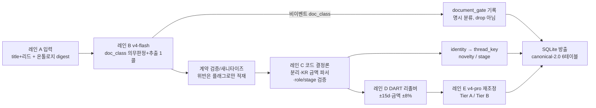

# 뉴스 추출·정규화 런북 v4 — canonical-1.0 코퍼스 → canonical-2.0 조회 스키마

> **위치.** 이 문서는 `event-argument-schema-v1.md`(7축 타입분리 + 4교정)의 **실행 런북**이다.
> 대상 코드는 `src/normalize/`(신규, `pythonpath=src` → `import normalize`), 소비 SSOT는
> `src/ontology`(수정 금지: 53타입 registry/profiles, lifecycle stage vocab,
> `news_thread_contract_v0_1.yaml`)이다. **설계 SSOT는
> `alphamale/artifacts/diagrams/ontology-normalization-v4-design.drawio`(레인 A~E)이며, 이 런북은
> 그 레인을 1:1로 구현·실행한다**: A 입력 → B `deepseek-v4-flash` 게이트+타입분류·per-type 추출
> (**라이브 호출**) → C 코드 결정론 정규화(LLM 0) → D DART 공시 리졸버(정규식·LLM 0) →
> E `deepseek-v4-pro` 에이전트 재조정 → canonical-event-2.0. 종전의 "100% 결정론·LLM 0회" 모드는
> corpus-v3 소비 **fallback**으로 강등되어 `normalize` 서브커맨드로 유지된다.

## (a0) 레인 구조 — drawio 1:1 매핑

| 레인 (drawio) | 구현 | 규칙 |
|---|---|---|
| **A. 입력** | `normalize.leads` + v3 코퍼스 + `src/ontology` SSOT + DART OpenAPI | econ parquet(뉴스 title+리드: 텍스트 컬럼 자동탐지 → html 제거 → 문장 3개/600자), 온톨로지 digest(53타입\|술어\|필수역할\|수량메뉴+stage vocab) 주입 |
| **B. v4-flash 문서판정(doc_class)+추출(1콜)** | `normalize.extract` | `https://api.deepseek.com/chat/completions`, 모델 `deepseek-v4-flash`, temperature=0, `response_format=json_object`, 배치 10건 `"[i] 제목 ⊙ 리드"`, 워커 ≤32, 재시도 ≤3(백오프). **모든 입력 i에 doc_class 의무 판정**(EVENT\|MARKET_COMMENTARY\|OPINION_OR_ANALYSIS\|PROMOTIONAL\|LIST) — 비이벤트는 명시 분류이지 "item 부재"가 아니다. EVENT면 item 필수. per-type 인자: role·predicate·stage + measure SURFACE verbatim — **LLM 판단만, 산술 금지**. extract 캐시 = JSONL(document_id 키, 재개 가능) |
| **C. 코드 결정론 정규화** | `normalize.events/amounts/threading` (기구현 재사용) | KR 금액 파서, role 메뉴 강제, basis 근거없으면 UNKNOWN, sanity 게이트(<1억·>100조 → 리뷰 플래그) |
| **D. DART 공시 리졸버** | `normalize.dart` (정규식·LLM 0) | stock_code→corp_code, 단일판매·공급계약 공시 조회(공시일 = 보도일 **±15d**), 정규식 파싱 → 계약금액·기간(시작/종료)→years·매출대비%. **금액매칭(±8%)=DART 권위** / 날짜만 매칭=모호(리뷰 플래그) / 미링크=뉴스값 유지 |
| **E. v4-pro 에이전트 재조정** | `normalize.agent` | 뉴스+DART 대조, 권위 = **DART > NEWS**, 근거 없으면 날조 금지. **Tier A**(DART 금액매칭: value·years·basis·rev% 결정론) / **Tier B**(UNRESOLVED: 기간의존 지표 제외). 검증 실패 제안은 기각(값은 코드·DART 소유) |

measures 결정론 계약(drawio p2): value=코드파싱(surface), unit=base 통화코드, basis=근거없으면
UNKNOWN, role=타입 qty메뉴 강제, `resolution_source ∈ {DART, NEWS, UNRESOLVED}` **활성화**
(DART=공시 권위 덮어쓰기·provenance `dart_rcept_no` 보존, NEWS=뉴스 surface 코드파싱,
UNRESOLVED=값 미해상).

## (a) 입력 계약 — 실측 (2026-07-24, 전수 스캔)

입력: `news_events_2026-06_07_v3.jsonl` (읽기 전용, alphamale interim). 전수 파싱 실측:

| 측정 | 값 |
|---|---|
| JSONL 줄 수 / 파싱 오류 | **39,959 / 0** |
| 문서:이벤트 | **1:1** (39,959 이벤트, `events[]` 길이 항상 1) |
| 월 분포 (`published_at` prefix) | 2026-06 = **23,731** · 2026-07 = 16,228 |
| argument 수 | 123,985 |
| `schema_version` | 전건 `canonical-event-1.0` |
| `event_type_id` distinct | **53 = 온톨로지 registry와 정확히 일치** (차집합 양방향 공집합) |
| `proposition.predicate_id` | 전건 `null` (`predicate_source="deferred"`) |
| stage/lifecycle 필드 | **없음** (v1.0에는 stage 슬롯 자체가 부재) |

**문서 레벨 키**(전건 동일): `schema_version`, `ontology_version`("2026-01"), `document_id`,
`published_at`("YYYY-MM-DD HH:MM:SS", KST 로컬 문자열), `events[]`.

**이벤트 레벨 키**(전건 동일): `event_id`("<document_id>#<n>"), `event_type_id`,
`proposition{predicate_id, predicate_source, subject_roles[], object_roles[]}`,
`arguments[]`, `completeness`(complete 35,292 / partial 4,667),
`confidence`(H 28,509 / M 9,414 / L 2,036),
`evidence{title, text_basis, assembler}` (`text_basis` 전건 "title+lead", assembler "llm-extract-v3").

**argument 레벨 키**(전건 동일): `role_id`, `mention{text}`(verbatim span),
`normalized{...}`, `role_source`("llm-extract-v3"). `normalized.kind` 3종 실측:

| kind | 건수 | normalized 형태 |
|---|---|---|
| `ENTITY` | 29,404 | `{kind, entity_id}` — entity_id 전건 `ORG_KR_<6자리 티커>` |
| `ENTITY_UNLISTED` | 74,179 | `{kind, name}` |
| `QUANTITY` | 20,402 | `{kind, value, unit}` (+2,896건 `review:"OFF_MENU"`, +3건 `norm`) — value에 null 존재, **선행 파이프라인이 환산까지 수행("2배"→100 PCT, "1분기"→90 DAYS)한 값이라 그대로 신뢰하지 않는다(§b-3)** |

**역할 × 온톨로지 크로스탭**(분리 정책의 근거, §b-2):

| (role∈타입 role 메뉴, role∈타입 quantities 메뉴, kind) | 건수 | 처리 |
|---|---|---|
| (in, non-qty, ENTITY_UNLISTED) | 72,969 | participant |
| (in, non-qty, ENTITY) | 29,404 | participant |
| (in, qty, QUANTITY) | 11,033 | measure |
| (**off-menu**, —, QUANTITY) | 8,457 | measure + `OFF_MENU_ROLE` 플래그 (드롭 금지) |
| (in, qty, ENTITY_UNLISTED) | 1,210 | measure(role 우선) + `ENTITY_KIND_IN_QUANTITY_ROLE` |
| (in, non-qty, QUANTITY) | 912 | measure(kind 우선) + `QUANTITY_KIND_OFF_QUANTITY_MENU` |

off-menu **entity** 역할은 0건 — 미정의 역할 문제는 전부 수량 축(파생 지표 이름: `EFFECTIVE_LAG_DAYS`,
`NAMED_EXECUTIVE_COUNT`, `TP_NEW` 등)이다. 역할 중복 이벤트 4,628건(11.6%) — v1.0에는
바인딩 키가 없으므로 corpus 유래 행의 `group_ord`는 **NULL(UNKNOWN)** 로 적재한다(날조 금지).

**참고 산출물**(thread_run_2026-06_07, 구조 참조만): `event_thread.jsonl`의
`thread_key = "event_type_id=<TYPE>||required:<ROLE>=<JSON>"`, `thread_id = "thr_"+16hex`.
verbatim-mention 키의 파편화가 v3의 알려진 결함 → §b-5 교정(정규화 identity 값) 적용.

## (b) 파이프라인 단계



### b-1. LLM 추출 계약 v3 — 문서별 의무 판정(doc_class) + per-type 추출 (레인 B 라이브)

계약 SSOT는 **사용자 확정 v3 계약**(2026-07-24 사용자 판정 2건 반영)이며 item 내부 스키마는
`normalize.llm_contract`가 소유한다(기존 b-1 확정형 그대로). 사용자 판정: (1) 비이벤트는
"item 부재"가 아니라 **명시적 시황/오피니언 분류**여야 한다, (2) **item이 없어도 이벤트일 수
있다** — 추출 실패와 비이벤트를 절대 혼동하지 않는다. **배치당** 출력 JSON은 정확히 이 형태다:

```json
{"docs":[
 {"i": 0, "doc_class": "EVENT", "item": {
   "type": "COMPANY.CONTRACT.SIGNING",
   "predicate": "SIGN",
   "trigger": "원유운반선 2척을 2734억원에 계약",
   "stage": "DEFINITIVE_SIGNED",
   "participants": [
     {"role":"SUPPLIER","slot":"subject","mention":"한화오션","group":0},
     {"role":"CONTRACT_OBJECT","slot":"object","mention":"유조선","group":1}],
   "measures": [
     {"role":"QUANTITY","surface":"2척","basis":"UNKNOWN","group":1},
     {"role":"CONTRACT_VALUE","surface":"2734억원","basis":"UNKNOWN","group":1}],
   "confidence": "H"}},
 {"i": 1, "doc_class": "MARKET_COMMENTARY", "item": null}]}
```

**의무 판정 + 완전성 규칙**: 모든 입력 i가 `docs[]`에 **정확히 1회** 등장해야 한다.
누락 i = **추출 실패** → 배치 재시도(≤3), 최종 실패 시 해당 문서만 error 레코드(재개 시
재시도)로 기록한다 — **누락·실패를 비이벤트로 기록하는 것은 금지**(침묵 drop 0).
off-menu doc_class 판정도 해당 i의 추출 실패로 취급한다(무효 판정은 기록 불가). 단 하나의
결정론 예외(실측 실패 모드): doc_class에 **item.type과 동일한 타입 ID를 에코**한 경우는
의미가 유일(EVENT)하므로 EVENT로 정규화하고 `n_doc_class_coerced`로 집계한다(에코 문자열
자체는 어디에도 기록 금지; item 부재·타입 불일치 에코는 그대로 추출 실패).

doc_class 메뉴(문서 판정, 상호배타):
- `EVENT` — 구체적 사건 보도 → **item 필수**. item이 없으면 그 문서는
  `EXTRACTION_INCOMPLETE` 리뷰 플래그와 함께 `document_gate`에 EVENT로 기록된다
  (event_fact에는 못 들어가지만 **비이벤트로 오분류되지 않는다**).
- `MARKET_COMMENTARY` — 시황·시세 해설: 가격·지수 움직임 자체, 누적 회고·마일스톤 단독
  ("2배 폭등"·"고공행진"·"반토막"·"X년 만에 최고/최저"), 영향·조언 중심 해설.
- `OPINION_OR_ANALYSIS` — 전망·분석·칼럼·의견.
- `PROMOTIONAL` — 보도자료·수상·신제품 홍보톤.
- `LIST` — 단순 나열·목록·시세표.
- doc_class≠EVENT ⇒ **item 금지**. item이 오면 무시하고 `ITEM_ON_NON_EVENT` 플래그(적재 0).

item 필드 규칙(기존 확정형): `type`=53타입 메뉴 · `predicate`=타입 통제 술어 메뉴 ·
`trigger`=원문 verbatim span(감사·스팬검증, event_fact로 적재) · `stage`=lifecycle_model
vocab 내 값 또는 null · `participants`=**개체값 역할만** `{role, slot(subject|object|
qualifier), mention(verbatim), group(정수 서수)}` · `measures`=**수량값 역할만** `{role,
surface(verbatim), basis(명시 마커 없으면 "UNKNOWN"), group}` — **LLM은 value/unit을 내지
않는다**(결정론 KR 파서가 계산) · `confidence`=H|M|L · participants↔measures는 group 서수로
연결(멀티 라인아이템).

테이블 매핑: doc_class/has_item/review_flags → `document_gate`(월 문서 전수 1행, §b-6),
type/predicate/trigger/stage/confidence → `event_fact`,
participants → `event_participant(role/slot/mention/group_ord)`,
measures → `event_measure(role/surface→value·unit 파싱/basis/group_ord)`.
`normalize.llm_contract.llm_payload_to_doc()`가 계약 출력을 canonical 이벤트로
변환해 아래 b-2~b-7과 **동일한 경로**로 흘린다(골든 픽스처로 적재 가능성 검증).
계약 검증: 미정의 타입/술어/stage/slot/basis는 위반으로 보고, participants에
수량 메뉴 역할 진입은 위반(교차 오염 금지); off-menu measure 역할(예 위 예시의
`QUANTITY`)은 거부하지 않고 `OFF_MENU_ROLE` 리뷰 플래그로 수용한다.
**라이브 모드(기본)**: 레인 B가 2026-06 문서 전량(23,731건)을 title+리드로
`deepseek-v4-flash`에 배치 추출한다. EVENT item은 `validate_llm_item`으로 검증 후
새니타이즈해 적재한다 — **미정의 타입 item은 적재 거부(리뷰 레코드 + 게이트
`ITEM_TYPE_REJECTED` 플래그, doc_class는 EVENT 유지)**, 미정의 predicate/stage/slot 값은
NULL/'UNKNOWN'으로 강등 + `INVALID_*` 리뷰 플래그(위반 값 자체는 어떤 컬럼에도 적재 금지).
비이벤트 문서는 이벤트 0건 문서로 흘리되 `document_gate`에 명시 분류로 기록된다(손실
아님, 퍼널·게이트로 집계). 엔티티 해상은 코드 소유: 같은 문서의 v3 코퍼스 ENTITY
링크(mention 정규화 일치)를 결정론 재사용해 `entity_id`를 복원한다(교차 문서 추정 금지).
**절대 배제(앵커 규칙에 우선, prompt `v3-docclass`)**: 부동산 시세(아파트·단지·지역 집값),
개인 신용점수, 주가·시총·지수 등락 자체는 관측창이 있어도 이벤트가 아니다 →
doc_class=MARKET_COMMENTARY. COMMODITY_PRICE_CHANGE 대상은 원자재·에너지·운임·농산물·금속
등 **산업 투입재 시장가격뿐**이다(수용 기준: "동탄 아파트 2주새 4% 급등"류는 반드시
MARKET_COMMENTARY — §(d)16).
**가격·지표 앵커 경계(v2 계승)**: 관리가격의 이산 변경·결정(요금·할증료·공급가
인상/인하)이거나 명시된 관측창의 새 프린트(전일比/전주比/전월比/'N주 연속'/특정일 마감 +
구체 수치)만 이벤트다. 누적 회고·마일스톤 단독이나 영향·조언 중심 해설 →
MARKET_COMMENTARY, 전망·분석 → OPINION_OR_ANALYSIS, 홍보톤 → PROMOTIONAL, 단순 나열 →
LIST(수용셋 §INDUSTRY.PRICE.COMMODITY_PRICE_CHANGE v3 절대 배제와 동일 규칙).
**캐시 레코드**: `{"document_id", "doc_class", "item", "prompt_v"}` (JSONL, document_id 키,
재개 가능; v3 캐시 = `data/cache/extract_v3docclass_2026-06.jsonl`, v2 캐시
`extract_v4_2026-06.jsonl`은 negatives-corpus로 보존). `load_cache`/`docs_from_cache`는 구
레코드(v2, doc_class 없음)와 하위호환: item 있으면 EVENT, item null이면
`NON_EVENT_LEGACY`로 해석한다. 캐시에 레코드가 없는 문서(재시도 후 최종 실패)는
`document_gate`에 `EXTRACTION_ERROR`로 기록된다 — 실패는 절대 비이벤트가 아니다.
**change-control**: 게이트/메뉴 프롬프트 변경 시 `normalize.extract.PROMPT_VERSION`을 올리고
(캐시 레코드 `prompt_v`로 행 단위 기록), 영향 타입/슬라이스만 `--refresh-docs`로 표적
재추출한다 — 변경 영향 범위만 재처리, 전량 재실행은 선택(v3 승격은 판정 축 자체가 바뀌어
전량 재추출).
**결정론-전용 fallback**: 코퍼스 v3 surface를 이 계약 형태로 어댑트해 소비한다(LLM 0회) —
코퍼스에 없는 필드(slot 일부, basis, group, trigger, stage)는 UNKNOWN/NULL honesty 규칙(§a).

### b-2. 결정론 정규화 — 타입 검증 → 분리

1. **타입 검증**: `event_type_id ∈ registry(53)`. 미정의 → 이벤트 보존 +
   `UNKNOWN_TYPE` 리뷰 플래그(family/stage 유도 불가 → NULL/'UNKNOWN').
2. **분리(타입 안전)**: measure 판정 = `role_id ∈ 타입 quantities 메뉴` **OR**
   `normalized.kind == QUANTITY`. 나머지 전부 participant.
   불변식: participant에 QUANTITY kind 0건, measure에 entity_id 0건(교차 오염 금지).
   크로스탭 소수 케이스는 §a 표의 플래그를 단다. off-menu 역할은 드롭하지 않고
   `OFF_MENU_ROLE` 플래그로 리뷰 큐에 태운다.
3. **slot**: argument에 명시 slot(subject|object|qualifier)이 있으면 그대로(계약 경로),
   없으면 `proposition.subject_roles/object_roles` 소속으로 subject/object, 아니면 NULL.

### b-3. 한국어 금액/단위 파서 (코드가 value 소유)

`normalize.amounts.parse_amount(surface)` — 입력은 verbatim `mention.text`.
코퍼스 `normalized.value`는 선행 파이프라인의 환산 결과를 포함하므로 **사용하지 않고
재파싱**한다(스키마 스펙 §4 교정 ①: value는 코드 소유).

- 자리값: 조=1e12, 억=1e8, 만=1e4 (+세그먼트 내 천/백/십). 연속 세그먼트 합산:
  "1조9000억"=1.9e12, "333억9000만"=3.339e10, "1만4312주"=14,312.
- 콤마/소수: "3,100억원"=3.1e11, "1.5조"=1.5e12.
- 범위: "3조~4조원" → **중앙값** + `parse_flag=approx_or_range` (스키마 스펙의
  레인지=중앙값 규칙). 좌변에 자리값이 없으면 우변의 자리값·단위를 상속("3~4조").
- 근사 마커(약/가량/안팎/이상/이하/최대/최소/숫자+여) → `approx_or_range`.
- 통화: 원/₩ → KRW(`currency_marked=1`); 달러/불/USD/$ → **USD 무환산**
  (`currency_marked=1`); 단위 토큰 없이 만 이상 자리값만 있으면 KR 금융뉴스 관행상
  KRW로 두되 `currency_marked=0`으로 구분(암시적 통화를 명시적 통화와 절대 혼동하지 않음).
- 기타 단위: % / %p / 퍼센트 → PCT; 주/건/명/개/대/척/곳/가구/회/기 → COUNT;
  년 → YEARS, 개월 → MONTHS, 일 → DAYS (**환산 금지** — 스펙 unit 메뉴
  {KRW,USD,PCT,COUNT,DAYS}에 YEARS/MONTHS를 가산 확장; "5년"→1825일 같은 환산은 날조).
- 파싱 불가(숫자 없음, 다중 숫자 run 모호, 미인식 단위 "2배"/"1분기"/"3나노") →
  `value=NULL, parse_flag=no_number, value_source=UNRESOLVED`. **추정·환산 금지.**
- `basis`: surface에 "총" → TOTAL, "연간" → ANNUAL, 그 외 **UNKNOWN**(스펙 교정 ②).
- `value_source ∈ {PARSED, UNRESOLVED, DART}` — DART는 레인 D 권위 덮어쓰기 시 활성
  (`parse_flag="dart"`, `resolution_source="DART"`, `dart_rcept_no` 보존).

### b-4. role/predicate 온톨로지 검증

- predicate: 값이 있으면 타입 predicate 메뉴로 검증, **위반 시 `INVALID_PREDICATE` 플래그 +
  `predicate_id=NULL` 강등(미정의 술어는 컬럼에 적재 금지 — 이벤트는 보존)**. 소스 부재(null)는 gap 집계.
- role: 타입 role 메뉴(required ∪ optional ∪ quantities) 밖이면 `OFF_MENU_ROLE`.
- stage: 소스에 있으면 lifecycle_model의 stages ∪ terminal로 검증(위반 →
  'UNKNOWN' + `INVALID_STAGE`); 소스에 없으면 stage_sensitive 타입은 **'UNKNOWN'**,
  아니면 NULL(해당 없음). 이번 코퍼스는 stage 부재 → stage_sensitive 이벤트 전건 UNKNOWN.

### b-5. identity → thread_key → novelty

`news_thread_contract_v0_1.yaml`의 타입별 `identity.required`가 SSOT.
정체값은 verbatim이 아니라 **정규화 값**(스키마 스펙 §7 교정 ③):

- ENTITY → `ENTITY:<entity_id>` (티커 결정론)
- ENTITY_UNLISTED → `NORM:<norm(name)>` (norm = NFKC + 공백 축약)
- QUANTITY(정체 역할이 수량일 때) → 파싱값 있으면 `QTY:<value>:<unit>`, 없으면 `NORM:<norm(surface)>`
- 같은 정체 역할 다중 필러 → 정렬 후 `+` 결합(결정론)

`thread_key = "event_type_id=<TYPE>||<ROLE>=<정체값>||…"`(contract의 required 순서),
`thread_id = "thr_" + sha1(thread_key)[:16]`. **required 역할이 하나라도 결손이면
`missing_identity_policy=EMIT_UNKNOWN_LINK_ONLY`**: thread_id=NULL,
novelty=UNKNOWN, `unknown_reason="missing required identity roles: …"`. 강제 연결 금지.

novelty(`(published_at, event_id)` 오름차순 PIT 스캔): 스레드 최초 이벤트 =
`FIRST_IN_THREAD`, 이후 = `FOLLOW_UP_STAGE`. `CORRECTION`은 correction_marker
predicate 필요(전건 null → 판정 불가, gap), `DUPLICATE_REBROADCAST`는
dedup_cluster 입력 필요(부재, `dedup_cluster_id=NULL` — thread_id로 유용 금지).

### b-6. SQLite 방출 — canonical-2.0 조회 뷰

스키마 스펙 §8 평면 읽기모델 + thread contract 테이블 + 문서 게이트. 6테이블:

```
event_fact(event_id PK, document_id, event_type_id, family, predicate_id, trigger,
           stage, thread_id, published_at, confidence, completeness,
           subject_entity_id, subject_role, title, review_flags)
event_participant(event_id→fact, arg_ord, role_id, slot, mention, entity_id,
                  entity_kind, group_ord, review_flag, PK(event_id, arg_ord))
event_measure(event_id→fact, arg_ord, role_id, surface, value REAL, unit, basis,
              value_source, parse_flag, currency_marked, group_ord, review_flag,
              resolution_source, dart_rcept_no, PK(event_id, arg_ord))
event_thread(thread_id PK, event_type_id, thread_key, current_stage, opened_at,
             latest_state_valid_from, latest_state_valid_to)
event_thread_link(event_id PK→fact, thread_id→thread, link_kind, novelty_status,
                  state_valid_from, asof, dedup_cluster_id, model_version,
                  data_version, unknown_reason)
document_gate(document_id PK, published_at, title, doc_class, has_item INTEGER,
              review_flags)
```

인덱스: fact(event_type_id / thread_id / published_at / document_id),
participant(entity_id / role_id), measure(role_id / value), thread(event_type_id),
link(thread_id / novelty_status), gate(doc_class). + `run_meta(key, value)` 런 증적(코퍼스
경로, 월 필터, 입력/출력 카운트, 결정론 해시 — 벽시계 없음).

`document_gate`는 **월 필터 내 전 문서 1행**(2026-06 = 23,731행)이다. doc_class ∈
{EVENT, MARKET_COMMENTARY, OPINION_OR_ANALYSIS, PROMOTIONAL, LIST} ∪
{NON_EVENT_LEGACY(v2 하위호환), EXTRACTION_ERROR(최종 추출실패)} — NULL 금지.
`has_item=1` ⇔ 해당 문서의 EVENT item이 event_fact로 적재됨. review_flags:
`EXTRACTION_INCOMPLETE`(EVENT인데 item 부재) / `ITEM_ON_NON_EVENT`(비이벤트에 item 동봉,
무시됨) / `ITEM_TYPE_REJECTED`(EVENT item이 off-menu 타입으로 적재 거부).

가산 컬럼 주석: `document_id/title`(증적·조인), `trigger`(확정 계약의 verbatim span —
코퍼스 v3에는 부재 → NULL), `arg_ord`(원본 순서 보존 PK),
`parse_flag/currency_marked`(스펙 §4 출처 채널), `review_flags`(리뷰 큐),
`resolution_source ∈ {DART,NEWS,UNRESOLVED}`(drawio p2 계약 활성화 — NEWS=코드파싱 성공,
UNRESOLVED=값 미해상, DART=레인 D 권위), `dart_rcept_no`(DART 덮어쓰기 provenance).
스펙 §8 컬럼명은 전부 그대로 보존(스펙 우선 규칙).

### b-7. 실행 모드 (CLI 서브커맨드)

- `normalize`(fallback, 결정론 전용): 코퍼스 v3 → b-2~b-6. `--month` prefix 필터,
  `--check-determinism`은 두 번 돌려 (event_id, thread_id, thread_key) 해시 동일 증명.
- `extract`(레인 A+B): 코퍼스 메타(document_id/published_at/title) + econ parquet 리드 →
  flash 배치 추출 → JSONL 캐시(`data/cache/extract_v3docclass_<월>.jsonl`, document_id 키).
  재실행 시 캐시 적중 문서는 API 재호출 0. `--limit N`으로 스모크(예: 50건) 지원.
- `build`(레인 C+D+E+방출): extract 캐시 → 계약 검증/새니타이즈 → b-2~b-6 정규화 →
  DART 리졸버(COMPANY.CONTRACT.SIGNING × 상장 공급사) → v4-pro 에이전트(금액매칭 건만) →
  SQLite + 리포트. DART/에이전트도 각자 캐시(`data/cache/dart_*.json`, `agent_v4_*.jsonl`)로
  재개 가능 — **전 캐시 적중 시 네트워크 0회로 동일 SQLite 재생성**.

### b-8. 레인 D — DART 공시 리졸버 (정규식 · LLM 0)

대상: `event_fact.event_type_id='COMPANY.CONTRACT.SIGNING'` × 공급사(SUPPLIER/ISSUER)가
v3 코퍼스에서 `ORG_KR_<티커>`로 해상된 이벤트. 단계:

1. stock_code → corp_code (`stock2corp` 캐시; alphamale experiment 캐시 읽기 재사용).
2. `list.json`으로 해당 corp의 "공급계약" 공시 조회(윈도 = 월 시작−15d ~ 월 말+15d; 캐시).
3. `document.xml` 정규식 파싱(캐시): `계약금액(원)`, `최근매출액(원)`, `매출액 대비(%)`,
   `시작일~종료일`(→ years = (end−start)/365.25) / fallback `계약기간 … N년`, `체결계약명`.
4. 매칭(이벤트 보도일 기준 공시일 ±15d 내 후보만):
   - **금액매칭**: |공시 계약금액 − 뉴스 CONTRACT_VALUE| / 뉴스값 < **8%** → DART 권위 확정.
     CONTRACT_VALUE·CONTRACT_DURATION(years)·REVENUE_SHARE_PCT를 `resolution_source=DART`,
     `value_source=DART`, `basis=TOTAL`(공시 계약금액은 총액), `dart_rcept_no` provenance로
     덮어쓰기/가산(공시에 없는 필드는 덮지 않음 — 날조 금지).
   - **날짜만 매칭**(금액 불일치, 최근접 공시 ±15d): 모호 → `DART_DATE_ONLY` 리뷰 플래그만,
     값 덮어쓰기 없음.
   - **미링크**(임계미만 소액·해외 등): 뉴스값 유지(`resolution_source=NEWS`/`UNRESOLVED`).

키: `DART_API_KEY`는 alphamale `.env`에서 `KEY=VALUE` 줄 파싱 + `os.environ.setdefault`로만
로드. **키 문자열은 코드·로그·산출물 어디에도 기록 금지.** 키 부재 시 레인 D만 중단(캐시로만 진행).

### b-9. 레인 E — v4-pro 에이전트 재조정 (Tier A/B)

대상: 레인 D **금액매칭** 계약만(권위 후보). 모델 `deepseek-v4-pro`, temperature=0,
json_object. 시스템 프롬프트 원칙(레퍼런스 보존): 주어진 사실(뉴스+공시)만, 추측·환산 금지,
공시 없으면 UNRESOLVABLE 선언. 에이전트 출력은 **제안**일 뿐 값을 소유하지 않는다:

- 제안이 DART 결정론 값과 일치(value ±5%, years ±0.15, resolvable=true) → **Tier A 확정**
  (정량 tradeable; run_meta `agent_agree` 집계).
- 불일치/판정불가 → 제안 **기각**, DART 값 유지 + `AGENT_DISPUTED` 리뷰 플래그(권위는 DART).
- 금액매칭이 아예 없는 계약 → **Tier B**: `resolution_source=NEWS/UNRESOLVED` 그대로,
  기간의존 파생지표(annualized_value, revenue_share) 계산 대상에서 제외. 날조 금지.

## (c) 단계별 불변식 + 실패 정책

| 단계 | 불변식 | 실패 정책 |
|---|---|---|
| 입력 | JSONL 줄당 1문서, 파싱 오류 0 | 파싱 불가 줄은 카운트 후 중단(현 코퍼스 0건) |
| 타입 검증 | 53타입 registry 소속 | 미정의 → 보존 + `UNKNOWN_TYPE`, family/stage NULL |
| 분리 | participant에 QUANTITY 0 · measure에 entity_id 0 | 크로스 케이스는 §a 규칙 + 리뷰 플래그 |
| 금액 파서 | 저장되는 value는 전부 numeric-typed | 파싱 불가 → NULL + `no_number` + UNRESOLVED. **환산·추정 금지** |
| role/predicate | 메뉴 밖 값은 전부 플래그 보유 | 드롭 금지, `OFF_MENU_ROLE`/`INVALID_PREDICATE` |
| threading | thread_id는 thread_key의 순수 함수 · dedup_cluster_id ≠ thread_id | identity 결손 → UNKNOWN 링크만(강제 연결 금지) |
| 방출 | 이벤트 손실 0: 입력 이벤트 수 == event_fact 행 수 == link 행 수 · **문서 손실 0: 월 문서 수 == document_gate 행 수 · event_fact 수 == gate의 doc_class=EVENT∧has_item=1 수** | 불일치 시 비정상 종료(방출 거부) |
| 전역 | 소스에 없는 값은 UNKNOWN/UNRESOLVED/NULL로만 표기 | 날조 금지 — 리포트 gap으로 집계 |
| 레인 B 추출 | 응답 JSON 유효율 ≥95% · 캐시 재개 시 API 재호출 0 | 배치 JSON 파싱 실패 → 재시도 ≤3 후 에러 레코드(재개 시 재시도) |
| 레인 B 완전성 | 모든 입력 i가 docs[]에 정확히 1회 — 누락 i로 인한 침묵 비이벤트 기록 0 | 누락 i → 배치 재시도 ≤3, 최종 실패 시 해당 문서만 error 레코드(`n_failed_docs` 보고). 비이벤트 기록 금지 |
| 레인 B 계약 | 미정의 타입/술어/slot/stage/doc_class 값 적재 0 · doc_class=EVENT⇒item 필수(부재는 `EXTRACTION_INCOMPLETE`) · doc_class≠EVENT⇒item 무시(`ITEM_ON_NON_EVENT`) | 타입 위반 item은 적재 거부+리뷰 레코드+게이트 플래그, 나머지는 NULL/'UNKNOWN' 강등 + `INVALID_*` 플래그 |
| 레인 D | 덮어쓰기는 금액 ±8% 매칭 시만 · provenance `dart_rcept_no` 필수 | 날짜만 매칭 → 플래그만, 값 불변. 공시에 없는 필드는 덮지 않음 |
| 레인 E | 에이전트 제안은 DART 결정론 값과 불일치 시 기각 | 불일치 → `AGENT_DISPUTED` 플래그, DART 값 유지 |

## (d) 수용 기준 (테스트로 검증)

1. **이벤트 손실 0** — 월 필터 후 입력 이벤트 수 == `event_fact` == `event_thread_link` 행 수.
2. **타입 유효율 100%** — `UNKNOWN_TYPE` 플래그 0행(실측상 53/53 일치).
3. **measure value 전건 numeric-typed** — `value IS NOT NULL AND typeof(value) NOT IN ('integer','real')` 0행.
4. **결정론** — 같은 입력 2회 실행 시 (event_id, thread_id, thread_key) 전건 동일(테스트 + `--check-determinism`).
5. **교차 오염 0** — participant.kind=QUANTITY 0행, measure.entity 유입 0행.
6. **identity 정직** — required identity 결손 이벤트는 전부 thread_id NULL + unknown_reason 보유.
7. **UNKNOWN 정직** — 소스 부재 필드(predicate, stage, group_ord, basis)는 NULL/'UNKNOWN'만 허용(값 채움 발견 시 테스트 실패).
8. **LLM 계약 적재 가능성** — 골든 픽스처(자작 2~3건)가 b-1 변환 → b-6 스키마에 무손실 적재.
9. 전체 `uv run pytest -q` 그린(기존 20 포함).
10. **[라이브] 추출 응답 JSON 유효율 ≥95%** — 배치 단위 `raw_json_ok / n_batches` (run_meta 집계).
11. **[라이브] 계약 위반 적재 0** — 미정의 타입/술어/slot/stage 값이 적재된 행 0
    (위반은 리뷰 플래그·리뷰 레코드로만; 검증기 `validate_llm_item`+새니타이저가 보장).
12. **[라이브] 캐시 재개** — extract/DART/agent 캐시 적중 시 API 재호출 0으로 동일 SQLite 재생성
    (determinism signature 동일).
13. **[라이브] resolution_source 분포 보고** — DART/NEWS/UNRESOLVED 카운트가 리포트·run_meta에 기록.
14. **[라이브] 문서 손실 0** — 월 필터 문서 수 == `document_gate` 행 수(2026-06 = 23,731) ·
    doc_class NULL 0행.
15. **[라이브] 게이트-팩트 정합** — `event_fact` 행 수 == `document_gate`의
    doc_class='EVENT' AND has_item=1 행 수. EVENT∧item 부재는 전건 `EXTRACTION_INCOMPLETE`
    리뷰 플래그 보유(비이벤트 오분류 0).
16. **[라이브] 절대 배제 수용 기준** — 동탄 아파트 시세 문서
    (document_id `01100801.20260619003306001`)의 doc_class는 MARKET_COMMENTARY(또는
    OPINION_OR_ANALYSIS) — EVENT 금지. 부동산 시세·개인 신용점수·주가/지수 등락은 관측창이
    있어도 EVENT 금지.

## (e) 실행 커맨드 (라이브)

```bash
cd D:/Github/homeserver/event-ontology
# 프로젝트는 uv package=false(미설치)이므로 CLI는 PYTHONPATH=src로 실행한다
# (bash)        PYTHONPATH=src uv run python -m normalize <subcommand> ...
# (PowerShell)  $env:PYTHONPATH="src"; uv run python -m normalize <subcommand> ...
CORPUS=D:/Github/homeserver/alphamale/data/interim/events/news_events_2026-06_07_v3.jsonl

# 1) 레인 B 스모크(50건) — 유효율/샘플 확인 후 전량
PYTHONPATH=src uv run python -m normalize extract --corpus $CORPUS --month 2026-06 \
  --cache data/cache/extract_v3docclass_2026-06.jsonl --limit 50
# 2) 레인 B 전량 (캐시 재개 — 중단돼도 같은 커맨드 재실행)
PYTHONPATH=src uv run python -m normalize extract --corpus $CORPUS --month 2026-06 \
  --cache data/cache/extract_v3docclass_2026-06.jsonl
# 3) 레인 C+D+E + 방출 (+ 캐시-재현성 증명; 직전 본은 *.pre-docclass.sqlite로 보존)
PYTHONPATH=src uv run python -m normalize build --corpus $CORPUS --month 2026-06 \
  --cache data/cache/extract_v3docclass_2026-06.jsonl --out data/processed/news_normalized_2026-06.sqlite \
  --check-determinism
# 4) fallback (결정론 전용, LLM 0회 — 종전 v1 경로)
PYTHONPATH=src uv run python -m normalize normalize --corpus $CORPUS \
  --out data/processed/news_normalized_2026-06.det.sqlite --month 2026-06 --check-determinism
# 5) 규칙 변경 표적 재처리 (프롬프트 버전 업 → 영향 문서만 재추출 → 재빌드)
PYTHONPATH=src uv run python -m normalize extract --corpus $CORPUS --month 2026-06 \
  --cache data/cache/extract_v3docclass_2026-06.jsonl --refresh-docs data/cache/refresh_ids.txt
uv run pytest -q
```

**비용 추정(레인 B)**: 23,731 문서 / 배치 10 ≈ 2,374 콜 × (시스템 digest ~6K + 유저 ~2.5K)자
≈ 콜당 ~4~5K 프롬프트 토큰 + ~2K 완성 토큰 → flash 단가 기준 수 USD 수준. 레인 E는 금액매칭
계약만(수백 건 이하, 배치 10 → 수십 콜). 재실행은 캐시 적중으로 0콜.

**실측 퍼널 (2026-06 v3-docclass 본 런, 2026-07-24 실행)**:

| 단계 | 값 |
|---|---|
| 입력 문서 / 리드 확보 | 23,731 / 23,731 (100%) |
| flash 콜 / JSON 유효 배치 | 3,005 / **2,533/2,533 (100%, 기준 ≥95%)** · 재시도 676(대부분 완전성 재시도) |
| **완전성** | 최종 실패 0 — 캐시 23,731/23,731 전 문서 doc_class 보유, 침묵 비이벤트 0 |
| doc_class 분포 | **EVENT 16,024 (67.5%)** · PROMOTIONAL 4,722 · MARKET_COMMENTARY 1,742 · OPINION_OR_ANALYSIS 1,187 · LIST 56 |
| EVENT item 적재 / 타입위반 거부(리뷰+게이트 플래그) | 15,949 / 75 → **event_fact 15,949** |
| EVENT∧item 부재(`EXTRACTION_INCOMPLETE`) / 비이벤트 동봉 item(`ITEM_ON_NON_EVENT`) | 0 / 0 |
| doc_class 타입-에코 정규화(`n_doc_class_coerced`) | 38 (EVENT로 결정론 정규화, 에코 문자열 기록 0) |
| 새니타이즈된 위반 (플래그·NULL 강등만, 적재 0) | item 1,347건 / 위반 1,350건 |
| document_gate | 23,731행 == 월 문서 전수 · doc_class NULL 0 · **event_fact == EVENT∧has_item (15,949) OK** |
| DART: 계약 이벤트 / 상장 공급사 | 1,264 / 1,026 |
| DART: **금액매칭 Tier A** / 날짜만(리뷰) / 미링크 | **243** / 208 / 575 |
| DART: years 확정 / rev% 확정 | 204 / 243 |
| DART 라이브 fetch (list/doc) | 0 / 0 (v2 캐시 전량 재사용) |
| agent(v4-pro): 케이스 / 콜 / **일치** / 불일치 | 243 / 0 (캐시 재사용) / **243 (100%)** / 0 |
| 캐시 재실행 | API 0콜, determinism sha256 동일 |

참고(v2→v3 전환): v2 `event_fact` 21,196 → v3 15,949 (Δ−5,247). v2 item 문서 중 5,829건이
v3에서 비이벤트로 명시 분류(PROMOTIONAL 3,794 · MARKET_COMMENTARY 1,263 · OPINION 739 ·
LIST 33), 역방향 v2 drop 2,451건 중 573건이 v3에서 EVENT로 복원(침묵 drop이 숨겼던 이벤트).
동탄 아파트 시세 문서(01100801.20260619003306001) = MARKET_COMMENTARY (수용 기준 §(d)16 충족).
v2 캐시(`extract_v4_2026-06.jsonl`)는 negatives-corpus로 보존, 직전 SQLite는
`news_normalized_2026-06.pre-docclass.sqlite`로 보존.

참고: 2026-07 파일럿(drawio p3, 계약 1,405건)은 value+years 결정론 확정 14%, '몇 년치'
결정론(뉴스+신뢰공시) ~22% — 나머지는 데이터 자체의 정보부재(뉴스 미기재 91%, 공시 임계미만 소액).

리포트(문서/이벤트 수, 타입 top20, 채움율(predicate·stage·trigger·group_ord 포함),
UNKNOWN/UNRESOLVED 비율, resolution_source 분포, 추출 퍼널, DART/agent 통계, thread 통계,
대표 조인 3종)는 CLI가 런 종료 시 콘솔로 출력한다.
