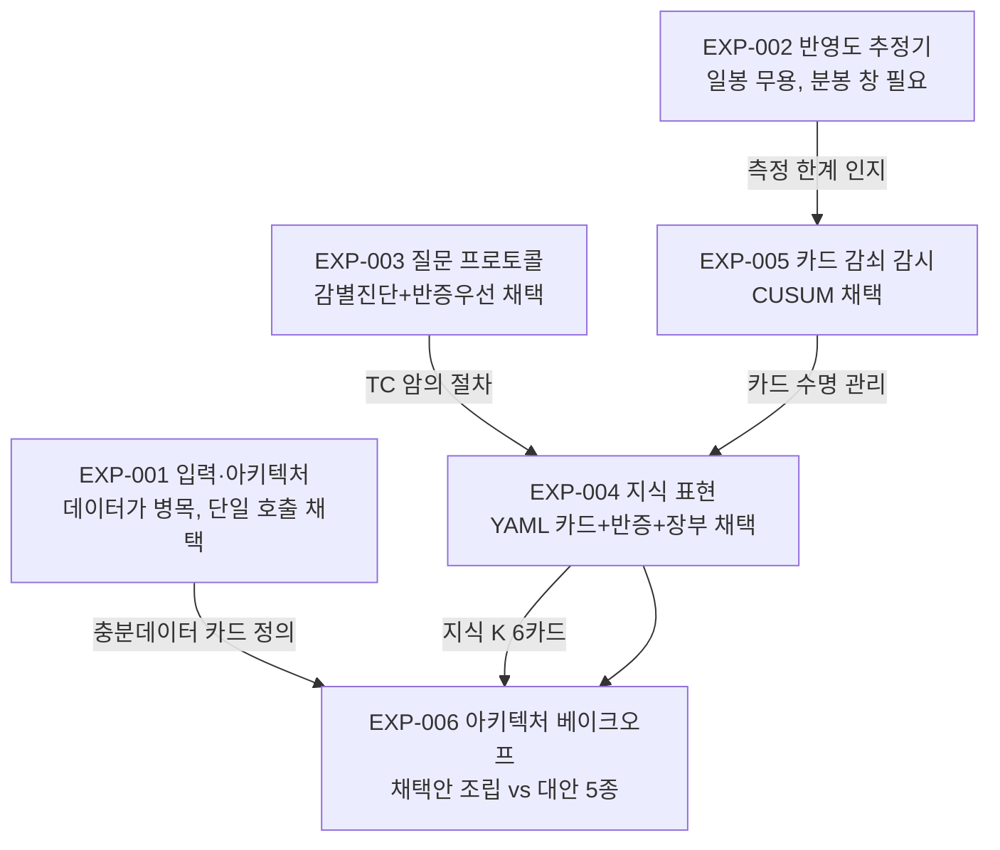

# 설명 실험 총람 — EXP-001~006 계보와 확정 결정

## 요약 (3줄)

주가가 왜 움직였는지 자동으로 설명하는 시스템을 만들기 위해, 여섯 번의 실험으로 설계 결정을 하나씩 확정해 왔다.
순서대로: 어떤 입력 데이터가 필요한가(001) → 가격 데이터는 어떤 촘촘함이 필요한가(002) → 어떻게 질문해야 정직한가(003) → 지식을 어떤 형식으로 저장하나(004) → 그 지식이 낡은 걸 어떻게 아나(005) → 이걸 다 조립한 설계가 대안들을 이기는가(006).
모든 실험은 정답을 미리 아는 시험 문제와 사전에 등록한 판정 규칙을 쓰며, 원자료는 전부 보존되어 재검증할 수 있다.

## 용어집

| 용어 | 정의 |
|---|---|
| 사전등록(preregistration) | 실험 시작 전에 가설·지표·판정 규칙을 문서로 고정하는 것. 결과를 보고 기준을 바꾸는 조작을 막는다 |
| 함정 사례(trap case) | 그럴듯한 오답으로 유인하도록 설계된 시험 문제. 지어내기(작화) 성향을 잰다 |
| 작화(confabulation) | 증거에 없는 이야기를 그럴듯하게 지어내는 것 |
| 블라인드 심판(blind judge) | 어느 조건의 출력인지 모르는 상태로 채점하는 별도 LLM |
| 반영도(paid_share) | 공개된 정보 중 이미 주가에 반영된 몫 (0~1) |
| 메커니즘 카드(mechanism card) | 가격 변동 기제 1개의 트리거·방향·크기·반증 조건을 적은 지식 단위 |
| 감쇠(decay) | 과거에 유효했던 기제의 효과가 시간이 지나 약해지거나 사라지는 것 |
| 감별진단(differential diagnosis) | 경쟁 가설을 3개 이상 세우고 가설별 판별 검사로 좁히는 의학식 절차 |
| 잔차(residual) | 종목 수익률에서 시장 수익률을 뺀, "시장 탓이 아닌" 부분 |

## 0. 한눈에 보는 계보

각 실험의 공통 골격: **사전등록 → 함정 포함 벤치 → 기계+블라인드 채점 → 채택/기각 판정 → 아티팩트 보존** (`data/interim/explanation/exp00N_*/`).

## 1. EXP-001 — 가설 생성 입력·아키텍처 파일럿 (2026-07-14)

**질문 2개.** ① 이벤트 스레드·기대·상태·타임라인 같은 "충분데이터 카드"를 주면 가설 품질이 오르나? ② 가설 생성과 분해를 한 번의 강한 모델 호출로 할까, 여러 에이전트로 쪼갤까?

**설계.** 통제 함정 6종(재탕 기사, 기대 대비 서프라이즈, 파생 기사, 클린 서프라이즈, 기정사실화, 비정보 수급)의 합성-현실 카드에 대해 {빈약 입력 vs 충분 입력} × {단일 호출 vs 강모델 분해 vs 약모델 분해} 조건을 교차. 출력은 Claim Tree 스키마 강제, 블라인드 심판+기계 지표로 채점.

**결과와 결정.**
- 충분데이터의 주효과는 정답률이 아니라 **즉시 검증가능한 가설 비율: 11% → 44% (4배)**. 데이터가 없으면 가설은 "데이터 요청 목록"이 되고, 있으면 "실행 가능한 검증 계획"이 된다.
- 에이전트 분리는 전 품질 지표 동급 + 비용 2배 → **단일 호출 채택**. 분해는 쉬운 일이고, 어려운 것(가설의 정명)은 아키텍처가 아니라 입력에 구속된다.
- 부작물: 빈약 입력 조건이 함정을 통과한 경로가 **기사 제목의 서사 편승**임을 실측 — 언론 편향 의존이 시스템에 실재함을 확인.

**후속에 미친 것**: D-카드 구현 우선순위(스레드 > 타임라인 > 기대 > 상태), `VERIFIABLE_NOW` 비율의 운영 KPI 승격, EXP-006 사례 카드의 필드 구성.

## 2. EXP-002 — 반영도(paid_share) 추정기와 노이즈 플로어 (2026-07-14)

**질문.** "이 정보는 이미 가격에 얼마나 반영돼 있나"를 현 파이프라인에서 계산할 수 있나? 성능 한계는 어디고, 어떤 데이터 투자가 성능을 올리나?

**설계.** 추정기 사다리 4단(PS0 사후 정규화 → PS1 유사사례 분모 → PS2 크기 사다리 분모 → PS3 확률경로 직독)을 설계하고, 시뮬레이션(셀당 4,000회)으로 관측 창 해상도별 3-구간 분류 정확도를 측정. 저장소 실측 프라이어(공급계약 공시 2,863건)와 2021-06 실데이터로 교차 검증.

**결과와 결정.**
- **일 단위 전체 창은 전 현실 구간에서 무용** (정확도 ≤0.62). 분봉 stage 창만 전형 크기(5~10%p)에서 작동 (0.79~0.88). 구조적 이유: 표준오차가 √(관측일수)에 비례 — 창을 좁히는 것이 유일한 지렛대.
- **실측이 문제의 실재를 증명**: 계약/매출 ≥50%인 대형 계약 공시조차 공시일 잔차 lift 0.98 (평범한 날과 구별 불가) — 계약 정보는 공시 전에 이미 지불된다. 반영도를 안 재는 설명 시스템은 이 부류 전체에서 체계적으로 과대 귀속한다.
- 데이터 한계효용 1위 = **분봉 stage 창 적재** (+0.27), 2위 스레딩 stage 날짜 (+0.16), 3위 초 단위 available_at (+0.11).

**후속에 미친 것**: EXP-001 벤치의 가상 수치 1건 정정(합성 카드의 한계 실증), EXP-005의 "잡음보다 작은 신호는 못 잡는다" 교훈의 원형, `price_intraday` KR 적재의 우선순위 근거.

## 3. EXP-003 — 인과추론 유도 프로토콜 벤치 (2026-07-14)

**질문.** 같은 사례를 어떤 질문 형식으로 물어야 LLM이 가장 정직하게(모르면 모른다고) 귀속하나?

**설계.** 프로토콜 6종 — P1 자유서술(대조군), P2 메커니즘 우선(결과 감춘 연역 후 고정), P3 반사실 구성(기후 귀속식), P4 감별진단(경쟁가설 ≥3 + 판별검사 + 보류 의무), P5 반증 우선(기각조건 ≥3 선작성), P6 토론(상반 2회+심판) — × 합성 함정 사례 6종. 추가로 부호 반전(같은 뉴스에 가격만 반대)과 유도 발화(사용자가 특정 원인 확신) 프로브.

**결과와 결정.**
- **P4 감별진단이 종합 1위 (0.97)**: 동시 사건에서 유일하게 보류 선언 + 실행 가능한 분리계획 제시, 부호 반전에서 유일하게 작화 거부.
- **P2 메커니즘 우선은 역방향 기각**: 사전 고정 장치가 시야 고정을 만들어 동시 사건에서 최악(오답 확신 0.8) — 편향 방지 장치의 굿하트 사례.
- 쉬운 사례는 전 프로토콜 동률 — 이득은 함정에 집중. 아첨(유도 발화)은 구조화 스키마만으로 전 프로토콜 방어.
- **채택**: 감별진단+반증우선 합성 (경쟁가설 ≥3 + 가설별 판별검사 + 실행가능 기각조건 + 판별 실패 시 보류).

**후속에 미친 것**: EXP-004의 질문 형식 축(E1), EXP-006 정리카드 암의 판정 절차, 파생 설계 문서 `explanation-justification-standard.md`의 문장 면허 규칙.

## 4. EXP-004 — 메커니즘 지식 표현 벤치 (2026-07-14)

**질문.** 기제 지식을 모델에 넣을 때 어떤 언어가 최선인가 — 안 넣기(K0) / 자연어 문단(K1) / 형식 YAML 카드(K2) / 카드+문자적 적용절차(K3)?

**설계.** 정보 등가로 작성한 카드 라이브러리 6종(연기금 리밸런싱, 지수 편출입, 숏커버, 편입 팝, 공급사슬 전이, 옵션 만기)을 4가지 표현 × 질문 형식 2종(자유 vs 감별진단)으로 교차. 사례 10종은 카드를 시험하도록 설계 — 반증 발화(조건은 맞는데 실측이 반대), 감쇠(효과가 최근 소멸), 상반 카드 동시 발화, 3중 교란, 크기 불일치 등. 강한 모델 80회 + 약한 모델 16회.

**결과와 결정.**
- **강한 모델에서는 표현이 무차별** (전 구성 0.94~1.0, 천장 효과) — 결정적 관측이 사례에 있으면 스스로 추론한다.
- **약한 모델에서 형식 카드가 함정 정답률 5/8 → 7/8**. 카드는 역량 평준화 장치다.
- 카드의 고유 기여 = **반증 기각의 감사 가능성**: "리밸런싱 조건 성립 + 연기금 순매수 실측" 사례에서 카드 구성 전원이 기각을 장부에 남기고 진범으로 이동 — 지식 없는 구성에서는 구조적으로 불가능한 기록.
- 실측된 부작용: **교란일 과신** (3중 교란에서 카드 구성이 확신 0.62→0.70~0.75로 상승 — 셋 중 둘을 카드가 설명해주자 해결됐다고 착각).
- **채택**: YAML 형식 카드 + 실행가능 반증 + 사용 장부 의무. 강제 조항 2개 — ① 사건 겹침 게이트는 카드 적용보다 먼저 실행되고 카드가 뒤집을 수 없다, ② 감쇠·기각 장부는 평결 상한과 기계 연동.

**후속에 미친 것**: EXP-006 지식 코퍼스 K(이 6카드를 동결 재사용), EXP-005의 감쇠 상태 필드 요구.

## 5. EXP-005 — 메커니즘 카드 감쇠 판정 (2026-07-14)

**질문.** "이 카드가 요즘은 안 먹힌다"(예: 지수 편입 효과 소멸 — Greenwood·Sammon 2025가 실증한 현상)를 LLM 판단이 아니라 통계 검정으로 알려면 어떤 절차여야 하나?

**설계.** 가상 카드의 발화 30회 여정을 3,000회 반복 생성(전형 효과 3%p, 발화당 잡음 2%p — EXP-002 실측 정합). 감시 절차 3종 비교: 무보정 즉시검정(매 발화 확인) vs 체크포인트+본페로니 vs 누적합(CUSUM).

**결과와 결정.**
- **매 발화 확인은 오탐 50.4%** — 반복해서 들여다보는 것 자체가 거짓 경보를 양산(광학적 정지 문제). 사실상 동전 던지기.
- 오탐률을 ~3%로 맞추고 비교하면 **CUSUM 승리**: 완전 소멸 99.6% / 절반 감쇠 74.6% (체크포인트 48.3%). 절반 감쇠 탐지까지 추가 발화 중앙값 9회.
- 정직한 한계 2개: 20% 경미 감쇠는 이 잡음에서 탐지 불가(EXP-002와 같은 교훈 — 잡음보다 작은 신호는 통계로 못 구제), 연 4회 발화 카드(연기금 리밸런싱)는 절반 감쇠 확인에 ~4.8년 → 해외 유사사례 이식이 유일한 현실 해법.
- **채택**: 카드 스키마에 `decay_monitor` 필드(기준선·CUSUM 상태·문턱·상태). 기준선 미확립(<10회) 카드는 `APPLIED` 금지, `DECAYED`면 크기 사전분포 사용 금지.

**후속에 미친 것**: 카드 수명 관리가 EXP-004 사용 장부와 기계 연동되는 계약.

## 6. EXP-006 — 설명 아키텍처 베이크오프 (2026-07-16)

**질문.** 001~005의 채택안을 조립한 설계(정리카드: 카드 라이브러리 + 감별진단 + 반증 우선)가, 대안 아키텍처 5종을 정답을 아는 문제에서 실제로 이기는가?

**설계·결과는 전용 문서 3부가 소유**: [사전등록](EXP-006-bakeoff-prereg.md) · [설계 상세](EXP-006-bakeoff-design.md) (암 6종·사례 6유형 정의) · [결과](EXP-006-bakeoff-results.md). 요점만: 48사례(합성 12, 실데이터 주입 16, 플라시보 8, 실제 역사 8, 모순 쌍둥이 4) × 6암, 1차 비교 3쌍 전부 비유의 — **우위 입증 실패가 결론이고, 순위보다 값진 발견 2개**(카드 커버리지 구멍이 아키텍처 차이보다 크다, 평결에 시장공통 vs 종목고유 귀속 레벨 축이 필요하다)가 개정안으로 넘어갔다.

## 7. 누적 확정 사항 (시스템 계약으로 흘러간 것)

| 결정 | 출처 | 반영처 |
|---|---|---|
| 가설 생성은 단일 강모델 호출 | 001 | 생성기 아키텍처 |
| `VERIFIABLE_NOW` 비율을 텔레메트리로 | 001 | 생성기 원장 |
| 반영도 측정은 분봉 stage 창 전제 | 002 | `price_intraday` KR 적재 우선순위 |
| 유사사례 분모는 "실현 반응"이 아니라 "사전드리프트 포함 총효과" | 002 | `_response_priors` 재계산 계획 |
| 판정 형식 = 감별진단+반증우선 합성 | 003 | 귀속 프롬프트 표준 |
| 후보 연역(P2식)은 생성 단계 전용, 판정 프레임 금지 | 003 | 동상 |
| 지식은 YAML 카드+반증+사용 장부 | 004 | 카드 스키마 |
| 겹침 게이트가 카드보다 선행, 카드가 못 뒤집음 | 004 | 판정 파이프라인 순서 |
| 카드 감쇠는 CUSUM, 미확립 카드 APPLIED 금지 | 005 | 카드 스키마 `decay_monitor` |
| 카드 커버리지 감사(클래스별 카드 수) 의무화 | 006 | 개정안 |
| 평결에 귀속 레벨(시장공통/종목고유) 축 추가 | 006 | 개정안, 2-leg 분해 계약 정렬 |

## 8. 아티팩트 색인

| 실험 | 원자료 경로 (`data/interim/explanation/`) |
|---|---|
| 001 | `exp001_hypothesis_bench/{cases,runs,scores,metrics}.json` |
| 002 | `exp002_paid_share/sim_results.json` 외 |
| 003 | `exp003_elicitation/{prereg,core_runs,probe_runs,p2_forces,p6_sides,scores}.json` |
| 004 | `exp004_knowledge_repr/{prereg,runs_batch1,runs_batch2,weak_model_slice,scores}.json` |
| 005 | `exp005_decay_monitor/{h0_false_positive,h1_power,calendar_translation,prereg_and_summary}.json` |
| 006 | `exp006_bakeoff/{prereg_hash,cases,ledger,knowledge_K.md,runs_main,judge_flags,scores,primary_comparisons,case_matrix}.json` |
