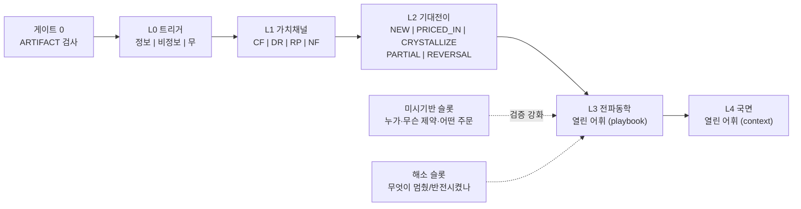

# 가격 변화 메커니즘 탐색공간

## Summary

- 가격 설명의 가설 공간을 평면 목록이 아니라 **레이어 경로 모형**으로 고정한다: 하나의 설명 = `트리거(L0) × 가치채널(L1) × 기대전이(L2) × 전파동학(L3) × 국면(L4)` 경로 + 횡단 슬롯(미시기반·해소·시간축).
- 레이어별 폐쇄성이 다르다. **L0·L1·L2는 항등식·삼분법으로 구조적으로 닫히고**, L3·L4와 횡단 슬롯 어휘는 열린 어휘로서 계측 대상이다. 커버리지는 닫힌 레이어에선 증명으로, 열린 레이어에선 C1~C5 기준으로 판정한다.
- 민간 서사(정치테마주, 선반영, 알고리즘 매매 등)는 단일 원인이 아니라 경로다. 사용자 언급 8개 현상 + 미언급 15개 현상을 경로로 컴파일해 어휘 v0의 생성력을 스트레스 테스트했다.
- **v0.2 변경** (외부 제안 v0.1 비판 수용): ① 미시기반 슬롯(투자자 집단·제약·주문 증거) ② 해소(resolution) 슬롯 ③ ARTIFACT(데이터 오류) 선행 게이트 ④ 가격 경로 형태 분류 → 메커니즘 prior ⑤ 게이트 의미론 3계층(자격/지지/반증) ⑥ 희소성 예산 C5 ⑦ 판별 검사 선택 규칙 ⑧ playbook 표준 필드(`valid_horizon`, `claim_ceiling`, `compatible_price_shapes`). 외부 제안의 9축 평면 곱공간 뼈대는 폐쇄성 부재로 기각하고 어휘만 이식했다.

## Context

이 문서는 explanation engine의 가설 어휘를 소유한다. 개별 게이트·인증 절차는 explanation-engine/price-decomposition 계약이, 이벤트 타입 어휘는 event-ontology가 소유하며, 이 문서는 **그 위의 가설 생성 공간**만 다룬다. 본문 실사례의 수치·시각은 경로 컴파일 예시이며 개별 인증 대상이다(§7 R1).

## 0. 선행 게이트 — ARTIFACT (M0 null branch)

모든 탐색에 앞서 "실제 경제적 움직임이 맞는가"를 확인한다. 항상 열려 있는 null branch다:

수정주가·배당/분할 조정 오류 · 티커 매핑 오류 · 거래정지/재개 처리 · 뉴스 timestamp 오류 · 중복 기사 · stub quote/시세 지연 · 지수 구성 오류 · 시세조종 가능성(계좌 수준 증거 없이 최종 설명 확정 금지).

ARTIFACT 게이트를 통과하지 못한 관측은 탐색공간에 진입하지 않는다. 이 게이트는 quality-observability 계층 소유이며, 여기서는 탐색 알고리즘의 0단계임만 고정한다.

## 1. 왜 평면 목록이 아니라 레이어 경로인가

"정치테마주 급등"을 평면 분류하면 한 칸을 차지한다. 경로로 분해하면:

```text
L0 트리거   = 후보 지지율 변동 (정보, 단 기업 무관)
L1 가치채널 = 현금흐름 경로 확인 불가 → NF(수급·비펀더멘털) 채널
L2 기대전이 = 정책 수혜 확률의 반복 재가격 (근거 약한 PARTIAL_REPRICE)
L3 전파동학 = HERDING_ATTENTION + CONSTRAINT_BINDING(투자경고·상한가)
미시기반    = 개인 순매수 집중 + 신용융자 증가 (KRX 데이터로 검증 가능)
해소        = 선거 확정 또는 관심 소멸 → 급락
L4 국면     = 정치 캘린더 (선거 D-N)
```

평면 목록은 새 현상마다 칸을 늘려야 하지만, 경로 모형은 **유한 어휘의 조합**으로 무한 서사를 표현한다. 커버리지 질문이 "현상을 다 나열했나"에서 "각 레이어의 어휘가 충분한가"로 바뀌고, 후자는 측정 가능하다.

주의: 경로는 선형 파이프라인이 아니다. PRICED_IN 경로는 주문 반응 자체가 없고, NON_INFO 트리거는 상태변화 없이 수급으로 직행한다. 슬롯은 선택적이며, 생략된 슬롯은 UNKNOWN으로 남는다(NULL 정직성).



## 2. 레이어 정의

### L0. 트리거 — 무엇이 시작했나 (닫힘: 삼분법)

| 값 | 정의 | 데이터 |
|---|---|---|
| `INFO` | 정보 도착 — 뉴스·공시·지표 | `canonical_event` (available_at PIT 축) |
| `NON_INFO` | 비정보 수급·구조 사건 — 만기, 리밸런스, 대량 프로그램, 반대매매, 락업 해제, ETF 설정·환매 | **합성 이벤트로 승격** (§6 설계 결정) |
| `NONE` | 무 트리거 — 내생 동학 (타임라인 공백이 증거) | timeline 부재 검사 |

삼분법이므로 구조적으로 닫힌다. 남는 위험은 NON_INFO의 목록 누락이며, 이는 L0가 아니라 합성 이벤트 카탈로그의 커버리지 문제로 격리된다. 잠재 충격(강제청산, 알고리즘 전환)은 NON_INFO의 부분집합으로, 직접 관측이 아니라 수급·호가에서 **추론**되는 트리거 후보다 — 추론 트리거는 자격 게이트에서 직접 관측 트리거보다 낮은 사전확률을 갖는다.

### L1. 가치평가 채널 — 왜 가치가 변했나 (닫힘: 항등식)

가격 항등식(Campbell–Shiller 분해)에 의해 임의의 가격 변화는 다음 넷으로 완전 분해된다:

| 채널 | 내용 | 지문 예측 (게이트 재료) |
|---|---|---|
| `CF` 현금흐름 뉴스 | 기대 현금흐름 변화 | 자산 특이적, 단면은 노출도 비례, 금리 무반응 |
| `DR` 할인율 뉴스 | 무위험 금리 경로 변화 | 듀레이션 자산 일관 동행, 채권·성장주 동시 반응 |
| `RP` 위험프리미엄 | 요구 보상·불확실성 변화 | VKOSPI 동행, 고베타 증폭, 안전자산 역행 |
| `NF` 비펀더멘털 | 수급·유동성·오가격 | 플로우 선행, 반전 경향, 펀더멘털 무관 단면 |

항등식이므로 다섯 번째 채널은 존재하지 않는다. 유동성·딜러 재고·관심 같은 상태는 채널이 아니라 L3 동학·미시기반의 상태변수다 — 층을 섞으면 폐쇄성이 사라진다.

### L2. 기대 전이 — 이미 가격에 있던 것과의 관계 (닫힘: 확률 산술)

사건 전 시장이 부여한 확률 p, 사건 후 p'의 산술로 닫힌다:

| 값 | 정의 (p → p') | 관측 지문 | 기존 매핑 |
|---|---|---|---|
| `NEW_SURPRISE` | p≈0 → p'≫0 | 발표 창 집중 반응 | novelty `FIRST_IN_THREAD` |
| `PRICED_IN` 선반영 | p≈1 유지 | 발표 시 무반응, 정보는 훨씬 전 공개 | `expectation_state.pre_event_drift`, corpus_search(asof) |
| `CRYSTALLIZE` 기정사실화 | p→1 최종 확정 | 사전 드리프트가 총 반응 대부분, 확정 시 소폭·역반응 | thread stage 전이 (RUMORED→CONFIRMED) |
| `PARTIAL_REPRICE` | 중간 p 재가격 | surprise 크기 비례 반응 | surprise 추정기 |
| `REVERSAL` 정정·부인 | p' 역전 | 기존 반응 되감기 | `CORRECTION`/denial flag (thread_state) |

"기정사실화 후 재료소멸(sell the news)"은 L2 `CRYSTALLIZE` + L3 `FAIT_ACCOMPLI_REVERSAL`의 합성 경로다. 발표 시점 무반응은 사건이 중요하지 않았다는 증거가 아니라 PRICED_IN 가설의 출발점이다. 여론조사·금리선물 등 **소스가 있는 사건에 한해** p의 연속 경로(`probability_path`)를 기록해 L2 판정을 연속화할 수 있다 — 소스 없는 확률 조작은 금지(market-expectation-draft 강등 논리).

**공개됨 ≠ 반영됨.** L2 값은 기사·사건의 속성이 아니라 **측정되는 가격 상태**다: 반영도(`paid_share` = 누적 사전 잔차 / 크기 사다리 함의치)의 구간 라벨로 읽는다. 이미 공개된 정보의 지연 반영은 명명된 반복 현상이며(PEAD, 재보도 재가격, 경제 링크 지연 전파), 경로 표현은 `PARTIAL_REPRICE + 재유통/주목 트리거(why-now 증거 필수)`다. 순간 반영을 전제로 novelty 태그가 L2를 판정하게 하면 이 부류 전체를 잘못 기각한다 — 세부 규칙은 가설 생성 계약 §3.1 소유.

### L3. 전파·증폭 동학 — 경로의 모양을 만든 것 (열림: playbook 어휘)

초기 어휘 v0. 각 항목은 역할 주석(`amplifier` 증폭 / `friction` 가격발견 지연·왜곡 / `dampener` 흡수)을 갖는다:

| 어휘 | 역할 | 핵심 반증 술어 | 데이터 |
|---|---|---|---|
| `ALGO_AMPLIFICATION` | amplifier | 분 단위 완결 속도, 프로그램 매매 급증, 뉴스 부재 반전 | 프로그램매매 동향(무료), 미시구조(유예) |
| `OVERSHOOT_RECOVERY` | amplifier | 회복일 신규 호재 부재 + 스프레드·변동성 정상화 동반 | timeline 부재검사, 잔차 z, 유동성 지표 |
| `SHORT_COVERING` | amplifier | 공매도 잔고 급감 동시성, 고공매도 종목 초과 반응 | 공매도 잔고(무료) |
| `HERDING_ATTENTION` | amplifier | 검색량·커뮤니티 급증 선행, 개인 수급 집중, 반전 경향 | 검색 트렌드, 투자자별 매매동향(무료) |
| `GRADUAL_DIFFUSION` | friction | D+1 기관·외인 전환, 리포트 발행 후 2차 반응 | flows, 리포트 발행 시각 |
| `LIQUIDITY_SPIRAL` | amplifier | 전 자산 동반 하락, 스프레드 폭발, 안전자산조차 하락 | 교차자산, 호가(부분) |
| `POSITIONING_UNWIND` | amplifier | 뉴스 대비 과대 반응 + 특정 통화·자산군 동조, 신용·청산 증가 | 교차자산, 신용융자 잔고(무료) |
| `CONSTRAINT_BINDING` | friction | 상·하한가 도달, 거래정지, 투자경고 지정, 공매도 제한 | KRX 시장조치(무료) |
| `FAIT_ACCOMPLI_REVERSAL` | amplifier | 확정 발표 직후 음(-) 반응, 사전 드리프트 비율 高 | L2 CRYSTALLIZE 연계 |
| `LEADERSHIP_ROTATION` | amplifier | 테마 내 동조, 밸류에이션 무관 지속, 거래대금 집중 | 테마 바스켓, 거래대금 |
| `HEDGING_FLOW` | amplifier | 옵션 미결제·딜러 노출 추정과 기초자산 헤지 방향 일치 | 옵션 데이터(부분). 옵션 거래량만으로 감마 서사 금지 — GameStop의 SEC 분석 교훈 |

#### 왜 L3가 필요한가 — 설계 근거

L0–L2는 "가격이 왜, 어느 방향으로 움직여야 했는가"(당위·방향)까지만 설명한다. **실현된 무브의 크기·속도·모양**은 설명하지 못한다. 같은 실적 서프라이즈(L0=INFO, L1=CF, L2=NEW_SURPRISE)가 현실에서 세 가지 모양으로 나타난다:

| 관측된 경로 | L0–L2만으로 | L3 어휘로 |
|---|---|---|
| 즉시 갭업 후 안정 | 설명됨 | L3 없음 — 교과서적 재가격 (빈 슬롯도 판정이다) |
| 발표 후 며칠 드리프트 | 설명 불가 — 왜 즉시 반영 안 됐나 | `GRADUAL_DIFFUSION` (PEAD) |
| 급등 후 전부 반납 | 설명 불가 — 호재인데 왜 하락 | `FAIT_ACCOMPLI_REVERSAL` |

L3를 제거하면 생기는 고장 세 가지:

1. **크기 과대귀속** — 공매도 금지 첫날 에코프로 +30%의 규제 현금흐름 효과는 ≈0이다. L3(`SHORT_COVERING`+`CONSTRAINT_BINDING`) 없이는 +30%를 L1 어딘가에 밀어 넣어야 한다: CF에 넣으면 과대주장, NF로 끝내면 "펀더멘털 아님"이라는 부정문만 남는다. NF는 무엇이 **아닌지**만 말하고, L3가 무엇**인지**를 말한다 — 숏커버/군집/알고 증폭은 데이터 지문(공매도 잔고 vs 개인 수급 vs 프로그램 매매)이 달라 구별 가능하다.
2. **에피소드 통째 실종** — 2024-08-05는 L0=NON_INFO, L1=NF라 L0–L2가 주는 설명이 사실상 없다. 그날의 설명 전체가 L3(`POSITIONING_UNWIND`+제약)와 해소 슬롯이다. L3 없이는 이런 날이 전부 UNEXPLAINED가 되어 C3(체계적 미설명 부재)를 위반한다 — 이름 붙일 수 있는 군집을 미설명으로 방치하는 것이므로.
3. **지속성 예측 불능** — L1=CF 재가격은 "유지"를, L3 증폭은 "부분 반전 위험"을 예측한다. 설명 소비자가 행동에 쓰는 핵심 정보가 이 구분이며, L3에서만 나온다.

이론적 지위: 시장이 정보 도착 즉시 정확한 새 균형으로 점프한다면(EMH 교과서) L3는 항상 빈 슬롯이고 L0–L2로 충분하다. 따라서 **L3는 즉시 재가격 귀무가설이 기각되는 반복적·명명된 방식들의 어휘 목록**이다(PEAD, 과잉반응-반전, 유동성 나선, 스퀴즈). 빈 L3는 "깨끗한 재가격"이라는 인증 가능한 판정이고, C5 희소성 예산(Amplifier ≤1)이 L3의 서사적 남용을 막으며, §6.3의 판별 검사(경쟁 가설을 가르는 검사)는 대부분 L3 가설의 차등 예측에서 나온다.

### 횡단 슬롯 1 — 미시기반 (누가 · 무슨 제약 · 어떤 주문)

심리·기대를 가격에 직접 연결하지 않는다. 반드시 `심리/상태 변화 → 어느 집단의 목표 포지션 변화 → 실제 주문`을 거친다:

| 성분 | 어휘 v0 | 데이터 |
|---|---|---|
| `agents` | 개인 / 외국인 현물 / 외국인 선물·옵션 / 국내기관 / 연기금 / 패시브 / 공매도자 / 시장조성·딜러 / 추세추종·CTA / 기업 내부자 | 투자자별 매매동향(무료·일별) |
| `constraints` | 마진콜·담보 / 손절·VaR / 지수추종 의무 / 환매 / 델타헤지 / 공매도 가능 여부·대차비용 / 가격제한·거래정지 | 신용잔고·대차잔고·시장조치(무료) |
| `order_evidence` | 순매수 방향·집중도, 프로그램 매매, 시간대 패턴 | flows |

"원해서 하는 주문"과 "해야만 해서 하는 주문"(제약 구동)의 구분이 이 슬롯의 존재 이유다. 미시기반이 식별된 claim은 등급 상한이 올라가고, 미식별이면 `mechanism_compatible` 수준에 캡된다. KR은 투자자 유형별 일별 수급이 공개되는 드문 시장 — 이 슬롯의 비교우위 지점이다.

### 횡단 슬롯 2 — 해소 (무엇이 멈췄나 · 반전시켰나)

가격이 회복됐다는 사실만으로 "과매도였다"고 결론 내리지 않는다. 회복을 만든 주문과 시장상태를 별도 어휘로 식별한다:

`LIQUIDITY_REPLENISH`(유동성 공급 복귀) · `FORCED_SELLING_EXHAUSTED`(강제매도 소진 — 신용·청산 데이터) · `EVENT_RESOLVED`(불확실성 확정) · `NEWS_CORRECTED`(오보 정정 — thread CORRECTION) · `ARBITRAGE_RESTORED`(차익 연결 복원 — 베이시스·괴리 정상화) · `FUNDAMENTAL_BUYER_ENTRY`(기초가치 매수 진입 — 기관·외인 순매수 전환) · `ATTENTION_DECAY`(관심 소멸 — 검색·거래대금 감쇠).

### L4. 조건 국면 — 원인이 아니라 사전확률의 변조기 (열림: context 어휘)

| 어휘 | 내용 | 데이터 |
|---|---|---|
| `POLITICAL_CALENDAR` | 선거 D-N, 탄핵·정국 | 선거 일정 레지스트리(무료), 지지율 |
| `REGULATORY_REGIME` | 공매도 금지, 가격제한 변경 등 제도 상태 | 제도 변경 이력(무료) |
| `MACRO_REGIME` | 금리 사이클 위치, 변동성 레짐 | 기존 context 블록 |
| `SEASONALITY` | 배당 시즌, 어닝 시즌, 연말 수급 | 캘린더 |
| `MICROSTRUCTURE_REGIME` | 공매도 금지 기간, 사이드카 발동 상태 | KRX 시장조치 |

국면은 **원인 주장이 될 수 없고** analogs/prior의 조건부 검색 키로만 쓴다. "선거철이라 올랐다"는 금지 문장이고, "선거 국면 조건부 과거 분포에서 {v}분위"가 허용 문장이다. 메커니즘 효과 크기는 레짐에 따라 변한다(지수 편입 효과의 시대별 감쇠) — 조건부 prior에 `valid_period`를 둔다.

### 시간축 — `valid_horizon`

모든 가설은 작동 시간축을 선언한다: `intraday_fast`(초~분) / `intraday`(장중) / `days` / `weeks` / `months`. 시간축 부정합(미시구조 가설로 월간 무브 설명)은 자격 게이트에서 기각된다.

## 3. 사용자 언급 현상의 경로 컴파일과 데이터화

| 현상 | 경로 (L0/L1/L2/L3/해소/L4) | 데이터화 | 상태 |
|---|---|---|---|
| 알고리즘 매매 | NON_INFO 또는 증폭자 / NF / — / ALGO_AMPLIFICATION / ARBITRAGE_RESTORED / — | 프로그램매매 동향, 체결 속도, 미시구조. **단일 메커니즘이 아님**: 실행/시장조성 철회/차익 전파/변동성 타깃은 별개 하위 경로 | 무료 부분 + backlog(`intraday_microstructure_reaction`) |
| 과도한 폭락의 회복 | NONE / NF→RP 정상화 / — / OVERSHOOT_RECOVERY 등 5경쟁 / 해소 어휘로 판별 / 변동성 레짐 | §4.2 판별표 — 회복의 원인 후보(유동성 복원/오보 정정/강제매도 소진/거래중단 재정렬/가치 매수)를 해소 슬롯으로 분리 | 대부분 보유 |
| 기정사실화 | INFO / CF / CRYSTALLIZE / FAIT_ACCOMPLI_REVERSAL / EVENT_RESOLVED / — | thread stage + 사전 드리프트 비율 + 사전 포지션 과밀도 | **이미 보유** (thread·expectation_state) |
| 선반영 | INFO / CF·DR / PRICED_IN / — / — / — | corpus_search(asof), pre_event_drift, 리포트 존재, (소스 있으면) probability_path | 보유 + PIT 검색 신규 |
| 선거철 상승 | 3문제로 분리: ①시장 전체(RP·환율·외국인) ②정책 수혜 업종(CF, 공약·법안 노출도) ③정치테마주(§1 경로) | ①CDS·환율·외인 파생 ②공약 텍스트→기업 노출도 ③아래 행 | 소형 신규. "선거→상승" primitive 저장 금지 |
| 정치테마주 | INFO(지지율) / **NF (CF 경로 확인 불가 명시)** / PARTIAL / HERDING+CONSTRAINT / ATTENTION_DECAY 또는 EVENT_RESOLVED / POLITICAL | 후보-기업 관계 그래프(정책노출/학연·지연/친족/근무), 지지율-바스켓 동행, 개인 수급·신용, 투자경고 지정. 연결 가치 ≈ 연결강도 × 권력유지확률 | 지지율·관계 그래프 신규(무료) |
| 규제 | INFO(공시·입법) / CF (준수비용·TAM), 때로 RP / 단계별 PARTIAL / GRADUAL_DIFFUSION / EVENT_RESOLVED / REGULATORY | 규제 lifecycle thread(루머→입법예고→상임위→본회의→시행령→집행), 노출도(피규제 매출 비중). **부호 사전 고정 금지** — 2008 공매도 금지의 효과는 의도와 달랐음 | 온톨로지 타입 보유, 노출도 신규 |
| 심리 | 증폭자 (단독 원인 주장 금지) / NF·RP / — / HERDING_ATTENTION / ATTENTION_DECAY / 변동성 레짐 | 잠재상태→proxy→집단 주문의 3단 강제: 검색·기사·SNS(관심), 하방 skew(공포), 신용·신규계좌(낙관), 개인 순매수(주문). claim_ceiling 기본 낮음 | 보유 + 무료 다수 |

## 4. 실사례 컴파일 — 어휘 v0 스트레스 테스트

경로 표기: `[L0 / L1 / L2 / L3 / 해소 / L4]`. 수치·시각은 R1 인증 대상.

1. **2024-12 비상계엄** — `[INFO(정치충격) / RP / NEW / OVERSHOOT+POSITIONING_UNWIND / EVENT_RESOLVED(정국 수습 경로) / POLITICAL]`. 원화 급락 동반(RP 지문).
2. **2023-11 공매도 전면금지 첫날 2차전지 급등** — `[INFO(규제) / NF / NEW / SHORT_COVERING+CONSTRAINT / FORCED 커버 소진 / REGULATORY 전환점]`. 고공매도 잔고 종목의 초과 반응이 단면 지문.
3. **2023-01 삼성전자 어닝쇼크에도 상승** — `[INFO(실적) / CF / PRICED_IN(쇼크)+NEW(감산 시사) / — / — / 메모리 바닥 국면]`. 같은 발표 안의 두 정보 차원.
4. **2020-03 코로나 폭락과 회복** — 폭락: `[INFO / CF+RP / NEW / LIQUIDITY_SPIRAL / — / —]` (국채까지 동반 하락 = dash-for-cash). 회복: `[INFO(정책) / DR+RP / NEW / — / LIQUIDITY_REPLENISH+FUNDAMENTAL_BUYER_ENTRY / —]`.
5. **정치테마주 (역대 대선 국면)** — §3 경로. 선거 확정 전 관심 소멸 급락 패턴은 해소=`ATTENTION_DECAY`의 대표 사례.
6. **2022-11-10 US CPI 하회 급등** — `[INFO(지표) / DR / PARTIAL / SHORT_COVERING 증폭 의심 / — / 긴축 말기]`. surprise 대비 과대 반응 여부가 L3 검증 지점.
7. **2024-08-05 급락(엔캐리 청산 서사)** — `[NON_INFO(포지션 청산) / NF / — / POSITIONING_UNWIND+CONSTRAINT(사이드카) / FORCED_SELLING_EXHAUSTED / MICROSTRUCTURE]`. 당일 국내 신규 악재 부재를 타임라인으로 인증하는 것이 핵심.
8. **2019-07 일본 수출규제 → 소부장** — `[INFO(규제) / CF / NEW→단계별 PARTIAL / GRADUAL_DIFFUSION / — / —]`. 밸류체인 그래프 전파의 대표 사례.
9. **HBM 수주 랠리 (2023–24)** — `[INFO(수주 thread) / CF / stage별 CRYSTALLIZE 반복 / LEADERSHIP_ROTATION / — / AI CAPEX 국면]`. 같은 thread의 반복 stage — novelty 기계의 스트레스 테스트.
10. **북한 도발 무반응** — `[INFO(지정학) / RP / PRICED_IN(학습된 습관화) / — / — / —]`. analogs가 "과거 20건 중간값 ≈ 0"을 돌려주는 것 자체가 설명.

10건 모두 신규 어휘 없이 컴파일된다. **음성 통제 시드**: 2010 Flash Crash(단일 "알고리즘" 서사가 아니라 실행 알고리즘+유동성 부족+재고 축소+시장 간 전파의 결합)와 2021 GameStop(감마 스퀴즈 서사가 SEC 거래 데이터 분석과 불일치)을 "유명하지만 데이터로 반증/약화된 설명" 사례로 벤치에 포함한다 — 검증기가 인기 서사를 기각할 수 있는지 시험하는 용도.

### 미언급 현상 스팟체크 (신규 어휘 필요 여부)

유상증자 오버행 `[INFO/NF+CF/NEW]` · 락업 해제 `[NON_INFO/NF/CRYSTALLIZE]` · MSCI 편출입 `[NON_INFO/NF/CRYSTALLIZE]` · 배당락 `[NON_INFO/—/PRICED_IN/SEASONALITY]` · 액면분할 `[INFO/NF/NEW/HERDING]` · 자사주 소각 `[INFO/CF/NEW]` · M&A 차익거래 `[INFO/CF/PARTIAL(성사확률)]` · 어닝시즌 동조화 `[INFO/CF/—/SEASONALITY]` · 목표가 상향 `[INFO/—/PARTIAL/GRADUAL_DIFFUSION]` · 반대매매 급락 `[NON_INFO/NF/—/LIQUIDITY_SPIRAL+제약]` · ETF 설정·환매 `[NON_INFO/NF]` · 환율 쇼크 전이 `[INFO/CF+RP/PARTIAL/MACRO]` · 횡령 공시 `[INFO/CF+RP/NEW/CONSTRAINT(거래정지)]` · 임상 결과 `[INFO/CF/NEW(이항)]` · 지배구조·승계 `[INFO/RP/PARTIAL/POLITICAL]` — **15건 전부 기존 어휘로 표현된다.**

## 5. 커버리지 판정 기준 — "잘 커버되었다"의 정의

무한한 서사 공간에서 완전 열거는 불가능하므로, 커버리지는 다음 5기준의 동시 충족으로 **정의**한다:

| 기준 | 내용 | 판정 방법 |
|---|---|---|
| **C1 구조적 폐쇄** | L0(삼분법)·L1(가격 항등식)·L2(확률 산술)는 누락 불가능 | 증명으로 종결 — 측정 불요 |
| **C2 서사 컴파일율** | 실제 시황·애널 코멘트 표본의 경로 컴파일율 ≥ 90% (잠정 목표치). 클래스 계층화: 기업·거시 이벤트 ≥ 90%, 시장구조·수급 ≥ 80%, 정치·심리·복합 ≥ 70% | R1 실험 |
| **C3 체계적 미설명 부재** | UNEXPLAINED 군집 최대 질량 < 5% — 미설명이 특이적이고 체계적이지 않음. Unresolved 자체는 항상 허용 — 설명 출력률 100%는 목표가 아니라 경고 신호 | 운영 원장 텔레메트리 |
| **C4 포화 + 한계효용** | 롤링 8주 신규 어휘 0건, **그리고** 새 메커니즘 패밀리 추가의 홀드아웃 커버리지 증가 < 2%면 상위 어휘 동결 — 이후엔 적용 조건·prior·데이터 proxy 개선에 투자 | 어휘 변경 로그 |
| **C5 희소성 예산** | 에피소드 설명은 기본 `Trigger 1 + Amplifier ≤1 + Resolver ≤1`. 템플릿 4개 이상을 요구하는 설명은 과적합 플래그 → 리뷰 큐 | claim 컴파일러 강제 |

어휘 증보는 NOVEL→playbook 승격 루프를 통해서만 일어나며 `ontology_drafts.jsonl`과 같은 append-only 로그를 남긴다.

## 6. 우리 데이터 구조에서의 구현

### 6.1 claim 스키마 확장 — `mechanism_path` v0.2

```json
"mechanism_path": {
  "trigger": {"kind": "INFO", "event_ref": "ev_...", "inferred": false},
  "channel": "CF",
  "expectation_transition": "CRYSTALLIZE",
  "dynamics": [{"id": "FAIT_ACCOMPLI_REVERSAL", "role": "amplifier"}],
  "microfoundation": {
    "agents": ["RETAIL"], "constraints": ["MARGIN_FINANCING"],
    "order_evidence_refs": ["c_0142"]
  },
  "resolution": "ATTENTION_DECAY",
  "regime_context": ["POLITICAL_CALENDAR:D-30"],
  "valid_horizon": "weeks",
  "price_shape": "trend_acceleration"
}
```

경로의 각 성분이 게이트를 소환한다. **경로 선언 없는 claim은 컴파일 거부.** `microfoundation` 미식별 claim은 `mechanism_compatible` 등급에 캡. C5 희소성 예산은 컴파일러가 강제.

### 6.2 가격 경로 형태 분류기 (신규, 저비용)

관측 확정(P2) 직후 경로 형태를 분류해 메커니즘 prior를 만든다: `jump` / `gradual_drift` / `gap` / `crash_and_rebound` / `trend_acceleration` / `intraday_reversal` / `volume_without_price` / `price_without_volume` / `xsec_rotation`. 형태→playbook 호환성(`compatible_price_shapes`)이 1차 자격 필터가 되어 탐색 비용을 줄인다. 기존 일중·일별 가격만으로 구현 가능.

### 6.3 게이트 의미론 3계층

| 계층 | 의미 | 실패 시 |
|---|---|---|
| `admissibility` | 후보 자격 최소조건 (사건이 가격 선행, 유효 노출 경로, 완전 중복 정보 아님, horizon 정합) | 후보 탈락 — 컴파일 거부 |
| `signature` | 지지 증거 (있으면 LR 상승, 없다고 반증 아님) | 등급 상승 실패 |
| `falsifier` | 거부권 (가격이 사건 선행, 노출도 역방향, placebo 동일 패턴) | claim 기각 |

판별 검사 선택 규칙: **모든 상위 가설이 공통 예측하는 신호(거래량 증가 등)는 재검사하지 않는다.** 상위 두 가설의 예측이 갈리는 검사를 우선한다 — $U(e) = \Delta\text{결정} \times \text{판별력} / \text{비용}$.

### 6.4 설계 결정: 비정보 트리거의 합성 이벤트 승격

선물옵션 만기, 지수 리밸런스 효력일, 대량 프로그램 매매일, 락업 해제일, 반대매매 급증일을 `source_class: MARKET_STRUCTURE`의 합성 `canonical_event`로 적재한다. 효과: confounder 타임라인이 정보·비정보를 한 축에서 커버 → "그날 뉴스가 없었다"가 "그날 아무것도 없었다"로 강화된다. 대부분 사전 캘린더라 PIT가 자명하다.

### 6.5 playbook 표준 필드 (L3·해소 어휘의 물질화 형식)

```yaml
id: OVERSHOOT_RECOVERY
version: 1
role: amplifier
compatible_price_shapes: [crash_and_rebound, intraday_reversal]
valid_horizon: [intraday, days]
claim_ceiling: mechanism_compatible      # 미시기반 식별 시 상향
admissibility: [depth_decline_or_spread_spike, no_equivalent_fundamental_revision]
signatures: [spread_expansion, recovery_with_liquidity_replenishment, forced_flow_evidence]
falsifiers: [new_negative_info_during_recovery, persistent_estimate_revision, stable_depth_throughout]
resolution_candidates: [LIQUIDITY_REPLENISH, FORCED_SELLING_EXHAUSTED, FUNDAMENTAL_BUYER_ENTRY]
```

### 6.6 저장 위치 매핑과 신규 데이터

| 레이어/슬롯 | 저장 |
|---|---|
| L0 카탈로그 | canonical_event + 합성 이벤트 캘린더 (신규 fixture) |
| L1 지문 템플릿 | 게이트 레지스트리 |
| L2 | 기존 thread·novelty·expectation_state — 신규 없음. probability_path는 소스 있는 사건만 |
| L3·해소 playbook | 온톨로지 리소스와 동급의 packaged YAML (버전·승격 로그) |
| 미시기반 | 투자자별 매매동향·신용·대차·시장조치 인제스트 |
| L4 context | feature registry context 블록 + 캘린더 fixture |

신규 확보 데이터 (전부 무료, KRX·공개 소스): 프로그램매매 동향 · 투자자별 매매동향 · 공매도·대차 잔고 · 신용융자 잔고 · KRX 시장조치 이력 · 선거 캘린더 · 후보 지지율 · 제도 변경 이력 · 후보-기업 관계 그래프(공약·경력 텍스트). 유일한 유예 항목은 미시구조 틱(기존 backlog 유지).

### 6.7 L3의 시스템 연결 — 이벤트 축과 다른 세 경로

L0 INFO 트리거는 이벤트 축(`canonical_event` → thread → novelty)을 탄다. L3 동학의 증거는 대부분 **연속 상태**(공매도·신용 잔고, 수급, 호가, 관심)라 같은 축을 탈 수 없다. 연결은 세 경로로 갈라진다:

| 경로 | 무엇이 | 어떻게 합류 |
|---|---|---|
| (a) 합성 이벤트 | **점(point) 성격의 비정보 사건만** — 만기, 리밸런스 효력일, 시장조치, 락업 해제 | §6.4대로 `MARKET_STRUCTURE` 이벤트화 → 기존 타임라인·confounder 기계에 그대로 합류 |
| (b) 시장 상태 원장 | 연속 패널 — 공매도·대차·신용 잔고, 투자자별 수급, 프로그램 매매, 스프레드·깊이, 검색량 | 이벤트가 아니라 **asof 버전드 상태 원장**. playbook의 자격·지지 게이트가 창 단위로 직접 질의 |
| (c) 형태 경로 | 가격 경로 자체 | P2 관측 → §6.2 형태 분류 → `compatible_price_shapes`로 playbook 후보 생성 — **가격 축이 곧 후보 생성기** |

수렴점은 claim 층이다: `mechanism_path.trigger`는 이벤트 축을, `dynamics`·`microfoundation`은 상태 원장을 참조하되, 게이트 3계층 의미론과 인증서 형식은 동일하다. 혼합 설명(INFO 트리거 + SHORT_COVERING 증폭)이 자연스럽게 표현된다.

이벤트 축과의 비대칭 두 가지를 명시한다:

1. **novelty의 자리에는 이상도(abnormality)가 온다.** 상태 원장에는 thread·novelty가 적용되지 않는다. 대신 상태의 역사 대비 z-score·분위가 자격 게이트의 재료다 (공매도 잔고 상위 분위 → SHORT_COVERING 후보 자격).
2. **상태 데이터의 PIT는 이중 날짜다.** `state_date`(상태 기준일)와 `published_at`(공표일)을 분리해야 한다 — KR 공매도 잔고는 T+2 공표, 신용융자 잔고는 익일 공표다. 시점 t의 에이전트가 알 수 있는 것은 t−2의 잔고뿐이며, 이를 무시하면 상태 축에서 lookahead가 발생한다. 이벤트 축의 `available_at` 규율의 정확한 상태판이다.

경로 (c)의 존재 이유가 가장 중요하다: 2024-08-05형 에피소드는 이벤트 후보가 0건이다. 후보 생성이 이벤트 축만 질의하면 이런 날은 전부 거짓 UNEXPLAINED가 된다 — 형태 경로와 상태 원장이 있어야 "이벤트 없는 설명"이 생성 가능하다.

## 7. 연구 킥오프

### 검증할 연구가설 (반증가능 형식)

- **H-A**: 평면 사건 분류보다 레이어 경로 문법이 홀드아웃 에피소드 커버리지에서 우월하다.
- **H-B**: 에피소드의 85% 이상이 C5 희소성 예산(T1+A≤1+R≤1) 안에서 표현된다.
- **H-C**: 선반영 판정에 사건 발생 여부 대신 확률 경로·surprise·사전 포지션을 쓰면 설명 정확도가 오른다.
- **H-D**: 선거 관련 무브를 시장 전체/정책 수혜/정치테마로 분리하지 않으면 오귀속이 증가한다.
- **H-E**: 심리 가설에 미시기반 signature(개인 수급·검색·신용·skew)를 요구하면 근거 없는 심리 서술이 감소한다.

### 실행 단계

| 단계 | 내용 | 산출물 | 수용 기준 |
|---|---|---|---|
| R1 이중 벤치 | (a) 시황·애널 코멘트 200건 서사 컴파일 (b) 고충격 에피소드 ~240건 stratified 표본(KR 120 / US·글로벌 80 / 교차자산 40) annotation — 음성 통제 시드(Flash Crash, GameStop, 정치테마 3개 대선, 2008 공매도 금지, 지수 편입 감쇠) 포함 | 컴파일율(C2), 에피소드 annotation셋 | C2 계층 목표, H-A/H-B 1차 판정 |
| R2 playbook v0 물질화 | §2 L3 11개 + 해소 7개를 §6.5 형식 YAML로 | packaged playbook | 각 playbook 실사례 1건 재현 + 음성 통제 1건 기각 |
| R3 합성 이벤트 캘린더 + 미시기반 인제스트 | §6.4 카탈로그 + 투자자별 수급·신용·시장조치 적재 | fixture + 적재 스크립트 | 최근 3년 타임라인 공백 검사 통과 |
| R4 UNEXPLAINED 군집 파이프라인 | C3 계측 자동화 | 군집 리포트 | 운영 원장 연동 |

R1이 최우선이다 — 어휘의 결함은 이론이 아니라 실제 서사·에피소드와의 충돌에서만 드러난다.

## 근거/출처

| 구분 | 경로/아티팩트 | 쓰임 |
|---|---|---|
| 채널 항등식 | Campbell–Shiller 로그선형 분해 계보 | L1 폐쇄성 근거 |
| 기대·novelty 기계 | `docs/research/event-modeling/event-ontology.md`, thread/novelty 계약 | L2 매핑 |
| 잔차·창 관측 | `docs/engineering/specs/price-decomposition-engine.md` P0–P7 | 지문 게이트 재료 |
| surprise 강등·복원 | `docs/engineering/design/market-expectation-draft.md` | L2 PARTIAL_REPRICE·probability_path 측정 경계 |
| 미시구조 backlog | `src/alphamale/events/ontology/resources/future_feature_backlog_v0_1.yaml` (`intraday_microstructure_reaction`) | ALGO_AMPLIFICATION 데이터 유예 근거 |
| 외부 제안 v0.1 (타 모델 작성) | 사용자 제공 첨부 | v0.2 채택 항목: 미시기반·해소 슬롯, M0, price shape prior, 3계층 게이트 의미론, C5 희소성, 판별 검사 규칙, playbook 필드. 기각: 9축 평면 곱공간(폐쇄성 부재), 부호·수치 목표의 무근거 단정 |
