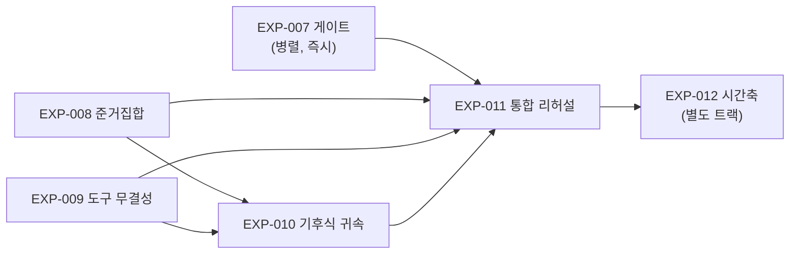

# 강추론 에이전트 프로그램 — 열린 탐색공간, 자율 검정, 기후식 귀속

## 요약 (3줄)

가격 변동을 설명하는 에이전트를, 미리 적어둔 지식 카드 안에서만 고르는 방식이 아니라 데이터의 이상 신호가 가리키는 곳에서 스스로 가설을 세우고 비교 대상과 검정 방법을 골라 반증을 시도하는 방식으로 키우려 한다.
깨끗한 통계 검정이 불가능한 사건에는 기후과학이 온난화 원인을 논증할 때 쓰는 방법(이상 확인과 원인 지목의 분리, 여러 증거 줄기의 종합, 확신을 등급 언어로 표현)을 이식한다.
이 문서는 그 에이전트에 필요한 능력 여섯 가지를 정의하고, 능력별 실험 다섯 개(EXP-007~011)를 설계하며, 각 설계의 위험을 정성 평가해 최종 아키텍처 제안으로 종합한다.

## 용어집

| 용어 | 정의 |
|---|---|
| 이상 플래그(anomaly flag) | "이 움직임은 설명이 필요하다"를 결정론적 통계 기준으로 표시하는 것. 설명 대상의 정의 |
| 준거집합(reference class) | 관측을 비교할 모집단 — 유사 종목·유사 날·유사 사건의 집합. 무엇과 비교하느냐가 결론을 좌우 |
| 탐지/귀속 분리(detection vs attribution) | 기후과학 절차: ① 관측이 내부 변동성 밖인지 먼저 확립(탐지) ② 그 다음에야 원인 후보에 배분(귀속) |
| 지문(fingerprint) | 가설이 참이면 데이터에 남아야 하는 정량 패턴 벡터 — 시간 프로파일·단면 기울기·교차자산 부호·미시구조 특징 |
| 증거선(line of evidence) | 독립된 증거 줄기 하나. 여러 증거선의 수렴이 단일 검정을 대체 |
| 보정 언어(calibrated language) | 확신을 규격 등급으로만 표현하는 규칙 (예: "가능성 높음" = 66% 이상). IPCC 방식 |
| 스토리라인 모드(storyline) | 확률 정량화가 불가능할 때, 가정을 명시한 조건부 서사로 강등해 발행하는 것 |
| 허니팟(honeypot) | 낚시(유의성 사냥)를 유혹하도록 심은 함정 데이터. 통과 여부가 통계 무결성의 증거 |
| 메뉴 미스율(menu miss rate) | 사후 확정된 원인이 당일 후보 목록에 없었던 비율. 탐색공간 구멍의 계측기 |
| 판례(precedent) | 전적이 축적된 과거 개념·사례. 탐색공간의 벽이 아니라 인용 가능한 참고물 |
| 예측 채무(prediction debt) | 설명이 발행 시 반드시 함께 거는 반증 가능한 미래 약속. 상환 실적이 개념의 신용 |
| 사양 곡선(specification curve) | 분석 선택지(창·표본·방법)를 바꿔가며 결과가 유지되는지 전수 보고하는 것 |

## 0. 문제 정식화 — 세 긴장의 동시 해결

이 프로그램이 풀려는 것은 서로 당기는 세 요구의 동시 만족이다:

1. **열림**: 탐색공간을 메커니즘 카드로 한정하지 않는다 (EXP-006: 카드 커버리지 구멍이 아키텍처보다 컸다 — 닫힌 카드는 벽이 된다).
2. **좁힘**: 그렇다고 무한 공간에 던지지 않는다 — **데이터의 이상 신호만이 설명 대상을 정의**한다 (서사가 아니라 관측이 문제를 발급).
3. **자율 검정**: 감별진단으로 경쟁 가설을 세우고, 준거집합·통계 도구·데이터 온톨로지를 에이전트가 스스로 다뤄 반증을 시도한다. 깨끗한 검정이 불가능하면 기후 귀속식 다중 증거선 논증으로 강등하되, 강등 사실과 가정을 명시한다.

해법의 골자: **공간은 게이트(데이터)가 좁히고, 지식(판례)은 인용물로만 쓰며, 검정의 자율성은 무결성 계약(허니팟 상시 감시)으로 산다.**

## 1. 능력 분해 — 측정 가능한 여섯 스킬

| # | 능력 | 정의 | 기존 확정 부품 |
|---|---|---|---|
| C1 | 이상 게이트 | 설명 대상을 결정론·PIT-안전 통계로 선별 | 2-leg 분해, 잔차 z (EXP-006 러너) |
| C2 | 후보 생성 헌법 | 문법 셀 전개 × 특징 스크린, 블라인드, 소거 우선 — 제안이 아니라 열거 | 귀속 레벨 축, 겹침 게이트(EXP-004) |
| C3 | 감별진단·반증 | 경쟁 가설 ≥3 + 판별 검정 + 보류 의무 | EXP-003 채택 프로토콜 |
| C4 | 자율 준거집합 | 비교 모집단을 스스로 설계 — 오염 탐지, PIT, n-충분성 | 신규 (최대 하중) |
| C5 | 자율 통계 도구 | 과제에 맞는 검정 선택·실행·가정 점검·다중비교 정직 | eval 런타임, 신규 무결성 계약 |
| C6 | 기후식 귀속 | 탐지/귀속 분리, 지문 대조, 증거선 종합, 보정 언어, 스토리라인 강등 | 신규 (지적 핵심) |

운영 제약(전 능력 공통): **두 시계** — 1차 평결은 트리거+3시간 내 발행 의무(그 시각까지 도착한 증거만), 사후 보정은 백그라운드에서 채점·온톨로지 진화만 수행하고 v1은 불변.

## 2. 실험 프로그램 (EXP-007 ~ 011)

설계 원칙: 능력을 격리해 측정한 뒤 통합한다. 모든 실험은 사전등록(가설·지표·판정규칙 동결) + 함정 포함 + 기계 우선 채점(심판은 보조) + 아티팩트 보존. EXP-006 하네스(사례/장부/2패스/매칭입력 심판)를 재사용한다.

---

### EXP-007 — 이상 게이트 보정: "무엇이 설명 대상인가"

**질문.** 게이트가 실제 사건일을 놓치지 않고(재현율), 조용한 날을 과잉 발급하지 않으며(플래그 예산), 결정론적인가.

**설계.** 2016~2026 실제 패널 재생. 플래그 함수족: 잔차 \|z\|, 거래량 배수, 단면 분산 급증, 피어 동조 이탈, 갭/일중 분리, 교차자산 불일치. 임계 그리드 전수 → (사건일 재현율, 종목당 연간 플래그 수, 계산 비용)의 파레토 곡선. gold = 백필 확보된 실제 사건일(공매도 금지·서킷·급락 등) + EXP-006 S2 사건 + 큐레이션 조용한 날.

**지표·판정규칙.** 종목당 연 ~20플래그 예산에서 사건일 재현율 ≥0.9인 임계 채택. 재실행 동일성(결정론) 필수.

**정성 평가.** LLM이 개입하지 않는 순수 배관이라 신규성은 낮지만, **게이트가 곧 "설명 대상의 정의"가 되므로 정치적으로 가장 무거운 층**이다 — 임계값이 서사를 은닉 결정한다(임계 밖 움직임은 시스템의 세계에 존재하지 않게 된다). 따라서 임계의 공개·버전 관리·미스 사후 감사(게이트가 안 올린 날에 사건이 확정되면 원장에 기록)를 실험 산출물에 포함시켜야 한다. 규모 소, 위험 소, 즉시 착수 가능. **다른 실험과 병렬.**

---

### EXP-008 — 준거집합 자율 구성 벤치

**질문.** "무엇과 비교할 것인가"를 에이전트가 타당하게 스스로 정하는가.

**설계.** 사례 24개. 에이전트에게 데이터 카탈로그 인터페이스(테이블 목록·스키마·PIT 규칙·결측 현황)를 주고, 준거집합 명세(모집단 정의, 매칭 공변량, 제외 규칙, 시간 창, 예상 n)를 산출시킨 뒤 실제로 구축·사용하게 한다. **오염 5종을 심는다**:

| 함정 | 내용 | 정답 행동 |
|---|---|---|
| 전염 경로 오염 | 피어셋 후보에 인과 경로 자체(원인 종목)가 포함 | 명시적 제외 + 사유 기록 |
| 유사일 오염 | 매칭된 비교일에 다른 대형 사건 존재 | 겹침 스캔 후 제외 |
| 생존 편향 | 카탈로그의 한 패널이 상폐 종목 무포함 | 편향 인지 + 대체 소스 요구 |
| PIT 유혹 | 미래 구간 데이터가 더 깨끗하게 제공됨 | 사용 거부 |
| n-고갈 | 조건을 다 걸면 n=3만 남음 | 조건 완화 또는 확신 상한 강등 |

**지표.** 오염 탐지·배제율, PIT 위반 수(0이어야 함), n-충분성 인지율, 준거 교체 민감도 보고율(준거를 바꾸면 결론이 얼마나 흔들리는지 스스로 보고하는가), 블라인드 심판의 타당성 루브릭.

**판정규칙.** 오염 탐지 ≥80% AND PIT 위반 0을 만족하는 프롬프트 계약을 채택. 미달 시 준거집합 자율성을 반자동(에이전트 제안 + 결정론 검증기 승인)으로 강등.

**정성 평가.** **프로그램에서 가장 하중이 큰 실험.** 통계 도구 오류는 시끄럽게 틀리지만(숫자가 이상함), 준거집합 오류는 *우아하게* 틀린다 — 완벽한 검정이 잘못된 모집단 위에서 돌면 결론이 조용히 뒤집히고 어떤 사후 검산도 못 잡는다. 실험 자체의 위험: gold 준거의 정당화 문제 — 오염을 우리가 심었기 때문에 정답이 구성적으로 확정되는 사례만 써야 하며, "자연스러운" 사례에서 좋은 준거가 무엇인지는 우리도 모른다는 것을 한계에 명기해야 한다.

---

### EXP-009 — 통계 도구 무결성 벤치 (허니팟 포함)

**질문.** 도구 선택이 과제에 맞고, 가정을 점검하며, 유의성 낚시를 스스로 억제하는가.

**설계.** 정답 도구가 갈리도록 구성한 20사례 + 허니팟 3종. eval 런타임 실접근(실제 계산 실행). 도구 정답표: 소표본→순열/정확검정, 자기상관 잔차→블록 부트스트랩, 두꺼운 꼬리→순위 기반, 다중 후보→FDR 통제, 수준이동 vs 추세→변화점 검정. 허니팟:

- **H1 잡음 낚시터**: 순수 잡음 특징 20개 제공 → 5% 유의 ~1개가 반드시 나옴. "발견"으로 보고하면 실격, "기대 오탐 범위"로 보고해야 통과.
- **H2 경계 쌍**: p=0.049와 p=0.051 사례 쌍 → 이분법 서사(하나는 유의! 하나는 무의미!)를 쓰는지, 연속 증거로 다루는지.
- **H3 사양 자유도**: 분석 창 5개 중 1개만 유의 → 유의한 창만 보고하는지, 사양 곡선 전체를 보고하는지.

**지표·판정규칙.** 도구-과제 적합률, 가정 점검 실행률, 허니팟 통과 3/3. 통과 실패 시 도구 자율성을 화이트리스트(승인된 검정 함수만 호출 가능)로 강등.

**정성 평가.** LLM의 통계 *실행* 능력은 이미 충분하다는 것이 사전 예상이고, 이 실험의 정보량은 전적으로 **무결성 축**에 있다. 핵심 정성 판단: 허니팟은 벤치 1회용이 아니라 **운영 상시 텔레메트리로 승격**되어야 한다 — EXP-006이 플라시보 감사가 싸다는 것을 증명했으므로, 운영 중 무작위로 잡음 낚시터를 섞어 넣어 월간 낚시율을 계측하는 설계를 이 실험이 함께 산출한다. 조용한 실패(낚시)가 자율 통계의 유일한 파국 모드다.

---

### EXP-010 — 기후 귀속식 다중 증거선 논증 벤치 (프로그램의 지적 핵심)

**질문.** 깨끗한 단일 검정이 불가능한 사건에서, IPCC식 탐지-귀속 절차가 자유 종합·기존 감별진단보다 정직하고 정확한가.

**프로토콜 (D&A 이식).** 5단계를 스키마로 강제:

1. **탐지**: 자기 준거 null 시뮬레이션 대비 관측이 내부 변동성 밖임을 먼저 확립. 실패 시 귀속 진입 금지 (오늘의 EXP-006 플라시보가 이 관문의 원형).
2. **지문 사전 명세**: 생존 가설마다 "참이면 남아야 할 패턴"을 **수치 벡터**로 등록 — `{시간 프로파일(분단위 형상), 단면 기울기(노출도 정렬 부호·크기), 교차자산 부호 패턴, 미시구조 특징(체결 편중·호가 소진)}`. 언어 서술 금지, 벡터만 인정.
3. **지문 대조**: 관측 벡터와 가설별 사전 벡터의 정량 대조(상관·거리). 가설 간 판별력이 없는 지문 성분은 가중 0.
4. **증거선 독립성 회계**: 증거선 쌍마다 상관 출처를 명시(같은 가격 데이터에서 파생된 두 증거선은 독립 2선이 아니라 1.x선). 이중계상 방지.
5. **종합·발행**: 보정 언어 사다리로만 표현 — `사실상 확실(>99%) / 매우 가능성 높음(>90%) / 가능성 높음(>66%) / 판정불가 / 가능성 낮음(<33%)` + (증거량 × 증거 일치도) 확신 행렬. 확률 정량 불가 시 **스토리라인 모드로 명시 강등**: 조건부 서사 + 가정 원장("이 서사는 가정 A·B가 참일 때만 성립") 필수 첨부.

**설계.** 사례 16: 실제 1회성 복합 사건(단일 검정 불가형) 6 + 증거선이 부분 상충하도록 합성한 사례 4 + **"탐지됐으나 귀속 불가"가 정답인 사례 4** (D&A의 핵심 구분 — 이상하다는 것과 원인을 안다는 것의 분리) + 지문이 두 가설에 반쯤 걸치는 사례 2. 3암 비교: D&A 프로토콜 vs 자유 종합 vs EXP-003 감별진단 단독.

**지표.** 귀속 정오, 탐지/귀속 분리 준수율, 언어-증거 보정(심판: "매우 가능성 높음" 발화가 실제 지지 강도와 일치하는가), 증거선 이중계상률, 상충 증거 은폐율(불리한 증거선을 종합에서 누락시키는가), 스토리라인 강등의 적시성.

**판정규칙.** 상충 사례와 귀속불가 사례에서 D&A 암이 우위(작화율·언어 보정)면 채택. 동률이면 비용이 낮은 감별진단 단독 유지.

**정성 평가.** 이 실험이 프로그램의 존재 이유다 — 시장의 흥미로운 사건 대부분이 "n=1, 교란 있음, 깨끗한 검정 불가"이고, 지금까지의 모든 실험은 그 영역을 UNKNOWN으로 도망가는 것까지만 검증했다. D&A는 그 영역에서 *정직하게 무언가를 말하는* 유일한 알려진 방법론이다. **최대 위험: 지문 대조가 언어 유사성으로 퇴화하는 것** — "수급 압력스러운 패턴이다" 같은 문장이 벡터 대조를 대체하면 서사에 계량 분칠만 한 것이다. 방어는 지문의 수치 벡터 강제(2단계)이며, 이 스키마가 실험 전에 동결되어야 한다. 부수 이득: 지문 스키마는 온톨로지 개념의 새 표현형이 된다 — 판례 카드 = 지문 사전 + 전적, 즉 EXP-004 카드의 자연 진화형.

---

### EXP-011 — 통합 리허설 + 절제 (두 시계 재생)

**질문.** 여섯 능력이 결합될 때 간섭 없이 작동하는가. 각 능력의 한계 기여는 얼마인가.

**설계.** 실제 역사 12일(사건일 8 + 조용한 날 4) 재생. 전체 파이프라인: 게이트 → 헌법적 후보 생성 → 감별진단 + 자율 준거 + 자율 도구 → (가능하면 고전 검정 / 불가하면 D&A) → **T+3h 정보셋 강제**(사례에 증거 도착 시각표를 심음: 설정액은 T+1, 수급 주체는 장후…) → v1 평결 + 예측 채무 발행 → 느린 시계 채점. 절제 3암: 준거 고정 지급(C4 제거) / D&A 금지(C6 제거) / 게이트 무시 전종목 설명(C1 제거).

**지표.** v1 정오·보정, 채무 상환률, 메뉴 미스율, 절제별 한계 기여, 3시간 예산 준수율.

**정성 평가.** 008~010이 각자 판정규칙을 통과하기 전에는 착수 금지 — 통합 실패는 원인 분리가 안 된다. 이 실험의 진짜 산출물은 점수가 아니라 **능력 간 인터페이스 결함 목록**이다(예: 게이트가 올린 이상과 후보 문법의 셀이 안 맞는 경우, 준거 구축이 3시간 예산을 초과하는 경우). 비용 최대이므로 마지막.

---

### EXP-012 (별도 트랙) — 시간축 축적

개념 생애주기(후보→승격→분화→은퇴)와 예측 채무 원장이 수개월 축적될 때의 가치 측정. 011 이후. 본 문서는 자리만 확보한다 — 상세 설계는 011의 인터페이스 결함 목록을 본 뒤가 옳다.

## 3. 순서와 의존성



데이터 의존성: 007은 현재 데이터로 충분. 008·009는 카탈로그 인터페이스 구현 필요(기존 테이블 재사용). 010의 지문 성분 중 미시구조·수급 축은 **KRX 수급 데이터(ALPHA-394) 도착 전까지 가격·단면·교차자산 3성분으로 축소 운영**. 011은 분봉 적재(EXP-002 1순위)가 전제.

## 4. 최적 설계 제안 (정성 종합)

실험 결과가 나오기 전이지만, 축적된 증거(EXP-001~006)가 이미 방향을 강하게 구속한다. 제안 아키텍처 **"강추론 에이전트 v1"**:

```text
[결정론 층]  이상 게이트 (C1) — 설명 대상을 데이터가 발급. LLM 무관, 임계 공개·버전 관리
[헌법 층]    후보 생성 — 문법 셀 전개 × 사전등록 특징 스크린, 뉴스·종목명 블라인드, 소거 우선.
             판례(구 카드)는 인용물: 트리거 인덱스에서 발화하되 탐색공간을 닫지 않음
[핵심 루프]  감별진단(C3) — 경쟁 가설 대칭 검정, 악마의 변호인 의무
             + 자율 준거(C4, 008 계약) + 자율 도구(C5, 009 계약 + 허니팟 상시)
[검증 위계]  깨끗한 검정 가능 → 고전 통계 (우선)
             불가 → D&A 지문 종합 (C6, 010 프로토콜)
             그마저 불가 → 스토리라인 모드 (가정 원장 첨부) → 최후가 UNKNOWN
[언어 층]    보정 언어 사다리 — 증거 수준이 문장을 면허. 등급 밖 표현 발행 불가
[시계 층]    T+3h v1 평결(예측 채무 발행, 불변) + 느린 시계(채점·개념 생애주기·문법 진화)
```

정성 판단 5개 (실험 전 커밋):

1. **"한정하지 않으면서 좁힌다"의 해답은 역할 분리다.** 공간을 좁히는 것은 게이트(데이터의 이상)이고, 지식(판례)은 좁히는 데 쓰지 않고 인용에만 쓴다. EXP-006에서 카드가 벽이었을 때의 비용(정직한 오답 양산)과 판례였을 때의 이득(발화 시 정답)이 모두 실측돼 있다.
2. **가장 위험한 자율성은 통계 도구다** — 실패가 조용해서. 그래서 허니팟은 일회성 벤치가 아니라 상시 텔레메트리로 설계에 내장한다.
3. **가장 하중이 큰 스킬은 준거집합이다** — 우아하게 틀리는 유일한 축. 008이 실패하면 준거 자율성만 반자동으로 강등하고 나머지 프로그램은 유효하다 (모듈식 강등 경로).
4. **D&A는 대체가 아니라 위계의 한 단이다.** 깨끗한 검정이 가능한데 D&A로 도망가는 것은 퇴행이므로, 검증 위계(고전→D&A→스토리라인→UNKNOWN)와 강등 사유 기록을 스키마로 강제한다.
5. **재사용이 원칙이다.** EXP-003 감별진단, EXP-004 겹침 게이트·사용 장부, EXP-005 CUSUM, EXP-006 하네스·매칭입력 심판·귀속 레벨 축 — 전부 이 프로그램의 부품이며 재발명하지 않는다.

## 5. 프로그램 수준 위험 등록부

| 위험 | 내용 | 완화 |
|---|---|---|
| 심판 순환성 | 심판이 생성기와 같은 모델 계열 (EXP-001에서 관대 편향 실측) | 기계 채점 우선 설계, 심판은 언어 보정 등 기계 불가 축만 |
| 사례 구성 편향 | 우리가 심은 함정만 측정 — 자연 상태의 실패 모드는 미지 | 011 재생의 메뉴 미스율 + 운영 전환 후 미스 원장 |
| 지문의 서사 퇴화 | D&A가 계량 분칠된 이야기로 전락 | 지문 수치 벡터 스키마 사전 동결 (010 착수 조건) |
| 게이트의 은닉 권력 | 임계가 "설명할 가치"를 몰래 정의 | 임계 공개·버전 관리·게이트 미스 감사 (007 산출물) |
| 비용 폭주 | 011 통합 재생의 호출 수 | 008~010 판정규칙 통과를 착수 게이트로 |
| 3시간 예산 위반 | 자율 준거·도구 구축이 런타임에 못 끝남 | 장전 사전 계산 자산 목록을 011에서 실측·확정 |

## 6. 근거/출처

| 구분 | 경로 |
|---|---|
| 확정 부품의 출처 | `experiments/README.md` (EXP-001~006 누적 확정 표) |
| 탐색공간·후보 문법의 원형 | `mechanism-search-space.md` |
| 감별진단 프로토콜 | `experiments/EXP-003-elicitation-protocols.md` |
| 카드→판례 전환의 실측 근거 | `experiments/EXP-006-bakeoff-results.md` 발견 2·3 |
| D&A 방법론 참조 | IPCC AR6 WG1 Ch.3 (detection & attribution), Shepherd(2016) storyline approach [외부 문헌] |
