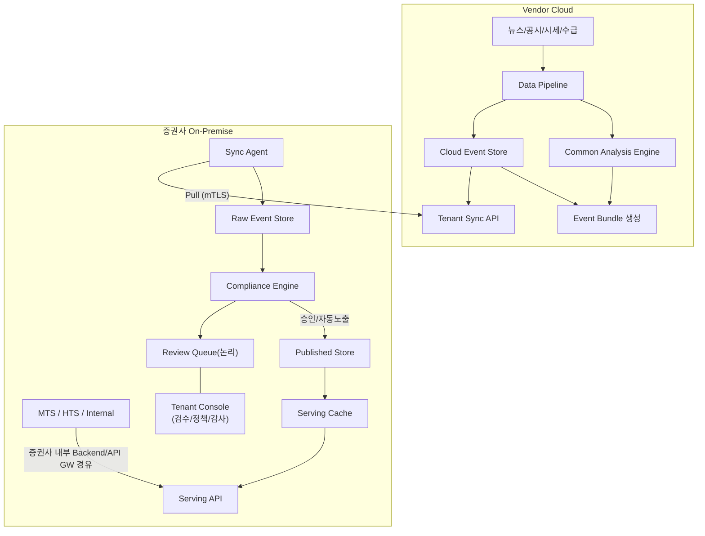

# EDGE 프로젝트 컨텍스트 — 하이브리드 On-Premise 피벗

> **문서 목적**: EDGE 프로젝트에 참여하는 모든 에이전트/팀원이 현재 제품 방향을 모호함 없이 이해하기 위한 단일 기준(Single Source of Truth) 문서.

> **적용 시점**: 2026-07 아키텍처 피벗 이후. 이 문서와 충돌하는 기존 문서(Cloud-only / embed widget 구조)는 전부 폐기된 방향이다.

> **작성 기준**: 제품 방향 지시 문서 + 기존 아키텍처 pptx(IA/Application/System/Cloud/Data Pipeline) 대조 + 8건의 미결 사항에 대한 PM(조영서) 확정 결정.

> **용어 — On-Prem(ise)**: 이 문서군의 On-Prem은 물리 서버가 아니라 **증권사가 통제하는 실행 환경**을 뜻한다 — 자체 IDC·내부 가상화는 물론, 증권사 명의로 운영하는 전용/금융 클라우드도 포함한다. 요건은 위치가 아니라 ① 고객 데이터 비반출(벤더 측으로 나가지 않음) ② 망분리 토폴로지 상당 구성(§3 네트워크 배치 — 클라우드 기반이면 VPC 서브넷 분리로 DMZ/내부망을 사상) ③ 증권사 통제권이다. 배제 대상은 클라우드 일반이 아니라 **벤더 통제 환경에 고객 데이터·검수·노출을 두는 구조**다. 대외 산출물에서는 "증권사 관리 환경"을 기본 표현으로 쓴다 ([writing-rules.md](writing-rules.md)).

## 1. 제품 정의 및 변경 배경

**한 줄 정의**: EDGE는 "AI 리포트 생성기"가 아니라, **증권사가 통제 가능한 '종목 가격 변동 이유 설명' 운영 인프라**다.

**표현 원칙**: 고객에게 제공되는 것은 "가격 변동의 확정 원인"이 아니라 **"공개 정보 기반 변동 요인 후보"**다. 모든 문서·UI·설명 문구에서 이 표현을 유지한다.

**변경 배경**:

- 기존 구조는 모든 기능을 Vendor Cloud에 두고 증권사 MTS/HTS에 임베드 widget을 제공하는 방식이었다 (widget-api, 클라우드 tenant-console-api, 범용 gateway, Super Admin의 API Key 관리 포함).
- 금융권 고객 데이터 비반출 요구와 준법감시인 통제 요구를 충족하기 위해, **고객 접점·컴플라이언스·검수·노출 이력을 전부 증권사 On-Premise로 이동**하는 하이브리드 구조로 전환했다.
- **규제 서사 (2026-07-13 재정렬)**: 2026년 망분리 규제 완화 흐름(4월 SaaS 망분리 예외 시행세칙 시행, 6월 보안 목적 생성형 AI 비조치의견서 발급, 일정 보안역량 충족 금융회사 대상 전면 해제 방안 검토 중 — 시한은 당국 미공표)으로 "클라우드는 승인이 어려우니 온프렘"이라는 회피 논거는 시효가 짧아지고 있다. EDGE의 온프렘 배치 근거는 규제 회피가 아니라 다음 두 가지다: ① 개인신용정보를 직접 처리하는 핵심 시스템은 완화 이후에도 엄격한 통제가 유지된다 ② 규제 패러다임이 자율보안-결과책임으로 전환되면서 사고 책임은 금융사에 남으므로, 통제권·감사 재현성을 금융사 내부에 두는 구조 자체가 제품 가치다. 모든 대외 문서·발표에서 이 프레임을 사용한다.
- MVP는 **종목 단위 가격 변동 이유 설명 기능** 하나에 집중한다.

**핵심 가치 (판매 논리)**:

1. 고객 데이터 비반출 — 고객 ID, 보유/관심 종목, 노출 이력이 벤더 클라우드로 나가지 않는다.
2. 컴플라이언스 통제권 — 증권사별 정책 적용, 검수 워크플로우, 감사 로그가 증권사 환경 안에 있다.
3. **"검수 없이 고객 노출 문구가 변경되는 경로가 존재하지 않는다"** — 정정 이벤트조차 재검수를 거친다 ([domain/state-machine.md](domain/state-machine.md)).

**MVP 제공 기능**: 종목별 가격 변동 이벤트 탐지 / 뉴스·공시·시세·수급 기반 변동 요인 후보 생성 / AI 설명 후보 생성 / 증권사별 컴플라이언스 정책 적용 / 자동 노출·검수 대기·차단 라우팅 / 검수자 승인·수정 승인·반려·차단 / 고객 노출 이력 및 민원 대응용 재현

## 2. 기존 구조 vs 신규 구조

| 항목 | 기존 (폐기) | 신규 (현행) |
| --- | --- | --- |
| 배치 | 모든 기능 Vendor Cloud | Cloud = 비개인화 공통 분석만 / On-Prem = 고객 접점·컴플라이언스 전부 |
| 고객 화면 | 벤더 embed widget (widget-api) | 증권사 MTS/HTS 자체 UI → On-Prem Serving API |
| Tenant Console | 클라우드 tenant-console-api | 증권사 On-Premise 배포 |
| 연동 방향 | 클라우드 → 증권사 (widget 서빙) | On-Prem Sync Agent → Cloud **Pull only** (outbound HTTPS/mTLS) |
| Gateway | 범용 클라우드 gateway | Cloud에는 Super Admin·Tenant Sync API용 gateway만 |
| API Key | Super Admin이 테넌트 API Key 관리 | API Key 메뉴 없음. Cloud Sync 인증서만 존재 |
| 고객 데이터 | 클라우드 저장 (RLS 격리) | On-Prem에만 저장 (물리 격리) |
| 멀티테넌시 | 단일 스키마 PostgreSQL RLS | 테넌트별 On-Prem 물리 격리 (RLS 폐기, [implementation.md](implementation.md)) |

**금지 사항 (불변 규칙)**:

- 클라우드가 증권사 내부망으로 직접 Push하지 않는다.
- MTS/HTS는 벤더 클라우드를 직접 호출하지 않는다.
- WebSocket/SSE는 MVP 필수가 아니다. 필요 시 Tenant Console 운영 알림에만 제한적으로 고려한다.

## 3. 하이브리드 아키텍처 개요

- 데이터는 항상 **Cloud → On-Prem 단방향**으로 흐르고, 연결은 항상 **On-Prem → Cloud outbound**로만 열린다.
- Cloud는 "어느 증권사가 무엇을 노출했는지" 알지 못한다. Cloud가 아는 테넌트 정보는 동기화 상태(마지막 sync 시각, 성공/실패, 전달 이벤트 수)까지다.
- **네트워크 배치 (확정, 2026-07-13)**: Sync Agent는 증권사 내부 업무망이 아닌 **DMZ(외부연계망) 구간**에 배치한다. 망분리 환경에서 내부 업무망은 외부 인터넷으로 직접 outbound를 열 수 없으므로, 외부 통신 경로는 DMZ에 한정한다. ① 방화벽 outbound 허용 대상은 벤더 Tenant Sync API의 **고정 FQDN:443 (mTLS) 단일 목적지 화이트리스트**로 제한 ② 증권사 표준 forward proxy 경유를 지원 ③ Sync Agent → 내부망 On-Prem DB 접근은 증권사 내부 방화벽 정책에 따라 전용 포트·계정으로 최소화 — 단, DMZ→내부망 직접 DB 커넥션 자체를 금지하고 망연계 솔루션(망간자료전송 시스템) 경유를 요구하는 증권사를 위해 **망연계 솔루션 경유 배치도 지원**한다. 이 경우 Sync Agent는 Pull·무결성 검증까지만 DMZ에서 수행하고, 내부망 저장은 별도 수신 모듈이 담당하는 2단 구성으로 분리한다. 나머지 온프렘 컴포넌트(Compliance Engine, Tenant Console, Serving API, DB)는 전부 내부 업무망에 위치하며 외부 통신이 없다. "외부와 닿는 것은 DMZ의 Sync Agent 하나, 방향은 outbound 하나, 목적지는 하나"가 준법감시인 대상 설명 문구다.

## 4. Cloud / On-Premise 책임 분리

### 4.1 Vendor Cloud 구성요소

| 컴포넌트 | 역할 |
| --- | --- |
| Data Pipeline | 뉴스/공시/시세/수급 수집 (Step Functions + ECS 워커 구조 유지) |
| Common Analysis Engine | 가격 변동 이벤트 생성, 공통 변동 요인 후보 생성 |
| (AI 설명 생성) | AI 설명 후보 + 근거 데이터 연결, 신뢰도/반대 요인 산출 |
| Cloud Event Store | 비개인화 이벤트·설명 후보·근거 저장, 정정/무효화 이벤트 발행 |
| Tenant Sync API | Sync Agent가 Pull하는 Event Bundle 제공 (cursor 기반 delta) |
| Super Admin Console + super-admin-api | 테넌트 생성, 파이프라인 조회, 공통 이벤트 정정/무효화 |
| Data Source Monitor | 소스별 수집 상태 모니터링 |
| Admin Activity Log | Super Admin 작업 이력 |

### 4.2 증권사 On-Premise 구성요소

| 컴포넌트 | 역할 |
| --- | --- |
| Sync Agent | Tenant Sync API를 outbound Pull, 번들 무결성 검증, On-Prem DB 저장 |
| Raw Event Store | 수신한 원본 이벤트 보존 (수신 원본 불변) |
| Compliance Engine | 증권사별 금칙어/금지 표현/처리 기준 적용 → 상태 분기 |
| Review Queue | **물리 DB 아님.** analysis_items 중 status=REVIEW_REQUIRED의 논리적 작업함 |
| Tenant Console + Tenant Console API | 검수, 정책 관리, 감사 로그, 설정 (증권사 내부 사용자 전용) |
| Published Store | 최종 노출 확정 문구 저장 |
| Serving Cache | Published 데이터 조회 캐시 (Redis) |
| Serving API | MTS/HTS/Internal에 Published 상태만 반환 |
| Exposure Log | 고객 노출 이력 (민원/감사 재현용) |
| Audit Log | 콘텐츠 상태 변경/검수/정책 변경 이력 |
| Tenant On-Prem DB | 위 전부의 저장소 (PostgreSQL) |

## 5. 서비스/API 변경표

| 기존 | 처리 | 신규 위치/내용 |
| --- | --- | --- |
| super-admin-api | **유지** | Vendor Cloud. 테넌트 생성, 파이프라인 조회, 정정/무효화, Admin Activity Log |
| tenant-console-api | **이동** | 증권사 On-Premise. 설명 조회, 검수, 컴플라이언스 정책, 감사 로그, 설정 |
| gateway | **축소** | Cloud에는 Super Admin·Tenant Sync API용 gateway만. On-Prem은 Serving API 또는 증권사 내부 API GW |
| widget-api | **제거** | MVP에 embed widget 없음. 고객 화면은 증권사 MTS/HTS가 직접 구성 |
| Tenant Sync API | **신규** | Vendor Cloud. cursor 기반 delta sync, 신규/정정/무효화 이벤트 전달, mTLS |
| Sync Agent | **신규** | On-Premise. outbound Pull, 무결성 검증 후 저장 |
| Compliance Engine | **신규** | On-Premise. 금칙어/금지 표현/자동노출·검수·차단 기준 적용 |
| Serving API | **신규** | On-Premise. Published 데이터만 조회 제공 |
