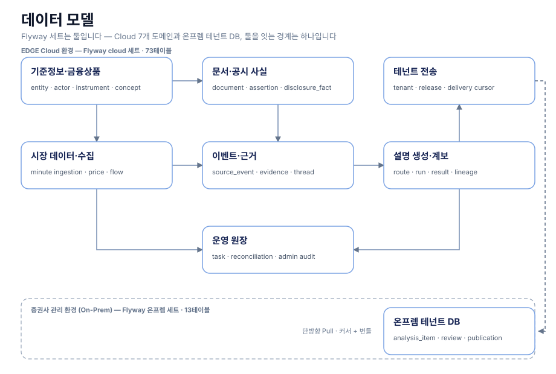

# 데이터 모델

두 Flyway 세트의 도메인 흐름은 overview로, 상세 물리 FK는 각 ERD로 구분한다.

## 개요 — 두 세트와 그 경계

## Cloud 도메인별 물리 관계

- [기준정보와 금융상품](domains/reference/)
- [문서와 공시 사실](domains/documents/)
- [시장 데이터와 수집 상태](domains/market/)
- [이벤트와 근거](domains/events/)
- [설명 생성과 계보](domains/explanation/)
- [테넌트 전송](domains/delivery/)
- [운영 원장](domains/operations/)

도메인 경계를 넘는 FK의 대상 테이블은 관계 이해에 필요한 컨텍스트로 상세 ERD에 포함한다.

## On-Prem 세트

Flyway 세트는 둘이고 위 도메인은 Cloud 세트다. 증권사 관리 환경에 배포되는 On-Prem 세트는
13테이블이라 도메인으로 쪼개지 않고 한 장으로 둔다 — [온프렘 테넌트 DB](onprem/).
