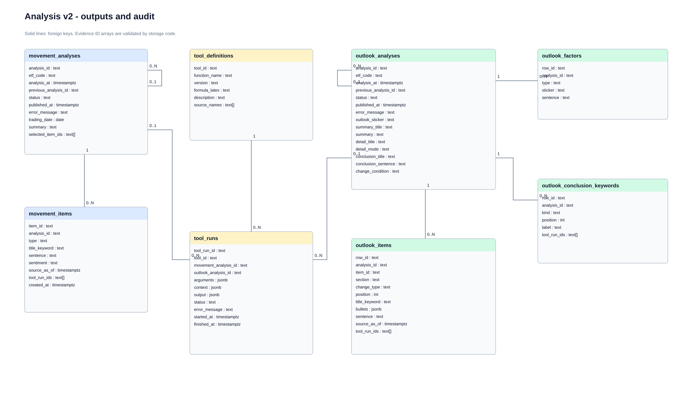

# v2 분석 결과와 툴 감사

오늘 움직임과 전망을 발행본별로 저장한다. 이전 결과를 조회해 다음 분석에 전달하고, 저장된 행으로 화면 응답을 조립한다.

- `movement_analyses`·`movement_items`: 오늘 움직임의 요약·선택 순서와 누적 설명.
- `outlook_analyses`·`outlook_items`: 전망 요약·본문·논점 변경 기록.
- `outlook_factors`·`outlook_conclusion_keywords`: 요인 판단과 결론의 도움·부담 키워드.
- `tool_runs`·`tool_definitions`: 호출 인수·반환값·수식·출처. 실행은 두 분석 종류 중 하나에만 소속.

실선은 실제 외래키다. `selected_item_ids`·`tool_run_ids` 배열의 존재·소속 검사는 저장 코드가 맡는다. 완료 결과 불변성·발행 조건도 별도 저장 로직이 필요하며, 이 테이블만으로 보장하지 않는다. 수치 카드와 이슈 상세의 추가 저장 구조는 후속 변경이다.
