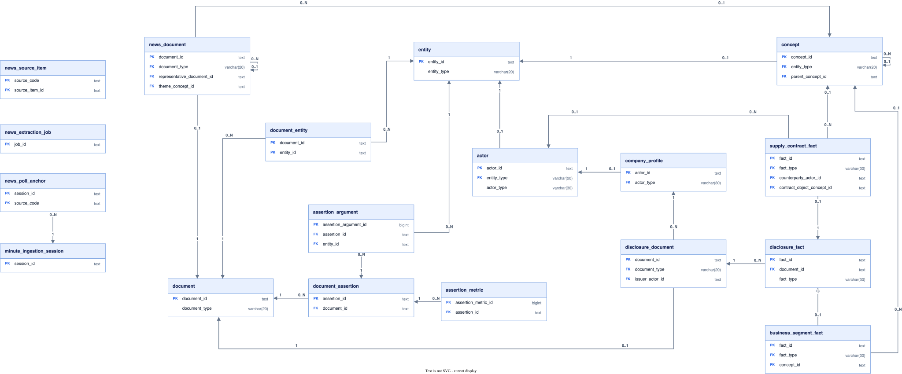

# 문서와 공시 사실

뉴스 수집 상태를 보존하고, 원문 `document`에서 명제와 역할을 정규화해 공시 문서를 구조화된 사실로 변환한다.
`entity`·`concept`·`actor`·`company_profile`은 기준정보, `minute_ingestion_session`은 수집 경계 컨텍스트다.
`news_source_item`과 `news_extraction_job`은 물리 FK가 없는 독립 운영 테이블이다.

