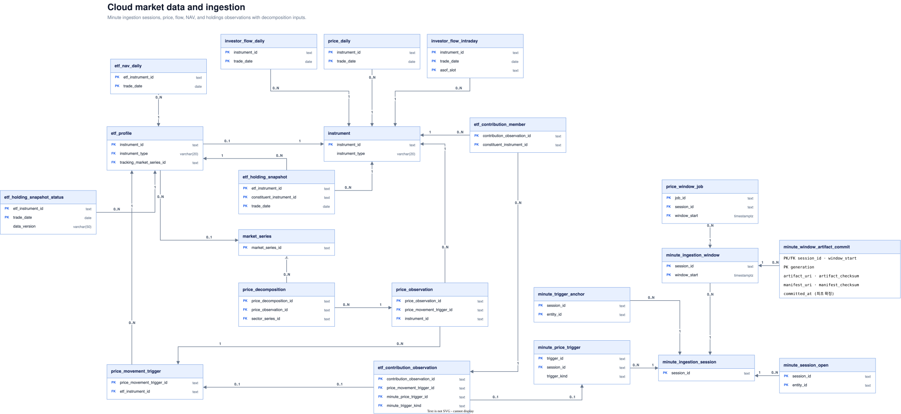

# 시장 데이터와 수집 상태

분봉 수집 세션과 작업 상태, 가격·수급·NAV·구성종목 관측, 변동 트리거 및 ETF 기여도 입력을 보존한다.
`minute_window_artifact_commit`은 window별 확정 artifact/manifest 세대 이력을 보존하며,
현재 승자와 과거 승자를 미확정 S3 후보와 구별한다.
`instrument`·`etf_profile`·`market_series`는 기준정보 도메인에서 참조하는 컨텍스트다.

