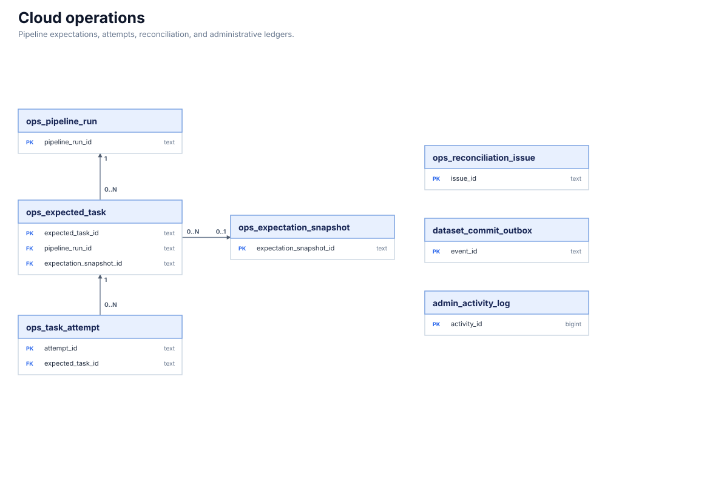

# 운영 원장

파이프라인 실행 기대값과 실제 시도, 조정 이슈, 커밋 아웃박스 및 관리자 활동을 별도 원장으로 기록한다.
업무 데이터의 의미 관계가 아니라 실행 완전성과 운영 추적을 위한 도메인이다.
시장·수집 도메인은 실행 및 커밋 상태를 남기고, 설명 도메인의 운영자 무효화는 `admin_activity_log`에 남는다.
`ops_reconciliation_issue.evidence`는 운영 진단 JSON이며 이벤트 도메인의 `event_evidence`를 참조하지 않는다.

