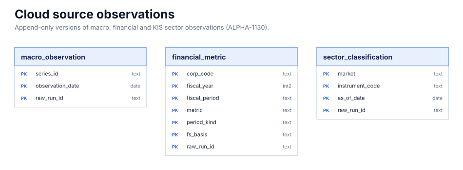

# 원천 관측(매크로·재무·업종)

분석 v2가 읽는 원천 관측의 **추가 전용 판본 이력**이다(ALPHA-1130). 한 행은 한 수집 실행(`raw_run_id`)이 받은
한 관측의 판본이고, 기준시각 조회는 `*_as_of` 함수가 정한다. 다른 테이블로 가는 FK는 없다 — 종목은 KRX 단축코드,
계열은 `series_id`로 식별하고, 구성종목과의 연결은 `etf_constituent_source_coverage` 함수가 기준시각에 맞춰 한다.
계약(경로·키·단위·시각·정정·보존)은 [ETF 데이터 저장 경로 설계 §10](../../../design/etf-data-storage-plan.md)에 있다.
읽기는 함수로만 — `macro_observations_as_of`·`financial_quarters_as_of`·`sector_classification_as_of`·
`etf_constituent_source_coverage`·`source_observation_freshness` 다섯이 `SECURITY DEFINER`이고 v2 쓰기 역할
(`edge_analysis_v2_writer`)에 EXECUTE 만 있다(테이블 권한 0, `libs/schema/tests/analysis_v2_writer.sql`).
`financial_quarters_as_of`의 행 단위는 `financial_report_version`의 확정 판본(보고서마다 가장 늦게 받은 CONFIRMED)이고, 그 실행이
만든 지표만 값이 있다 — 지표가 0개인 판본도 한 줄(NULL)이며, UNCONFIRMED(응답 실패·파손·값을 읽는 줄의 칸을 읽지 못한 응답)는 옛 확정값을 무효화하지 않고
`latest_unconfirmed_at`으로만 드러난다(§10.4). 판본 행은 지표 행과 같은 정제·같은 트랜잭션으로 실린다.

