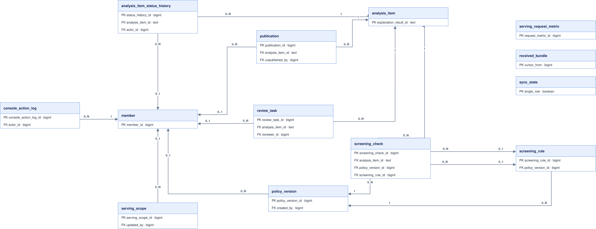

# 온프렘 테넌트 DB

증권사 관리 환경(On-Prem)에 배포되는 세트다. 번들 수신(`received_bundle`·`sync_state`)에서 시작해
정책 심의(`policy_version`·`screening_rule`·`screening_check`), 검수(`review_task`), 게시(`publication`)까지
한 항목(`analysis_item`)의 수명주기를 원장으로 남긴다. 행위 주체는 모두 `member`를 참조하고,
상태 전이와 콘솔 조작은 `analysis_item_status_history`·`console_action_log`에 감사 로그로 남는다.

Cloud 세트와는 FK로 이어지지 않는다 — 경계는 커서(`sync_state.last_cursor`)와 번들 본문이며,
`analysis_item.explanation_result_id`가 Cloud의 설명 결과와 논리적으로만 대응한다.

