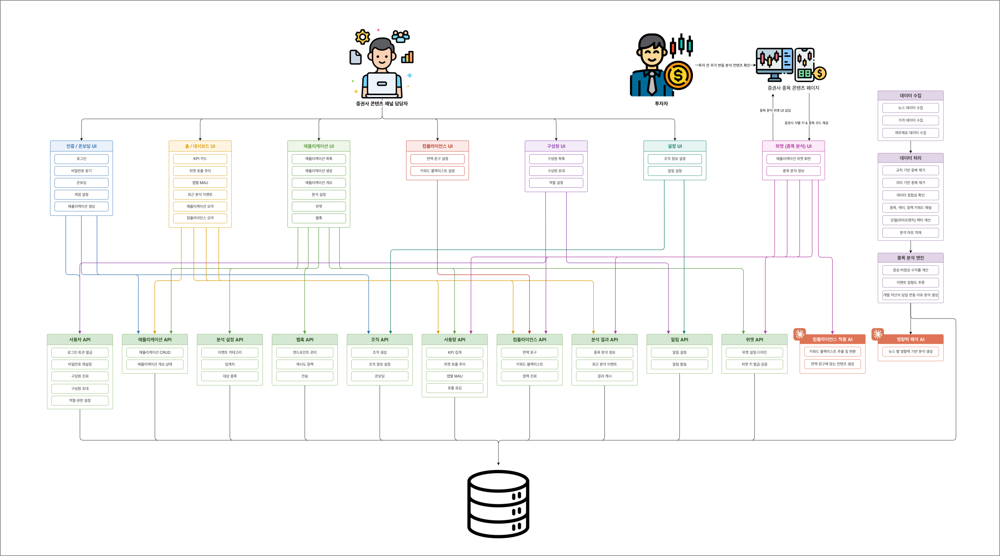

# 2 애플리케이션 아키텍처 (Application Architecture)

cloud/onprem 하이브리드 — 클라우드에서 만들고 증권사 통제 환경에서 서빙하는 구조.

상자를 클릭하면 상위·하위 1단계가 함께 강조된다.

버전: <strong>v2</strong> (현재) · <a href="#v1">v1</a> ·
<a href="../interactive/2-aa.v2.html" target="_blank" rel="noopener">전체 화면으로 열기 ↗</a>

  <iframe src="../interactive/2-aa.v2.html" title="EDGE 애플리케이션 아키텍처 다이어그램 v2 — 인터랙티브" loading="lazy"></iframe>

!!! note "설계 뷰 — 원본 v0.2 기준"
    이 다이어그램은 설계 시점(v0.2)의 애플리케이션 구성이다. 현행 사실·계약의 권위는
    context·contracts 등 SSOT 에 있으며, 충돌 시 SSOT 가 우선한다.

근거 문서(설계 뷰): [application-architecture.md](../reference/architecture/application-architecture.md)

### v1 — 초기 설계 (v0.1) { #v1 }

??? note "v1 정적 이미지 펼치기"
    

---

[← 1 정보 구조](1-information-architecture.md) · [목록](index.md) · [다음 → 3 시스템 아키텍처](3-system-architecture.md)
