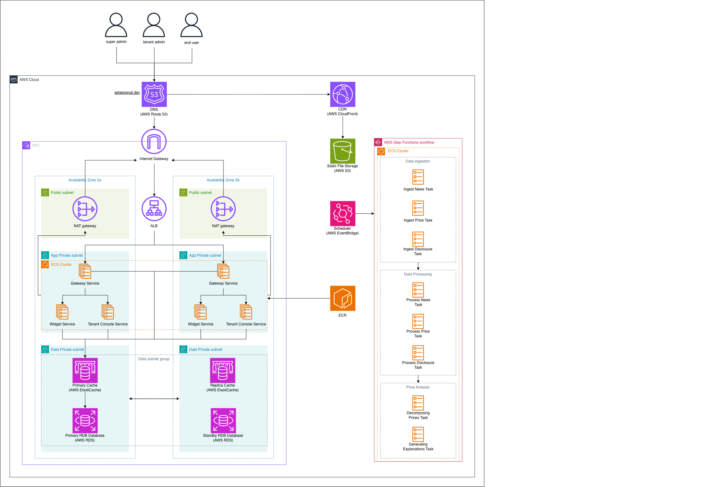

# 4 클라우드 아키텍처 (Cloud Architecture)

ECS 클러스터 분리·RDS·CloudFront 등 실 배포 토폴로지.

상자를 클릭하면 상위·하위 1단계가 함께 강조된다.

버전: <strong>v2</strong> (현재) · <a href="#v1">v1</a> ·
<a href="../interactive/4-ca.v2.html" target="_blank" rel="noopener">전체 화면으로 열기 ↗</a>

  <iframe src="../interactive/4-ca.v2.html" title="EDGE 클라우드 아키텍처 다이어그램 v2 — 인터랙티브" loading="lazy"></iframe>

!!! note "설계 뷰 — 원본 v0.2 기준"
    이 다이어그램은 설계 시점(v0.2)의 클라우드 토폴로지다(다중 AZ 등 목표 구성 포함).
    현행 인프라의 권위는 infra/terraform 등 SSOT 에 있으며, 충돌 시 SSOT 가 우선한다.

근거 문서(설계 뷰): [cloud-architecture.md](../reference/architecture/cloud-architecture.md)

### v1 — 초기 설계 (v0.1) { #v1 }

??? note "v1 정적 이미지 펼치기"
    

    [원본 크기로 열기 ↗](images/4-ca.v1.png){ target=_blank rel=noopener }

---

[← 3 시스템 아키텍처](3-system-architecture.md) · [목록](index.md)
