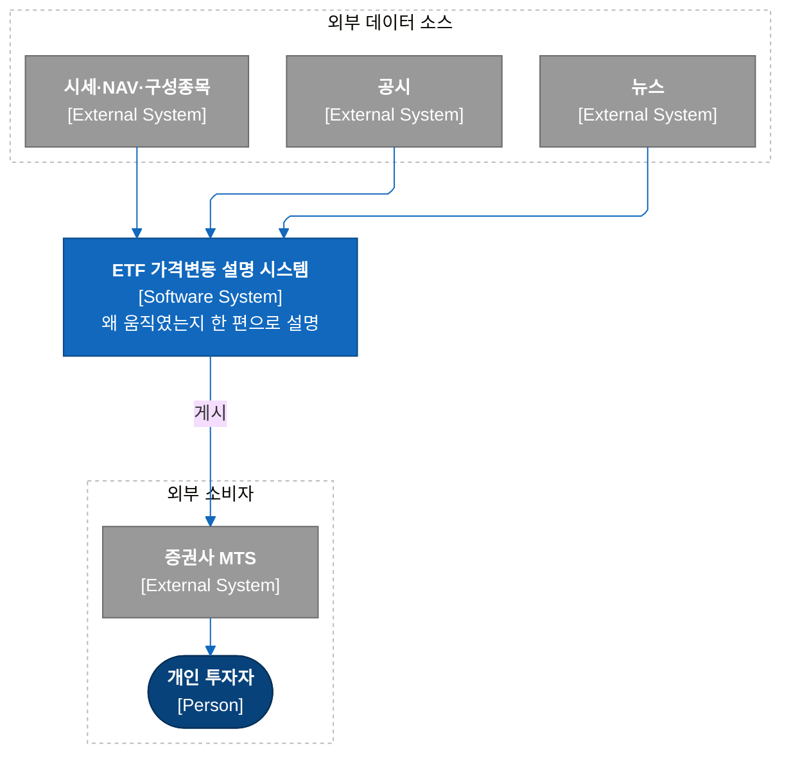
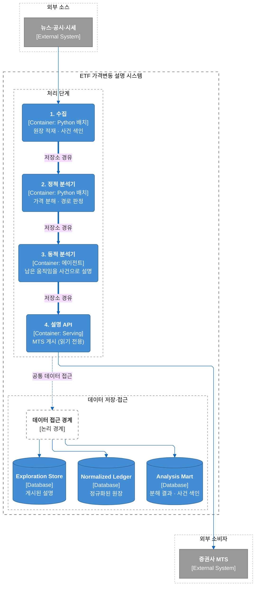
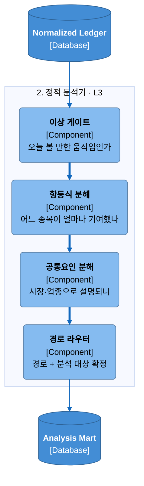
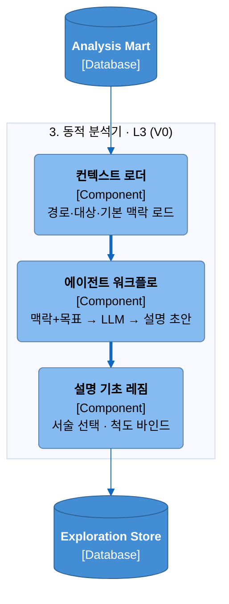
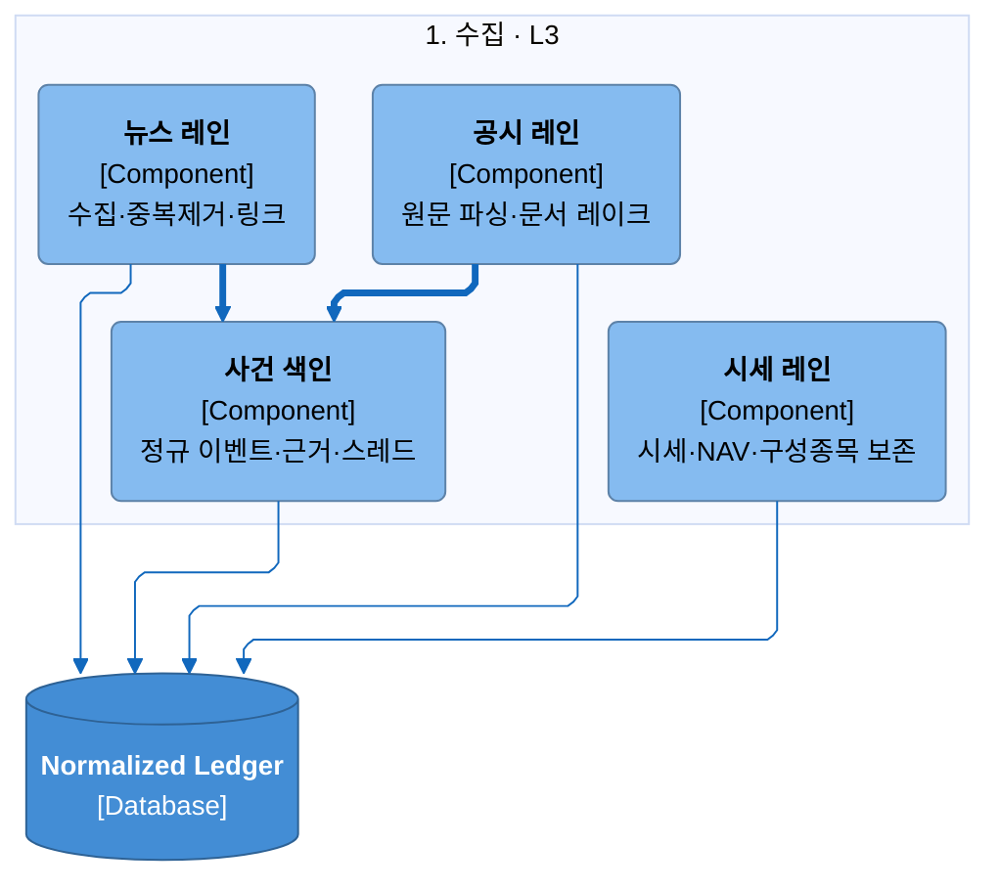
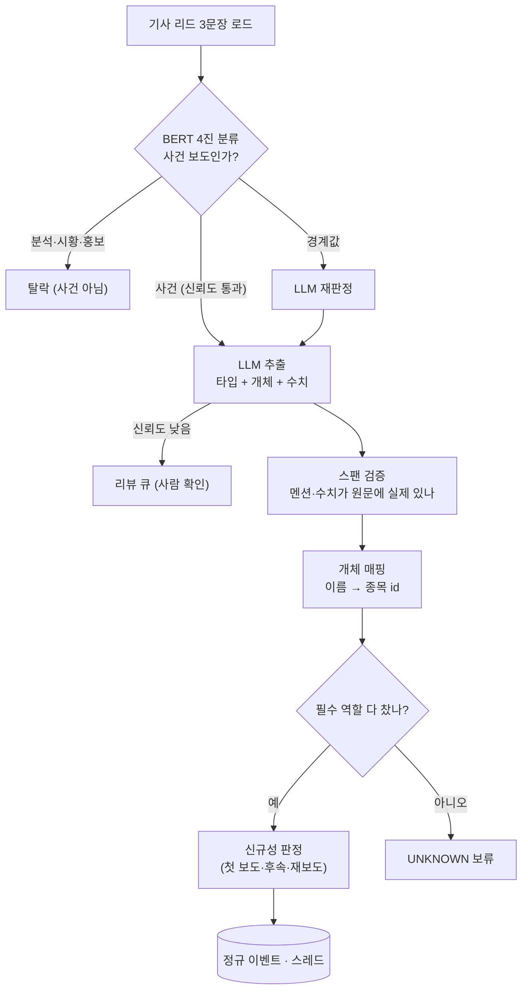
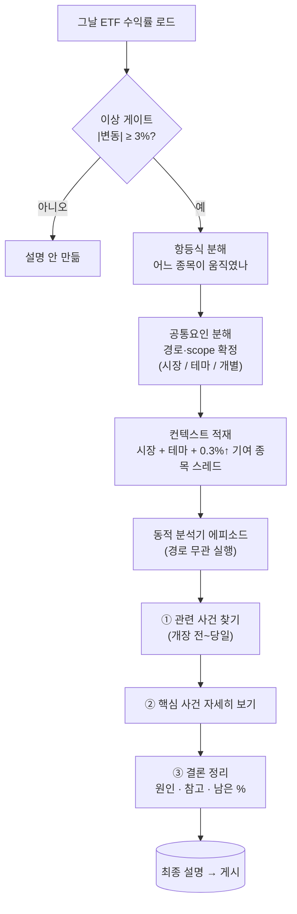

# ETF 가격변동 설명 시스템 — 베이스라인 아키텍처

> **이 문서가 소유**: 현재 만들어져 돌아가는 시스템의 전체 그림 — 시스템 컨텍스트(C4 L1)·컨테이너(C4 L2)·컨테이너별 컴포넌트(C4 L3), 그리고 하루가 실제로 설명되는 런타임 흐름.
> **따로 뺀 것**: 동적 분석기를 연구 루프로 키우는 **확장안**은 아직 만들지 않은 미래라서 [제안 0004](../proposals/0004-dynamic-analyzer-extension.md)로 분리했다.
> **더 깊은 계약**: 산식·이벤트/스레드 타입 정밀 규칙은 [`../specs`](../specs), 수집 내부는 [data-ingestion.md](data-ingestion.md).

이 문서는 어려운 약어를 쓰지 않는다. 단계 이름은 처음 나올 때 한글 이름과 짧은 설명을 함께 적고, 필요한 곳에만 원식(수식)을 보인다.

---

## 1. 무엇을 하는 시스템인가

**하나의 ETF가 오늘 왜 그렇게 움직였는지**를 사람이 읽을 수 있는 한 문단으로 설명해, 증권사 앱(MTS)에 올려 개인 투자자에게 보여주는 시스템이다.

설명은 항상 **가격에서 출발**한다. 값이 얼마나 움직였는지 먼저 숫자로 분해해 그 움직임이 시장·테마·개별 중 어느 성격인지 정한다. 그 위에서 동적 분석기가 사건(뉴스·공시)을 끌어와 원인을 붙이되, **시장·업종으로 이미 설명되는 부분은 사건으로 중복 서사화하지 않는다**. 순서를 이렇게 고정하는 이유는, 사건부터 찾으면 "그날 있었던 아무 뉴스나" 원인처럼 붙기 때문이다. 가격이 먼저 움직임의 성격과 범위를 정하고, 사건은 그 위에서 설명에 참여한다.

관통하는 원칙 넷:

- **가격 먼저(price-first)** — 출발점은 언제나 ETF 가격의 분해다. 분해가 경로(route)와 설명 범위(scope)를 정하고, 설명 자체는 언제나 동적 분석기가 만든다.
- **경로는 범위를 정한다(route-driven)** — 경로와 분석 대상(scope)은 **무엇을 어느 범위로 주장할지**를 고정할 뿐, 동적 분석기를 켜고 끄지 않는다. 시장·테마·개별 어느 경로든 동적 분석기로 가며, 초기 컨텍스트는 경로로 제한하지 않는다(§5.2 규칙). 뒤 단계는 이 판정을 다시 계산하지 않는다.
- **방향은 검증하지 않는다** — "이 뉴스가 가격을 올렸다"처럼 사건과 가격의 인과 방향을 판정하는 단계는 없다. 사건은 "같은 종목·같은 시간대"라는 근거로만 설명에 참여하고, 방어선은 관측·추정·가설을 문장에서 섞지 않는 것과 모르는 건 모른다고 적는 것이다.
- **같은 입력이면 같은 결과(PIT 재현)** — 같은 날짜·같은 기준시점으로 다시 돌리면 같은 설명이 나와야 한다. 과거 데이터를 나중 값으로 덮어쓰지 않는다(point-in-time).

---

## 2. 전체 그림 — 시스템 컨텍스트 (C4 L1)

> 바깥에서 본 한 장: 세 종류의 원천이 들어오고, 설명 한 편이 증권사 앱을 거쳐 투자자에게 나간다.



---

## 3. 컨테이너 (C4 L2)

> 네 개의 처리 단위가 저장소를 사이에 두고 한 방향으로 이어진다. 각 단계는 앞 단계가 저장소에 남긴 것만 읽는다 — 직접 호출하지 않는다.



| 컨테이너 | 하는 일 | 남기는 저장소 | 상세 |
|---|---|---|---|
| **1. 수집** | 외부 원천을 다시 만들 수 있는 정규화된 원장으로 적재하고, 뉴스·공시를 사건 색인(정규 이벤트·스레드)으로 상시 승격 | Normalized Ledger | §6 · [data-ingestion.md](data-ingestion.md) |
| **2. 정적 분석기** | ETF 가격을 항등식으로 분해 → 시장·업종으로 설명되는지 판정 → 경로와 분석 대상 확정. **사건 데이터는 보지 않는다** | Analysis Mart | §4 |
| **3. 동적 분석기** | 경로·scope와 함께 받은 컨텍스트(시장·테마·주요 기여 종목 스레드)로 사건 색인을 조회해 설명을 만든다. 경로 무관 상시 실행 | Exploration Store | §5 |
| **4. 설명 API** | 완성된 설명을 MTS에 게시(판단을 다시 하지 않는 읽기 전용) | — | §8 |

세 저장소는 단계 사이의 경계다. 뒤 단계는 앞 단계가 남긴 저장소만 읽으므로, 단계를 따로 다시 돌리거나 백필해도 서로 어긋나지 않는다.

---

## 4. 정적 분석기 (Static Analysis Engine)

가격만 보고 "이 움직임은 설명이 필요한가, 필요하면 어느 종목을 봐야 하는가"를 판정한다. 코드만으로 돌아가며 LLM이 개입하지 않는다.

### 4.1 컴포넌트 (C4 L3)



- **이상 게이트** — 오늘 그 ETF가 설명할 만큼 움직였는지 먼저 거른다. 기준(현재): ETF 하루 변동폭이 3% 이상, 그리고 KOSPI 대비 1%p 이상 차이. 못 넘으면 그날은 설명을 만들지 않는다.
- **항등식 분해** — ETF 수익률을 구성종목별 기여로 쪼갠다. "어느 종목이 오늘 ETF를 움직였나"에 답한다. ETF는 정의상 구성종목의 가중합이므로 이 분해는 추정이 아니라 **관측**이다. (괴리·환율·부채·스왑 비용은 모두 iNAV에 이미 반영되어 있어 따로 고려하지 않는다.)
- **공통요인 분해** — 움직인 종목의 수익률에서 시장 요인과 업종(피어) 요인을 차례로 걷어내, 그래도 남는 **고유 움직임**이 얼마인지 본다(§4.2).
- **경로 라우터** — 분해 결과의 성격을 판정해 **경로(route)**와 **분석 대상(scope)**을 확정한다. 여기까지가 정적 분석기의 책임이고, 사건 해석은 하지 않는다.

### 4.2 어떻게 분해하나

ETF 수익률에서 설명되는 요인을 **바깥에서 안으로** 차례로 걷어낸다. 각 단계는 "걷어내고 남은 값이 통계적으로 유의하게 크냐(표준편차의 2배 이상)"로 그 움직임의 **성격(경로)**을 정한다. 어느 경로로 판정되든 이후 동적 분석기로 넘어가며, 경로는 설명 범위(scope)만 바꾼다.

```
r0 = ETF 수익률

1) 시장 걷어내기
   r1 = r0 − βm·rm − am
   |r1|/σ(r1) < 2  → 시장으로 설명됨 (경로 = 시장)
   그 이상          → 다음 단계

2) 업종(피어) 걷어내기 — 단, 시장과 직교시킨 피어만
   r2 = r1 − β⊥p·r⊥p − a⊥p
   |r2|/σ(r2) < 2  → 업종으로 설명됨 (경로 = 테마)
   그 이상          → 고유 움직임 (경로 = 개별 / concentrated)

   r⊥p = (w1·p1 + w2·p2 + w3·p3) − βnm·rnm − anm
        = 상위 3개 피어의 가중 수익률에서 시장 요인을 다시 걷어낸 값
```

- **피어 정의** — 같은 시장 안에서 상관관계가 가장 높은 상위 3개 종목이면서 GICS 소분류가 같은 종목. 회귀 계수는 과거 126일로 적합한다(같은 업종 강제 + 126일이 표본 밖 설명력을 유의하게 높인다는 게 검증됐다).
- **왜 피어를 시장과 직교시키나** — 시장과 피어 수익률을 직교시키지 않고 따로 설명하면, 시장 때문에 생긴 피어 동조가 뭉개져 "시장 탓인지 업종 탓인지"가 흐려진다. 그래서 시장을 걷어낸 뒤의 피어 설명 범위만 본다. (대안으로 둘을 직교시키지 않는 안을 검토했으나 이 모호함 때문에 채택하지 않았다.)
- **현재 제외** — 해외 주식이 한국 주식에 주는 영향은 지금은 배제한다(향후 확장, §12).

### 4.3 경로(route)와 분석 대상(scope)

경로는 그 움직임의 **성격**과 설명의 **범위(scope)**를 정한다. 어느 경로든 동적 분석기로 넘어간다 — 경로는 무엇을 주장할지를 정할 뿐, 분석을 켜고 끄지 않는다.

| 경로 | 성격 | 설명 범위(scope) |
|---|---|---|
| 시장 | 시장 요인이 움직임을 대부분 설명 | 시장 수준 서술 |
| 테마 | 시장 걷어낸 뒤 업종(피어)이 설명 | 테마/피어 |
| 개별 | 시장·업종으로도 안 남는 큰 잔차 | 그 소수 종목 |

경로와 무관하게 동적 분석기가 실행되고, 초기 컨텍스트는 경로로 제한하지 않는다(적재 규칙은 §5.2). 경로는 설명이 어느 범위를 주장하는지만 바꾼다.

> **향후 확장(정적 분석기)** — 아래는 아직 만들지 않은 실험 항목이다: 반복 패턴을 찾아 메커니즘으로 플래그화, 설명력 수치의 결과 정리·전달, 다중요인 PCA 회귀·파마-프렌치 팩터가 정상 수익률 설명력을 더 높여 에이전트 분석 범위를 줄여 주는지 실험. 동적 분석기 확장과 달리 별도 문서로 빼지 않고 여기 목록으로만 둔다.

---

## 5. 동적 분석기 (Dynamic Analysis Engine) — 현재 버전(V0)

정적 분석기가 정한 경로·scope와 컨텍스트를 받아, 사건 색인을 조회해 **왜 그렇게 움직였는지**를 만든다. 시장·테마·개별 어느 경로든 실행되며, 다른 것은 scope와 컨텍스트의 넓이뿐이다. 현재 버전은 한 번 훑고 설명을 내는 단순한 에이전트다.

### 5.1 컴포넌트 (C4 L3)



### 5.2 무엇을 하나

에이전트는 세 가지를 입력받아 한 번의 분석으로 설명 초안을 만든다:

- **정적 분석 맥락** — 항등식·공통요인 분해 결과와 경로·scope.
- **목표(Goal)** — 오늘 이 ETF의 움직임을 설명하라.
- **시스템 맥락(System Context)** — 규칙·말투·금지사항.

**초기 컨텍스트 적재 규칙** — 경로로 범위를 좁히지 않는다. 컨텍스트 로더는 언제나 다음을 넣는다:

- **시장** 맥락(그날 시장 요인).
- **테마** 맥락(관련 업종·피어).
- **주요 ETF에 0.3% 이상 기여한 구성종목**의 **개별종목 사건 스레드**(그 종목의 최근 이벤트 계보).

경로(시장/테마/개별)는 이 컨텍스트 위에서 **무엇을 주장할지의 범위(scope)**만 바꾼다 — 시장 경로라고 개별종목 스레드를 빼지 않는다. 이 셋을 LLM(현재 DeepSeek)에 넣어 **동적 분석 맥락**(설명 초안)을 얻고, 설명 기초 레짐이 서술을 다듬어 저장한다.

> **확장(V1)은 여기 없다** — 에이전트를 "가설 → 실험 → 검증 → 리뷰" 연구 루프로 키우고, 과거 사건·시계열을 직접 질의하는 도구를 붙이는 확장은 [제안 0004 — 동적 분석기 확장](../proposals/0004-dynamic-analyzer-extension.md)에서 다룬다.

---

## 6. 수집 (Data Ingestion) · 뉴스 정규화

외부 원천을 원장으로 적재하고, 뉴스·공시를 **정규 이벤트와 스레드**로 상시 승격한다. 시세·NAV·구성종목은 그대로 보존해 정적 분석기의 입력이 된다.

### 6.1 컴포넌트 (C4 L3)



### 6.2 뉴스 정규화 (v3) — 런타임 흐름

뉴스 한 건을 정규 이벤트로 만드는 흐름이다. 값싼 분류로 먼저 거르고, 사건인 것만 비싼 LLM 추출에 넘긴 뒤, 결과를 규칙으로 검증해 확정한다.



- **BERT 4진 분류** — 리드 3문장을 넷 중 하나로 나눈다: 사건 보도 / 분석·전망·해설 / 시황·시세 / 홍보·광고. 사건 보도만, 그것도 확신이 충분할 때(1등 확률과 2등과의 격차가 기준 이상)만 통과시킨다. 애매하면 LLM에 다시 물어본다.
- **LLM 추출** — 사건으로 통과한 기사에서 **이벤트 타입·관련 개체·수치**를 뽑는다.
- **규칙 검증(조립)** — 모델이 뽑은 멘션·수치가 원문에 실제로 있는지 문자열로 대조하고(없으면 그 인자만 버린다), 개체 이름을 종목 id로 매핑하고, 그 타입이 요구하는 필수 역할이 다 찼는지 본다.
- **스레딩** — 필수 역할이 차면 같은 사건 계보(스레드)에 잇고 이 보도가 첫 보도인지·후속인지·단순 재보도인지 판정한다. 못 차면 `UNKNOWN`으로 보류한다. (신규성 판정 규칙의 정밀 계약은 [스레드 타입](../specs/data/thread-types.md).)
- **정본(SSOT)** — 요구 필드는 온톨로지 리소스가 소유한다: 역할은 `event_type_profiles`, 수치 피처는 `feature_specs`, 스레드 식별은 `news_thread_contract`. 프롬프트도 여기서 기계로 생성해 검증과 같은 출처를 쓴다.

---

## 7. 이벤트 타입 체계 (Event Taxonomy)

뉴스·공시가 주장하는 사건을 정해진 타입으로만 라벨링한다(모델이 라벨을 지어내지 못하게). 현재 체계는 **6개 대분류 · 44개 세부 타입**이다.

| 대분류 | 세부 타입 수 | 예 |
|---|---:|---|
| 기업(Company) | 24 | 실적 발표, 계약 체결, 인수·합병, 제품 출시, 임원 변경 |
| 매크로(Macro) | 7 | 기준금리 결정, 물가 발표, GDP 발표 |
| 산업(Industry) | 5 | 공급능력 변화, 수요 변화, 원자재 가격 변화 |
| 정책·규제(Policy) | 7 | 규제 변경, 관세 변경, 제재 부과 |
| 외생(Exogenous) | 6 | 재해, 사고·운영 중단, 분쟁 |
| 시장구조·정보(Market) | 6 | 애널리스트 등급 변경, 지수 편입·편출, 거래정지 |

- 각 타입은 **허용 술어**(예: ISSUE, RAISE, MAINTAIN)와 **필수 개체**(예: ISSUER, TARGET_COMPANY)를 갖고, 일부 타입은 **STAGE**(예정→확정처럼 여러 단계로 진행)를 갖는다.
- 정밀 카탈로그(타입별 역할·술어·lifecycle·투영)는 [뉴스 온톨로지 타입](../specs/data/news-ontology-types.md)이 소유한다.

> **알려진 드리프트** — 이 표(44타입/6분류)는 본 아키텍처 원본 기준이다. 저장소의 [뉴스 온톨로지 카탈로그](../specs/data/news-ontology-types.md)는 `event_type_profiles_v0_1.json`(53타입/7패밀리)을 정본으로 삼는다. 두 수치가 다른 것은 스냅샷 세대 차이다 — 통일은 온톨로지 소유자 결정 안건(§12).

---

## 8. 설명 API (Explanation API)

완성된 설명을 증권사 MTS에 게시한다. **판단을 다시 하지 않는 읽기 전용** 경계다 — 이미 저장된 설명을 그대로 내보낸다. 최종 화면은 ETF 등락률, 시장 대비 초과분, 기여 상위 종목, 핵심 원인 한 문단, 그리고 "아직 설명되지 않은 부분 몇 %"까지 사람이 읽을 수 있는 형태로 보여준다.

---

## 9. 런타임 — 하루가 어떻게 설명되나

정적 분석기부터 최종 설명까지의 한 흐름. 앞부분(게이트·분해)은 코드만으로 돌고, 이상 게이트만 통과하면 경로와 무관하게 동적 분석기(LLM)가 열린다 — 경로는 설명 범위(scope)만 바꾼다.



**예시 (KODEX 2차전지, 2026-07-09, ETF +4.6% / KOSPI +0.8%)**

1. **이상 게이트** — ETF +4.6%로 3% 초과 → 분석 시작.
2. **항등식 분해** — 에코프로비엠 +11.2%(ETF 기여 +1.10%p), 삼성SDI +6.9%(+0.59%p). 움직임이 2개 종목에 집중 → 분석 대상 확정.
3. **공통요인 분해** — 에코프로비엠은 시장 +0.9%·섹터 +2.1%로 걷어내도 **+8.2%가 유의하게 남음**(경로 = 개별). 삼성SDI는 섹터로 설명됨(경로 = 테마). 두 종목 모두 0.3% 이상 기여 → 컨텍스트에 두 종목 스레드 + 시장·테마 적재.
4. **동적 분석기** — (경로 무관 실행, 주장 scope는 에코프로비엠 잔차) ① 최근 사건 조회: 08:31 공시된 1.2조 공급계약(첫 공개), 09:05 같은 내용 뉴스, 14:40 목표주가 상향(뒤늦은 소식). ② 핵심 사건(공급계약) 상세: 금액 1.2조, 연매출의 21%, 과거 최대 계약의 3배 → 시장이 예상 못한 큰 계약. ③ 결론: 남은 +8.2%의 주요 원인 = 개장 전 공급계약. 삼성SDI는 섹터 상승으로 설명. 목표주가 상향은 상승 **이후**라 원인이 아니라 참고. 남은 미설명 약 8%.
5. **게시** — "시장보다 크게 오른 날, 대부분이 2개 종목에 집중, 핵심 원인은 개장 전 공급계약"을 한 문단으로 MTS에 게시.

---

## 10. 설계 원칙

- **가격 먼저 / 경로가 범위를 정한다** — §1의 두 원칙. 가격 분해가 경로·scope를 정하고, 경로는 주장 범위만 바꿀 뿐 동적 분석기를 켜고 끄지 않는다.
- **관측 · 추정 · 가설을 섞지 않는다** — 항등식 기여는 관측, 공통요인 분해는 추정, 사건 해석은 가설이다. 한 문장에서 뭉쳐 "관측된 움직임 = 확정 원인"으로 쓰지 않는다.
- **방향 불검증 + 정직한 모름** — 사건과 가격의 인과 방향을 판정하지 않는다. 모르는 부분은 "약 N% 남음"처럼 드러낸다.
- **같은 입력이면 같은 결과(PIT 재현)** — 같은 `(종목·거래일·기준시점)`이면 같은 경로·같은 설명. 과거를 나중 값으로 덮지 않는다.

---

## 11. 검증 (베이스라인 계약)

- **PIT 재현** — 같은 `(시장, ETF 티커, 거래일, 기준시점)`에서 같은 경로·같은 설명이 나온다.
- **경로 무관 실행 · 컨텍스트 규칙** — 모든 경로에서 동적 분석기가 실행되고, 초기 컨텍스트에는 시장·테마 + 그날 ETF에 0.3% 이상 기여한 구성종목의 개별종목 스레드가 빠짐없이 포함된다.
- **정규화 스팬 검증** — 정규 이벤트의 모든 멘션·수치는 원문에 실제로 존재한다(지어낸 인자 0건).
- **타입 구속** — 온톨로지 밖 타입은 통과하지 못한다(모델이 라벨을 발명하면 사유와 함께 탈락).

---

## 12. 열린 질문 / 알려진 드리프트

- **타입 수 불일치** — 본 문서 44타입/6분류 vs. 온톨로지 카탈로그 53타입/7패밀리. 스냅샷 세대 차이 — 통일 시점은 온톨로지 소유자 결정.
- **동적 분석기 V0 → V1** — 현재는 한 번 훑는 단순 에이전트. 연구 루프 확장은 [제안 0004](../proposals/0004-dynamic-analyzer-extension.md).
- **해외 → 한국 영향** — 정적 분석기에서 현재 배제. 통합은 향후 확장.
- **작업 우선순위(현재)** — 정리된 파이프라인의 코드 구현·검증, 최종 설명의 질적 판단 메트릭, 타입·요구필드·요구피처·허용값 검증, 이벤트 수치가 정해진 타입 밖 값을 가질 때의 리뷰 큐화.

---

## 13. 참고

- 수집 내부 상세: [data-ingestion.md](data-ingestion.md)
- 정밀 계약: [뉴스 온톨로지 타입](../specs/data/news-ontology-types.md) · [스레드 타입](../specs/data/thread-types.md)
- 동적 분석기 확장(드래프트): [제안 0004](../proposals/0004-dynamic-analyzer-extension.md)
