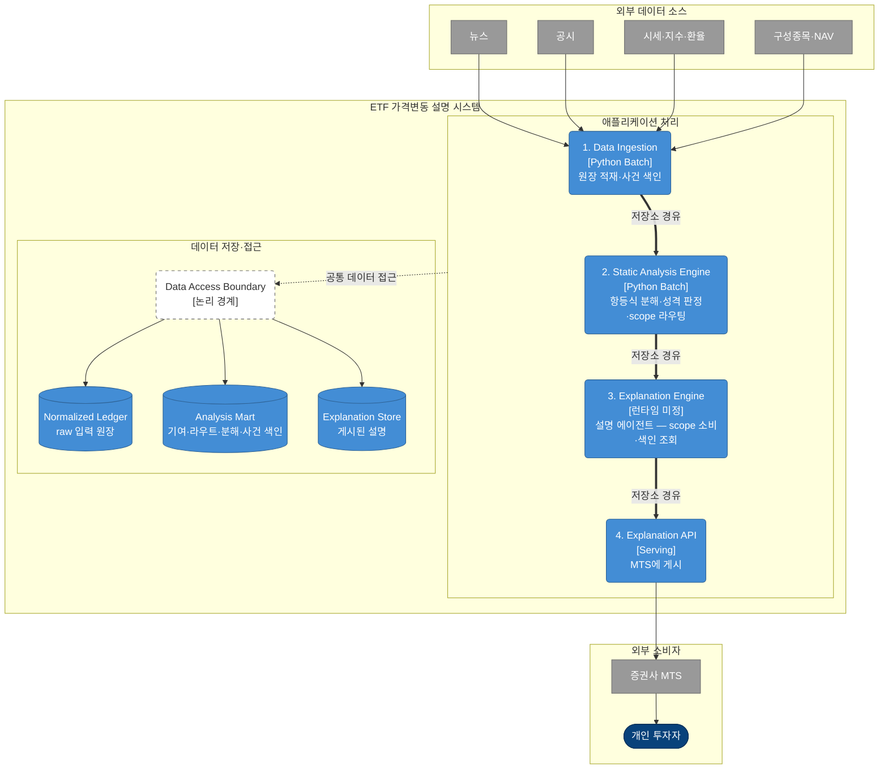
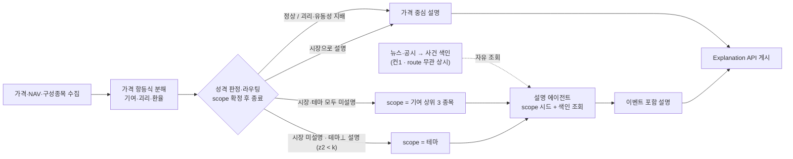
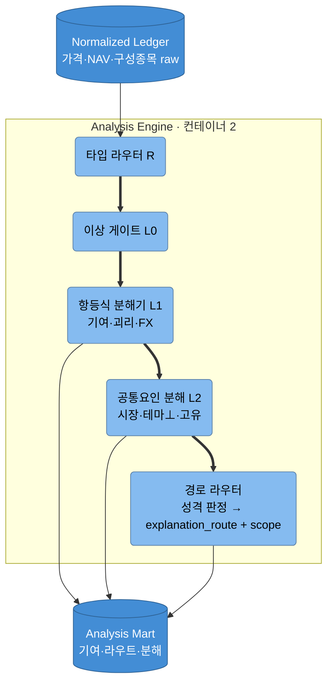
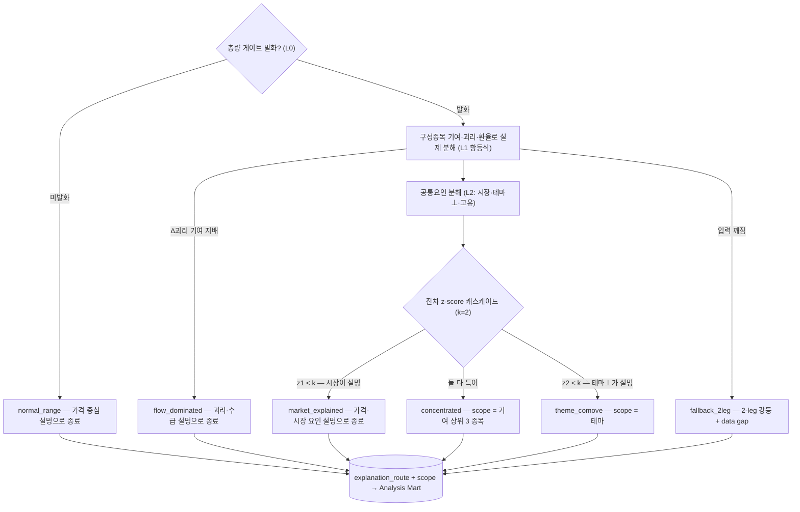
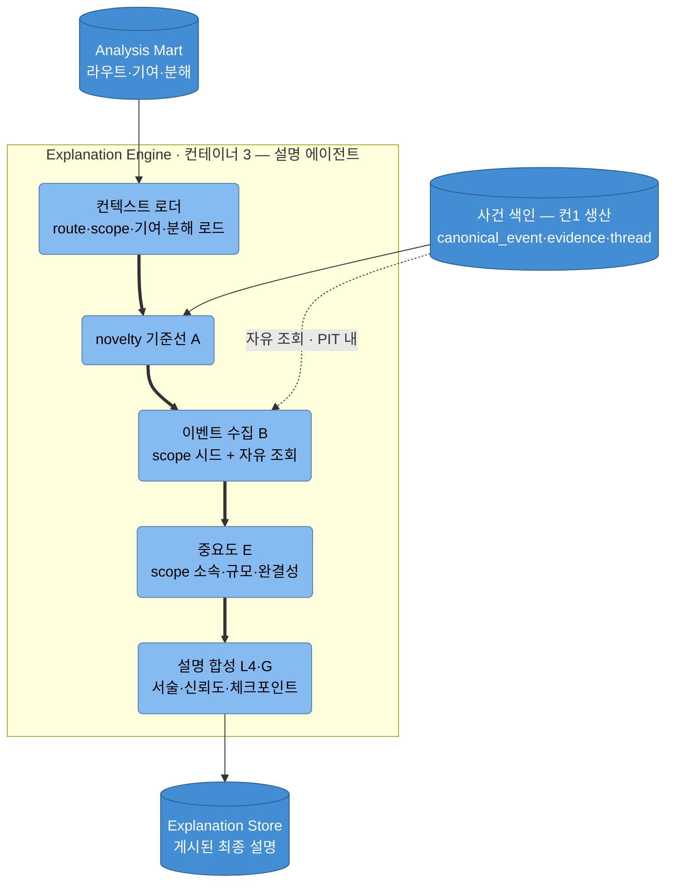
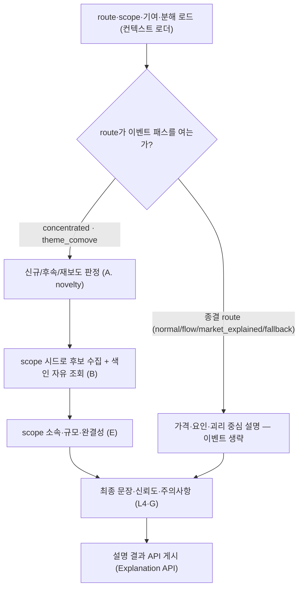

# 아키텍처 (베이스라인) — 시스템·분석·설명

> **이 문서가 소유**: 시스템 컨텍스트·컨테이너(C4 L1/L2) 정적 뷰 + 시스템 런타임·요구 동작 + **Analysis Engine(컨2)·Explanation Engine(컨3)의 컴포넌트(L3)·런타임·행동 계약·handoff 계약**.
> **링크로 위임**: 수집(컨1) 내부와 **사건 색인(O1–O6·교차소스 정합)** → [data-ingestion.md](data-ingestion.md). 산식·이벤트/스레드/공시/엔티티 타입·O6 threading 알고리즘 → [`../specs`](../specs). 강등(C·D) 상세 → [proposals](../proposals). **기호(R·L*·A–G·O*·P*) 해독 → [용어 맵](../README.md#용어-맵-기호-해독)**.
> ⚠️ **유실**: 구 `current-architecture.md`의 컨테이너 상세 lineage 표(기술·상태·미결정)는 커밋 전 삭제되어 복구 불가 — 필요 시 오너 재작성.
> ✅ **재설계 확정 (2026-07-20)**: ① **event-price 정합검증(P5–P7·F) 전면 제거** — 어떤 단계도 이벤트의 가격 방향·타이밍 적합성을 판정하지 않는다. ② **route 게이트** — 시장으로 설명되면 종결. 시장 미설명 변동만 이벤트 패스: 테마 동조 → scope=테마, 소수 종목 잔차 → scope=top3. ③ **사건 색인(Event Intelligence)은 컨1 이관** — route 무관 상시 생산. 설명 에이전트는 scope 시드를 받되 색인을 자유 조회(PIT 내). 본 문서 §1·§3–§13에 반영 완료.

## 1. 시스템 요약

가격 변동을 관측 가능한 **항등식(구성종목 기여·괴리·환율)**으로 먼저 분해하고, 움직임의 성격을 판정해 분석 scope를 확정한다. **시장으로 설명되지 않는 변동일 때만** 설명 에이전트가 그 scope에서 사건 색인을 조회해 설명을 만든다. 수집(컨1)이 원장과 **사건 색인**을, 분석(컨2)이 `explanation_route`·기여·분해를 **생산**하고, 설명(컨3)이 그것을 **소비**해 최종 설명 artifact를 만든다.

관통 원칙 넷:

- **price-first** — 출발점은 항상 L1(항등식 분해)의 ETF 가격 관측. 이벤트는 route가 필요하다고 판단한 scope에만 붙는다.
- **route-driven** — `explanation_route`(+scope)가 하류 개입 범위를 고정한다. 하류는 route·scope를 재계산하지 않는다.
- **방향 불검증** — 이벤트는 scope 연관 + PIT 창으로만 설명에 참여한다. 이벤트-가격 방향·타이밍 적합성을 검증하는 단계는 존재하지 않는다. 방어선은 §9 관측/가설 분리 + honest unknown.
- **PIT 재현** — `available_at`·`trade_date`·`asof`가 같은 재현 경계. 소급 병합 금지. 설명 에이전트의 자유 조회에도 동일 적용.

## 3. 정적 뷰 — 컨테이너 (C4 L2)

| 컨테이너 | 책임 | 내부 상세 |
|---|---|---|
| Data Ingestion | 외부 원천 → 재현 가능한 logical ledger + **사건 색인(O1–O6·교차소스 정합) 상시 생산** | [data-ingestion.md](data-ingestion.md) |
| Analysis Engine | 가격 항등식 분해 → 성격 판정 → scope 라우팅. **이벤트 데이터 불관여** | 본 문서 §5 |
| Explanation Engine | route·scope 소비 + 사건 색인 자유 조회(PIT 내) → 설명 합성 | 본 문서 §6 |
| Explanation API | 게시된 최종 설명 serving (판단 재수행 없음) | — (단일 책임) |
| Normalized Ledger / Analysis Mart / Explanation Store | 단계별 저장 경계. 사건 색인은 컨1이 생산해 Analysis Mart 이벤트 축에 적재 — 저장 경계 재검토는 §13 | [../reference/logical-erd.dbml](../reference/logical-erd.dbml) |

### 3.1 정적 뷰 — 통합 파이프라인 (전 컨테이너 가로 배치)

> 컨1–컨4를 한 줄로 편 **컨테이너 단위 파이프라인 개요**다. 각 컨테이너 박스에 내부 단계를 순서대로 적었고, 컴포넌트 상세·상태(current/제안)·요구 동작 표는 컨1 → [data-ingestion.md](data-ingestion.md), 컨2 → §5, 컨3 → §6이 소유한다 — 이 그림은 흐름만 보인다.

**사건 색인(컨1)은 route와 무관하게 Analysis Mart 이벤트 축을 상시 채우고, 컨2가 route·scope를 확정한 뒤에야 설명 에이전트(컨3)가 그 scope로 색인을 PIT 조회한다.**

```mermaid
%%{init: {
  "flowchart": { "defaultRenderer": "elk", "curve": "linear" },
  "theme": "base",
  "themeVariables": { "lineColor": "#1168bd", "textColor": "#333333", "fontSize": "14px" },
  "elk": {
    "edgeRouting": "ORTHOGONAL",
    "nodePlacementStrategy": "BRANDES_KOEPF",
    "mergeEdges": false,
    "ranksep": 70,
    "nodeSpacing": 50
  }
}}%%
flowchart LR
    classDef person fill:#08427b,stroke:#052e56,color:#fff
    classDef external fill:#999,stroke:#6b6b6b,color:#fff
    classDef container fill:#438dd5,stroke:#2e6295,color:#fff
    classDef database fill:#438dd5,stroke:#2e6295,color:#fff

    subgraph INPUTS["외부 데이터 소스"]
        NEWS["<b>뉴스</b><br/>[External System]"]:::external
        DART["<b>공시</b><br/>[External System]"]:::external
        MKT["<b>시세·NAV·구성종목</b><br/>[External System]"]:::external
    end

    subgraph SYS["ETF 가격변동 설명 시스템"]
        C1("<b>1. Data Ingestion · 컨1</b><br/>[Container]<br/>뉴스·공시·시세 lane 수집<br/>사건 색인 O1–O6 상시 생산"):::container
        LEDGER[("<b>Normalized Ledger</b><br/>[Database]<br/>raw 원장")]:::database
        C2("<b>2. Analysis Engine · 컨2</b><br/>[Container]<br/>R → L0 → L1 → L2 → 경로 라우터<br/>항등식·공통요인 분해 → route+scope"):::container
        MART[("<b>Analysis Mart</b><br/>[Database]<br/>route·기여·분해<br/>+ 사건 색인 축")]:::database
        C3("<b>3. Explanation Engine · 컨3</b><br/>[Container]<br/>컨텍스트 로더 → A → B → E → L4·G<br/>scope 색인 조회 → 설명 합성"):::container
        STORE[("<b>Explanation Store</b><br/>[Database]<br/>게시된 설명")]:::database
        API("<b>4. Explanation API</b><br/>[Container]<br/>MTS 게시 (판단 없음)"):::container
    end

    subgraph OUTPUTS["외부 소비자"]
        MTS["<b>증권사 MTS</b><br/>[External System]"]:::external
        INVESTOR(["<b>개인 투자자</b><br/>[Person]"]):::person
    end

    NEWS --> C1
    DART --> C1
    MKT --> C1
    C1 -->|"raw"| LEDGER
    C1 ==>|"사건 색인 · 상시 · route 무관"| MART
    LEDGER ==>|"배치 handoff"| C2
    C2 ==>|"route+scope · 기여 · 분해"| MART
    MART ==>|"route·scope 로드"| C3
    MART -.->|"자유 조회 · PIT 내"| C3
    C3 ==>|"게시"| STORE
    STORE ==> API
    API ==>|"게시"| MTS
    MTS --> INVESTOR

    style INPUTS fill:none,stroke:#bbb,stroke-dasharray:3 3
    style OUTPUTS fill:none,stroke:#bbb,stroke-dasharray:3 3
    style SYS fill:none,stroke:#444,stroke-dasharray:6 6
```

## 4. 동작 뷰 — 시스템 런타임·요구 동작

**하루의 동작.** 수집(컨1)은 route와 무관하게 하루 종일 돈다 — 뉴스·공시가 도착하는 대로 원장에 적재되고, 사건 색인(O1–O6)이 이를 `canonical_event`·`event_evidence`·`event_thread`로 승격해 이벤트 축에 쌓는다. 조용한 날의 문서도 똑같이 색인된다. 장 마감 후 시세·NAV·구성종목이 갖춰지면 분석(컨2)이 ETF마다 항등식 분해를 실행한다: 가격 변동이 구성종목 기여·괴리·환율 **관측**으로 나뉘고, 필요하면 공통요인 분해가 시장·테마⊥·고유 leg를 **추정**한다. 경로 라우터는 이 관측·추정만 보고 오늘의 route와 scope를 `explanation_route`에 기록한 뒤 끝난다 — 라우터는 이벤트를 본 적이 없다.

**갈림 이후.** 대부분의 날은 여기서 종결된다: 게이트가 조용하면 `normal_range`, 괴리가 지배하면 `flow_dominated`, 시장이 설명하면 `market_explained` — 설명(컨3)은 가격·요인 문장만 만들고 이벤트는 조회하지 않는다. 시장으로 설명되지 않는 날에만 설명 에이전트가 깨어난다: 라우터가 남긴 scope(top3 구성종목 또는 테마)를 시드로 사건 색인에서 후보를 모으고, 과거 thread로 신규/후속·재보도를 가른 뒤, 시점상 부합하는 사건을 관측과 분리된 **가설**로 서술한다. 후보가 없으면 `유의하나 미설명`으로 끝난다. 완성된 설명은 `asof`와 함께 게시되고, 같은 `asof`로 재실행하면 같은 설명이 나온다.

아래 §5–§6이 컨2·컨3 내부를 상세화한다.

## 5. Analysis Engine (컨테이너 2)

### 5.1 정적 — 컴포넌트 (C4 L3)

두 서브엔진 — **ETF Identity**(제안): 유형 판정·이상 게이트·항등식 분해·성격 판정·scope 라우팅 / **Price Attribution**(current): L2 공통요인 분해(시장·테마⊥·고유) — 라우팅 판정의 입력. 구 Event Intelligence(O1–O6·교차소스 정합)는 **컨1로 이관**(2026-07-20 재설계) → [data-ingestion.md](data-ingestion.md). 정밀 계약은 [ETF 항등식 분해](../specs/etf-identity-decomposition.md)·[가격 분해 엔진](../specs/price-decomposition-engine.md) 소유.

컴포넌트 계약 (블랙박스 수준 — 트리거·산식·임계·검증 절차는 소유 spec, 시스템 검증은 §12):

| 컴포넌트 | 역할 | 요구 동작 | 금지 | 입력 → 출력 |
|---|---|---|---|---|
| R 타입 라우터 (제안) | ETF 유형(국내 테마·섹터/해외지수/레버리지·인버스/채권)으로 분해 템플릿 선택 | **AE-R1** 유형 판정 후 템플릿 고정. 미확정·신규 상장은 `UNKNOWN` + review | 유형을 추정으로 채움 | `etf_reference` → `explanation_route.template` |
| L0 이상 게이트 (제안) | 오늘 설명이 필요한 움직임인지 진입 판정 | **AE-R2** 미발화면 `normal_range` 기록 후 이후 단계 중단 | — | 시세 원장 → L0 라벨 |
| L1 항등식 분해기 (current) | 가격 변동을 기여·괴리·환율 **관측**으로 분해 | **AE-R3** 항등식 분해 산출 · **AE-R4** holdings/NAV 결손 시 `fallback_2leg` + data gap | 결손 0 대체 · 회귀/추정으로 관측 대체 | 시세·NAV·구성종목 → `etf_contribution_observation`(+`_member`) |
| L2 공통요인 분해 (current) | 구성종목 변동을 시장·테마⊥·고유 leg로 **추정** | **AE-R5** leg 분해 산출, 관측(L1)과 분리 표기 | route 확정(라우터 소관) | L1 산출 + 벤치마크 → `constituent_decomposition_observation` |
| 경로 라우터 (제안) | 잔차 z-score 캐스케이드 → route·scope 확정. **여기서 컨2 종료** | **AE-R6** 괴리 지배 → `flow_dominated` · **AE-R7** `z1 < k` → `market_explained` 종결, 이벤트 패스 없음 · **AE-R8** `z2 < k` → `theme_comove`(테마), 그 외 → `concentrated`(기여 상위 3 종목). 산식·k=2 → [항등식 spec](../specs/etf-identity-decomposition.md) | 이벤트 조회 · **방향 적합성 판정** · 하류의 route/scope 재계산 | L1·L2 관측 → `explanation_route`(+`scope_targets[]`·`z1`·`z2`) |

### 5.2 동작 — 런타임 흐름

**동작 서술.** 매일 장 마감 후 `(market, etf, trade_date)`마다 한 번 돈다. R(타입 라우터)이 `etf_reference`에서 유형을 읽어 분해 템플릿을 고르고, L0(이상 게이트)이 오늘 움직임이 설명 대상인지 판정한다 — 조용하면 `normal_range` 기록만 남기고 그날 컨2는 끝난다. 발화하면 L1(항등식 분해)이 시세·NAV·구성종목으로 항등식을 실제 계산해 기여·괴리·환율 관측을 만든다. holdings/NAV가 비어 있으면 이 시점에 `fallback_2leg`로 강등되고 gap이 기록된다. Δ괴리 기여가 지배적이면 수급 설명으로 종결되고(`flow_dominated`), 아니면 L2(공통요인 분해)가 구성종목 변동을 시장·테마⊥·고유 leg로 쪼갠다. 경로 라우터는 이 위에서 **잔차 z-score 캐스케이드**를 돈다: 시장 제거 후 잔차가 평상 범위(`z1 < k`)면 `market_explained` 종결, 테마⊥까지 제거해 평상 범위(`z2 < k`)면 `theme_comove`(scope=테마), 그래도 특이하면 `concentrated`(scope=기여 상위 3 종목)를 `explanation_route`에 기록한다. 여기까지 컨2가 만진 데이터는 전부 가격 축이다 — 이벤트는 존재조차 모른 채 하루가 끝난다.

## 6. Explanation Engine (컨테이너 3)

### 6.1 정적 — 컴포넌트 (C4 L3)

컨텍스트 로더 → A(novelty) → B(수집) → E(중요도) → G·L4(합성). 구 F(이벤트-가격 정합성 검사)는 **재설계로 제거**(방향 불검증 원칙). 기대 대비 차이(C)·영향 경로(D)는 소스 부재로 강등(§11). 최종 artifact는 컨테이너 4 Explanation API가 serving만 한다.

컴포넌트 계약 (블랙박스 수준 — 세부 판정·artifact 형식은 소유 spec, 시스템 검증은 §12):

| 컴포넌트 | 역할 | 요구 동작 | 금지 | 입력 → 출력 |
|---|---|---|---|---|
| 컨텍스트 로더 (current) | `(…, asof)` 설명 요청의 분기점(route·scope) 고정 | **EE-R1** route·scope·기여·분해 로드 | route·scope 재계산·재해석 | mart → 실행 컨텍스트 |
| A novelty 기준선 (current) | 후보가 신규/후속/재보도인지 판정 | **EE-R2** prior thread 기준 판정, thread 부재 시 미확정으로 유지 | consensus·기대치 추정 | `event_thread`·`canonical_event` → novelty 라벨 |
| B 이벤트 수집 (current) | scope 시드 수집 + 색인 자유 조회 | **EE-R3** scope 연관 event를 `available_at ≤ asof` 창에서 수집 · **EE-R4** 맥락은 색인 자유 조회로 보강 | 원문 재파싱 · PIT 밖 조회 · **방향 적합성으로 채택/탈락** | scope + 사건 색인 → 후보 event 집합 |
| E 중요도 (current) | 후보 서열화 | **EE-R5** scope 소속 확인 + 규모·완결성 서열화 | scope 밖 사건을 설명 대상으로 승격 | 후보 + holdings·disclosure fact → surviving 후보 |
| G·L4 합성 (current) | 최종 문장·신뢰도·체크포인트 | **EE-R6** 관측/추정/가설 분리 서술 · **EE-R7** 무브보다 늦은 공개는 원인 서술 금지(사후 보도 표기) · **EE-R8** 후보 없으면 `유의하나 미설명`으로 종료 | 서사 보강 · 확정 원인 단정 | surviving + `event_evidence` → 설명 artifact |

### 6.2 동작 — 런타임 흐름

**동작 서술.** 설명 요청 `(market, etf, trade_date, asof)`이 오면 컨텍스트 로더가 그날의 `explanation_route`·scope·기여·분해를 읽어 분기점을 고정한다 — 첫 분기는 route의 재확인일 뿐 재계산이 아니다. 종결 route면 에이전트는 가격·요인·괴리 숫자만으로 문장을 만들고 끝난다. 이벤트 패스가 열린 날은: A(novelty)가 scope 연관 thread 이력으로 오늘 후보들이 신규인지 후속·재보도인지 기준선을 잡고, B(수집)가 scope 시드로 `available_at ≤ asof` 창에서 `canonical_event`를 모은다 — 맥락이 더 필요하면 색인을 자유 조회하되 원문으로는 내려가지 않는다. E(중요도)가 scope 소속과 규모·완결성으로 서열화하고, G·L4(합성)가 살아남은 후보를 관측(숫자)·추정(leg)·가설(사건)로 분리해 문장·신뢰도·checkpoint로 합성한다. 움직임보다 늦게 공개된 사건은 사후 보도로만 표기되고, 살아남은 후보가 없으면 `유의하나 미설명`이 그대로 출력된다.

## 7. explanation_route — 실행 스위치

route는 라벨이 아니라 "여기서 끝내도 되는가, 열리면 어느 scope를 보는가"를 고정하는 스위치다. 라우터는 scope 확정까지만 책임진다.

| route | 뜻 | scope | 하류 호출 |
|---|---|---|---|
| `normal_range` | 총량 게이트 조용(`l0_entry` 미발화) | — | 없음 — price-only 종료 |
| `flow_dominated` | Δ괴리 기여 지배(수급·유동성 우선) | — | 없음 — 괴리·수급 설명 종료 |
| `market_explained` | 시장 공통요인이 변동을 설명 | — | 없음 — 가격·시장 요인 설명 종료 |
| `theme_comove` | 시장 미설명 + 테마⊥가 설명(`z2 < k`) | 테마 | 설명 에이전트 이벤트 패스 |
| `concentrated` | 시장·테마⊥ 모두 미설명 — 잔차 특이 | 기여 상위 3 종목 | 설명 에이전트 이벤트 패스 |
| `fallback_2leg` | holdings/NAV 결손 | — | 2-leg 강등 + data gap 고지 |

`market_explained`·`theme_comove`는 구 `common_factor`의 분화(제안 이름 — §13). `scope_targets[]`는 구 `l3_targets`를 대체한다.

## 8. 모듈 책임

| 컨테이너 | 모듈 | 책임 | 상태 |
|---|---|---|---|
| 1 | 사건 색인 (Event Intelligence) | 뉴스 envelope·공시 lake → `canonical_event`·`event_evidence`·`event_thread` 상시 생산, 교차소스 정합 | current — 컨2에서 이관(2026-07-20) |
| 2 | ETF Identity | ETF 유형 판정·이상 게이트·항등식 분해·성격 판정·scope 라우팅. **여기서 역할 종료** | 제안 |
| 2 | Price Attribution | L2 공통요인 분해(시장·테마⊥·고유) — 라우팅 판정 입력 | current (event-price 검증 제거) |
| 2 | Analysis Mart handoff | route·기여·분해를 저장가능 artifact로 고정, 컨3 소비 경계 제공 | current+제안 |
| 3 | 컨텍스트 로더 | route·scope·기여·분해 로드, 오늘 분기점 고정 (재계산 금지) | current |
| 3 | novelty 기준선 A | prior thread·event로 신규/후속/재보도 판정 (consensus 추정 금지) | current |
| 3 | 이벤트 수집 B | scope 시드 수집 + 색인 자유 조회(PIT 내, 원문 재파싱 금지) | current — 의미 변경 |
| 3 | 중요도 E | event 엔티티의 scope 소속 확인 + 규모·완결성 | current |
| 3 | 합성 G·L4 | surviving·caveat·confidence를 checkpoint·문장으로, 선후·미설명 정직 표기 | current |

## 9. 설계 원칙·결합 규칙

- **관측 / 추정 / 가설 분리** — L1 기여·괴리는 관측, L2 leg 분해는 추정, 이벤트 해석은 가설. 한 문장에 섞어 "관측된 움직임 = 확정 원인"으로 쓰지 않는다(L4 규율).
- **방향 불검증** — 이벤트-가격 방향·타이밍 적합성을 판정하는 단계는 시스템 어디에도 없다. scope 안의 반대 방향 함의 사건도 수집될 수 있으며, 방어선은 관측/가설 분리와 honest unknown(EE-R6·R8)이다.
- **precedence (서술 규율)** — 같은 thread의 최초 `available_at`이 선후 기준. 늦은 확인 공시가 먼저 나온 뉴스를 사후 보도로 오판하지 않는다. 움직임보다 늦게 공개된 사건은 원인 후보로 서술하지 않는다(EE-R7). 검증 파이프라인이 아니라 L4 서술 규율이다.
- **교차소스 정합** — 같은 사건이 뉴스·공시에 나오면 source-neutral 같은 thread로 귀속(이중 계산 방지). 시점·최초성=최초 소스, 규모·상대방·계약기간=공시 권위. 컨1 사건 색인 소관 — 판정 알고리즘 상세는 [스레드 타입](../specs/data/thread-types.md) 소유.
- **honest unknown** — scope에서 설명 후보를 찾지 못하면 억지로 고르지 않고 `유의하나 미설명`·`정상 변동 범위`로 종료. 서사 보강 금지.
- **결합 authority** — 설명 에이전트 입력은 원문이 아니라 `canonical_event`+`event_evidence`+`event_thread`. 조인 축은 `event_id`+scope 엔티티+`available_at` 창. `dedup_cluster_id`는 seed일 뿐 조인·판정 키 아님.
- **자유 조회 경계** — 에이전트의 조회 자유는 사건 색인·mart 산출물에 한정되고 `available_at ≤ asof`를 넘지 않는다. scope는 **설명 대상**을 고정하고, 조회는 맥락 확보 수단이다.
- **데이터 이름 = 요구사항** — 설계 문서의 데이터 이름은 논리 계약이다([문서 작성 규칙](../README.md)). 물리 배치는 계약/스펙이 소유한다.

## 10. Handoff 데이터 계약

수집 → 분석 → 설명 → API 최소 계약(빠른 조회용; grain·산식 세부는 소유 spec).

| 데이터 | grain | 생산 → 소비 | 상태 |
|---|---|---|---|
| `explanation_route` (+`scope_targets[]`) | (market, etf, trade_date) | ETF Identity → Explanation | 제안 |
| `etf_contribution_observation` | (market, etf, trade_date) | ETF Identity(L1) → 라우팅 / Explanation / L4 | 제안 |
| `etf_contribution_member` | (…, constituent) | ETF Identity(L1) → 라우팅(집중 판정) / Explanation | 제안 |
| `constituent_decomposition_observation` | (market, constituent, trade_date) | Price Attribution(L2) → 라우팅(시장 설명 판정) / Explanation | 제안 |
| `canonical_event` | event 1건 | 사건 색인(컨1) → Explanation(A·B·E) | current |
| `event_evidence` | evidence 1건 | 사건 색인(컨1) → Explanation(A·B·G) | current |
| `event_thread` / `_link` / `thread_discovery_snapshot` | thread / event 1건 | 사건 색인(컨1) → Explanation(A) | current, 일부 persistence `[INFERENCE]` |
| disclosure fact (`dart_supply_contract_fact` 등) | fact 1건 | 공시 파이프라인 → Explanation(E) | current |
| 최종 설명 artifact | (market, etf, trade_date, asof) | Explanation → Explanation API | 제안 |

**폐기 (2026-07-20 재설계 — 생산 단계 소멸)**: `event_price_window` / `event_price_observation` / `event_confounder_link` / `hq_market_bridge` / `response_prior` — P5–P7 제거로 생산자 부재. 기존 산출물은 lineage 보존용으로만 남기고 신규 생산·소비 금지.

## 11. 강등·fallback

- **C. 기대 대비 차이** — analyst consensus·priced-in baseline 부재로 강등 → [제안 0003](../proposals/0003-market-expectation.md).
- **D. 영향 경로** — 다중홉 관계 그래프 미운영, 직접 membership 단일 홉으로 단순화 → [제안 0002](../proposals/0002-relationship-graph.md). ETF→설명단위→event **2홉 캡** 강제.
- **fallback_2leg** — 구성종목/NAV 결손 시 price-only + 강등 사실·data gap 고지. 실패를 0 대체로 숨기지 않는다.

## 12. 검증 (baseline 계약)

- **PIT 재현** — 동일 `(market, etf_ticker, trade_date, asof)`에서 동일 route·동일 설명 artifact. 자유 조회를 포함해도 성립해야 한다(§9 자유 조회 경계).
- **route 게이트** — 종결 route(`normal_range`·`flow_dominated`·`market_explained`·`fallback_2leg`) 날의 설명 에이전트 이벤트 소비 0건, artifact 이벤트 서사 0건(AE-R7·EE-R1 계열).
- **scope 인용 경계** — 최종 artifact가 인용한 사건의 scope 연관 100%(EE-R5). 자유 조회는 맥락 확보 수단이지 인용 승격 경로가 아니다.
- **방향 불검증** — 컨2 산출물과 설명 에이전트 입력 계약에 이벤트-가격 방향·타이밍 정합 필드가 존재하지 않는다(§9 방향 불검증). 폐기 계약(§10) 신규 생산 0건.
- **handoff 최소성** — 설명 에이전트가 원문 재파싱 없이 `explanation_route`(+scope)와 사건 색인만으로 시작 가능(EE-R3·EE-R4).
- **precedence / honest-unknown** — 무브보다 늦게 공개된 사건의 원인 서술 0건(EE-R7), surviving 없으면 `유의하나 미설명` 실제 출력(EE-R8).
- **기준 라벨 벤치** — 라우터 판정은 [route 정답 라벨](../specs/route-ground-truth.md)("그날 가장 중요한 이슈가 시장/테마/개별 어디였나")과의 혼동행렬로 실측한다. 임계·route 설계 변경의 판정 기준 (2026-07-20 결정).

## 13. Open questions

**해소 (2026-07-20)**: 구 Q9 재설계 3문항 — ① event-price 정합검증은 P5–P7·F 포함 전면 제거. ② route 게이트는 시장 설명 시 종결, scope 대상은 {top3 구성종목, 테마}. ③ 사건 색인은 컨1 이관·상시 생산, 설명 에이전트는 자유 조회. 구 Q3(공시 P5 fan-out)·Q5(`response_prior` 소비)는 해당 기계 폐기로 무효.

남은 질문:

1. 컨2 내부 실행 스케줄링 — 컨1 색인과 컨2 가격 축이 분리 실행되므로, 컨2 단일 DAG의 트리거·cut-off만 확정하면 되는가.
2. 시장 설명 판정(AE-R7)에 L2 전체 분해가 필요한가, market leg만의 경량 계산으로 충분한가 — 판별력·임계는 [route 정답 라벨](../specs/route-ground-truth.md) 벤치로 실측해 결정.
3. `event_thread*` 물리 저장소 확정(JSONL producer 이후 warehouse persistence 마감 위치).
4. 교차소스 2차 부분일치 임계·review 회부 기준, 교차소스 확인을 `novelty_status` 확장 vs 별도 `link_kind` — 컨1 색인 소관으로 이관.
5. §9 threading 잔여 파라미터 — `CORRECTION` 권위 숫자 임계, `TYPE_UNCERTAIN` 기준, anchor role 마킹.
6. Explanation Store artifact 형식(문단+checkpoint vs 구조화 카드), 복수 통과 후보의 L4 우선순위, intraday refresh `asof` cadence.
7. 사건 색인 저장 경계 — Analysis Mart 이벤트 축 유지 vs 컨1 산출물로서 Ledger 쪽 승격.
8. 자유 조회의 인용 경계 — scope 밖 조회 결과를 최종 artifact에 맥락으로 인용 가능한가, 근거로는 금지인가(현재 계약: 대상 확정은 scope 내, EE-R5).
9. route enum 이름 확정 — `market_explained`·`theme_comove`(제안)와 `scope_targets[]` 명명.

## 14. 통합된 원본 / 참고

- 이 문서로 통합·간소화된 원본: `design/analysis-engine.md`(컨2), `design/explanation-engine.md`(컨3). **§7 O6 threading 결정 알고리즘**(thread_key 직렬화·해시·흡수/분리·novelty 캐스케이드)은 미포함 → [스레드 타입](../specs/data/thread-types.md) 이관 후 원본 제거할 것(이관 전 삭제 시 유실).
- 사건 색인(구 Event Intelligence) 상세는 컨1 이관에 따라 [data-ingestion.md](data-ingestion.md)와 [뉴스 ontology](../specs/data/news-ontology-types.md)·[스레드](../specs/data/thread-types.md)가 소유.
- 수집(컨1): [data-ingestion.md](data-ingestion.md)
- 정밀 계약: [ETF 항등식 분해](../specs/etf-identity-decomposition.md) · [가격 분해 엔진](../specs/price-decomposition-engine.md) · [뉴스 ontology](../specs/data/news-ontology-types.md) · [스레드](../specs/data/thread-types.md) · [공시](../specs/data/disclosure-types.md) · [엔티티 마스터](../specs/data/entity-master.md)
- 참조 데이터: [logical-erd.dbml](../reference/logical-erd.dbml)
- 강등 제안: [0002 관계 그래프](../proposals/0002-relationship-graph.md) · [0003 시장 기대](../proposals/0003-market-expectation.md)
