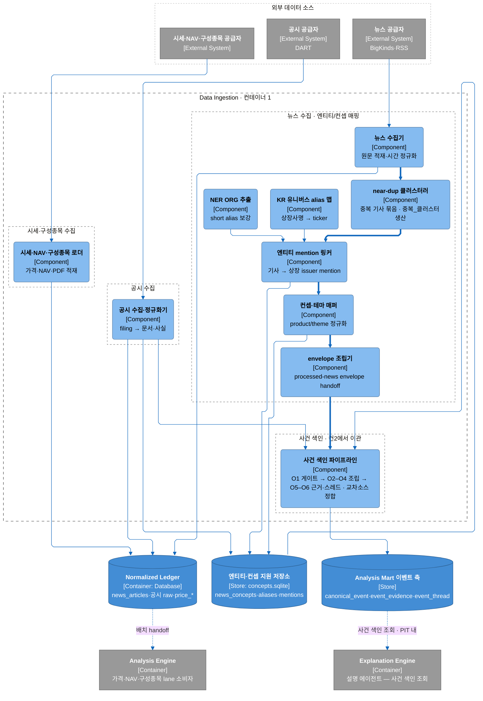
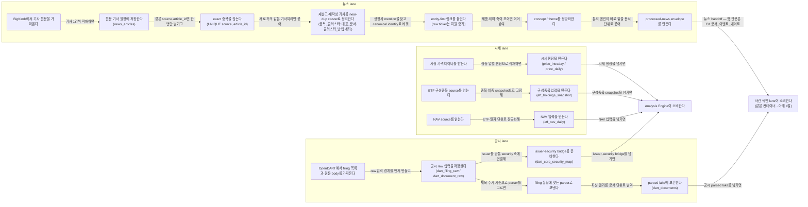

# Data Ingestion 컨테이너

## Summary

Data Ingestion 컨테이너의 책임은 외부 원천을 **분석 전 단계의 재현 가능한 logical ledger**로 바꾸는 것이다. 이 컨테이너는 원천별 수집기를 직접 소유하지만, 더 중요한 경계는 “어디까지를 ingress 준비로 보고 어디서부터 분석·해석으로 넘기는가”다.

이 문서가 고정하는 컨테이너 출력은 네 갈래다.

- **뉴스 lane**: `news_articles` 원장 → exact ingest 멱등성 → near-duplicate 제어(논리 ERD `중복_클러스터`) → 엔티티/컨셉 매핑 → `processed-news envelope`
- **공시 lane**: OpenDART 원천 입력 → filing ingest / parser dispatch → `dart_documents` 파싱 문서 레이크 + `dart_corp_security_map`
- **시세 lane**: `price_intraday` / `price_daily` 원장과, ETF 항등식 분해에 필요한 `etf_holdings_snapshot` / `etf_nav_daily` raw input requirement
- **사건 색인 lane** (2026-07-20 컨2에서 이관): `processed-news envelope`·`dart_documents` → O1(문서 게이트) → O2–O4(canonical event 조립) → O5–O6(근거·스레드) → 교차소스 정합. **route와 무관하게 상시 생산**

핵심 결정은 네 가지다.

1. exact ingest 중복은 source natural key에서 끊는다. 뉴스는 `UNIQUE(source, article_id)`가 기준이다.
2. 뉴스 identity는 raw ticker-first가 아니라 **entity-first**다. raw `ticker` backfill은 지원 증거일 뿐, downstream canonical join key가 아니다.
3. near-duplicate cluster와 event thread는 다르다. 전자는 복제 제어, 후자는 사건 계보다.
4. 모든 lane은 point-in-time 재현을 위해 `available_at`과 `ingested_at` 또는 그에 준하는 availability 경계를 남긴다.

## Context

- 시스템 전체 목적과 컨테이너 간 관계는 [아키텍처 베이스라인](analysis-engine-design.md)이 소유한다.
- 뉴스·공시 upstream의 수집, exact/near-dup 제어, parser dispatch, handoff assembly는 이 문서가 직접 소유한다. 타입 세부는 [공시 타입 카탈로그](../specs/data/disclosure-types.md)와 [엔티티 마스터](../specs/data/entity-master.md)가 소유한다.
- 엔티티 taxonomy, canonical entity bridge, short alias 신뢰 규칙은 [엔티티 마스터](../specs/data/entity-master.md)가 소유한다.
- 공시 타입 자체의 세부 분류는 [공시 타입 카탈로그](../specs/data/disclosure-types.md)가 소유한다.
- ETF 분해 관점에서 이 컨테이너가 왜 `price_intraday`/`price_daily`, `etf_holdings_snapshot`, `etf_nav_daily`를 준비해야 하는지는 [ETF 항등식 분해](../specs/etf-identity-decomposition.md)와 [시스템 아키텍처](analysis-engine-design.md)의 Data Ingestion / L1(항등식 분해) 문맥을 따른다.
- 서비스 전체의 논리 데이터 모델(문서·주장·이벤트·스레드·가격)은 [한글 논리 ERD v1.2](../reference/logical-erd.dbml)가 소유한다. 이 문서는 그중 **ingestion이 생산하는 엔터티**(문서·뉴스_문서·공시_문서·중복_클러스터·문서_엔터티·일별_가격·ETF_구성종목·ETF_기준가_일별)만 다루며, 매핑은 아래 「논리 ERD 정렬」이 고정한다.

## Problem

현재 Data Ingestion 관련 설명은 뉴스 spec, 공시 spec, 아키텍처 문서, 코드 lineage에 흩어져 있다. 그 결과 다음 문제가 생긴다.

1. 컨테이너 1이 어디서 끝나는지 불분명하다. raw loader만 Data Ingestion인지, parser dispatch와 handoff assembly까지 포함하는지 문서마다 읽는 위치가 다르다.
2. 뉴스에서 dedup, entity linking, concept mapping이 왜 ingest 경계 안에 있는지 한 문서로 보이지 않는다.
3. 공시에서 raw filing snapshot과 issuer-security bridge가 왜 동시에 필요하며, `dart_documents`가 왜 최종 facts가 아니라 parsed lake인지 분리 설명이 부족하다.
4. 시세·NAV·구성종목 lane은 아키텍처 표에만 있고, Data Ingestion의 공통 설계 원칙(PIT, 멱등성, 결측 처리)으로 묶여 있지 않다.

## Goals

- Data Ingestion 컨테이너의 경계를 뉴스/공시/시세 3개 lane으로 self-contained하게 설명한다.
- 각 lane의 입력, 중간 산출물, handoff 출력을 **grain + 생산→소비 + 결정 논리** 수준으로 고정한다.
- exact ingest 멱등성, near-duplicate 제어, entity-first 링크, issuer-security bridge, PIT availability 같은 공통 설계 결정을 한곳에 모은다.
- downstream이 이 컨테이너 출력을 어떻게 소비하는지 설명하되, 타입 카탈로그·C4 다이어그램·필드 glossary를 복사하지 않는다.

## Non-goals

- C4 다이어그램, 상위 레이어 흐름, 컨테이너 간 전체 시스템 소유권 재서술.
- 가격 분해·라우팅·설명 로직 설명. 사건 색인의 타입·산식 세부(`canonical_event`·`event_thread` 필드 계약)는 형제 spec 소유 — 이 문서는 lane 경계·요구 동작만 고정한다.
- 타입 카탈로그 재작성. 뉴스 이벤트 타입, 공시 타입, 엔티티 taxonomy의 정의는 형제 spec이 소유한다.
- 물리 스키마, 컬럼 타입, 인덱스, 전체 필드 표, SQL DDL.

## Current state

| lane | current | 제안 / 미정 |
|---|---|---|
| 뉴스 | BigKinds 계열 수집, `news_articles` 원장, exact duplicate guard, NER+deterministic linker, concept/theme 정규화, `processed-news envelope` handoff가 문서·코드 계보로 확인된다 | canonical normalized ledger 이름과 일부 bridge는 logical contract로 고정돼 있고 물리화는 문서 바깥에서 계속 진화 가능하다 |
| 공시 | OpenDART filing/raw body ingest, parser dispatch, `dart_documents` parsed lake, issuer-security bridge requirement가 문서·코드 계보로 확인된다 | downstream fact/assertion 확장은 형제 spec 소유이며, 이 컨테이너는 D0–D2a 경계만 확정한다 |
| 시세 | `price_intraday` / `price_daily` raw input requirement는 current다 | `etf_holdings_snapshot` / `etf_nav_daily`는 제안 상태이며 소스와 cadence는 추가 확정이 필요하다 |

## Proposed design

### 컨테이너 경계

Data Ingestion은 **원천 적재 + 재현성 보장 + ingress 정규화 + handoff assembly**를 담당한다. 분석 의미론을 붙이는 일은 여기서 하지 않는다.

- 뉴스에서는 기사 1건을 안정된 문서 단위로 정리한 뒤, 복제 제어와 entity/concept link를 붙여 ontology가 바로 읽을 수 있는 envelope로 넘긴다.
- 공시에서는 filing과 원문 body를 안정적으로 보존하고, parser가 읽을 수 있는 lake row까지 만든다. issuer를 공통 security axis에 붙이는 bridge도 이 경계 안에서 준비한다.
- 시세에서는 가격 원장을 current contract로 유지하고, ETF 항등식 분해에 필요한 holdings/NAV 입력을 같은 PIT 원칙 아래 준비한다.

### 컴포넌트 뷰 (C4 L3)

Data Ingestion 컨테이너의 정적 컴포넌트 구조다. 동적 처리 순서는 아래 「3-lane 처리 뷰」와 「중요한 처리 흐름과 중간 산출물」이 소유한다.

컴포넌트 코드 경로: 뉴스 수집 `news/acquisition/*`, near-dup `analytics/common/nlp/dedup.py`, 유니버스 alias 맵 `news/universe/kr.py`, NER `news/remote/ner.py`, mention 링커 `news/linking/*`, 컨셉·테마 `graph/normalize.py` + `news/classification/sector_map.py`. 엔티티·컨셉 노드 레지스트리는 [엔티티 마스터](../specs/data/entity-master.md)가 universe·concept 카탈로그에서 직접 만든다 — 구 `graph_nodes` 노드 적재(`graph/storage/graph_store.py`)와 관계 엣지는 [관계 그래프 draft](../proposals/0002-relationship-graph.md)로 강등했다. `SUPPORT`는 물리적으로 `data/news/bigkinds/concepts.sqlite`. envelope 조립기는 「주요 모듈의 책임」의 뉴스 semantic prep에 대응하며, 물리화 범위는 Open questions 4를 따른다.

### 3-lane 처리 뷰

## 중요한 처리 흐름과 중간 산출물

처음 보는 사람은 아래 세 lane을 “원문을 그대로 남기는 입력 원장 → 중복과 링크를 제어하는 중간 산출물 → Analysis Engine이 바로 읽을 handoff” 순서로 따라가면 된다. 여기서 이름이 붙은 테이블·필드는 단순 라벨이 아니라, 어느 시점에 무엇을 확정했고 왜 그 결정을 뒤로 미루지 않았는지를 드러내는 계약이다.

### 1. 뉴스 lane

1. **수집과 첫 입력 원장 고정**
   - BigKinds 수집기가 기사 1건을 가져오면 가장 먼저 `news_articles`에 넣는다. `news_articles`는 **원문 기사 1건을 가능한 한 그대로 보관하는 첫 입력 원장**이라, 이후 dedup·엔티티 링크·테마 매핑 규칙이 바뀌어도 항상 같은 출발점에서 재처리할 수 있게 해 준다.
   - 이때 `published_at`은 기사 자체에 적힌 발행 시각, `available_at`은 우리 시스템 기준으로 그 기사를 실제로 관측 가능해진 시각, `ingested_at`은 저장을 끝낸 시각이다. 세 값이 분리돼 있어야 downstream이 “그날 이미 알 수 있었던 정보만 썼는가”를 point-in-time 기준으로 다시 검증할 수 있다.

2. **exact ingest 멱등성으로 같은 원문을 한 번만 살린다**
   - `UNIQUE(source, article_id)`는 **같은 공급자(`source`)가 준 같은 기사 번호(`article_id`)는 하나의 원문만 인정한다**는 exact duplicate guard다. 목적은 운영 편의가 아니라, 같은 배치를 다시 읽어도 logical 기사 수가 늘지 않는 안정된 입력 원장을 만드는 데 있다.
   - file manifest 기반 resume도 같은 이유로 필요하다. 실패 후 재실행할 때 새 row를 더 만드는 대신, 이미 적재된 원문을 같은 natural key로 다시 확인하고 이어서 진행해야 멱등성이 유지된다.

3. **near-duplicate cluster로 재송고·재작성 묶음을 먼저 정리한다**
   - `near-duplicate cluster`는 **문장 표현은 조금 달라도 사실상 같은 사건을 다룬 복수 기사 묶음**이다. exact duplicate가 byte 수준의 동일 기사만 막는다면, 이 단계는 재송고·요약 재작성·동일 공급자의 재배포처럼 downstream에 같은 story를 여러 번 세게 만들 입력을 줄이는 역할을 한다.
   - 이 묶음은 사건의 시간적 진화를 나타내는 thread가 아니라 **복제 제어 단위**다. 그래서 정정 기사나 후속 기사처럼 같은 사건 계열에 속하는 문서라도, 실제 텍스트와 보도 맥락이 다르면 같은 cluster로 강제하지 않는다.
   - 논리 ERD에서 이 묶음은 1급 엔터티 `중복_클러스터`(대표_문서, 클러스터_방법 = 판정 방법·임계값·실행 메타, 생성시각)로 승격되고, `뉴스_문서.중복_클러스터_ID`가 이를 참조한다(`뉴스_문서.대표_문서_ID`는 조회 편의용 비정규화 사본). 사건 계보를 담는 `이벤트_스레드`와는 참조 축 자체가 분리된다.

4. **entity-first 링크로 ‘이 문서가 누구 이야기인가’를 푼다**
   - 여기서 엔티티 mention은 **기사 본문 속 회사명·별칭 한 토막이 어느 상장 issuer를 가리키는지 해소한 결과**다. 뉴스 lane은 ticker 문자열을 곧바로 믿지 않고, 먼저 본문 mention을 issuer 중심으로 풀어야 short alias 충돌과 오매칭을 줄일 수 있다고 본다.
   - deterministic token scan은 긴 alias를 먼저 잡고, 짧거나 충돌이 잦은 alias는 NER ORG corroboration이 있을 때만 링크한다. short alias가 확인되지 않으면 미링크로 남기는 편이 맞다. 이 문서에서 `UNLINKED`는 실패가 아니라, 근거 없는 매칭을 만들지 않았다는 상태 값이다.
   - raw `news_articles.ticker`는 **공급자가 원문에 함께 실어 보낸 종목 코드 힌트**라서 primary mention을 찾을 때는 참고할 수 있지만, canonical join key는 아니다. downstream은 `listed_entity_links[]`를 읽는데, 이것은 **문서 안에서 상장 issuer로 해소된 링크 목록**이고 각 항목의 `entity_id`는 엔티티 마스터 상의 안정된 주체 식별자, `security_id_or_null`은 상장 증권 축까지 붙었는지 여부를 보여 주는 보조 값이다.

5. **concept / theme map으로 문서가 걸리는 주제 축을 붙인다**
   - issuer link가 “누구 기사인가”를 푼다면, `concept/theme map`은 **이 문서가 어떤 상품·산업·테마 축으로 읽혀야 하는가**를 정리한다. `product_to_concept()`는 문서 표현을 바로 concept로 연결하는 direct hit 규칙이고, `sector_map`은 direct hit가 없을 때 coarse 산업군으로라도 내려놓기 위한 fallback이다.
   - 최종적으로 남는 `theme_concept`는 downstream이 문서를 어떤 주제 바구니에 올릴지 판단하는 정규화 결과다. 둘 다 실패하면 `UNKNOWN`으로 남겨, 테마를 발명하지 않고 결측 자체를 계약으로 드러낸다.

6. **processed-news envelope로 하류가 바로 읽는 문서 단위를 만든다**
   - 뉴스 lane의 종료점은 `processed-news envelope`다. 이것은 **하류 온톨로지가 바로 소비할 수 있게 정리된 문서 단위 출력**으로, dedup 대표 문서, `listed_entity_links[]`, theme concept, source metadata, processing run lineage를 한데 묶는다.
   - 여기서 processing run lineage는 **어느 처리 규칙·어느 실행분이 이 envelope를 만들었는지 추적하는 계보 정보**다. 덕분에 Analysis Engine은 원문부터 dedup·링크·테마 결정까지의 경로를 다시 따라가며 재현성 검증을 할 수 있다.
   - envelope의 첫 소비자는 **같은 컨테이너 사건 색인 lane의 O1 게이트**(논리 ERD `문서_이벤트_게이트`, 2026-07-20 컨2에서 이관)다. 게이트에서 비이벤트로 판정된 문서는 주장(assertion)·이벤트 계층으로 올라가지 않으므로, 문서 lane은 게이트가 요구하는 공통 문서 축(`문서_ID`, `사용가능시각`)을 뉴스·공시 양 lane 모두에서 보장해야 한다.

### 2. 공시 lane

1. **OpenDART 원문과 메타데이터를 먼저 분리 보존한다**
   - 공시 lane의 첫 경계는 OpenDART에서 filing list와 본문을 가져와 `dart_filing_raw`와 `dart_document_raw`를 쌓는 것이다. `dart_filing_raw`는 **접수번호·제목·제출시각 같은 filing 메타데이터를 남기는 원장**, `dart_document_raw`는 **HTML/XML 등 실제 공시 본문을 다시 열람할 수 있게 남기는 원문 저장소**다.
   - `rcept_no`는 DART 접수번호라서 공시 1건을 끝까지 추적하는 natural key이고, `report_nm`은 보고서 제목이라 어떤 parser family로 보낼지 가르는 첫 분기 조건이다. 반면 filing snapshot에 같이 있는 `stock_code`나 `ticker`는 당시 문서가 들고 있던 provenance 값이지, 안정된 cross-family join key로 바로 승격하지 않는다.

2. **parser dispatch는 ‘무슨 의미인가’가 아니라 ‘어느 parser를 탔는가’를 고정한다**
   - parser dispatch 단계는 제목 substring, 보고서 cadence, issuer 축을 보고 해당 filing을 어느 parser로 보낼지 결정한다. 이 컨테이너의 책임은 downstream 사실을 최종 판정하는 것이 아니라, **같은 입력이면 같은 parser 선택이 재생성되도록 라우팅 경로를 고정하는 것**이다.
   - 그래서 dispatch 결과는 “이 공시를 어떤 의미로 읽어야 한다”보다 “어느 해석기 세트를 태웠는가”에 가깝다. 의미론 확정은 형제 spec과 downstream이 맡고, Data Ingestion은 그 이전 단계의 재현 가능한 문서 lake를 준비한다.

3. **dart_documents는 최종 사실 테이블이 아니라 파싱 문서 레이크다**
   - `dart_documents`는 **공시 원문을 파싱해 넣는 문서 레이크**다. grain은 `(rcept_no, doc_type)`이며, 여기서 `doc_type`은 parser가 이 문서를 어떤 공시 family로 읽었는지 나타내는 정규화된 분류값이다.
   - 중요한 점은 `dart_documents`가 최종 facts 테이블이 아니라는 것이다. downstream fact/assertion이 다시 읽을 중간 원장으로 남아 있어야 parser version이 바뀌었을 때 재실행 비교가 가능하고, raw HTML/XML까지 다시 근거로 대조할 수 있다.
   - 논리 ERD에서는 이 레이크의 행이 문서 슈퍼타입(`문서`)과 서브타입(`공시_문서`: 제출회사, 공시_유형, 파서_버전, 파싱결과_URI)으로 읽힌다. 즉 `(rcept_no, doc_type)`이 `문서_ID`로 승격되며, 뉴스와 같은 `사용가능시각` 계약을 공유한다.

4. **dart_corp_security_map으로 법인코드와 증권 축을 잇는다**
   - `dart_corp_security_map`은 **DART의 `corp_code`를 가격·뉴스가 쓰는 `(market, ticker)` 증권 축으로 잇는 법인코드↔증권축 브리지**다. 공시는 법인 식별이 강하고 시세는 증권 식별이 강하므로, 이 다리를 따로 만들어 두어야 같은 issuer를 컨테이너 바깥에서 안정적으로 다시 만날 수 있다.
   - `corp_code`는 DART 법인 식별자, `market`은 어느 거래소/시장 축인지, `ticker`는 그 시장에서의 거래 코드다. filing snapshot의 `stock_code`가 비어 있거나 흔들려도 canonical join은 이 브리지가 맡아야 하며, fallback이 필요하면 audit 가능한 방식으로만 남기고 아니면 gap/review 상태를 유지한다.

### 3. 시세 lane

1. **price 원장은 Analysis Engine이 다시 계산하지 않을 관측값을 보존한다**
   - `price_intraday`는 **자산-시각 grain의 장중 가격 원장**, `price_daily`는 **자산-거래일 grain의 일별 가격 원장**이다. 두 테이블은 분석 결과가 아니라 관측된 시장 데이터를 point-in-time 기준으로 재현하기 위한 입력 원장이라서, 이후 엔진이 factor나 precedence를 계산할 때 다시 출발점으로 삼는다.

2. **ETF holdings snapshot은 분해 계산의 필수 원재료다**
   - `etf_holdings_snapshot`은 **특정 거래일의 ETF가 어떤 구성종목을 어떤 비중 체계로 들고 있었는지 남기는 스냅샷 원장**이다. ETF 항등식 분해는 이 입력이 없으면 시작조차 할 수 없으므로, Data Ingestion은 비중을 재해석하지 않고 source snapshot 자체를 raw input requirement로 고정한다.

3. **NAV 원장은 가격과 별도로 들어와야 한다**
   - `etf_nav_daily`는 **ETF의 일별 순자산가치(NAV)를 보존하는 원장**이다. NAV는 시장 체결 가격과 다른 원천·다른 공개 cadence를 가지므로, `price_daily`에 섞어 숨기지 않고 별도 handoff 계약으로 유지해야 가격 괴리와 분해 오차를 downstream이 정확히 계산할 수 있다.

4. **결측은 0이 아니라 data gap으로 넘긴다**
   - holdings나 NAV가 비어 있을 때 Data Ingestion은 값을 보정하지 않는다. 여기서 gap은 “아직 관측되지 않았거나 계약된 원천에서 오지 않았다”는 사실 자체이므로, Analysis Engine이 fallback을 쓰더라도 입력 컨테이너는 결측을 숨기지 않고 그대로 전달한다.

### 4. 사건 색인 lane (Event Intelligence — 2026-07-20 컨2에서 이관)

뉴스 envelope·공시 parsed lake를 **사건 단위 색인**으로 승격하는 lane이다. `explanation_route`와 무관하게 상시 실행되어, 설명 에이전트(컨3)가 어느 날 개입하든 과거 사건 계보(thread·novelty·최초 `available_at`)가 이미 준비돼 있게 한다. 타입·산식 상세는 [뉴스 ontology](../specs/data/news-ontology-types.md)·[스레드 타입](../specs/data/thread-types.md)·[공시 타입](../specs/data/disclosure-types.md)이 소유한다.

- **트리거**: `processed-news envelope`·`dart_documents` 신규 도착. route와 무관하게 상시.
- **입력**: envelope(`문서_ID`·`사용가능시각`·entity/concept links), 공시 parsed lake, 엔티티 마스터.
- **요구 동작**:
  - **EI-R1** — O1 게이트는 이벤트성 문서만 통과시키고, 비이벤트 판정도 기록으로 남긴다.
  - **EI-R2** — O2–O4는 같은 사건을 다룬 복수 문서를 `canonical_event` 1건으로 조립한다(이중 계산 방지).
  - **EI-R3** — O5–O6는 `event_evidence`와 `event_thread`(신규/후속/정정 계보)를 생산한다. thread의 최초 `available_at`이 downstream 선후 기준이 된다.
  - **EI-R4** — 같은 사건이 뉴스·공시 양쪽에 나오면 source-neutral 같은 thread로 귀속한다. 시점·최초성=최초 소스, 규모·상대방·계약기간=공시 권위.
- **출력**: `canonical_event` / `event_evidence` / `event_thread` → Analysis Mart 이벤트 축 (저장 경계 재검토는 [아키텍처 베이스라인 §13](analysis-engine-design.md)).
- **금지**: 가격·NAV 데이터 불관여. `explanation_route` 소비 금지 — route의 존재를 모른 채 동작해야 한다. 이벤트-가격 방향 적합성 판정 금지.
- **검증**: 조용한 날(`normal_range`)의 문서도 색인에 존재 / 동일 입력 재실행 시 동일 event·thread 재생성 / 색인 산출물에 가격 참조 필드 부재.

### 공통 설계 원칙

- **source natural key 우선**: ingestion에서 먼저 해결해야 하는 것은 “같은 원문을 두 번 적재하지 않는가”다. 뉴스는 `(source, article_id)`가 그 기준이다.
- **PIT availability 우선**: 원천 공개 시각과 ingest 완료 시각을 분리해 남긴다. downstream precedence 검증은 이 경계를 신뢰한다.
- **meaning-preserving normalization**: 이 컨테이너는 값을 해석해 사건 타입을 판정하지 않는다. 대신 downstream이 안전하게 읽을 수 있는 문서/bridge/ledger를 만든다.
- **explicit missingness**: 본문 없음, 컨셉 미결정, bridge 미확정, 비공개 상대방은 omission이 아니라 `NULL`/`UNKNOWN`/review 상태로 남긴다.

## 논리 ERD 정렬

[한글 논리 ERD v1.2](../reference/logical-erd.dbml)와 이 컨테이너 산출물의 매핑이다. ingestion은 아래 표의 엔터티를 **생산**하며, 주장·정규화_이벤트·이벤트_스레드는 사건 색인 lane(위 4절, 2026-07-20 컨2에서 이관)이 생산한다. 설명_라우트·타입 레지스트리는 Analysis Engine 소유라 여기서 생산하지 않는다.

| ingestion 산출물 | 논리 ERD 엔터티 | 메모 |
|---|---|---|
| `news_articles` | `문서` + `뉴스_문서` (서브타입) | `published_at`/`available_at`/`ingested_at` 분리가 문서 공통 축 계약 |
| near-duplicate cluster | `중복_클러스터` | 대표_문서·클러스터_방법(임계값·실행 메타)·생성시각. `이벤트_스레드`와 축 분리 |
| `news_document_entity_link` / `news_document_concept_link` | `문서_엔터티` | entity-first 해소 결과. 개념 링크는 `엔터티_ID`가 개념인 행 |
| `processed-news envelope` | (엔터티 아님 — handoff 묶음) | 첫 소비자 = `문서_이벤트_게이트`(O1, 같은 컨테이너 사건 색인 lane) |
| `dart_filing_raw` / `dart_document_raw` | (ERD 미표현 — 원문 보존 원장) | `공시_문서`의 upstream provenance |
| `dart_documents` | `문서` + `공시_문서` (서브타입) | `(rcept_no, doc_type)` → `문서_ID` 승격, `파서_버전`·`파싱결과_URI` 보존 |
| `dart_corp_security_map` | `회사_프로필.DART_법인코드` ↔ `금융상품` 브리지 | filing snapshot ticker는 canonical join key 아님 |
| `price_daily` (`price_intraday`) | `일별_가격` (장중은 ERD 미표현) | 분석이 재계산하지 않는 관측 원장 |
| `etf_holdings_snapshot` | `ETF_구성종목` | 기준일 grain snapshot |
| `etf_nav_daily` | `ETF_기준가_일별` | 괴리·유동성 라우트(`설명_라우트`) 판정 입력. 결측은 명시적 gap |
| `canonical_event` / `event_evidence` / `event_thread` | `주장` · `정규화_이벤트` · `이벤트_스레드` | 사건 색인 lane 생산(컨2 이관). 필드 계약은 specs 소유 |
| (미승격 — Open questions 5) | `시장_시계열` | 지수·환율 벤치마크 입력을 승격할 때의 목적지 |

## 주요 모듈의 책임

| 모듈 | 책임 | 상태 |
|---|---|---|
| 뉴스 acquisition | BigKinds 기사 fetch, pagination/rate-limit 대응, source article record 생성 | current |
| 뉴스 ingest/idempotency | `news_articles` 적재, source natural key 기준 exact duplicate 방지, resume 가능한 ingest run 유지 | current |
| 뉴스 dedup/linking prep | near-duplicate clustering, mention linker, done marker, raw ticker backfill 지원 | current |
| 뉴스 semantic prep | entity-first document bridge, deterministic concept/theme mapping, `processed-news envelope` 조립 | current/deferred 혼재 |
| 사건 색인 (O1–O6·교차소스 정합) | envelope·parsed lake → `canonical_event`·`event_evidence`·`event_thread` 상시 생산 | current — 컨2에서 이관(2026-07-20) |
| 공시 acquisition | filing list 조회, raw document fetch, filing metadata와 body 보존 | current |
| 공시 parser dispatch | filing 제목/주기 기준 라우팅, parsed payload를 `dart_documents`에 upsert | current |
| issuer-security bridge | `corp_code` 기준 issuer를 `(market, ticker)` 축으로 잇는 `dart_corp_security_map` 준비 | current requirement |
| 시세 ingest | `price_intraday` / `price_daily` raw input requirement 유지 | current |
| ETF holdings/NAV ingest | `etf_holdings_snapshot`, `etf_nav_daily` raw input requirement 준비 | 제안 |
| handoff assembler | lane별 logical ledger를 Analysis Engine이 읽는 경계로 고정 | current/제안 혼재 |

## 대안

| 대안 | 판단 |
|---|---|
| raw ticker-first 뉴스 링크를 canonical identity로 채택 | short alias 충돌과 venue/sports 오매칭을 막기 어렵다. raw ticker backfill은 지원 증거로만 두고, canonical join은 entity-first로 유지한다 |
| near-duplicate cluster를 event thread와 동일시 | 복제 제어와 사건 진화를 같은 키로 묶으면 정정 기사·후속 공시·재보도를 구분하지 못한다 |
| 공시를 raw body에서 곧바로 assertion으로 올리고 parsed lake를 생략 | parser 재실행, provenance, 버전 비교가 어려워진다. `dart_documents`는 중간 산출물이지만 필수다 |
| holdings/NAV 결측 시 0 또는 직전값으로 자동 보정 | 항등식 분해의 관측 성격을 훼손한다. 명시적 gap이 더 안전하다 |

## 위험과 실패 처리

- **뉴스 partial ingest 실패**: file/window 단위 resume이 가능해야 하며, 재실행해도 `(source, article_id)` 멱등성은 깨지지 않아야 한다.
- **뉴스 오매칭 위험**: short alias 또는 collision-prone alias는 NER ORG 확인이 없으면 링크하지 않는다. “못 맞춤”은 허용하지만 “틀리게 맞춤”은 허용하지 않는다.
- **near-duplicate 과대 병합**: dedup threshold는 run metadata와 함께 남겨 같은 입력에서 같은 cluster가 재생성되게 한다. cluster는 thread 대체물이 아님을 문서/코드 모두에서 유지한다.
- **공시 issuer 축 불안정**: filing snapshot ticker와 canonical bridge를 혼동하지 않는다. bridge가 없으면 silent join 대신 review/gap으로 남긴다.
- **공시 상대방·세그먼트 결측**: 비공개 상대방, 링크 실패 세그먼트, 본문 부재는 `NULL`/`UNKNOWN`/draft 상태로 남긴다.
- **시세·NAV·구성종목 지연**: 해당 날짜 raw input requirement가 비면 명시적으로 gap을 드러낸다. Analysis Engine fallback이 있더라도 이 컨테이너가 값을 발명하지 않는다.
- **PIT 위반 위험**: `available_at`과 `ingested_at` 경계가 없으면 downstream precedence 검증이 무너진다. availability는 optional 메타데이터가 아니라 계약이다.

## 검증 방법

- **뉴스 멱등성 검증**: 같은 source article batch를 재적재해도 logical 기사 수가 늘지 않는지, exact duplicate guard가 유지되는지 확인한다.
- **뉴스 링크 품질 검증**: short alias/충돌 alias가 NER 확인 없이 링크되지 않는지, primary mention backfill이 canonical join을 대체하지 않는지 샘플 확인한다.
- **뉴스 handoff 검증**: `processed-news envelope`에 `available_at`, dedup 대표, entity links, theme concept가 빠짐없이 채워지고 결측은 `NULL`/`UNKNOWN`으로 남는지 확인한다.
- **공시 dispatch 검증**: representative filing이 기대한 `doc_type`으로 `dart_documents`에 들어가고 raw document 재근거가 가능한지 확인한다.
- **bridge 검증**: `dart_corp_security_map`이 `corp_code` 기준 issuer를 price/news가 공유할 `(market, ticker)` 축으로 재연결하는지 확인한다.
- **시세 lane 검증**: `price_intraday` / `price_daily` current contract와 `etf_holdings_snapshot` / `etf_nav_daily` proposal이 ETF identity L1 입력 grain을 만족하는지 확인한다.
- **논리 ERD 정합 검증**: 두 lane의 handoff 문서가 공통 문서 축(`문서_ID`, `사용가능시각`)을 빠짐없이 채우는지, `중복_클러스터`가 같은 입력에서 같은 대표_문서로 재생성되는지 확인한다.

## 참고: 데이터 계약 요약

빠른 조회용 reference다. 각 이름이 왜 필요한지와 처리 순서는 위 「중요한 처리 흐름과 중간 산출물」을 기준으로 읽는다.

| 모듈 | 입력 grain | 출력 grain | 생산 → 소비 |
|---|---|---|---|
| 뉴스 acquisition / ingest | 원천 기사 1건 | `news_articles` 기사 1건 | BigKinds → 뉴스 linker/dedup |
| 뉴스 dedup | 문서 1건들 + issuer/security partition | `중복_클러스터` 1건 + 멤버십 1건 (대표_문서·클러스터_방법 메타 포함) | `news_articles` → envelope assembler |
| 뉴스 entity/concept prep | 문서 1건 | `news_document_entity_link` / `news_document_concept_link` / `processed-news envelope` | 뉴스 support tables → 사건 색인 lane (첫 관문 O1 문서 게이트) |
| 공시 acquisition | filing 1건 / raw body 1건 | `dart_filing_raw` / `dart_document_raw` | OpenDART → parser dispatch |
| 공시 parser dispatch | `(rcept_no, doc_type)` 후보 1건 | `dart_documents` row 1건 | raw filing/body → downstream fact/assertion |
| issuer-security bridge | `(corp_code, market, ticker, valid_from)` 매핑 1건 | `dart_corp_security_map` row 1건 | issuer lookup → 공시/가격 조인 |
| 시세 ingest | 자산-시각 1건 | `price_intraday` / `price_daily` row 1건 | 시장 데이터 공급자 → ETF identity / price factor |
| ETF holdings ingest | `(market, etf_ticker, trade_date, constituent_ticker)` 1건 | `etf_holdings_snapshot` row 1건 | holdings source → ETF identity L1 |
| NAV ingest | `(market, etf_ticker, trade_date)` 1건 | `etf_nav_daily` row 1건 | NAV source → ETF identity L1 |
| 사건 색인 | envelope / `dart_documents` 문서 1건 | `canonical_event`·`event_evidence`·`event_thread` row | 사건 색인 lane → Explanation Engine(설명 에이전트, PIT 내 자유 조회) |

## Open questions

1. ETF holdings source를 어떤 원천으로 확정할지, 그리고 비중 기준 시점을 `T`와 `T-1` 중 어떻게 계약화할지.
2. ETF NAV source의 cadence와 cut-off를 어떤 availability 규칙으로 고정할지.
3. `dart_corp_security_map`의 validity 갱신 cadence를 어떤 운영 source가 책임질지.
4. 뉴스 `processed-news envelope`의 `open_entity_links[]`를 어디까지 current physical artifact로 물리화할지.
5. 시세 lane에서 지수·환율·괴리 입력을 별도 raw input requirement로 승격할지, 아니면 existing market data lineage 안에 남길지.
6. `중복_클러스터`의 대표_문서 선정 규칙(최초 발행 vs 최장 본문)을 어느 계약으로 고정할지, 그리고 `뉴스_문서.대표_문서_ID` 비정규화 사본을 유지할지.
7. 사건 색인 lane의 실행 cadence — 장중 incremental vs EOD batch, 그리고 시세·가격 lane과의 스케줄 독립성을 어떻게 보장할지.
