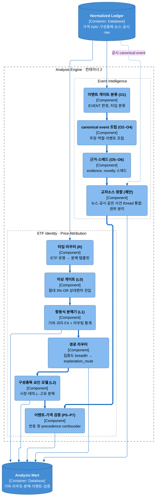
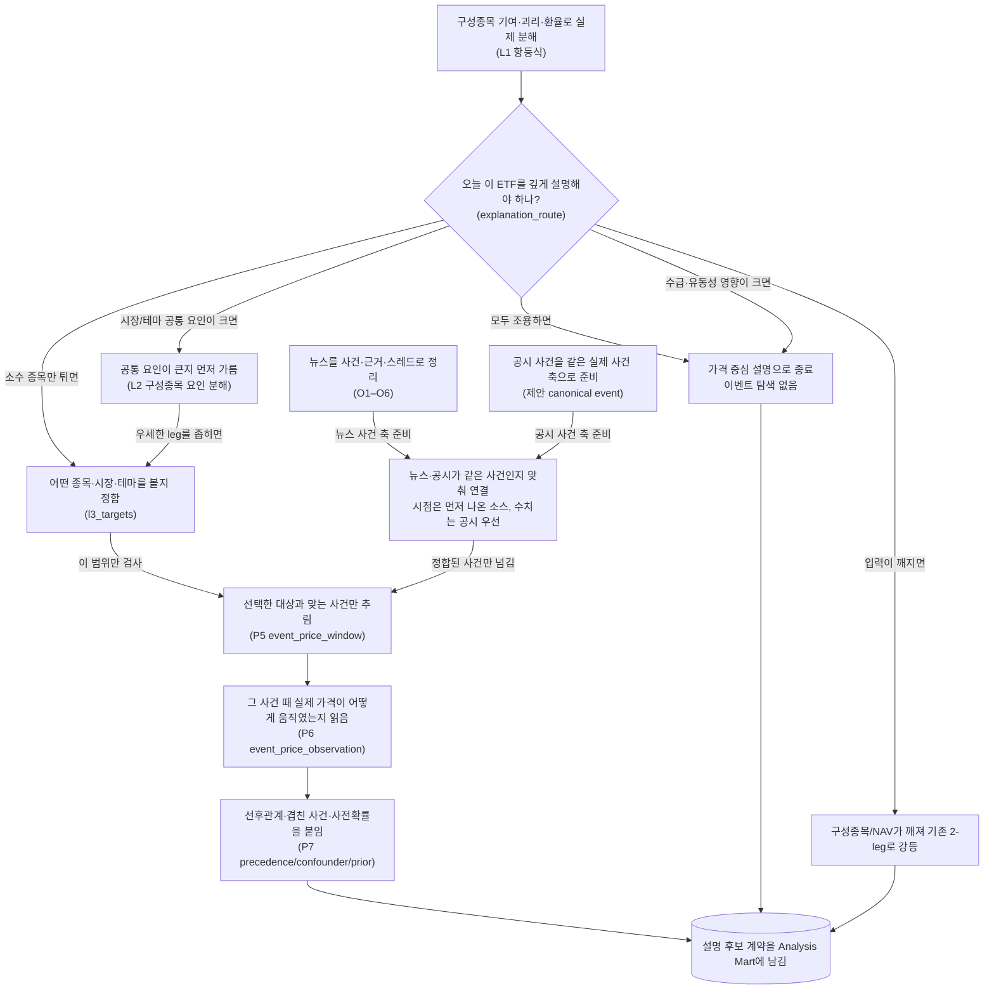

# Analysis Engine 컨테이너

## Summary

Analysis Engine(컨테이너 2)은 **ETF Identity / Price Attribution / Event Intelligence**를 하나의 배치 실행 경계로 묶어, 원장 입력을 **Analysis Mart의 설명 후보 계약**으로 바꾼다. 이 컨테이너의 핵심은 세 가지다.

1. **ETF Identity**가 ETF 일간 무브를 먼저 관측하고 `explanation_route`로 하류 경로를 결정한다.
2. **Event Intelligence**가 뉴스 입력을 `canonical_event`·`event_evidence`·`event_thread*`로 승격해 가격 검증이 재사용할 구조화 이벤트 축을 만든다.
3. **Price Attribution**이 route가 요청한 자산/범위에 대해서만 L2와 P5–P7을 호출해, 가격 축과 이벤트 축을 `event_price_window`·`event_price_observation`·`hq_market_bridge`에서 만난다.

현재 상태는 혼합형이다. Event Intelligence(O0–O6)와 Price Attribution(P0–P7)은 current 계약이 있고, ETF Identity(R·L0·L1·라우팅)는 제안 계약이다. 이 문서는 세 서브엔진의 **컨테이너 수준 작동 로직과 handoff**만 고정한다. 산식·필드 glossary·이벤트 타입·스레드 타입 규칙은 각 소유 spec으로 링크한다.

## Context

상위 레이어·컨테이너 경계는 [현재 아키텍처](../baseline/analysis-engine-design.md)와 [C4 다이어그램](../baseline/analysis-engine-design.md)이 소유한다. ETF Identity와 Price Attribution의 세부 계약은 [ETF 항등식 분해](../specs/etf-identity-decomposition.md), [가격 분해 엔진](../specs/price-decomposition-engine.md)이, 이벤트 type surface와 thread contract 규칙은 [뉴스 ontology 타입 카탈로그](../specs/data/news-ontology-types.md), [스레드 타입 카탈로그](../specs/data/thread-types.md)가 소유한다.

이 문서가 답하는 질문은 더 좁다.

- 왜 세 엔진이 하나의 컨테이너로 묶여 있는가?
- 어떤 route가 어떤 서브엔진을 호출하는가?
- `canonical_event`와 price decomposition이 어디서 만나는가?
- 어떤 출력이 Analysis Mart에 남고, 어떤 시점에 Explanation Engine으로 넘어가는가?

상세 타입 카탈로그는 여기서 다시 쓰지 않는다. 이벤트 타입은 [뉴스 ontology 타입 카탈로그](../specs/data/news-ontology-types.md), 스레드 규칙은 [스레드 타입 카탈로그](../specs/data/thread-types.md)가 소유한다.

## Problem

현재 spec들은 각자 잘게 쪼개져 있어 단계 내부 규칙은 보이지만, **컨테이너 2가 하루 실행에서 어떻게 오케스트레이션되는지**는 한 장에서 읽기 어렵다. 그 결과 다음 혼동이 생긴다.

- L1 라우팅이 언제 L2를 호출하고, 언제 곧바로 이벤트 검증으로 가는지 한눈에 보이지 않는다.
- Event Intelligence가 만든 `canonical_event`·`event_evidence`·`thread` 산출물이 price 검증에서 어떤 역할을 하는지 분리되어 읽힌다.
- Analysis Mart 안에서 가격 축(`etf_contribution_*`, `constituent_decomposition_observation`, `event_price_*`)과 이벤트 축(`canonical_event`, `event_thread*`)이 어디서 만나는지 드러나지 않는다.
- 제안(ETF Identity)과 current(Event Intelligence, Price Attribution)가 섞여 보여, 무엇이 이미 관찰되고 무엇이 계약 단계인지 판단하기 어렵다.

## Goals

- Analysis Engine을 구성하는 세 서브엔진의 실행 순서와 handoff를 고정한다.
- `explanation_route`가 L2와 이벤트 검증(P5–P7)을 어떻게 fan-out하는지 설명한다.
- Event Intelligence 산출물 중 가격 검증과 설명 합성에 필요한 최소 계약을 고정한다.
- Analysis Mart에서 가격 축과 이벤트 축이 합류하는 지점을 current/제안 상태와 함께 명시한다.
- 설명 엔진(컨테이너 3)이 재사용할 수 있는 grain 수준 출력만 남긴다.

## Non-goals

- P0–P7 산식, 회귀 계수, 필드 glossary를 다시 적지 않는다. 상세는 [가격 분해 엔진](../specs/price-decomposition-engine.md)이 소유한다.
- 53개 이벤트 타입 목록이나 type별 역할 규칙을 다시 적지 않는다. 상세는 [뉴스 ontology 타입 카탈로그](../specs/data/news-ontology-types.md)가 소유한다.
- 53개 타입의 identity 입력·novelty 어휘 사전을 다시 적지 않는다 — [스레드 타입 카탈로그](../specs/data/thread-types.md) 소유. 반대로 O6 threading **결정 알고리즘**(thread_key 직렬화, `thread_id` 해시, novelty status 판정 순서·correction marker·null-handling)은 **본 문서 §7 소유**다(잔여 파라미터는 Open questions 7).
- HQ A–G 해석 순서, 최종 설명 문장 조합, serving 계약을 다시 정의하지 않는다.
- 물리 스키마, 컬럼 타입, 인덱스, 전역 스케줄러 구현을 확정하지 않는다.

## Current state

| 영역 | 현재 관찰되는 상태 | 이 문서에서 고정하는 해석 |
|---|---|---|
| Event Intelligence | 뉴스 O0–O6 current. `canonical_event`, `event_evidence`, `event_thread*`, `hq_run_evidence` 계약이 문서화돼 있다. O6는 JSONL producer 구현이 있고 일부 table persistence는 `[INFERENCE]`다. | Analysis Engine의 **이벤트 축 생산자**로 취급한다. 가격 검증은 이 축을 읽되, 타입·스레드 규칙은 소유 문서로 링크한다. |
| Price Attribution | 개별 종목(ETF 구성종목 포함)의 price decomposition, residual gate, event-price verification 계약이 current다. | Analysis Engine의 **가격 축 생산자이자 이벤트 검증자**로 취급한다. ETF 설명에서는 route가 요구할 때만 호출 범위를 좁힌다. |
| ETF Identity | R·L0·L1·라우팅 계약은 제안 상태다. `etf_reference`, `etf_holdings_snapshot`, `etf_nav_daily`, `etf_contribution_*`, `explanation_route`가 logical requirement로 정의돼 있다. | Analysis Engine의 **진입 판단과 fan-out 제어기**로 취급한다. 이 레이어가 컨테이너 2의 실행 비용을 통제한다. |
| 컨테이너 경계 | C4에서 Event Intelligence + ETF Identity + Price Attribution이 한 컨테이너로 정의돼 있다. 저장은 Analysis Mart를 경유한다. | 세 엔진을 독립 서비스로 쪼개지 않고, 같은 `asof` 배치 안에서 mart handoff하는 경계로 유지한다. |
| 스케줄러/런타임 | 컨테이너 내부 실행 순서와 런타임 구현은 미정이다. | 본 문서는 **논리 실행 순서와 계약**만 고정한다. 구체 스케줄러는 Open question으로 남긴다. |

## Proposed design

### 컴포넌트 뷰 (C4 L3)

Analysis Engine 컨테이너의 정적 컴포넌트 구조다. 세 서브엔진(ETF Identity · Price Attribution · Event Intelligence)과 그 결합점을 보여준다. 동적 실행 순서는 아래 「동적 실행 흐름」과 「중요한 처리 흐름과 중간 산출물」이 소유한다.

컴포넌트별 정밀 계약: ETF Identity(R·L0·L1·라우팅)는 [ETF 항등식 분해](../specs/etf-identity-decomposition.md), Price Attribution(L2·P5–P7)은 [가격 분해 엔진](../specs/price-decomposition-engine.md), 이벤트·스레드 타입은 [뉴스 ontology 타입](../specs/data/news-ontology-types.md)·[스레드 타입](../specs/data/thread-types.md)이 소유한다. `교차소스 정합`은 제안 상태이며 판정·권위 규칙은 본 문서 §6이 소유한다.

### 동적 실행 흐름

하루 실행에서 라우팅이 하류를 fan-out하고, 이벤트 축(뉴스+공시 정합)이 가격 검증과 만나는 순서다.

## 중요한 처리 흐름과 중간 산출물

이 다이어그램은 **ETF를 먼저 관측하고, 그 관측이 필요한 범위만 사건 축에 질의한다**는 컨테이너 2의 읽는 순서를 보여준다. 왼쪽의 ETF Identity가 “오늘 왜 더 파야 하는지”를 정하고, 오른쪽의 Event Intelligence는 ETF별로 다시 계산하지 않는 **공유 사건 인덱스**를 미리 준비한다. Price Attribution의 P5–P7은 이 둘이 실제로 만나는 접점이다.

### 흐름 1. ETF 관측이 `explanation_route`를 만든다

하루 설명은 이벤트에서 시작하지 않고 ETF 가격 관측에서 시작한다. L0가 진입 여부를 거르고 L1이 `etf_contribution_observation`을 남기는데, 이것은 **ETF 1개 × 거래일 1개 기준으로 총 기여, 괴리, FX, reconciliation 신뢰도를 묶어 둔 관측 요약**이다. 같은 시점의 `etf_contribution_member`는 **어떤 구성종목이 그날 ETF 무브에 얼마나 기여했는지를 구성종목 단위로 적어 둔 member row**다.

이 두 관측을 바탕으로 라우터가 `explanation_route`를 기록한다. `explanation_route`는 **그날 그 ETF를 어느 깊이·범위로 설명할지 미리 정해 둔 라우팅 결정값이자 하류 실행 계획**이다. 값의 뜻은 다음처럼 읽는다.

| route | 뜻 | 하류 의미 |
|---|---|---|
| `normal_range` | 총량 게이트(절대·상대 OR)가 조용해(`l0_entry` 미발화) 특이 요인을 더 캐지 않아도 되는 상태 — v1은 기여 조용을 보증하지 않는다(기여 게이트 defer) | 추가 fan-out 없이 price-only 설명으로 종료 |
| `flow_dominated` | `Δ괴리` 기여율이 지배적이라 수급·유동성 설명이 우선인 상태 | 이벤트 검증 없이 종료 |
| `concentrated` | 소수 구성종목 기여가 무브를 사실상 설명하는 상태 | 어떤 종목을 볼지만 바로 정하고 event-price 검증으로 내려감 |
| `common_factor` | ETF 전반의 동조가 커서 시장·테마⊥·고유 leg를 먼저 가려야 하는 상태 | L2를 반드시 호출해 event 탐색 범위를 다시 좁힘 |
| `fallback_2leg` | holdings/NAV 입력이 깨져 ETF 항등식 경로를 끝까지 신뢰할 수 없는 상태 | 기존 2-leg 경로로 강등하고 data gap을 남김 |

핵심은 `explanation_route`가 단순 라벨이 아니라 **“여기서 끝내도 되는가, 더 내려가면 무엇을 먼저 계산해야 하는가”를 고정하는 실행 스위치**라는 점이다.

### 흐름 2. route가 하류 fan-out 범위를 좁힌다

`normal_range`와 `flow_dominated`는 여기서 사실상 종료된다. Analysis Mart에는 route와 기여 관측만 남고, 이후 Explanation Engine은 “특이 이벤트가 없었다” 또는 “수급 지배였다”는 결론을 그대로 재사용한다.

`concentrated`와 `common_factor`만 이벤트 검증 단계로 내려간다. 이때 공통으로 필요한 것이 `l3_targets`인데, 이것은 **이제 어떤 자산 범위에서 사건을 찾을지 적어 둔 target 집합**이다. `concentrated`는 L1이 이미 소수 종목으로 범위를 줄였기 때문에 `l3_targets`를 바로 적는다. 반대로 `common_factor`는 아직 시장인지, 테마인지, 고유 종목인지가 섞여 있으므로 L2를 먼저 돈다.

L2의 결과물인 `constituent_decomposition_observation`은 **종목 1개 × 거래일 1개 기준으로 시장·테마⊥·고유 분해 결과를 담은 관측 row**다. 이 row들을 ETF 수준으로 다시 집계해 우세 leg를 정하고, 그 leg가 시장이면 시장 이벤트 범위, 테마면 테마 이벤트 범위, 고유면 종목 이벤트 범위로 `l3_targets`를 다시 좁힌다. 그래서 `common_factor`는 “이벤트를 찾기 전에 먼저 가격 쪽 분해를 한 번 더 해 scope를 줄이는 경로”다.

`fallback_2leg`는 심화 fan-out을 포기하는 비상 경로다. 이 경우 문서는 실패를 숨기지 않고 **강등 사실과 data gap 자체를 산출물로 남긴다**.

### 흐름 3. Event Intelligence가 `canonical_event`와 `event_thread`를 준비하고, 교차소스로 정합한다

한편 Event Intelligence는 ETF별 서브루틴이 아니라 공유 사건 축을 미리 준비한다. 여기서 핵심 산출물인 `canonical_event`는 **기사·공시의 자유 텍스트를 사건 타입, 주체, 역할로 정규화한 구조화 이벤트 1건**이다. `event_evidence`는 **그 구조화 판단이 어떤 문장·숫자·원문 근거에서 나왔는지 붙여 주는 provenance 조각**이라서, P5–P7은 원문 문서를 다시 읽지 않고도 검증 근거를 따라갈 수 있다.

같은 실제 사건의 신규/후속 여부는 `event_thread` 계열이 맡는다. `event_thread`는 **같은 실제 사건을 소스와 문서가 달라도 하나의 계보로 묶는 thread 단위**이고, 여기서 말하는 `novelty`는 **이번 문서가 그 thread의 첫 발견인지, 이미 열린 사건의 후속 업데이트인지, 단순 재송고인지 구분하는 상태**다. 따라서 novelty는 “문서가 새롭다”보다 “사건 계보 안에서 무엇이 새롭나”를 말해 준다.

교차소스 정합은 이 thread 규칙을 뉴스와 공시까지 확장하는 단계다. 같은 실제 사건이 뉴스와 공시에 각각 `canonical_event`로 나타나면, Analysis Engine은 새 사건 두 개를 만드는 대신 **source-neutral한 같은 `event_thread`에 귀속**시킨다. 뉴스가 먼저 있었다면 뉴스 이벤트가 anchor가 되고 공시는 **확인 증거(linked confirming evidence)**로 붙는다. 이때 가장 이른 소스의 `available_at`이 선후(precedence)와 가격 반응 창의 기준이 되고, 계약금액·상대방·계약기간 같은 정밀 사실은 공시가 권위를 가진다. 즉 교차소스 정합의 목적은 “같은 사건을 하나로 세고, 어떤 필드는 어느 소스를 믿을지 분리하는 것”이다.

### 흐름 4. route target과 사건 축이 P5–P7에서 만나 `hq_market_bridge`로 봉합된다

P5는 route가 넘긴 `l3_targets`와 정합된 사건 축을 읽어 `event_price_window`를 연다. `event_price_window`는 **사건 1건 × 대상 자산 1개 × 정책 창 1개 기준으로, 그 사건 전후 가격 반응을 볼 수 있는 관측 가능 시간 창**이다. 이 단계는 아무 사건이나 열지 않고, route가 “이 자산 범위만 보라”고 줄여 둔 대상에 맞는 `canonical_event`만 통과시킨다.

P6는 같은 창 안의 실제 가격 움직임과 decomposition baseline을 합쳐 `event_price_observation`을 만든다. `event_price_observation`은 **반응 창 1개 안에서 실제 수익률·기저 분해·usable 여부를 함께 적어 둔 가격 반응 관측**이므로, “사건이 있었나”가 아니라 “그 사건이 이 무브와 시간상·가격상 맞물렸나”를 판단하는 기본 row다.

P7은 그 관측에 선후(precedence), 겹침 사건(confounder), prior를 붙인다. `event_confounder_link`는 **같은 검증 창에 겹쳐 들어온 다른 사건을 기록해 단일 원인 해석을 경계하게 하는 링크**다. 이렇게 정리된 최종 검증 결과는 `hq_market_bridge`로 적재되는데, `hq_market_bridge`는 **HQ와 Explanation Engine이 바로 소비할 수 있게 사건-가격 검증 결과를 1행 계약으로 봉합한 bridge row**다. 같은 thread 안에서 늦게 나온 공시가 있더라도 precedence 기준은 여전히 가장 이른 `available_at`을 따르므로, 늦은 확인 공시 때문에 먼저 나온 뉴스가 사후 보도로 오판되지 않는다.

### 흐름 5. Analysis Mart가 컨테이너 3 handoff를 고정한다

Analysis Mart에는 가격 축과 이벤트 축이 각각 들어오고, P5–P7이 둘을 연결한 뒤 handoff용 계약을 남긴다. 여기서 컨테이너 3으로 넘어가는 것은 원문 뉴스나 회귀 내부 상태가 아니라, **왜 이 ETF가 그 route로 분기됐는지 보여 주는 기여 관측**, **같은 사건의 신규/후속 여부를 담은 thread lineage**, **실제 가격 반응과 confounder 판단을 담은 `event_price_*`와 `hq_market_bridge`**다.

그래서 Explanation Engine은 Analysis Engine 내부 알고리즘을 다시 실행하지 않는다. route는 설명 깊이를, `canonical_event`와 `event_thread`는 사건 identity와 novelty를, `event_price_observation`과 `hq_market_bridge`는 가격 검증 결과를 넘겨 주고, 컨테이너 3은 그 계약을 조합해 A–G 설명을 만든다.

## 주요 모듈의 책임

| 모듈 | 책임 | 상태 | 상세 소유 문서 |
|---|---|---|---|
| ETF Identity | ETF 유형 판정, 이상 라벨, 항등식 분해, route 결정 | 제안 | [ETF 항등식 분해](../specs/etf-identity-decomposition.md) |
| Price Attribution | 구성종목 가격 분해, residual gate, event-price verification, prior bridge | current | [가격 분해 엔진](../specs/price-decomposition-engine.md) |
| Event Intelligence | 뉴스 envelope를 accepted event·canonical event·thread lineage로 승격 | current | [뉴스 ontology 타입 카탈로그](../specs/data/news-ontology-types.md), [스레드 타입 카탈로그](../specs/data/thread-types.md) |
| Analysis Mart handoff | 세 엔진의 산출물을 저장 가능한 logical artifact로 고정하고 컨테이너 3 소비 경계를 제공 | current + 제안 혼합 | [현재 아키텍처](../baseline/analysis-engine-design.md) |

## 설계 원칙과 세부 규칙

### 1. 컨테이너 수준 실행 원칙

Analysis Engine은 세 가지 원칙으로 돈다.

- **price-first**: 설명의 출발점은 항상 L1 관측이다. 이벤트는 route가 필요하다고 판단한 범위에만 붙는다.
- **route-driven**: Event Intelligence는 market-wide 사건 축을 생산할 수 있지만, ETF 설명용 조회 범위는 `explanation_route`와 `l3_targets`가 줄인다.
- **PIT-reproducible**: Event Intelligence의 `available_at`, ETF Identity의 `trade_date`, Price Attribution의 `evaluation_asof`가 같은 `asof`·`data_version` 재현 경계를 이룬다.

### 2. 세 서브엔진의 역할 분담

- **ETF Identity**는 “오늘 이 ETF를 어디까지 설명할 것인가”를 정해 `explanation_route`를 남긴다.
- **Event Intelligence**는 “이 문서 묶음을 어떤 사건 단위로 읽을 수 있는가”를 정해 `canonical_event`와 thread lineage를 남긴다.
- **Price Attribution**은 “선택된 사건이 실제 가격 움직임과 시간·시장 맥락상 맞는가”를 정해 `event_price_*`, `event_confounder_link`, `hq_market_bridge`, `response_prior`를 남긴다.

### 3. route별 하류 호출 규칙

| route | 호출 규칙 | 핵심 이유 |
|---|---|---|
| `normal_range` | 추가 호출 없음 | 특이 요인 탐색 자체가 불필요하다. |
| `flow_dominated` | 이벤트 검증 없음 | `Δ괴리`가 설명의 중심이라 price-only 설명이 더 정확하다. |
| `concentrated` | L2 생략 가능, 직접 P5–P7 호출 | L1이 이미 소수 종목으로 범위를 줄였다. |
| `common_factor` | L2 필수 후 P5–P7 호출 | 시장·테마·고유 중 무엇이 우세한지 L2 없이는 정해지지 않는다. |
| `fallback_2leg` | 기존 2-leg 경로로 강등 | 입력 결손을 숨기지 않고 비상 경로를 명시한다. |

### 4. Event Intelligence와 Price Attribution의 결합 규칙

- P5–P7의 입력 authority는 원문 문서가 아니라 `canonical_event`와 `event_evidence`다.
- 가격 검증의 직접 조인 축은 `event_id` + target asset + `available_at` 기반 window다.
- 같은 `event_thread` 안에서는 가장 이른 `available_at`이 precedence 기준이 된다. 늦은 확인 공시가 먼저 있던 뉴스의 선후 판정을 뒤집지 않는다.
- `dedup_cluster_id`는 duplicate rebroadcast seed일 뿐, 가격 검증 조인 키가 아니다.

### 5. Analysis Mart에서 두 축이 만나는 지점

| 축 | 상류 산출물 | 합류 지점 |
|---|---|---|
| 가격 축 | `etf_contribution_observation`, `etf_contribution_member`, `constituent_decomposition_observation`(또는 기존 `price_decomposition_observation`) | `event_price_observation`, `hq_market_bridge` |
| 이벤트 축 | `canonical_event`, `event_evidence`, thread lineage | `event_price_window`, `event_price_observation`, `event_confounder_link` |

Analysis Mart의 역할은 단순 적재가 아니라 **시간 정렬, 가격 정렬, handoff 정렬**이다. 이 컨테이너 안에서는 여기서 두 축의 계약이 맞물린다.

### 6. 교차소스 이벤트 정합 규칙

같은 실제 사건이 뉴스와 공시 양쪽에 나타나도 source-neutral한 같은 `event_thread`에 귀속시키고, 소스별 이벤트는 링크로 연결한다. 병합의 목적은 이중 계산 방지이지 소스 흔적 제거가 아니다.

| 규칙 | 내용 |
|---|---|
| 1차 결정론 | 같은 `event_type_id` + `identity.required` tuple이면 같은 사건으로 본다. `identity.optional_discriminators`는 §7의 흡수/분리 규칙을 따른다(상충 시 분리, 일측 결측 시 흡수). |
| 2차 부분 일치 | 대상 일치 + 시간 근접 + 내용 유사도가 충분하면 같은 사건으로 링크하고, 아니면 review로 보낸다. |
| 필드별 권위 | `available_at`·precedence·반응 창은 가장 이른 소스, 규모·상대방·계약기간 같은 정밀 사실은 공시가 우선한다. |
| PIT 경계 | T 시점에는 T까지 가용한 소스만 링크한다. T+1 공시는 T 뉴스 thread의 후속일 뿐 T로 소급 병합하지 않는다. |

### 7. O6 threading 결정 알고리즘 (제안)

thread 어휘·키 입력 계약은 [스레드 타입 카탈로그](../specs/data/thread-types.md)가, 판정 로직은 본 절이 소유한다. 전 단계는 결정론이다 — 같은 `asof` 입력이면 같은 판정이 나와야 하고(PIT 재현), 학습 요소는 없다.

**thread_key 직렬화.**

1. 값 정규화: 엔티티 필드는 엔티티 마스터 해소 결과의 canonical id, enum 필드는 canonical 토큰, 날짜는 ISO-8601, 자유 텍스트 discriminator는 NFKC·trim·casefold.
2. 직렬화: `event_type_id` 뒤에 `identity.required` 필드를 **필드명 사전순**으로 `필드명=값` 쌍으로 이어 `|`로 연결한다. 값 안의 `|`·`=`는 percent-encode. 카탈로그 선언 순서가 아니라 사전순인 이유: 카탈로그 표 재배열이 key를 바꾸면 안 된다.
3. `identity.optional_discriminators`는 **key 문자열에 넣지 않는다** — 매칭 단계의 흡수/분리 축으로만 쓴다(아래 표).

**thread_id 생성.** `thread_id = "th_" + hex(sha256(thread_key + "|" + opening_discriminator_set))[:32]`. `opening_discriminator_set`은 thread를 연 이벤트의 discriminator 값 직렬화(없으면 빈 문자열)다. thread를 연 입력만으로 재계산 가능하므로 replay에서 동일 id가 나온다.

**discriminator 흡수/분리 규칙.**

| 케이스 | 판정 |
|---|---|
| 양측 값 있음 + 일치 | 같은 thread |
| 양측 값 있음 + 상충 | 다른 thread(분리) — 같은 issuer·상대방의 서로 다른 계약 두 건을 가른다 |
| 한쪽 결측 | 기존 thread로 **흡수** — 소문(계약번호 없음) → 확정 공시(계약번호 있음) 체인이 이 규칙으로 이어진다 |
| 결측 이벤트인데 base 그룹에 discriminator가 다른 thread 2개 이상 | `UNKNOWN`(`AMBIGUOUS_THREAD_MATCH`) — 추측 배정 금지 |

**novelty 판정 캐스케이드.** 위에서부터 첫 매치에서 종료한다.

| 순서 | 조건 | 판정 |
|---|---|---|
| 0a | `identity.required` 중 **주체(anchor) role** 결측 또는 엔티티 해소 실패 | `UNKNOWN`(`MISSING_IDENTITY_FIELD`/`ENTITY_UNRESOLVED`), `thread_id` null |
| 0b | 주체 role은 있으나 그 외 required 결측(뉴스의 부분 추출) | **2차 부분일치 강등**: 같은 `event_type_id`+주체 일치 thread 후보에 시간 근접·내용 유사도(§6 2차 기준)로 매칭. 단일 후보 충족 → 흡수 후 캐스케이드 계속. 후보 없음/기준 미달 → `UNKNOWN`(`MISSING_IDENTITY_FIELD`), 복수 후보 → `UNKNOWN`(`AMBIGUOUS_THREAD_MATCH`). **부분 identity로 thread 신설 금지**(카탈로그 불변식 4·5) |
| 1 | base 그룹(`event_type_id`+required, 흡수/분리 규칙 적용) 매칭 thread 없음 | `FIRST_IN_THREAD` — 새 header open |
| 2 | 매칭 thread 존재 + correction marker(정정·취소 계열 doc_type, 명시적 철회 assertion) 또는 권위 필드 값이 기존 권위 값과 유의 차이(임계 연구 소유) | `CORRECTION` |
| 3 | 매칭 thread 존재 + 신규 assertion 또는 stage 전이(예정→확정, 새 수치·기간) | `FOLLOW_UP_STAGE` |
| 4 | 매칭 thread 존재 + 신규 정보 없음 + 같은 `source_class` | `DUPLICATE_REBROADCAST` |
| 5 | 매칭 thread 존재 + 신규 정보 없음 + 다른 `source_class` | 교차소스 확인 — 표현 방식은 Open questions 6(status 확장 vs `link_kind`) |

- 판정 입력은 `asof`까지 가용한 thread 상태뿐이다. 소급 병합 금지(§6 PIT 경계와 동일).
- `dedup_cluster_id`는 순서 4의 seed 신호일 뿐 판정 축이 아니다 — 다른 계보의 텍스트 유사가 thread를 만들지 않는다.
- `unknown_reason` 어휘: `MISSING_IDENTITY_FIELD` · `ENTITY_UNRESOLVED` · `AMBIGUOUS_THREAD_MATCH` · `TYPE_UNCERTAIN`. 소비자는 `UNKNOWN`을 보수적으로(독립 이벤트 취급, 신뢰 하향) 소비한다.
- **주체(anchor) role**: 타입의 `identity_roles` 중 이벤트 귀속의 1차 당사자(기업 이벤트군의 ISSUER·SUPPLIER·ACQUIRER류). 타입별 명시 마킹은 카탈로그 후속 — Open questions 7.
- **`UNKNOWN`은 종결이 아니라 재평가 대상**: 이후 `asof` 판정에서 thread가 생기면 0b 기준으로 귀속 승격할 수 있다. link는 최신 `asof` 판정으로 갱신하고 discovery snapshot은 불변 — 소급 병합이 아니라 신규 시점 판정이다. 승격 시 thread 최초 `available_at`이 앞으로 당겨져 precedence 앵커도 갱신된다(소문 08:50 → 확정 공시 체인이 이 경로로 복원).

## 대안

| 대안 | 판단 |
|---|---|
| Event Intelligence를 별도 컨테이너로 분리 | 장기적으로 가능하지만 현재 C4는 같은 배치 경계와 Analysis Mart handoff를 전제로 한다. 스케줄링·배포 분리 근거가 생기기 전에는 이득보다 조합 비용이 크다. |
| 이벤트를 먼저 찾고 가격 검증을 나중에 보조로 붙이기 | 상위 아키텍처의 price-first 원칙과 충돌한다. 뉴스가 많은 날 과잉 설명을 유도한다. |
| ETF마다 O0–O6을 재실행해 ETF 전용 이벤트 인덱스를 만들기 | 이벤트 축 중복 계산과 PIT 관리 비용이 크다. `canonical_event`를 공유 인덱스로 두고 route가 조회 범위만 줄이는 편이 낫다. |
| 하나의 초대형 spec에 O0–O6, R–L1, P0–P7을 모두 합치기 | 단계 소유권과 current/제안 구분이 흐려진다. 컨테이너 오케스트레이션만 이 문서에서 묶고, 알고리즘은 소유 spec으로 링크하는 편이 유지보수에 유리하다. |

## 위험과 실패 처리

- **구성종목/NAV 입력 결손**: `fallback_2leg`로 강등하고 data gap을 남긴다. ETF Identity failure를 0 대체로 숨기지 않는다.
- **reconciliation 오차 과대**: L1 신뢰도를 강등하되, 오차를 event explanation으로 덮지 않는다. 가격 축이 흔들리면 이벤트 축은 보조 증거일 뿐이다.
- **L2 실패 또는 불안정**: `common_factor` 경로라도 L1 관측 자체는 유효하다. 모델 실패를 제품 실패로 승격하지 않고, price-only 또는 축소된 설명으로 남긴다.
- **사후 보도/선후 불명**: P5–P7이 `available_at` 기반 창과 confounder 상태를 남긴다. 선후가 불명하면 event는 존재해도 그날 무브의 원인으로 채택하지 않는다.
- **`dedup_cluster_id`와 `thread_id` 혼동**: duplicate rebroadcast와 동일 사건 계보를 섞으면 novelty 판단이 왜곡된다. O6 소유 규칙을 그대로 따른다.
- **O6 물리화 오독**: `event_thread*`와 `hq_run_evidence`는 producer current지만 일부 table persistence는 `[INFERENCE]`다. 컨테이너 수준 소비 계약과 물리 적재 완료를 같은 말로 취급하지 않는다.
- **이벤트 미발견**: `residual_move`가 남아도 적절한 `canonical_event`가 없거나 confounded이면 “유의하나 미설명”으로 남긴다. 서사 보강 금지.

## 검증 방법

- **route 재현성**: 동일 `asof`·입력 버전에서 동일 ETF가 동일 `explanation_route`를 내는지 확인한다. 세부 판정 테스트는 [ETF 항등식 분해](../specs/etf-identity-decomposition.md)를 따른다.
- **event-price 결합 일관성**: `event_price_window`가 `canonical_event`와 `event_evidence` 없이 생성되지 않고, `event_price_observation`이 항상 대응 decomposition baseline을 참조하는지 확인한다. 세부는 [가격 분해 엔진](../specs/price-decomposition-engine.md)을 따른다.
- **thread lineage 일관성**: `canonical_event`의 novelty snapshot과 `event_thread_link` / `thread_discovery_snapshot` authority가 모순되지 않는지 확인한다. 세부는 [스레드 타입 카탈로그](../specs/data/thread-types.md)를 따른다.
- **컨테이너 handoff 최소성**: Explanation Engine이 원문 재파싱 없이 `explanation_route`, `canonical_event`, `event_price_*`, `hq_market_bridge`만으로 A–G 소비를 시작할 수 있어야 한다.
- **문서 경계 검증**: 이벤트 타입·스레드 규칙·가격 산식이 이 문서에 중복되지 않고 소유 spec 링크로만 남아 있는지 검토한다.

## 참고: 데이터 계약 요약

빠른 조회용 reference다. 세부 필드·산식은 각 소유 문서가 관리하고, 여기서는 grain과 생산→소비 경계만 다시 본다.

| 계약 데이터 | grain | 생산 → 소비 | 상태 |
|---|---|---|---|
| processed-news envelope | 문서 1건 | Data Ingestion → Event Intelligence | current |
| `canonical_event` | event 1건 | Event Intelligence → Price Attribution / Explanation Engine | current |
| `event_evidence` | evidence 조각 1건 | Event Intelligence → Price Attribution / Explanation Engine | current |
| `event_thread_link` / `thread_discovery_snapshot` | event 1건 | Event Intelligence → Explanation Engine | current, 일부 persistence `[INFERENCE]` |
| `etf_contribution_observation` | ETF 1개 × 거래일 1개 | ETF Identity → 라우팅 / Explanation Engine | 제안 |
| `etf_contribution_member` | ETF 1개 × 거래일 1개 × 구성종목 1개 | ETF Identity → 라우팅 / 종목 타깃 선정 | 제안 |
| `explanation_route` | ETF 1개 × 거래일 1개 | ETF Identity → Price Attribution / Explanation Engine | 제안 |
| `constituent_decomposition_observation` | 종목 1개 × 거래일 1개 | Price Attribution(L2) → 이벤트 검증 / Explanation Engine | 제안 |
| `event_price_window` | event 1개 × 대상 자산 1개 × 정책 창 1개 | Price Attribution(P5) → P6 / P7 | current |
| `event_price_observation` | 검증 창 1개 × 실제 관측 1개 | Price Attribution(P6) → P7 / Explanation Engine | current |
| `event_confounder_link` | 검증 창 1개 × 겹침 사건 1개 | Price Attribution(P7) → Explanation Engine | current |
| `hq_market_bridge` | HQ run 1개 × event 1개 × 대상 자산 1개 | Price Attribution(P7) → Explanation Engine | current |

## Open questions

1. Analysis Engine 내부 실행 순서를 누가 스케줄링하는가? 하나의 일괄 DAG인지, 이벤트 축과 ETF 축을 분리 실행한 뒤 mart에서 합류시키는지 아직 미정이다.
2. `concentrated` 경로에서 L2를 완전히 생략할지, 또는 선택된 종목에 한해 security-level decomposition baseline을 항상 요구할지 운영 기준이 더 필요하다.
3. 공시 계열 `canonical_event`가 뉴스와 동일한 `event_price_window` fan-out 정책을 그대로 따르는지, source-specific precedence 예외가 필요한지 추가 정리가 필요하다.
4. `event_thread*`의 logical contract를 어떤 물리 저장소로 고정할지, JSONL producer 이후 warehouse persistence를 어디서 마감할지 결정이 남아 있다.
5. `response_prior`를 Explanation Engine이 언제 필수로 읽고 언제 참고치로만 읽을지 소비 정책을 더 명확히 해야 한다.
6. 교차소스 정합(§6)의 2차 부분일치 임계(대상 일치 + 내용 유사도)와 review 회부 기준을 어떻게 보정할지, 그리고 교차소스 확인을 `novelty_status` 확장으로 둘지 별도 `link_kind`로 둘지 최종 결정이 필요하다.
7. §7 threading 알고리즘의 잔여 결정 — `CORRECTION` 판정의 권위 숫자 유의 차이 임계(연구 소유), `TYPE_UNCERTAIN` 판정 기준, 0b 부분일치 임계(OQ6와 공유), 그리고 타입별 **주체(anchor) role 명시 마킹**(카탈로그 확장). 알고리즘 골격은 §7이 소유하며 이 항목은 파라미터·마킹만 다룬다.
