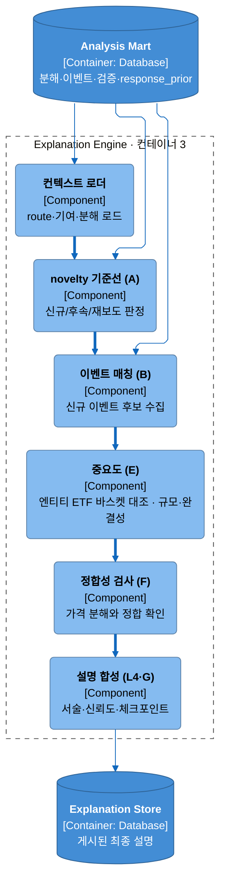
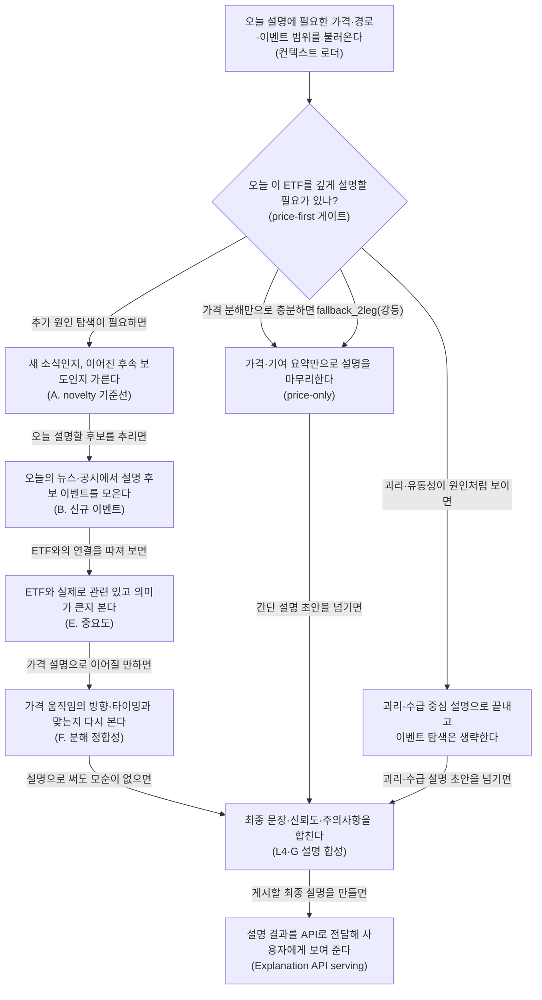

# Explanation Engine

## Summary

Explanation Engine는 컨테이너 2 [Analysis Engine](../baseline/analysis-engine-design.md)이 만든 route·기여·분해·event mart를 투자자용 설명으로 조합하는 **컨테이너 3**이다. 이 컨테이너의 시작점은 가격이다. 먼저 `explanation_route`와 가격 분해 결과를 읽어 **price-first pre-step**을 수행하고, residual gate와 route 성격에 따라 설명을 `price-only`로 끝낼지, 아니면 A–G 해석 체인으로 더 깊게 들어갈지 결정한다.

A–G는 `canonical_event`·`event_evidence`·`event_thread*`·공시 fact·price verification mart를 순서대로 좁혀 가며 **기준선·novelty(A) → 신규 이벤트(B) → 중요도(E) → 가격 정합성(F) → 최종 체크포인트(G)** 를 만든다. 영향 경로(D, 다중홉 관계 그래프)와 기대 대비 차이(C, 시장 기대 대비 surprise)는 각각 정밀 소스가 없어 [관계 그래프 draft](../proposals/0002-relationship-graph.md)·[시장 기대 draft](../proposals/0003-market-expectation.md)로 강등했다. 마지막 L4는 이 판단을 서술로 합성하되, **관측(L1)**, **추정(L2)**, **가설(A·B·E–G)** 을 섞어 말하지 않고, precedence 위반·2홉 초과·증거 부족은 그대로 드러낸다.

이 문서가 소유하는 것은 **컨테이너 작동 로직**이다. A–G evidence matrix의 전체 필드 표, residual 공식/컷오프, type taxonomy, event extraction 세부는 각 owner 문서가 소유한다. 컨테이너 4 **Explanation API**는 여기서 게시된 최종 설명 artifact를 serving만 한다.

## Context

- 전체 시스템의 컨테이너 경계는 [시스템 아키텍처](../baseline/analysis-engine-design.md)와 [C4 다이어그램](../baseline/analysis-engine-design.md)이 소유한다. 이 문서는 그중 **Explanation Engine(컨테이너 3)** 내부 동작만 풀어 쓴다.
- upstream 가격·라우팅·이벤트 생산 로직은 [Analysis Engine](../baseline/analysis-engine-design.md), [ETF 항등식 분해](../specs/etf-identity-decomposition.md), [가격 관찰·분해 엔진 계약](../specs/price-decomposition-engine.md)이 소유한다. A–G 소비 순서와 최종 설명 조합은 이 문서가 직접 소유한다.
- 뉴스·공시 원천의 구조화 handoff는 [Data Ingestion 디자인](../baseline/data-ingestion.md), 이벤트·스레드 승격 로직은 [Analysis Engine](../baseline/analysis-engine-design.md)이 소유한다.
- 타입 taxonomy는 컨테이너 설계가 아니라 spec 자산이다. 이벤트/공시/thread/entity 분류 규칙은 각각 [뉴스 온톨로지 타입](../specs/data/news-ontology-types.md), [공시 타입](../specs/data/disclosure-types.md), [스레드 타입](../specs/data/thread-types.md), [엔티티 마스터](../specs/data/entity-master.md)가 소유한다.

## Problem

현재 문서 세트에는 A–G가 무엇을 읽는지는 있으나, **컨테이너 3이 실제로 어떤 순서와 어떤 veto 규칙으로 설명을 조립하는지**는 한 장으로 드러나 있지 않다. 그 결과 세 가지가 흐려진다.

1. **price-first 분기점이 약하다.** residual이 작거나 route가 괴리/유동성 지배일 때 어디서 deep explain을 중단하는지 읽기 어렵다.
2. **A–G의 판단 역할이 표 나열처럼 보인다.** `canonical_event`, `event_evidence`, `event_thread`, price mart가 각 단계에서 무엇으로 변환되는지보다 입력 목록이 먼저 보인다.
3. **설명 책임과 serving 책임이 섞이기 쉽다.** 컨테이너 3은 설명을 만들고, 컨테이너 4는 그것을 배포한다. 이 경계가 문서상 짧고 선명해야 한다.

## Goals

- Explanation Engine의 **price-first pre-step → A–G → L4** 실행 논리를 한 문서에서 고정한다.
- 각 단계가 어떤 grain의 데이터를 소비하고 어떤 판단으로 다음 산출을 만드는지 설명한다.
- 관측/추정/가설 구분, precedence, 2홉 재귀 캡, 미설명 정직 표기 같은 설명 원칙을 컨테이너 수준 규칙으로 명시한다.
- upstream owner 문서를 복사하지 않고 링크만 하면서, 컨테이너 3이 가져야 할 책임 경계를 명확히 한다.
- 컨테이너 4 Explanation API를 downstream serving 경계로 짧게 정리한다.

## Non-goals

- A–G evidence matrix 전체 필드 표를 relation/field dictionary 수준으로 다시 싣지 않는다.
- residual score, cutoff, `pre_anchor_move_share`, reaction window policy의 수식·임계값을 다시 정의하지 않는다. 상세는 [가격 관찰·분해 엔진 계약](../specs/price-decomposition-engine.md)이 소유한다.
- 뉴스/공시/thread/entity taxonomy를 재서술하지 않는다. 타입 식별자와 의미는 각 type spec owner 문서에 남긴다.
- 컨테이너 4 API shape, 인증, serving SLA를 설계하지 않는다. 이 문서는 설명 생성까지만 다룬다.

## Current state

| 항목 | current | 제안/미정 |
|---|---|---|
| upstream 입력 계약 | `explanation_route`, 기여 observation/member, 구성종목 L2 분해, `canonical_event`·`event_evidence`·`event_thread*`, `event_price_*`, `response_prior`가 이미 owner 문서에 정의돼 있다 | 입력 물리화 위치와 런타임 조합은 owner 문서/후속 계약이 확정한다 |
| Explanation Engine 경계 | C4에서 컨테이너 3이 `기대 대비 해석과 설명 조합`을 맡는다고 정의돼 있다 | 이 문서가 그 내부 로직을 처음으로 독립 설명한다 |
| 설명 원칙 | 상위 아키텍처가 price-first, precedence, 미설명 정직 표기를 선언했다 | 컨테이너 3 수준의 veto 순서와 모듈 책임을 본 문서가 명시한다 |
| serving 경계 | Explanation Store와 Explanation API는 C4에 존재한다 | artifact shape·API 계약은 후속 설계 대상이다 |

## Proposed design

### 컴포넌트 뷰 (C4 L3)

Explanation Engine 컨테이너의 정적 컴포넌트 구조다. 동적 실행 순서는 아래 「컨테이너 내부 흐름」과 「중요한 처리 흐름과 중간 산출물」이 소유한다.

기대 대비 차이(C)와 영향 경로(D)는 소스·근거 부재로 강등됐다 — C는 [market-expectation-draft](../proposals/0003-market-expectation.md), D는 직접 membership 단일 홉으로 단순화([relationship-graph-draft](../proposals/0002-relationship-graph.md)). `STORE`는 Explanation API(컨테이너 4)가 소비한다.

### 컨테이너 내부 흐름

### 중요한 처리 흐름과 중간 산출물

이 다이어그램의 읽는 순서는 **price-first pre-step → A → B → E → F → G → L4**다. 핵심은 "이날 ETF 가격 움직임을 굳이 event로 설명해야 하는가"를 먼저 좁히고, event를 열더라도 각 단계가 **같은 후보를 더 보수적인 기준으로 재심사**한다는 점이다.

#### 1. price-first pre-step — event 체인을 열지 말지 먼저 정한다

컨텍스트 로더는 `explanation_route`와 price mart를 먼저 읽는다. `explanation_route`는 `(market, etf_ticker, trade_date)` grain에서 **그날 그 ETF를 어느 lane으로 설명할지 미리 정한 route 계약**이고, 컨테이너 3이 시장/테마/구성종목/괴리 범위를 다시 추정하지 않게 막는다. `etf_contribution_observation`은 **ETF 일간 움직임을 어떤 기여 요약으로 읽을지 정리한 관측치**이고, `etf_contribution_member`는 **그날 설명 단위로 우선 볼 구성종목 seed**라서 이후 event 탐색 범위를 ETF 전체가 아니라 실제 기여 바스켓 쪽으로 좁히는 데 쓴다. `constituent_decomposition_observation`(기존 `price_decomposition_observation` 계약의 종목 레벨 재사용)은 **가격 변동 중 이미 시장·테마·고유 leg로 나눠 놓은 baseline 관측**이므로, 남는 residual이 작으면 컨테이너 3은 A–G를 열지 않고 `price-only`로 종료한다.

여기서 판정은 두 갈래다. residual이 작으면 "가격 분해만으로도 충분히 설명된다"는 뜻이므로 뉴스·공시는 원인 후보가 아니라 배경 코멘트로만 남긴다. 반대로 route 자체가 premium/discount·유동성·괴리 지배를 가리키면, 그것도 **event가 아니라 구조적/수급성 설명을 우선하라**는 신호이므로 A–G를 생략하고 괴리/수급 설명으로 끝낸다. 즉 pre-step은 "무엇을 찾을까"보다 먼저 "오늘 정말 찾을 필요가 있는가"를 닫아 주는 안전장치다.

**fallback_2leg 경로**: L1 강등(구성종목·NAV 미확보) 시 price-only 설명에 강등 사실과 데이터 gap을 함께 고지한다.

#### 2. A — 오늘 후보가 새 사건인지, 같은 thread의 후속인지, 단순 재보도인지 고정한다

pre-step이 deep explain을 열면 A는 novelty anchor부터 세운다. `canonical_event`는 **뉴스/공시 원문을 공통 event identity로 정규화한 사건 1건**이고, `event_thread`는 **같은 사건군을 묶는 thread 1건**, `event_thread_link`와 `thread_discovery_snapshot`은 **개별 event가 어느 thread에 어떻게 연결됐는지 남긴 연결 기록**이다. A는 여기에 prior `event_evidence`를 함께 읽어, 오늘 본 문서가 완전히 새 사건인지(`FIRST_IN_THREAD` 계열), 기존 사건의 후속 stage인지, 아니면 이미 알려진 내용을 다시 실은 재보도인지부터 고정한다.

이 단계의 산출인 `A.novelty_anchor_set`은 **뒤 단계가 같은 novelty 판단을 공유하도록 고정한 기준 묶음**이다. B가 후보를 더 모으더라도 "이미 어제 알려진 사건을 오늘 새 원인처럼 말하지 않는다"는 제약은 A에서 먼저 잠근다. 현재 문서는 analyst consensus나 priced-in 기대를 정밀하게 모르는 상태를 전제로 하므로, A의 역할은 "시장 기대를 맞혔는가"가 아니라 "새 정보인가, 같은 이야기의 연장인가"를 thread 단위로 가르는 데 있다.

#### 3. B — route가 허용한 범위 안에서 오늘 새 이벤트 후보를 모은다

B는 금일 뉴스/공시에서 설명 후보를 수집하되, raw 문서 family를 직접 비교하지 않고 모두 `canonical_event` grain으로 맞춘다. 이때 `event_evidence`는 **각 event가 어떤 원문과 provenance로 뒷받침되는지 보여 주는 근거 묶음**이라서, 나중에 "왜 이 event를 설명 후보로 올렸는가"를 소급 가능하게 만든다. route가 시장 lane이면 시장 event 중심, 테마 lane이면 theme event 중심, 구성종목 집중 lane이면 issuer event 중심으로 수집 범위가 달라진다.

이 단계의 결과인 `B.candidate_event_set`은 **오늘 설명 후보로 계속 심사할 event 목록**, `B.evidence_bundle`은 **그 후보들을 뒷받침하는 source-backed 근거 다발**이다. 중요한 점은 B가 후보를 "많이" 모으는 단계가 아니라, A가 잠근 novelty 기준을 유지한 채 **오늘 설명에 올릴 자격이 있는 후보만 canonical grain으로 정리**하는 단계라는 점이다.

#### 4. E — ETF에 정말 중요한 사건인지, 말할 숫자가 갖춰졌는지 다시 줄인다

E는 후보가 "있다"에서 그치지 않고 "이 ETF 설명에서 말할 가치가 있다"까지 좁힌다. `dart_supply_contract_fact`는 **공시에서 계약 규모·상대방·기간 같은 경제적 규모를 읽게 해 주는 fact**, `dart_business_segment_fact`는 **사업부문 노출을 통해 ETF 바스켓과의 접점을 확인하게 해 주는 fact**, `document_assertion`은 **문서에서 추출한 숫자·기간·주장 단위**다. E는 이 fact들과 `canonical_event` completeness를 함께 보면서, event 엔티티가 ETF 구성종목이나 코호트에 실제로 닿는지, 그리고 숫자·기간이 빠지지 않아 경제적으로 해석할 수 있는지 점검한다.

산출인 `E.significance_verdict`는 **이 event를 ETF 설명에 올릴지 말지에 대한 중요도 판정**, `E.integrity_flag`는 **숫자·기간 무결성이 충분한지 표시한 품질 플래그**, `E.caveat_set`은 **규모는 커 보여도 해석할 때 같이 달아야 하는 유보 문구 묶음**이다. 여기서 살아남지 못한 후보는 "사건은 있었지만 이 ETF 움직임을 대표 설명으로 올리기엔 연결이 약하다"는 뜻이므로, 뒤 단계로 넘기지 않는다.

#### 5. F — reaction window의 realized move를 분해 baseline과 대조해 사후 서사를 걷어낸다

F는 event 이야기가 가격과 실제로 맞는지 본다. `event_price_window`는 **event별로 어느 반응창을 검증할지 미리 정한 시간 구간**, `event_price_observation`은 **그 반응창에서 실제로 관측된 realized move**, `constituent_decomposition_observation`은 **같은 날 가격을 시장·테마·고유로 나눈 baseline**, `hq_market_bridge`는 **event 검증창과 시장/테마 쪽 baseline을 같은 좌표계로 맞대는 연결 정보**다. F는 이를 나란히 두고, E까지 통과한 event가 residual의 방향·크기·시간축과 맞는지, 이미 시장이나 테마 leg로 설명된 부분을 다시 event 서사로 덮어쓰지 않는지 확인한다.

이 단계의 `F.market_fit_check`는 **event 해석이 residual 방향과 크기에 맞는지 보는 적합성 판정**, `F.timing_fit_check`는 **반응 시점이 설명 대상 거래일의 움직임과 시간상 맞물리는지 보는 판정**이다. same-day 설명에서는 precedence도 여기서 함께 선명해진다. 같은 thread의 최초 `available_at`이 설명 대상 거래일 D의 `POST_CLOSE` 버킷이면, 그 event는 D 무브의 원인으로 채택할 수 없다. 즉 F는 "가격이 움직였으니 나중에 나온 기사 하나를 붙인다"는 사후 보도를 구조적으로 막는 마지막 가격 정합성 관문이다.

#### 6. G — confounder, prior, PIT를 모아 "말해도 되는 설명"만 남긴다

G는 F까지 살아남은 후보를 그대로 문장화하지 않고 마지막 checkpoint를 거친다. `event_confounder_link`는 **같은 반응창에 겹친 다른 event나 혼선 요인을 묶어 둔 링크**, `response_prior`는 **유사 event가 과거에 어떤 반응 bucket을 보였는지 남긴 historical prior**, `hq_run_evidence`는 **이번 판정이 어떤 실행 스냅샷과 증거 집합 위에서 나왔는지 남기는 run-level evidence**, `PIT timestamp`는 **그 시점에 실제로 알 수 있었던 정보만 사용했는지 고정하는 point-in-time 기준 시각**이다. 여기에 `event_evidence`를 다시 붙여 증거 부족 여부도 점검한다.

결과인 `G.final_checkpoint_set`은 **최종 설명에 포함 가능한 후보와 탈락 사유를 함께 남기는 보수적 checkpoint 묶음**이고, confidence bounds는 **왜 이 설명을 단정이 아니라 신뢰도 범위와 함께 말해야 하는지**를 드러낸다. 큰 confounder가 있거나 PIT를 어기면, E와 F를 통과했던 후보라도 사용자-facing causal claim으로는 올리지 않는다.

#### 7. L4 — 관측, 추정, 가설을 섞지 않고 최종 설명 artifact로 정리한다

L4는 새로운 사실을 만드는 단계가 아니라, pre-step과 A–G가 남긴 판단을 **관측 / 추정 / 가설**의 층위로 분리해 서술 순서를 정하는 단계다. `etf_contribution_observation`과 ETF 괴리·FX 같은 값은 **실제로 관측된 사실**, `constituent_decomposition_observation`은 **구성종목 움직임을 시장·테마⊥·고유 leg로 분해한 추정 결과**, A–G를 통과한 event interpretation은 **조건부 설명 가설**로 말한다. 한 문장 안에서 이 세 층을 섞어 "관측된 가격 움직임 = 확정된 원인"처럼 쓰지 않는 것이 L4의 핵심 규율이다.

최종 산출인 설명 artifact는 `(market, etf_ticker, trade_date, asof)` grain에서 **그 거래일 설명 본문과 checkpoint를 묶은 사용자 게시 단위**다. 여기서 `asof`는 **어느 시점 정보까지 반영했는지 고정하는 재현성 기준**이므로, 같은 날짜라도 intraday refresh 여부를 구분할 수 있게 해 준다. surviving candidate가 없거나 precedence/confounder로 모두 탈락하면 L4는 억지로 한 후보를 고르지 않고 `유의하나 미설명` 또는 `정상 변동 범위`로 끝낸다.

#### 8. 왜 C와 D는 강등됐는가

- **C. 기대 대비 차이**는 analyst consensus, options-implied, priced-in 기대 같은 정밀 baseline이 아직 없어 **"기대 대비 surprise"를 엄밀하게 말할 권한이 없기 때문에** [시장 기대 draft](../proposals/0003-market-expectation.md)로 강등했다.
- **D. 영향 경로**는 event에서 ETF까지 가는 다중홉 관계 그래프를 아직 운영하지 않으므로, 현재 설계는 **구성종목/코호트 직접 소속 여부와 상위 기여 종목 대조만으로 충분한 범위만 말하기 위해** [관계 그래프 draft](../proposals/0002-relationship-graph.md)로 강등했다.

### 주요 모듈의 책임

| 모듈 | 책임 | 비고 |
|---|---|---|
| 컨텍스트 로더 | `explanation_route`, ETF 기여 관측, L2 분해, event/search scope를 로드해 오늘 설명의 분기점을 고정한다 | route 재계산 금지 |
| novelty 기준선 (A) | prior thread·event를 묶어 오늘 후보의 신규/후속/재보도를 판정한다 | 시장 기대(consensus) 추정 금지 — [시장 기대 draft](../proposals/0003-market-expectation.md) |
| 이벤트 매칭기 (B) | route가 허용한 범위에서 오늘 candidate event를 canonical grain으로 모은다 | raw 문서 family 직접 비교 금지 |
| 중요도 평가기 (E) | event 엔티티가 ETF 구성종목/코호트에 속하는지 직접 확인하고 규모·완결성으로 경제적 의미를 판정한다 | 다중홉 관계 그래프 순회는 [관계 그래프 draft](../proposals/0002-relationship-graph.md)로 강등 |
| 정합성 검사기 (F) | event interpretation이 price decomposition과 모순되지 않는지 확인한다 | price는 재진입하지만 causal proof는 아님 |
| 체크포인트/설명 합성기 (G·L4) | surviving candidate, caveat, confidence를 checkpoint와 문장으로 조합한다 | precedence·confounder·미설명 정직 표기 책임 |

### Downstream — Explanation API (제안)

컨테이너 3의 종료점은 **최종 설명 artifact**다. 이 artifact의 grain은 `(market, etf_ticker, trade_date, asof)`이며, 컨테이너 4 Explanation API는 이를 읽어 MTS에 게시한다. API는 serving만 담당하고 A–G 판단을 재수행하지 않는다.
## 대안

| 대안 | 판단 |
|---|---|
| 이벤트 우선(event-first)으로 뉴스/공시를 먼저 읽고 나중에 가격으로 맞춘다 | 기사가 많은 날 과잉 설명과 사후 보도 오귀속 위험이 커진다. price-first 유지 |
| A–G를 Analysis Engine 안에 흡수해 컨테이너 2에서 바로 최종 설명까지 만든다 | 관측/분해 생산과 서술/신뢰도 조합이 섞여 책임 경계가 흐려진다. 컨테이너 3 분리 유지 |
| 설명이 약해도 가장 plausible한 event를 반드시 하나 선택한다 | `미설명`을 버리면 신뢰도가 아니라 서사 강박이 된다. honest unknown 유지 |

## 위험과 실패 처리

- **route 또는 기여 컨텍스트 부족**: 컨테이너 3은 새 라우팅을 추정하지 않는다. 입력이 없으면 price-only 또는 `UNKNOWN`으로 강등하고 결손을 밝힌다.
- **novelty 오판**: thread identity가 불안정하면 A가 새 사건과 follow-up stage를 혼동할 수 있다. novelty의 권위는 [Analysis Engine](../baseline/analysis-engine-design.md)과 [스레드 타입](../specs/data/thread-types.md)에 둔다.
- **late news / after-the-fact 기사**: precedence 위반(POST_CLOSE)이면 causal claim 금지, 배경 코멘트로만. 단 판정은 스레드 최초 시각 기준이므로 소문→확정 체인의 늦은 확정 공시는 late가 아니다.
- **cross-family 불일치**: 뉴스는 강하지만 공시 숫자가 비어 있거나, 공시는 강하지만 price fit이 약할 수 있다. 이때 후보를 버리기보다 confidence와 caveat를 낮춰 표기하되, F/G를 통과하지 못하면 최종 원인 서사는 하지 않는다.
- **설명 단위 과확장**: ETF → 설명 단위 → event 2홉 캡을 강제한다. 다중홉 관계 그래프 순회는 [관계 그래프 draft](../proposals/0002-relationship-graph.md)로 강등했다.

## 검증 방법

- **분기 검증**: residual 작음 / residual 큼 / 괴리 지배 3경로가 서로 다른 설명 결과를 내는지 replay로 확인한다.
- **precedence 검증**: 같은 event라도 스레드 최초 `available_at`의 세션 버킷(PRE_OPEN/INTRADAY/POST_CLOSE)에 따라 최종 causal claim이 달라지는지, 소문→확정 체인이 확정 공시 시각 때문에 오탈락하지 않는지 확인한다.
- **novelty 검증**: `FIRST_IN_THREAD`, `FOLLOW_UP_STAGE`, `CORRECTION`, `DUPLICATE_REBROADCAST`, `UNKNOWN`이 A 판단에 올바르게 반영되는지 확인한다.
- **중복 주장 방지 검증**: F가 이미 시장·테마 leg로 설명된 움직임을 event explanation으로 다시 쓰지 않게 하는지 확인한다.
- **PIT 재현성 검증**: 동일 `(market, etf_ticker, trade_date, asof)`에서 같은 설명 artifact가 다시 생성되는지 확인한다.
- **정직 출력 검증**: surviving candidate가 없을 때 `유의하나 미설명` 또는 `정상 변동 범위`가 실제로 최종 출력되는지 확인한다.

## 참고: 데이터 계약 요약

빠른 조회용 reference다. 읽는 순서와 판단 기준은 위 「컨테이너 내부 흐름」과 「중요한 처리 흐름과 중간 산출물」이 소유한다.

| 데이터 | grain | 생산 → 소비 | Explanation Engine에서의 쓰임 |
|---|---|---|---|
| `explanation_route` | `(market, etf_ticker, trade_date)` | Analysis Engine 라우팅 → 컨텍스트 로더 | deep explain 여부, 검색 범위, primary explanation lane 고정 |
| `etf_contribution_observation` | `(market, etf_ticker, trade_date)` | ETF identity(L1) → 컨텍스트 로더/L4 | ETF 레벨 기여·괴리·breadth 요약 |
| `etf_contribution_member` | `(market, etf_ticker, trade_date, constituent_ticker)` | ETF identity(L1) → 컨텍스트 로더 | 어떤 구성종목을 설명 단위로 볼지 좁히는 seed |
| `constituent_decomposition_observation` | `(market, constituent_ticker, trade_date)` | Price Attribution(L2) → F/L4 | 구성종목별 시장·테마⊥·고유 기여 참조 |
| `canonical_event` | `event_id` 1건 | 뉴스 온톨로지·공시 파이프라인 → A/B/E | accepted event identity와 lifecycle 기준 |
| `event_evidence` | `evidence_id` 1건 | 뉴스 온톨로지·공시 파이프라인 → A/B/G | 이벤트 provenance와 source-backed 근거 |
| `event_thread` / `event_thread_link` / `thread_discovery_snapshot` | `thread_id` 1건 / event 1건 | 스레드 계층 → A | 기존 thread, novelty status, follow-up stage 판정 |
| disclosure fact | fact 1건 | 공시 파이프라인 → E | 숫자·기간 무결성, 사업부문 노출 |
| `event_price_window` / `event_price_observation` / `event_confounder_link` / `hq_market_bridge` / `response_prior` | 이벤트×증권×검증창 / prior bucket | 가격 검증 계층 → F/G | 방향·타이밍 정합성, confounder, historical response 점검 |
| 최종 설명 artifact | `(market, etf_ticker, trade_date, asof)` | Explanation Engine → Explanation API | 사용자에게 게시될 설명 |

## Open questions

1. Explanation Store의 최종 artifact를 문단형 텍스트 + 구조화 checkpoint로 둘지, 구조화 explanation card + 렌더링 분리로 둘지.
2. 여러 candidate가 모두 F/G를 통과했을 때 L4의 우선순위를 `significance`, `price fit`, `novelty` 중 무엇에 둘지.
3. `response_prior`를 A의 baseline 보조 신호로 얼마나 전진 배치할지, 아니면 G의 보수적 checkpoint로만 둘지.
4. Explanation API가 same-day intraday refresh를 지원할 경우, 컨테이너 3의 `asof` 재실행 cadence를 어디까지 허용할지.
