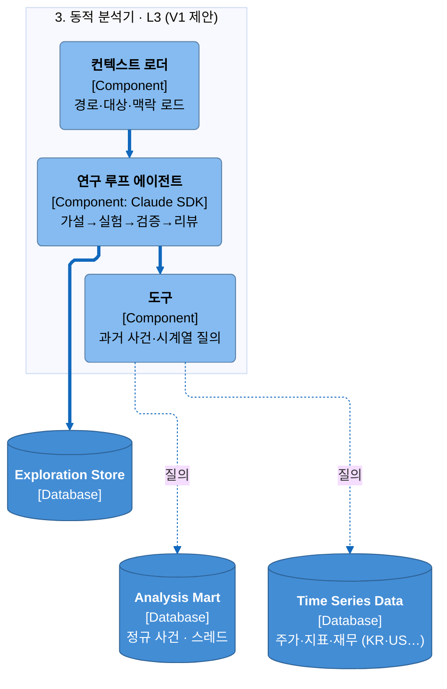
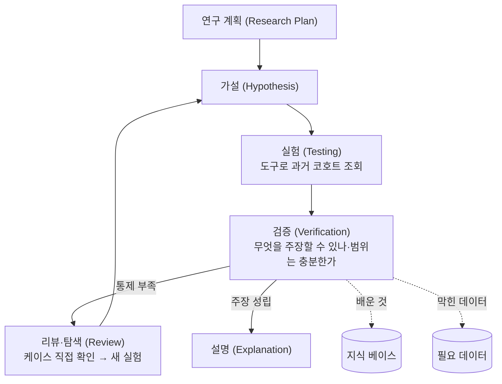

# 제안 0004 — 동적 분석기 확장 (연구 루프 에이전트, V1)

> **상태: Proposed.** 현재 동적 분석기는 한 번 훑고 설명을 내는 단순 에이전트(V0, [베이스라인 §5](../baseline/analysis-engine-design.md))다. 이 문서는 그 에이전트를 **가설 → 실험 → 검증 → 리뷰**의 연구 루프로 키우고, 과거 사건·시계열을 직접 질의하는 **도구(Tools)**를 붙이는 확장안이다. 아직 만들지 않았다.

## Context

V0는 "이 종목의 남은 움직임을 설명하라"는 목표를 받아 한 번의 LLM 호출로 설명 초안을 낸다. 이 방식의 한계:

- **통제되지 않은 주장** — "이 계약이 중요하다"고 말할 때, 과거 비슷한 사건들과 비교해 실제로 그런지 확인하는 절차가 없다. 근거 없는 중요도 주장이 섞일 수 있다.
- **누적되지 않는 학습** — 매번 새로 판단하고, "어떤 조건의 계약이 실제로 주가에 반응을 일으켰는지" 같은 배운 것이 남지 않는다.
- **필요 데이터가 드러나지 않음** — "성장 가설을 확인하려면 애널리스트 리포트가 필요하다"처럼, 설명을 막는 데이터 공백이 표면화되지 않는다.

## Goals

- 동적 분석기를 **가설을 세우고 과거 데이터로 검증한 뒤 주장 범위를 스스로 점검**하는 연구 루프로 만든다.
- 에이전트가 **과거 사건·시계열을 직접 질의하는 도구**를 통해 근거를 모으게 한다.
- 루프가 배운 것을 **지식 베이스**에 남기고, 설명을 막는 **필요 데이터**를 드러내게 한다.

## Non-goals

- V0(현재 단순 에이전트) 자체 — [베이스라인](../baseline/analysis-engine-design.md)이 소유한다.
- 도구가 읽는 사건 마트·시계열의 물리 스키마 — [specs](../specs)가 소유한다.
- 사건-가격 방향·타이밍 인과 판정 — 시스템 어디에서도 하지 않는다는 원칙은 확장 후에도 유지한다.

## Design

### 확장 후 컴포넌트 (제안, C4 L3)

에이전트에 **Tools** 입력이 추가되고, 그 도구가 분석 마트(사건·스레드)와 시계열 데이터를 질의한다. 점선은 아직 만들지 않은 접근이다.

### 연구 루프 (런타임)

한 번의 설명이 아니라, 가설을 세우고 과거로 검증한 뒤 주장 범위를 점검하는 반복이다. 검증이 불충분하면 리뷰를 거쳐 가설을 다시 세운다.

### 도구가 여는 것

- **사건 마트 질의** — 정규 뉴스·공시·해외 뉴스·정부 발표에서 만든 **정규 사건(Canonical Event)**과 **사건 스레드(Event Thread)**. "같은 업종에서 비슷한 규모의 계약 사건들"을 조회할 수 있다.
- **시계열 질의** — 시장별(KR·US·…) 주가, 경제 지표, 과거 재무제표. "그 사건들 이후의 주가 흐름"을 확인할 수 있다.

### 예시 흐름 (반도체 공급계약)

1. **가설** — "과거 동종 업종 기업이 매출 대비 비슷한 규모의 계약을 체결한 뒤 주가 흐름이 좋았을 것이다." (사건 피처 예: `SIGN_VOLUME` = 계약 금액 / 전체 매출 = 20%)
2. **실험** — `Tool(테마='반도체', 사건유형=COMPANY.CONTRACT.SIGNING, 피처=SIGN_VOLUME, 20%, 조건='upper')` → `Check_after_event(현재 데이터)`.
3. **관측** — "과거에도 이런 패턴을 보였다."
4. **검증** — 이 실험으로 주장 가능한 것과 아닌 것은? 처음 보이려던 것을 보였나? 가설 범위가 너무 좁지 않았나?
5. **리뷰·탐색** — 케이스별로 충분히 통제되지 않았다 → 케이스를 직접 보고, 어떻게 통제해야 가설을 입증할 수 있을지 정해 새 실험을 만든다.
6. **지식 베이스** — "매출 대비 15% 이상 계약이면서 상대 기업이 우량하고 당해 실적에 바로 영향을 주는 계약에 사람들이 반응한다"를 저장. 주요 제품 성장 가설을 뒷받침하는 증거로도 쓰일 수 있음.
7. **필요 데이터** — "각 회사의 성장 가설을 알려면 애널리스트 리포트 데이터가 필요하다"를 드러낸다.
8. **결론** — "이 사건은 ~ 때문에 중요하다."

## Alternatives

- **V0(단일 패스) 유지** — 구현이 단순하지만 교란요인을 통제하지 못하고 학습이 누적되지 않는다. 근거 없는 중요도 주장 위험이 남아 기각.
- **규칙만으로 중요도 판정** — 사건 중요도를 고정 규칙으로 정하는 안. 새 유형·맥락에 취약하고, "왜 중요한가"의 서사를 만들지 못해 부적합.

## Rollout — 승격 조건

- 도구 2종(사건 마트 질의·시계열 질의) 구현 + 과거 N개 케이스에서 루프 실행.
- 검증 단계가 "주장 가능/불가"를 실제로 구분하는지, 통제 부족 시 리뷰로 되돌아가는지 확인.
- 지식 베이스 항목·필요 데이터 항목이 실제로 쌓이는지 확인.
- 승인 시 → 베이스라인 §5를 V1로 갱신 + `decisions/` ADR 증류.

## References

- 현재 동적 분석기(V0): [베이스라인 §5](../baseline/analysis-engine-design.md)
- 사건·스레드 계약: [뉴스 온톨로지 타입](../specs/data/news-ontology-types.md) · [스레드 타입](../specs/data/thread-types.md)
