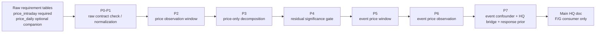
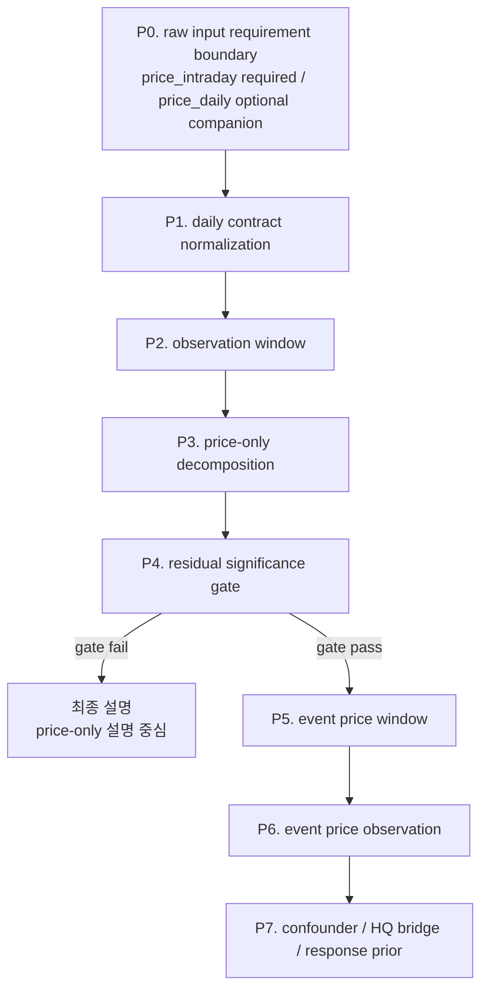

# 가격 관찰·분해 엔진 계약

> **범위 메모:** 본문에 적힌 코드·데이터 경로는 원본 개발 저장소 기준이다. 이 문서 저장소에는 해당 실행 파일이 포함되지 않을 수 있다.

## Summary

이 문서는 PRICE 계층을 raw input requirement ledger인 `price_intraday`와 optional companion ledger인 `price_daily`에서 시작해 **가격 관찰 → 정규화 → 분해 → residual gate → event market verification → HQ bridge**를 설명하는 split-owned 설계 문서다. 목적은 “가격 쪽 로직은 어디까지가 raw input requirement boundary이고, 어디부터가 downstream normalization·mart·bridge인가?”를 한 장에서 고정하는 것이다.

본 문서의 적용 레벨은 **개별 종목(ETF 구성종목 포함)의 분해(L2)와 event-price 검증(P5–P7)**이다. ETF 레벨 1차 분해(항등식)와 라우팅은 [ETF 항등식 분해](etf-identity-decomposition.md)가 소유하며, ETF를 본 문서의 2-leg 모델로 직접 분해하지 않는다.

이 문서는 다음 세 계약을 함께 고정한다.

- **개별 종목의** 가격 설명축은 **시장 수익률 leg**와 **시장 수익률에 직교화한 peer-group 수익률 leg** 두 가지뿐이다. ETF 레벨 1차 분해는 이 계약의 대상이 아니다.
- peer group은 **직전 252거래일 상관 기준 top-3 exact-3**를 쓰며, 후보는 **같은 GICS theme 또는 같은 GICS sub-industry/small category** 안에서만 고른다. peer set은 row마다 익명 재계산하지 않고 **slow-moving as-of contract**로 관리한다.
- `residual_move`는 price-only unexplained move다. 잔차가 의미 있을 때만 이후 A-G 이슈 분석이 깊어지지만, 잔차가 작아도 price-only 분해 결과는 최종 설명에 직접 쓰인다. F와 G7에서 가격은 시장 검증 레이어로 다시 쓰인다.

메인 HQ 문서는 이 문서가 정의한 `security_price_*`, `price_peer_set*`, `price_*`, `event_price_*`, `hq_market_bridge`, `response_prior`를 downstream consumer로만 참조해야 한다. 코드·SQL 표기는 필드 계보와 rollup 로직의 증거일 뿐, 특정 물리 배치를 canonical 경계로 선언하는 근거는 아니다.

## 근거/출처

| 구분 | 경로/아티팩트 | 쓰임 |
|---|---|---|
| 상위 아키텍처 | `docs/engineering/current-architecture.md` | price-first, residual 해석, F/G consumer 경계. ETF identity-first 리비전 기준이며 본 문서의 2-leg 계약은 구성종목 레벨(L2) 적용으로 개정 반영 완료(본문 적용 레벨 절 참조) |
| Ground Rule | `docs/operations/data/edge-db-ground-rules.md:19-35,106-137` | `market`, `ticker`, `trade_date`, `ts_utc` 식별자·시간 규칙 |
| intraday→daily lineage | `src/alphamale/analytics/factors/database.py:473-519` | `price_daily.trade_date`/`return` 계보와 last-bar rollup 예시 |
| legacy intraday dependency | `src/alphamale/analytics/factors/pipeline.py:113-120` | 기존 KR 파이프라인의 legacy table-name 기대 경로 |
| export naming example | `src/alphamale/analytics/context/price_export.py:284-306` | daily/intraday table-name CLI 예시 |
| peer research | `../../archive/research/ff5-cluster-pilot/07-nearest-peer-regression.md`; `../../archive/research/ff5-cluster-pilot/08-pareto-peer-explanation.md`; `../../archive/research/ff5-cluster-pilot/04-oos-models-and-gics-hierarchy.md` | 252일 lookback, exact-3, same-theme / same-sub-industry, market orthogonalization 근거 |
| response prior artifact | `data/interim/events/_response_priors.json`; `src/alphamale/events/etf/response_priors.py:1-12,191-206` | `response_prior` artifact 기준과 bridge reference shape |

## 0. Raw input requirement tables

이 문서에서 raw requirement boundary는 `price_intraday`다. `price_daily`는 downstream 진입 전에 함께 준비되어 있으면 가장 단순한 companion ledger이며, 필요하면 upstream raw-prep이 `price_intraday`를 일봉화해 채울 수 있다. 이름은 **설계 요구사항**이며, 특정 DB/schema/table의 존재를 뜻하지 않는다.

| 테이블 | 역할 | 필수 grain / 핵심 필드 |
|---|---|---|
| `price_intraday` | 필수 raw intraday ledger | `(market, ticker, ts_utc)` 또는 동등 UTC 시각 축, `open`, `high`, `low`, `close`, nullable `adj_close`, nullable `volume`, nullable `dollar_vol`, nullable `asof`, nullable `data_version` |
| `price_daily` | optional raw daily companion ledger | `(market, ticker, trade_date)`, nullable `open`, `high`, `low`, `close`, nullable `adj_close`, nullable `volume`, nullable `dollar_vol`, nullable `return`, nullable `log_return`, nullable `price_basis`, nullable `return_policy`, nullable `asof`, nullable `data_version` |
<details>
<summary>예시 JSON</summary>

```json
{
  "price_intraday": {
    "market": "KR",
    "ticker": "373220",
    "ts_utc": "2026-07-08T01:22:31Z",
    "open": 409000,
    "high": 413000,
    "low": 408500,
    "close": 412000,
    "adj_close": null,
    "volume": 185320,
    "dollar_vol": 76358400000,
    "asof": "2026-07-08T02:00:00Z",
    "data_version": "price_v2026-07-08_01"
  },
  "price_daily": {
    "market": "KR",
    "ticker": "373220",
    "trade_date": "2026-07-08",
    "open": 404000,
    "high": 413000,
    "low": 403500,
    "close": 412000,
    "adj_close": 412000,
    "volume": 1284300,
    "dollar_vol": 528000000000,
    "return": 0.0184,
    "log_return": 0.0182,
    "price_basis": "adj_close",
    "return_policy": "close_to_close_v1",
    "asof": "2026-07-08T09:10:00Z",
    "data_version": "price_v2026-07-08_01"
  }
}
```

</details>

## Split boundary



- 이 문서의 시작점은 raw requirement ledger `price_intraday`다. `price_daily`는 downstream 진입 전에 함께 준비될 수 있는 optional companion ledger이며, 물리 schema, DB, 적재 책임은 이 문서 바깥에서 소유한다.
- `price_daily.trade_date`/`return` 계보, legacy intraday dependency, export naming example은 모두 `근거/출처`의 intraday→daily lineage, legacy intraday dependency, export naming example 항목을 따른다. 이 문서의 raw input boundary는 기존 물리 테이블명에 묶이지 않는다.
- `security_price_intraday`, `security_price_daily`, `price_observation_window`, `price_peer_set`, `price_peer_set_member`, `price_decomposition_observation`, `event_price_window`, `event_price_observation`, `event_confounder_link`, `hq_market_bridge`, `response_prior`는 이 문서가 정의하는 **downstream normalization / mart / bridge persistence**다.
- `response_prior`는 measured prior JSON artifact를 bridge에서 참조 가능한 계약으로 승격한 것이다. 물리 table이 없더라도 기준 artifact는 `data/interim/events/_response_priors.json`이다.

## Implementation lineage anchors

| 질문 | 근거/출처 참조 | 의미 |
|---|---|---|
| downstream 이전에 어떤 raw table 경계를 요구하나 | 이 문서 Summary / `0. Raw input requirement tables` | raw input boundary |
| `price_daily`에 기대하는 `trade_date`/`return` 계보는 무엇인가 | intraday→daily lineage | intraday에서 daily companion을 준비하는 rollup lineage evidence |
| 코드 lineage가 어떤 legacy intraday dependency를 예시로 보이나 | legacy intraday dependency | legacy naming evidence; requirement boundary 아님 |
| 가격 export는 어떤 naming convention을 기본 예시로 두나 | export naming example | naming example only |
| 잔차를 어떻게 읽어야 하나 | 상위 아키텍처 / price module note | residual over-claim 방지 |
| peer leg은 어떤 해석을 조심해야 하나 | peer research | peer leg 해석 경계 |

## Raw requirement boundary vs downstream persistence
| ERD 구간 | 필요한 입력 테이블/아티팩트 | 최종 출력 마트/브리지 | 중간 산출(최종 아님) | 상태/owner |
|---|---|---|---|---|
| price-only observation/decomposition | `price_intraday`, optional `price_daily` | `security_price_daily`, `price_observation_window`, `price_peer_set`, `price_peer_set_member`, `price_decomposition_observation`, `residual_gate_output` logical artifact [INFERENCE] | `security_price_intraday` | current / `security_price_intraday` alias-only, downstream persistence deferred where stated |
| event-price verification + HQ bridge | `canonical_event`, `event_evidence`, `price_decomposition_observation`, `security_price_daily` 또는 `security_price_intraday`, `data/interim/events/_response_priors.json`, market calendar / reaction-window policy artifact [INFERENCE] | `event_price_window`, `event_price_observation`, `event_confounder_link`, `hq_market_bridge`, `response_prior` | 없음 | current / event-price · HQ bridge owner, physicalization deferred where stated |

## Current State and Proposed Contract

### 1. PRICE pipeline overview



핵심 원칙은 세 가지다.

1. **price-first**: 뉴스·공시보다 먼저 가격 관찰과 분해가 수행된다.
2. **residual is not causality**: `residual_move`는 시장 leg와 시장-직교 peer leg로 설명되지 않은 **price-only unexplained move**이며, 원인 확정 문장이 아니다.
3. **HQ consumer contract**: HQ는 F/G 단계에서만 이 테이블들을 재소비한다. 즉 가격은 해석을 보강하는 market verification layer다.

### 입출력 테이블 맵
| ERD 구간 | 필요한 입력 테이블/아티팩트 | 최종 출력 마트/브리지 | 중간 산출(최종 아님) | 상태/owner |
|---|---|---|---|---|
| P0-P4. price-only observation/decomposition | `price_intraday`, optional `price_daily`, measurement-window policy artifact [INFERENCE], decomposition coefficient artifact [INFERENCE] | `security_price_daily`, `price_observation_window`, `price_peer_set`, `price_peer_set_member`, `price_decomposition_observation`, `residual_gate_output` logical artifact [INFERENCE] | `security_price_intraday` | current / `security_price_intraday` alias-only, downstream persistence deferred where stated |
| P5-P7. event-price verification + HQ bridge | `canonical_event`, `event_evidence`, `price_decomposition_observation`, `security_price_daily` 또는 `security_price_intraday`, market calendar / reaction-window policy artifact [INFERENCE], `data/interim/events/_response_priors.json` | `event_price_window`, `event_price_observation`, `event_confounder_link`, `hq_market_bridge`, `response_prior` | 없음 | current / event-price · HQ bridge owner, physicalization deferred where stated |

### 2. Stage-by-stage contract

#### P0. Raw input requirement boundary

**의미**

P0는 downstream PRICE 처리가 시작되기 전에 충족되어야 하는 raw input requirement boundary를 고정한다. 필수 입력은 `price_intraday`이며, `price_daily`는 downstream 진입 전에 함께 준비해 둘 수 있는 optional companion ledger다.

**입력 계약**

| 테이블 | 필드 | 의미 |
|---|---|---|
| `price_intraday` | `market`, `ticker`, `ts_utc` | raw intraday natural key. KR `ticker`는 zero-padded TEXT여야 하고, timestamp는 UTC 의미를 유지해야 한다. |
| `price_intraday` | `open`, `high`, `low`, `close`, `adj_close` | intraday 관찰 가격값. `adj_close`는 nullable field로 둘 수 있다 [INFERENCE]. |
| `price_intraday` | `volume`, `dollar_vol`, `asof`, `data_version` | 유동성 diagnostic 및 PIT 재현 metadata [INFERENCE]. |
| `price_daily` | `market`, `ticker`, `trade_date` | optional companion daily key. downstream 일봉 입력을 미리 준비했다면 이 키를 따른다. |
| `price_daily` | `return`, `log_return`, `open`, `high`, `low`, `close`, `adj_close`, `volume`, `dollar_vol`, `price_basis`, `return_policy`, `asof`, `data_version` | optional companion daily row. 값이 준비돼 있으면 P1이 이를 그대로 받아 canonical 일봉 입력으로 정규화한다 [INFERENCE]. |
<details>
<summary>예시 JSON</summary>

```json
{
  "price_intraday": {
    "market": "KR",
    "ticker": "373220",
    "ts_utc": "2026-07-08T01:22:31Z",
    "open": 409000,
    "high": 413000,
    "low": 408500,
    "close": 412000,
    "adj_close": null,
    "volume": 185320,
    "dollar_vol": 76358400000,
    "asof": "2026-07-08T02:00:00Z",
    "data_version": "price_v2026-07-08_01"
  },
  "price_daily": {
    "market": "KR",
    "ticker": "373220",
    "trade_date": "2026-07-08",
    "return": 0.0184,
    "log_return": 0.0182,
    "open": 404000,
    "high": 413000,
    "low": 403500,
    "close": 412000,
    "adj_close": 412000,
    "volume": 1284300,
    "dollar_vol": 528000000000,
    "price_basis": "adj_close",
    "return_policy": "close_to_close_v1",
    "asof": "2026-07-08T09:10:00Z",
    "data_version": "price_v2026-07-08_01"
  }
}
```

</details>

Lineage note: upstream이 `price_daily`를 직접 주지 않더라도 `price_intraday`에서 `trade_date`별 마지막 bar와 수익률을 계산해 companion daily row를 만들 수 있다. 세부 계보는 `근거/출처`의 intraday→daily lineage 항목을 따른다.

읽는/쓰는 contract를 테이블 이름으로 고정하면 P0의 source/sink는 다음과 같다.

| 구간/단계 | 읽는 테이블/아티팩트 | 쓰는 테이블/아티팩트 | 소유/비고 |
|---|---|---|---|
| P0 raw requirement hand-off | upstream market price feed / raw bar artifact [INFERENCE] | `price_intraday` | downstream 전 필수 raw ledger |
| P0 optional companion hand-off | `price_intraday` rollup lineage 또는 upstream daily artifact | `price_daily` | optional raw daily companion |
| P0 lineage alias | `price_intraday` | `security_price_intraday` | downstream alias이며 raw requirement table은 아님 |

**출력 계약**

- required raw hand-off: `price_intraday`
- optional companion hand-off: `price_daily`
- lineage normalized alias: `security_price_intraday` (intraday lineage를 별도 보존할 때)
<details>
<summary>예시 JSON</summary>

```json
{
  "required_raw_handoff": {
    "price_intraday": {
      "market": "KR",
      "ticker": "373220",
      "ts_utc": "2026-07-08T01:22:31Z",
      "close": 412000
    }
  },
  "optional_companion_handoff": {
    "price_daily": {
      "market": "KR",
      "ticker": "373220",
      "trade_date": "2026-07-08",
      "return": 0.0184
    }
  },
  "lineage_normalized_alias": {
    "security_price_intraday": {
      "market": "KR",
      "ticker": "373220",
      "ts_utc": "2026-07-08T01:22:31Z",
      "session_date": "2026-07-08"
    }
  }
}
```

</details>

**필드 메모**

- `price_intraday`가 raw requirement boundary라는 뜻은 downstream이 기존 특정 DB 이름을 source로 고정한다는 뜻이 아니다. 필요한 것은 이 contract shape의 intraday ledger 존재다.
- `price_daily.return`은 직접 공급받아도 되고, upstream이 `close`/`adj_close` 또는 intraday lineage를 사용해 계산해도 된다. 이 문서는 계산 경로보다 **raw requirement ledger와 companion daily 준비 가능성**을 고정한다.
- upstream raw column명이 `ts`라도 intraday lineage alias contract는 `ts_utc`라는 이름을 써서 “UTC 보존 timestamp” 의미를 드러내는 편이 안전하다 [INFERENCE].
- `session_date`는 intraday row가 속한 **현지 거래 세션 날짜**다. `price_intraday`에 직접 저장할 수도 있고 downstream alias에서 파생할 수도 있다 [INFERENCE].

#### P1. Daily contract normalization

**의미**

P1은 optional companion `price_daily`가 이미 준비된 경우 이를 decomposition/HQ가 소비할 canonical daily contract로 정규화하고, companion이 비어 있으면 `price_intraday` lineage에서 동일 contract를 채우는 단계다. KR 코드 lineage의 intraday last-bar rollup은 그 준비 경로의 evidence다 (`근거/출처`의 intraday→daily lineage 참조).

| 읽는 테이블/아티팩트 | 쓰는 테이블/아티팩트 | 비고 |
|---|---|---|
| `price_daily` 또는 `price_intraday` | `security_price_daily` | companion daily가 있으면 그대로 정규화하고, 없으면 intraday lineage에서 채운다 |


**입력 필드**

| 필드 | 의미 |
|---|---|
| `price_daily.market`, `price_daily.ticker`, `price_daily.trade_date` | canonical daily natural key |
| `price_daily.return` | 값이 존재하면 그대로 채택하는 canonical 일간 단순수익률 schema column이다 [INFERENCE]. |
| `price_daily.log_return` | required schema column이다. upstream이 비워 두면 `return`에서 계산하고, `return`도 비어 있으면 `NULL/UNKNOWN`으로 남긴다 [INFERENCE]. |
| `price_daily.close` / `price_daily.adj_close` | required schema column이다. `return`이 없을 때 daily return을 계산하기 위한 가격 basis이며, source 부재 시 `NULL/UNKNOWN`을 허용한다. |
| `price_daily.volume`, `price_daily.dollar_vol` | required schema column인 유동성 diagnostic 입력이다. source 부재 시 `NULL/UNKNOWN`을 허용한다 [INFERENCE]. |
| `price_daily.price_basis`, `price_daily.return_policy`, `price_daily.asof`, `price_daily.data_version` | required schema column인 return 산식, adjusted price 사용 여부, PIT metadata다. 값이 비면 `UNKNOWN` 또는 `NULL`로 남긴다. |
<details>
<summary>예시 JSON</summary>

```json
{
  "price_daily_input": {
    "market": "KR",
    "ticker": "373220",
    "trade_date": "2026-07-08",
    "return": 0.0184,
    "log_return": 0.0182,
    "close": 412000,
    "adj_close": 412000,
    "volume": 1284300,
    "dollar_vol": 528000000000,
    "price_basis": "adj_close",
    "return_policy": "close_to_close_v1",
    "asof": "2026-07-08T09:10:00Z",
    "data_version": "price_v2026-07-08_01"
  }
}
```

</details>

**출력 필드**

| 필드 | 의미 |
|---|---|
| `market`, `ticker`, `trade_date` | daily grain natural key |
| `return` | canonical 일간 단순수익률 required schema column |
| `log_return` | canonical 일간 로그수익률 required schema column. `return`이 unresolved면 `NULL/UNKNOWN`으로 남긴다 |
| `close`, `adj_close` | return 산식 검증과 재계산을 위한 required schema column. 값은 source 부재 시 `NULL/UNKNOWN` 가능 |
| `volume`, `dollar_vol` | 거래일 유동성/거래량 diagnostic용 required schema column. 값은 source 부재 시 `NULL/UNKNOWN` 가능 |
| `price_basis`, `return_policy` | 어떤 입력과 산식으로 return을 확정했는지 |
| `asof`, `data_version` | PIT 재현과 데이터 버전 추적 |
<details>
<summary>예시 JSON</summary>

```json
{
  "security_price_daily": {
    "market": "KR",
    "ticker": "373220",
    "trade_date": "2026-07-08",
    "return": 0.0184,
    "log_return": 0.0182,
    "close": 412000,
    "adj_close": 412000,
    "volume": 1284300,
    "dollar_vol": 528000000000,
    "price_basis": "adj_close",
    "return_policy": "close_to_close_v1",
    "asof": "2026-07-08T09:10:00Z",
    "data_version": "price_v2026-07-08_01"
  }
}
```

</details>

**정규화 로직**

- `price_daily.return`이 존재하면 P1은 그 값을 canonical daily return으로 채택하고, `return_policy`에 upstream 산식을 남긴다 [INFERENCE].
- `price_daily.return`이 없고 `close`/`adj_close`가 있으면 `px_t`를 선택해 `return_t = px_t / px_{t-1} - 1`로 계산한다. `adj_close` 우선 여부는 `price_basis`/`return_policy`가 소유한다 [INFERENCE].
- `price_daily.return`이 없고 `close`/`adj_close`도 모두 비어 있으면 `return`과 `log_return`은 `NULL/UNKNOWN`으로 남기고 gap을 명시한다 [INFERENCE].
- `log_return`이 비어 있고 `return_t`가 확정되면 `log_return_t = ln(1 + return_t)`로 계산한다. `return_t`도 비어 있으면 `NULL/UNKNOWN`을 유지한다 [INFERENCE].
- KR factor code lineage는 intraday table을 Seoul `trade_date`로 묶고 가장 늦은 `ts`의 `close`에서 `ret_1d`를 만든다. 이는 upstream raw-prep이 `price_daily`를 채울 때 참고할 lineage evidence이지, 이 문서의 downstream 시작 경계를 규정하는 문장은 아니다 (`근거/출처`의 Ground Rule 참조).

#### P2. Observation window

**의미**

P2는 event-specific replay 창(P5/P6) 이전 단계에서, non-event/daily/session decomposition에 공통으로 쓰는 generic PIT observation-window spec이다. 즉 데이터 소스 자체도 아니고 수익률 값 자체도 아니다. 이 창은 opaque interval label이 아니라 `start_ts/end_ts`로 materialize되는 UTC 가격 측정 구간이며, 같은 가격 row라도 어떤 측정 구간과 anchor policy로 보느냐에 따라 해석이 달라지므로 P3 분해 전에 first-class entity로 확정한다.

- `daily_close_to_close`: 예를 들어 2026-07-08 한 row는 “2026-07-07 종가 → 2026-07-08 종가” 수익률을 본다는 뜻이다.

P2는 아직 causality나 residual을 계산하지 않는다. 여기서는 target/market/peer가 모두 같은 measurement interval에서 비교되도록 UTC price measurement interval과 PIT anchor를 고정하고, 이후 HQ가 “정확히 어느 구간을 검사했는가”를 재현할 수 있게 한다. persisted contract에는 `now`를 쓰지 않고, runtime의 `now`가 필요하면 저장 전에 `evaluation_asof`로 정규화한다.

| 읽는 테이블/아티팩트 | 쓰는 테이블/아티팩트 | 비고 |
|---|---|---|
| `security_price_daily`, `security_price_intraday`, measurement-window policy artifact [INFERENCE] | `price_observation_window` | downstream decomposition과 HQ replay가 같은 UTC measurement interval을 읽게 고정 |

**입력 필드**

| 필드 | 의미 |
|---|---|
| `market`, `ticker` | 관찰 대상 자연키 |
| `start_ts`, `end_ts` | 관찰할 가격 move의 UTC 경계. 즉 generic daily/session 창에서 실제로 측정한 **UTC price measurement interval**의 시작/끝 시각이다 |
| `anchor_trade_date` | 창을 대표하는 거래일. downstream 정렬과 재현 기준으로 사용 |
| `window_kind` | generic daily/session 창 taxonomy. 예: `daily_close_to_close`. interval label만 저장하는 것이 아니라 어떤 UTC measurement interval을 읽었는지 해석하는 key다 |
| `evaluation_asof`, `data_version` | 시뮬레이션된 정보 cutoff와 데이터 버전 |
| `confounder_policy` | 후속 event overlap 판정 규칙 이름 [INFERENCE] |
<details>
<summary>예시 JSON</summary>

```json
{
  "price_observation_window_input": {
    "market": "KR",
    "ticker": "373220",
    "start_ts": "2026-07-07T06:30:00Z",
    "end_ts": "2026-07-08T06:30:00Z",
    "anchor_trade_date": "2026-07-08",
    "window_kind": "daily_close_to_close",
    "evaluation_asof": "2026-07-08T09:10:00Z",
    "data_version": "price_v2026-07-08_01",
    "confounder_policy": "event_overlap_v1"
  }
}
```

</details>

**출력 계약**

- `price_observation_window`
- PK: `window_id`
- grain: “관찰 대상 1개 × measurement-interval policy 1개 × anchor 1개”

<details>
<summary>예시 JSON</summary>

```json
{
  "price_observation_window": {
    "window_id": "pricewin:KR:373220:daily_close_to_close:2026-07-08",
    "market": "KR",
    "ticker": "373220",
    "window_kind": "daily_close_to_close",
    "start_ts": "2026-07-07T06:30:00Z",
    "end_ts": "2026-07-08T06:30:00Z",
    "anchor_trade_date": "2026-07-08"
  }
}
```

</details>

**출력 필드**

| 필드 | 의미 |
|---|---|
| `window_id` | 관찰창 식별자 |
| `market`, `ticker` | 어떤 자산의 창인지 나타내는 자연키 |
| `window_kind` | generic daily/session measurement interval을 구분하는 taxonomy key |
| `start_ts`, `end_ts` | 고정된 UTC price measurement interval 경계 |
| `anchor_trade_date` | 이 창을 대표하는 거래일 |
| `confounder_policy` | 후속 event overlap 판정 규칙 |
| `evaluation_asof`, `data_version` | PIT 재현용 정보 cutoff와 데이터 revision 추적 |
<details>
<summary>예시 JSON</summary>

```json
{
  "price_observation_window": {
    "window_id": "pricewin:KR:373220:daily_close_to_close:2026-07-08",
    "market": "KR",
    "ticker": "373220",
    "window_kind": "daily_close_to_close",
    "start_ts": "2026-07-07T06:30:00Z",
    "end_ts": "2026-07-08T06:30:00Z",
    "anchor_trade_date": "2026-07-08",
    "confounder_policy": "event_overlap_v1",
    "evaluation_asof": "2026-07-08T09:10:00Z",
    "data_version": "price_v2026-07-08_01"
  }
}
```

</details>


**변환 로직**

- `window_id`는 대상 자산, measurement-interval policy, 창 경계를 함께 고정하는 surrogate identifier다.
- 같은 종목이라도 서로 다른 daily/session 창은 섞지 않는다. `window_kind`와 (`start_ts`, `end_ts`)가 같은 measurement interval을 보장한다.
- persisted row에는 `now`를 남기지 않는다. runtime anchor가 현재 시각이라면 저장 전에 항상 `evaluation_asof`로 치환한다.
- `anchor_trade_date`는 이후 `price_peer_set` / `price_peer_set_member`의 evaluation-asof validity를 판정하는 기준일이기도 하다. 즉 P3는 window마다 익명 peer basket을 즉석 재생성하지 않고, anchor 시점에 유효한 slow-moving peer set을 참조한다.

#### P3. Price-only decomposition

**의미**

P3는 상위 아키텍처의 price-only explanation을 **정확히 2-leg 계약**으로 고정한다. 현재 문서의 설명축은 (1) broad market return과 (2) **같은 날 peer raw return을 market return에 선형회귀해 직교화한 peer return**뿐이다. 여기에는 서로 다른 두 상수항 개념이 있다. `peer_market_intercept`는 peer raw~market 회귀에서 `peer_orth_return`을 만들 때만 쓰이고, `target_intercept_return`은 target return 회귀의 baseline으로서 `explained_return`에 더해지되 `market_explained_return` 안에는 들어가지 않는다. 이전 draft의 `sector` / `correlated-asset` leg는 이 문서에서 retire하며 downstream contract는 더 이상 그 두 leg를 요구하지 않는다.

| 읽는 테이블/아티팩트 | 쓰는 테이블/아티팩트 | 비고 |
|---|---|---|
| `price_observation_window`, `security_price_daily`, `price_peer_set`, `price_peer_set_member`, decomposition coefficient artifact [INFERENCE] | `price_decomposition_observation` | normalized price를 market leg + 시장-직교 peer leg + residual로 분해 |


**입력 필드**

| 범주 | 필드 | 의미 |
|---|---|---|
| 대상 관찰 | `window_id`, `market`, `ticker`, `trade_date`, `return`, `log_return` | target leg |
| market leg | `market_benchmark_id`, `market_return` | broad market move |
| peer-set header | `peer_set_id`, `peer_selection_policy`, `policy_version`, `effective_from_trade_date`, `effective_to_trade_date`, `gics_constraint_kind`, `gics_constraint_value`, `corr_lookback_trade_days`, `corr_lookback_end_trade_date`, `market_benchmark_id` | slow-moving peer cohort header |
| peer-set member | `peer_slot`, `peer_market`, `peer_ticker`, `corr_252d`, `corr_rank`, `member_effective_from_trade_date`, `member_effective_to_trade_date` | exact-3 peer membership |
| regression coefficients | `peer_market_intercept`, `peer_market_beta`, `target_intercept_return`, `beta_market`, `beta_peer` | lookback regression coefficients; physical storage/lookup는 `decomposition_policy`가 소유 |
| diagnostics | `volume_abnormality`, `volatility_change`, `decomposition_policy`, `asof`, `data_version` | gate inputs |
<details>
<summary>예시 JSON</summary>

```json
{
  "target_observation": {
    "window_id": "pricewin:KR:373220:daily_close_to_close:2026-07-08",
    "market": "KR",
    "ticker": "373220",
    "trade_date": "2026-07-08",
    "return": 0.0184,
    "log_return": 0.0182
  },
  "market_leg": {
    "market_benchmark_id": "KRX.KOSPI200",
    "market_return": 0.0061
  },
  "peer_set_header": {
    "peer_set_id": "peerset:KR:373220:2026-07-08",
    "peer_selection_policy": "corr252_exact3_same_theme_v1",
    "policy_version": "v1",
    "effective_from_trade_date": "2026-07-01",
    "effective_to_trade_date": "2026-07-31",
    "gics_constraint_kind": "theme",
    "gics_constraint_value": "Battery",
    "corr_lookback_trade_days": 252,
    "corr_lookback_end_trade_date": "2026-07-07",
    "market_benchmark_id": "KRX.KOSPI200"
  },
  "peer_set_member": {
    "peer_slot": 1,
    "peer_market": "KR",
    "peer_ticker": "006400",
    "corr_252d": 0.84,
    "corr_rank": 1,
    "member_effective_from_trade_date": "2026-07-01",
    "member_effective_to_trade_date": "2026-07-31"
  },
  "regression_coefficients": {
    "peer_market_intercept": 0.0012,
    "peer_market_beta": 1.0,
    "target_intercept_return": 0.0004,
    "beta_market": 0.9180327869,
    "beta_peer": 0.75
  },
  "diagnostics": {
    "volume_abnormality": 1.7,
    "volatility_change": 0.24,
    "decomposition_policy": "mkt_peer_252d_exact3_v1",
    "asof": "2026-07-08T09:10:00Z",
    "data_version": "price_v2026-07-08_01"
  }
}
```

</details>

**출력 계약**

- `price_decomposition_observation`
- PK: `(window_id, market, ticker, trade_date)`
- 핵심 산출: `market_return`, `peer_raw_return`, `peer_orth_return`, `target_intercept_return`, `market_explained_return`, `peer_explained_return`, `explained_return`, `unexplained_return`, `residual_move`
- `peer_market_intercept`, `peer_market_beta`는 `peer_orth_return` 계산을 위한 coefficient 이름이며, 이 문서의 row-level active output field는 아니다. row에는 target baseline인 `target_intercept_return`만 직접 노출한다.
<details>
<summary>예시 JSON</summary>

```json
{
  "price_decomposition_observation_core": {
    "market_return": 0.0061,
    "peer_raw_return": 0.0105,
    "peer_orth_return": 0.0032,
    "target_intercept_return": 0.0004,
    "market_explained_return": 0.0056,
    "peer_explained_return": 0.0024,
    "explained_return": 0.0084,
    "unexplained_return": 0.01,
    "residual_move": 0.01
  }
}
```

</details>

**peer-set 계약**

| 계약 | PK / grain | 핵심 필드 / 제약 |
|---|---|---|
| `price_peer_set` | `peer_set_id` | `market`, `ticker`, `peer_selection_policy`, `policy_version`, `effective_from_trade_date`, `effective_to_trade_date`, `corr_lookback_trade_days=252`, `corr_lookback_end_trade_date`, `gics_constraint_kind`, `gics_constraint_value`, `market_benchmark_id`, `update_reason`, `review_status`, `reviewed_by`, `review_note`, `asof`, `data_version` |
| `price_peer_set_member` | `(peer_set_id, peer_slot)` | `peer_slot ∈ {1,2,3}`만 허용, `peer_market`, `peer_ticker`, `corr_252d`, `corr_rank`, `member_effective_from_trade_date`, `member_effective_to_trade_date`, duplicate peer 금지, `peer_ticker != target ticker`, peer set은 정확히 3개 live member가 있을 때만 usable |
<details>
<summary>예시 JSON</summary>

```json
{
  "price_peer_set": {
    "peer_set_id": "peerset:KR:373220:2026-07-08",
    "market": "KR",
    "ticker": "373220",
    "peer_selection_policy": "corr252_exact3_same_theme_v1",
    "policy_version": "v1",
    "effective_from_trade_date": "2026-07-01",
    "effective_to_trade_date": "2026-07-31",
    "corr_lookback_trade_days": 252,
    "corr_lookback_end_trade_date": "2026-07-07",
    "gics_constraint_kind": "theme",
    "gics_constraint_value": "Battery",
    "market_benchmark_id": "KRX.KOSPI200",
    "update_reason": "scheduled_monthly_refresh",
    "review_status": "reviewed",
    "reviewed_by": "analyst.price",
    "review_note": "stable exact-3 cohort",
    "asof": "2026-07-08T09:10:00Z",
    "data_version": "price_v2026-07-08_01"
  },
  "price_peer_set_member": {
    "peer_set_id": "peerset:KR:373220:2026-07-08",
    "peer_slot": 1,
    "peer_market": "KR",
    "peer_ticker": "006400",
    "corr_252d": 0.84,
    "corr_rank": 1,
    "member_effective_from_trade_date": "2026-07-01",
    "member_effective_to_trade_date": "2026-07-31"
  }
}
```

</details>

**필드 의미와 pseudo-formula**

```text
target_return_t := return_t
market_return_t := return(market benchmark identified by market_benchmark_id, t)
peer_raw_return_t := (return_peer_slot1,t + return_peer_slot2,t + return_peer_slot3,t) / 3
peer_raw_return_t = peer_market_intercept + peer_market_beta * market_return_t + peer_orth_return_t
peer_orth_return_t := peer_raw_return_t - (peer_market_intercept + peer_market_beta * market_return_t)
```

```text
target_return_t := target_intercept_return_t + beta_market * market_return_t + beta_peer * peer_orth_return_t + residual_move_t
market_explained_return_t := beta_market * market_return_t
peer_explained_return_t := beta_peer * peer_orth_return_t
explained_return_t := target_intercept_return_t + market_explained_return_t + peer_explained_return_t
unexplained_return_t := target_return_t - explained_return_t
residual_move_t := unexplained_return_t
```

- peer set 선택 규칙은 **직전 252거래일 상관 기준 top-3**이며, 후보는 **같은 GICS theme 또는 같은 GICS sub-industry/small category** 제약 안에서만 뽑는다. peer count는 정확히 3이다. 세부 근거는 `근거/출처`의 peer research 항목을 따른다.
- `peer_market_intercept`, `peer_market_beta`는 peer raw return을 market return에 회귀한 lookback regression 계수이고, `target_intercept_return`, `beta_market`, `beta_peer`는 target return 회귀 계수다. coefficient storage 방식은 `decomposition_policy`가 소유한다.
- 평균 제거(centered)·무상수항(no-intercept) 정책을 쓰는 경우에도 주 decomposition 계약에서는 `target_intercept_return` column을 생략하지 않는다. 그 경우 `target_intercept_return_t = 0`을 구조적으로 저장하고 `market_explained_return_t`는 계속 `beta_market * market_return_t`를 뜻한다. 왜 0이 되었는지는 `decomposition_policy`에 기록한다.
- `residual_move`는 **price-only unexplained move**다. 즉 `target_intercept_return`, `market_explained_return`, `peer_explained_return`로 설명되고 남은 signed move일 뿐, “뉴스나 공시가 원인이다”를 증명하지 않는다. 해석 경계는 `근거/출처`의 상위 아키텍처, price module note, peer research 항목을 따른다.
- 같은 날 peer component는 attribution이지 prediction이 아니다. 252일 창·exact-3·동종업종 제약에서만 OOS 설명력이 안정적이라는 점까지 함께 읽어야 한다.

**보조 지표 formula**

```text
volume_abnormality_t
  := zscore(log(1 + volume_t), clean lookback window for same security)         [INFERENCE]
```

```text
realized_vol_t := rolling_std(log_return over clean lookback window for same security)  [INFERENCE]
baseline_realized_vol_t := rolling_std(log_return over baseline lookback window)         [INFERENCE]
volatility_change_t := realized_vol_t / baseline_realized_vol_t - 1                      [INFERENCE]
```

- `volume_abnormality`와 `volatility_change`는 residual gate를 보조하는 “움직임의 비정상성” 지표다. canonical contract는 rolling `std(log_return)` 기반 변동성 변화율이며, intraday RV 대체는 future/deferred policy extension으로만 다룬다 [INFERENCE].

#### P4. Residual significance gate

**의미**

P4는 “잔차가 의미 있는가”를 판정해, price-only 설명만으로 최종 설명을 끝낼지 아니면 대상 자산 이슈 분석으로 진입할지 가른다. 상위 판정 경계는 `근거/출처`의 상위 아키텍처를 따른다.

| 읽는 테이블/아티팩트 | 쓰는 테이블/아티팩트 | 비고 |
|---|---|---|
| `price_decomposition_observation` | `residual_gate_output` logical artifact [INFERENCE] | gate 결과는 price-only 종료 여부와 P5/P7 진입 판단을 전달 |


**입력 필드**

- `price_decomposition_observation.target_return`
- `market_return`, `peer_raw_return`, `peer_orth_return`
- `target_intercept_return`, `market_explained_return`, `peer_explained_return`, `explained_return`, `unexplained_return`, `residual_move`
- `decomposition_policy`가 소유한 lookback coefficient semantics (`peer_market_intercept`, `peer_market_beta`, `beta_market`, `beta_peer`)
- `volume_abnormality`, `volatility_change`
<details>
<summary>예시 JSON</summary>

```json
{
  "residual_gate_input": {
    "target_return": 0.0184,
    "market_return": 0.0061,
    "peer_raw_return": 0.0105,
    "peer_orth_return": 0.0032,
    "target_intercept_return": 0.0004,
    "market_explained_return": 0.0056,
    "peer_explained_return": 0.0024,
    "explained_return": 0.0084,
    "unexplained_return": 0.01,
    "residual_move": 0.01,
    "volume_abnormality": 1.7,
    "volatility_change": 0.24,
    "decomposition_policy": "mkt_peer_252d_exact3_v1"
  }
}
```

</details>

**출력 필드**

| 필드 | 의미 |
|---|---|
| `residual_move` | signed unexplained move |
| `residual_significance_score` | gate score [INFERENCE] |
| `residual_gate_status` | `pass` / `fail` / `review` (`review` 진입 조건은 미정 — Open) [INFERENCE] |
| `gate_reason` | `target_intercept_return`, `market_explained_return`, `peer_explained_return` 이후에도 남는 unexplained move가 왜 gate를 통과했는지 기록 [INFERENCE] |
<details>
<summary>예시 JSON</summary>

```json
{
  "residual_gate_output": {
    "residual_move": 0.01,
    "residual_significance_score": 2.48,
    "residual_gate_status": "pass",
    "gate_reason": "abs_residual_z>=z_threshold"
  }
}
```

</details>

**pseudo-formula**

```text
residual_sigma_t := std(unexplained_return over clean lookback window)           [INFERENCE]
residual_z_t := residual_move_t / NULLIF(residual_sigma_t, 0)                    [INFERENCE]
```

```text
residual_gate_status_t :=
  pass   if abs(residual_z_t) >= z_threshold
           or (abs(residual_move_t) >= abs_threshold
               and (abs(volume_abnormality_t) >= volu_threshold
                    or abs(volatility_change_t) >= vol_threshold))                [INFERENCE]
  fail   otherwise                                                                [INFERENCE]
```

- threshold 숫자 자체는 구현 근거가 없으므로 `decomposition_policy`가 소유해야 한다 [INFERENCE].
- 중요한 점은 gate가 **원인을 증명하는 단계가 아니라**, “price-only로는 아직 다 설명되지 않는다”를 선언하는 단계라는 점이다.

#### P5. Event price window

**의미**

P5는 뉴스/공시 문서에서 정의된 `canonical_event`를 price layer에 붙여, F/G에서 쓸 **시장 검증용** 창을 만든다. event 생성 책임은 이 문서 바깥이고, 이 문서는 그 event가 어떤 UTC price measurement interval로 검증되는지만 정의한다. HQ 연결 맥락은 `근거/출처`의 메인 HQ consumer contract를 따른다.

| 읽는 테이블/아티팩트 | 쓰는 테이블/아티팩트 | 비고 |
|---|---|---|
| `canonical_event`, `event_evidence`, market calendar / reaction-window policy artifact [INFERENCE] | `event_price_window` | 뉴스/공시 event를 price verification window로 변환 |


**입력 필드**

| 필드 | 의미 |
|---|---|
| `event_id` | canonical event 식별자 |
| `anchor_evidence_ref` / `event_evidence_ref` | `anchor_available_at`을 입증하는 뉴스/공시 provenance ref |
| `market`, `ticker` | 반응을 볼 대상 자산 |
| `anchor_available_at` | news/disclosure/event evidence가 시장 참여자에게 action 가능하게 공개된 UTC anchor 시각 |
| `window_start`, `window_end` | event가 raw로 들고 오는 값이 아니라, PRICE layer가 `anchor_available_at`·시장 캘린더/세션 규칙·reaction window policy에서 계산한 UTC price measurement interval 경계. 항상 `window_end <= evaluation_asof` |
| `confounder_policy` | overlap/usable-window 판단 정책 |
| `evaluation_asof`, `data_version` | PIT 재현용 정보 cutoff와 버전 |
<details>
<summary>예시 JSON</summary>

```json
{
  "event_price_window_input": {
    "event_id": "event:KR:373220:2026-07-08:contract_signing",
    "anchor_evidence_ref": "newsdoc:yonhap:2026-07-08-001",
    "event_evidence_ref": "event:KR:373220:2026-07-08:contract_signing",
    "market": "KR",
    "ticker": "373220",
    "anchor_available_at": "2026-07-08T07:20:00Z",
    "window_start": "2026-07-08T06:30:00Z",
    "window_end": "2026-07-09T06:30:00Z",
    "confounder_policy": "event_overlap_v1",
    "evaluation_asof": "2026-07-09T09:10:00Z",
    "data_version": "price_v2026-07-09_01"
  }
}
```

</details>

**출력 계약**

- `event_price_window`
- PK: `event_price_window_id`
- grain: “event 1개 × 대상 자산 1개 × policy-derived price measurement interval 1개”

<details>
<summary>예시 JSON</summary>

```json
{
  "event_price_window": {
    "event_price_window_id": "pricewin:event:KR:373220:2026-07-08:default_daily",
    "event_id": "event:KR:373220:2026-07-08:contract_signing",
    "market": "KR",
    "ticker": "373220",
    "window_start": "2026-07-08T06:30:00Z",
    "window_end": "2026-07-09T06:30:00Z"
  }
}
```

</details>

**출력 필드**

| 필드 | 의미 |
|---|---|
| `event_price_window_id` | 이벤트별 시장 검증창 식별자 |
| `event_id` | 어떤 canonical event의 price verification interval인지 |
| `anchor_evidence_ref` / `event_evidence_ref` | anchor provenance ref |
| `market`, `ticker` | 반응을 측정할 대상 자산 |
| `window_start`, `window_end` | 시장 검증에 쓰는 UTC price measurement interval 경계. 입력 event payload가 아니라 PRICE layer 파생값 |
| `anchor_available_at` | 시장에 event evidence가 알려진 anchor 시각. 공개·배포 evidence timestamp 자체를 받는다 |
| `confounder_policy` | overlap/usable-window 판정에 쓸 규칙 |
| `evaluation_asof`, `data_version` | PIT 재현 metadata |
<details>
<summary>예시 JSON</summary>

```json
{
  "event_price_window": {
    "event_price_window_id": "pricewin:event:KR:373220:2026-07-08:default_daily",
    "event_id": "event:KR:373220:2026-07-08:contract_signing",
    "anchor_evidence_ref": "newsdoc:yonhap:2026-07-08-001",
    "event_evidence_ref": "event:KR:373220:2026-07-08:contract_signing",
    "market": "KR",
    "ticker": "373220",
    "window_start": "2026-07-08T06:30:00Z",
    "window_end": "2026-07-09T06:30:00Z",
    "anchor_available_at": "2026-07-08T07:20:00Z",
    "confounder_policy": "event_overlap_v1",
    "evaluation_asof": "2026-07-09T09:10:00Z",
    "data_version": "price_v2026-07-09_01"
  }
}
```

</details>


**변환 로직**

**정책 파생 규칙**

- `anchor_available_at`은 news/disclosure/event evidence의 공개·배포 시각을 받으며, event가 시장에서 actionable해지는 기준 시각으로 해석한다.
- `anchor_evidence_ref` / `event_evidence_ref`는 그 anchor 시각의 provenance를 남긴다.
- `window_start/window_end`는 raw event input field가 아니라 PRICE layer 파생값이다. 계산 입력은 `anchor_available_at`, 시장 캘린더/세션 규칙, 그리고 named reaction window policy다.
- default daily 검증 policy에서는 `window_start`를 `anchor_available_at` 기준 직전 또는 동시점 마지막 정규장 종가 시각으로 두고, `window_end`를 그 뒤 첫 eligible 정규장 종가 시각으로 둔다. 이렇게 해야 overnight/pre-open/after-close gap이 빠지지 않는다.
- intraday policy에서는 `window_start`를 `anchor_available_at` 자체 또는 그 직후 첫 eligible bar 시각으로 둘 수 있고, `window_end`는 same-session close 또는 next regular close처럼 policy 이름이 명시한 endpoint를 따른다.
- 따라서 “same-session close”, “next close”, “N trading days after event” 같은 해석은 event row에서 추정하지 않고 policy 이름이 소유한다.
- event-specific replay에서는 항상 `window_end <= evaluation_asof`를 만족해야 한다.
- 이 단계의 목적은 F/G 검증 창을 reproducible하게 다시 열 수 있게 하는 것이다.
- (제안) 이벤트를 **당일 무브의 원인 후보로 쓸 때**는 반응 창 검증과 별도로 선후 판정이 필요하다. default daily policy의 `window_start`는 anchor 이전 당일 무브를 창에 포함하므로, `pre_anchor_move_share`(당일 무브 중 `anchor_available_at` 이전 발생 비율)를 P6 관측에 추가하고 P7 `attribution_status`에 반영한다. 상위 라우팅·정직 출력 계약은 [ETF 항등식 분해](etf-identity-decomposition.md)와 아키텍처 문서가 소유한다. 선후 판정 시각은 이벤트 단독 `available_at`이 아니라 **같은 thread의 최초 `available_at`**을 따른다(소문→확정 체인 오탈락 방지, analysis-engine 교차소스 규칙과 동일 원리). v1 설명 경로는 이 판정을 세션 버킷(PRE_OPEN/INTRADAY/POST_CLOSE, current-architecture 핵심 결정 소유)으로 수행하며, `pre_anchor_move_share`·온셋 탐지는 장중 정밀도가 필요한 후속 확장이다(v1 미사용).

**예시**

- 장후 공시: 예를 들어 정규장 종료 뒤 16:20 현지시각 공시면 default daily policy에서 `window_start=당일 정규장 종가`, `window_end=다음 거래일 정규장 종가`다.
- 장중 뉴스: 예를 들어 13:10 현지시각 뉴스면 intraday same-session policy에서는 `window_start=13:10 시각 또는 다음 eligible bar`, `window_end=당일 정규장 종가`이고, default daily policy에서는 `window_start=직전 정규장 종가`, `window_end=다음 eligible 정규장 종가`다.

#### P6. Event price observation

**의미**

P6는 event window 안에서 실제로 관찰된 반응 수치를 남긴다. 이 row는 **market verification row**이며 causal proof row가 아니다. HQ 연결 맥락은 `근거/출처`의 메인 HQ consumer contract를 따른다.

| 읽는 테이블/아티팩트 | 쓰는 테이블/아티팩트 | 비고 |
|---|---|---|
| `event_price_window`, `security_price_daily` 또는 `security_price_intraday`, `price_decomposition_observation` | `event_price_observation` | event reaction row와 decomposition audit를 함께 남긴다 |


**입력 필드**

- `event_price_window.event_price_window_id`
- `security_price_daily` 또는 `security_price_intraday`
- `price_decomposition_observation`의 `target_intercept_return` audit 값과 market/peer explained-unexplained 진단값
- overlap/confounder candidate set [INFERENCE]
<details>
<summary>예시 JSON</summary>

```json
{
  "event_price_observation_input": {
    "event_price_window_id": "pricewin:event:KR:373220:2026-07-08:default_daily",
    "security_price_daily": {
      "return": 0.021,
      "close": 420500
    },
    "price_decomposition_observation": {
      "target_intercept_return": 0.0004,
      "market_explained_return": 0.0056,
      "peer_explained_return": 0.0024,
      "residual_move": 0.01
    },
    "confounder_candidate": "event:KR:373220:2026-07-08:peer_notice"
  }
}
```

</details>

**출력 필드**

| 필드 | 의미 |
|---|---|
| `event_price_observation_ref` | event reaction row 식별자 |
| `event_price_window_id` | 어떤 event window의 row인지 |
| `market`, `ticker` | 반응을 측정한 대상 자산 |
| `window_start`, `window_end` | 실제로 재생한 event reaction 구간 경계. raw event field가 아니라 `anchor_available_at`에서 파생된 UTC price measurement interval이다 |
| `evaluation_asof`, `data_version` | 이 observation row를 재현하는 PIT cutoff와 버전 |
| `start_price_ts`, `end_price_ts` | 수익률 계산에 실제로 선택된 시작/종료 가격 시각 |
| `ts_utc` | 장중 observation이면 해당 관찰 시각. 일봉 close 기반 row면 nullable |
| `return`, `log_return` | realized move |
| `market_return`, `peer_raw_return`, `peer_orth_return` | explanation legs |
| `target_intercept_return`, `market_explained_return`, `peer_explained_return`, `explained_return`, `unexplained_return`, `residual_move` | decomposition result |
| `volume_abnormality`, `volatility_change` | abnormality diagnostics |
| `window_status` | `complete` / `partial` / `censored` / `no_price` |
| `confounded_flag` | overlap/usable-window 문제 여부 |
<details>
<summary>예시 JSON</summary>

```json
{
  "event_price_observation": {
    "event_price_observation_ref": "eventobs:KR:373220:2026-07-08:default_daily",
    "event_price_window_id": "pricewin:event:KR:373220:2026-07-08:default_daily",
    "market": "KR",
    "ticker": "373220",
    "window_start": "2026-07-08T06:30:00Z",
    "window_end": "2026-07-09T06:30:00Z",
    "evaluation_asof": "2026-07-09T09:10:00Z",
    "data_version": "price_v2026-07-09_01",
    "start_price_ts": "2026-07-08T06:30:00Z",
    "end_price_ts": "2026-07-09T06:30:00Z",
    "ts_utc": null,
    "return": 0.021,
    "log_return": 0.0208,
    "market_return": 0.0061,
    "peer_raw_return": 0.0105,
    "peer_orth_return": 0.0032,
    "target_intercept_return": 0.0004,
    "market_explained_return": 0.0056,
    "peer_explained_return": 0.0024,
    "explained_return": 0.0084,
    "unexplained_return": 0.0126,
    "residual_move": 0.0126,
    "volume_abnormality": 1.9,
    "volatility_change": 0.31,
    "window_status": "complete",
    "confounded_flag": 0
  }
}
```

</details>

**pseudo-formula**

```text
confounded_flag := 1
  if exists overlapping event/disclosure/market-shock within event window
     where overlap_type in {'same_ticker', 'same_theme', 'macro_market', 'earnings_cluster'}
     and attribution_status != 'clean'                                            [INFERENCE]
  else 0                                                                          [INFERENCE]
```

- `confounded_flag = 1`은 “반응이 섞였을 가능성이 높다”는 뜻이지 “이 이벤트가 무효”라는 뜻은 아니다.
- `start_price_ts` / `end_price_ts`는 requested measurement interval이 아니라 실제 선택된 가격 point를 남긴다. event row도 `residual_move := unexplained_return` 정의를 그대로 따른다. 즉 market verification에서도 `target_intercept_return`, `market_explained_return`, `peer_explained_return`를 분리해 읽는다.

#### P7. Confounder link / HQ market bridge / response prior

**의미**

P7은 event reaction을 HQ 실행과 연결하는 마지막 계층이다. 이 단계에서만 `event_confounder_link`, `hq_market_bridge`, `response_prior`가 같이 등장한다.

| 읽는 테이블/아티팩트 | 쓰는 테이블/아티팩트 | 비고 |
|---|---|---|
| `event_price_window`, `event_price_observation`, `canonical_event`, `data/interim/events/_response_priors.json` | `event_confounder_link`, `hq_market_bridge`, `response_prior` | HQ run이 실제로 읽은 verification row와 prior reference sink를 고정 |


**입력 필드**

| 엔터티 | 핵심 입력 |
|---|---|
| `event_confounder_link` | `event_price_window_id`, `confounder_event_id`, `overlap_type`, `usable_window`, `attribution_status`, `evidence_ref` |
| `hq_market_bridge` | `hq_run_id`, `event_id`, `(market, ticker)`, `event_price_window_id`, `event_price_observation_ref`, `response_prior_ref`, `market_verification_status`, `confounder_status` |
| `response_prior` | `event_type_id`, `exposure_bucket`, `market_context_bucket`, `asof`, `analog_count`, `mean_return`, `mean_residual_move`, `median_volume_abnormality`, matching rules |
<details>
<summary>예시 JSON</summary>

```json
{
  "event_confounder_link_input": {
    "event_price_window_id": "pricewin:event:KR:373220:2026-07-08:default_daily",
    "confounder_event_id": "event:KR:373220:2026-07-08:peer_notice",
    "overlap_type": "same_ticker",
    "usable_window": "partial",
    "attribution_status": "confounded",
    "evidence_ref": "newsdoc:yonhap:2026-07-08-019"
  },
  "hq_market_bridge_input": {
    "hq_run_id": "hqrun:2026-07-09:KR:373220",
    "event_id": "event:KR:373220:2026-07-08:contract_signing",
    "market": "KR",
    "ticker": "373220",
    "event_price_window_id": "pricewin:event:KR:373220:2026-07-08:default_daily",
    "event_price_observation_ref": "eventobs:KR:373220:2026-07-08:default_daily",
    "response_prior_ref": "respprior:SIGN:HIGH:KR_RISK_ON:2026-07-08T00:00:00Z",
    "market_verification_status": "verified",
    "confounder_status": "clean"
  },
  "response_prior_input": {
    "event_type_id": "COMPANY.CONTRACT.SIGNING",
    "exposure_bucket": "HIGH",
    "market_context_bucket": "KR_RISK_ON",
    "asof": "2026-07-08T00:00:00Z",
    "analog_count": 24,
    "mean_return": 0.018,
    "mean_residual_move": 0.011,
    "median_volume_abnormality": 1.4,
    "stage_match_rule": "stage:execution",
    "role_match_rule": "role:buyer"
  }
}
```

</details>

**출력 계약**

- `event_confounder_link`
- `hq_market_bridge`
- `response_prior`

<details>
<summary>예시 JSON</summary>

```json
{
  "event_confounder_link": {
    "event_price_window_id": "pricewin:event:KR:373220:2026-07-08:default_daily",
    "confounder_event_id": "event:KR:373220:2026-07-08:peer_notice"
  },
  "hq_market_bridge": {
    "hq_run_id": "hqrun:2026-07-09:KR:373220",
    "event_price_observation_ref": "eventobs:KR:373220:2026-07-08:default_daily",
    "response_prior_ref": "respprior:SIGN:HIGH:KR_RISK_ON:2026-07-08T00:00:00Z"
  },
  "response_prior": {
    "response_prior_ref": "respprior:SIGN:HIGH:KR_RISK_ON:2026-07-08T00:00:00Z",
    "event_type_id": "COMPANY.CONTRACT.SIGNING",
    "analog_count": 24
  }
}
```

</details>

**출력 필드**

| 엔터티 | 핵심 출력 필드 | 의미 |
|---|---|---|
| `event_confounder_link` | `event_price_window_id`, `confounder_event_id`, `overlap_type`, `usable_window`, `attribution_status`, `evidence_ref` | 어떤 겹침 때문에 clean attribution이 약해졌는지 기록 |
| `hq_market_bridge` | `hq_run_id`, `event_id`, `market`, `ticker`, `event_price_window_id`, `event_price_observation_ref`, `response_prior_ref`, `market_verification_status`, `confounder_status` | HQ run이 실제로 소비한 시장 검증 row와 prior ref를 stitch |
| `response_prior` | `response_prior_ref`, `event_type_id`, `exposure_bucket`, `market_context_bucket`, `asof`, `analog_count`, `mean_return`, `mean_residual_move`, `median_volume_abnormality` | 과거 유사 event 반응 요약의 bridgeable contract |
<details>
<summary>예시 JSON</summary>

```json
{
  "event_confounder_link": {
    "event_price_window_id": "pricewin:event:KR:373220:2026-07-08:default_daily",
    "confounder_event_id": "event:KR:373220:2026-07-08:peer_notice",
    "overlap_type": "same_ticker",
    "usable_window": "partial",
    "attribution_status": "confounded",
    "evidence_ref": "newsdoc:yonhap:2026-07-08-019"
  },
  "hq_market_bridge": {
    "hq_run_id": "hqrun:2026-07-09:KR:373220",
    "event_id": "event:KR:373220:2026-07-08:contract_signing",
    "market": "KR",
    "ticker": "373220",
    "event_price_window_id": "pricewin:event:KR:373220:2026-07-08:default_daily",
    "event_price_observation_ref": "eventobs:KR:373220:2026-07-08:default_daily",
    "response_prior_ref": "respprior:SIGN:HIGH:KR_RISK_ON:2026-07-08T00:00:00Z",
    "market_verification_status": "verified",
    "confounder_status": "clean"
  },
  "response_prior": {
    "response_prior_ref": "respprior:SIGN:HIGH:KR_RISK_ON:2026-07-08T00:00:00Z",
    "event_type_id": "COMPANY.CONTRACT.SIGNING",
    "exposure_bucket": "HIGH",
    "market_context_bucket": "KR_RISK_ON",
    "asof": "2026-07-08T00:00:00Z",
    "analog_count": 24,
    "mean_return": 0.018,
    "mean_residual_move": 0.011,
    "median_volume_abnormality": 1.4
  }
}
```

</details>


**변환 로직**

- `event_confounder_link`는 “왜 이 event window를 clean reaction으로 읽기 어려운가”를 row로 남긴다 [INFERENCE].
- `hq_market_bridge`는 HQ run이 실제로 어떤 `event_price_observation_ref`와 어떤 `response_prior_ref`를 참조했는지 기록하는 stitch table이다. 세부 consumer 맥락은 `근거/출처`의 메인 HQ consumer contract를 따른다.
- `response_prior`는 event family + exposure bucket + market context bucket 기준 과거 반응 요약을 담는다. 확인 가능한 artifact와 builder 계보는 `근거/출처`의 response prior artifact 항목을 따른다. HQ direct join을 위해 table ref를 부여한다 [INFERENCE].

## Quant formulas and interpretation rules

### 1. Return family

```text
return_t := px_t / px_{t-1} - 1
log_return_t := ln(px_t / px_{t-1})
```

- 코드 근거는 `close` 기반 `ret_1d`다 (`근거/출처`의 intraday→daily lineage 참조).
- `px_t`를 `close`로 둘지 `adj_close`로 둘지는 data policy가 소유한다 [INFERENCE].

### 2. Market / peer legs

```text
market_return_t := return(market benchmark identified by market_benchmark_id, t)
peer_raw_return_t := (return_peer_slot1,t + return_peer_slot2,t + return_peer_slot3,t) / 3
peer_raw_return_t = peer_market_intercept + peer_market_beta * market_return_t + peer_orth_return_t
peer_orth_return_t := peer_raw_return_t - (peer_market_intercept + peer_market_beta * market_return_t)
```

- peer set은 **exact-3**만 허용한다. `price_peer_set_member.peer_slot`은 1, 2, 3만 가능하며 duplicate peer와 target self-reference는 금지다.
- peer 후보군은 **같은 GICS theme 또는 같은 GICS sub-industry/small category** 안에서만 뽑고, 선택 기준은 **직전 252거래일 상관**이다. 즉 `corr_lookback_trade_days = 252`가 기본 계약이다 (`근거/출처`의 peer research 참조).
- `peer_orth_return_t`의 `(peer_market_intercept, peer_market_beta)`는 **peer raw return을 market return에 회귀한 lookback regression**에서 추정한다. 같은 날 peer leg는 market leg에 남은 고유 공동움직임만 보게 하려는 계약이다.
- peer set은 매 row 재선정이 아니라 **slow-moving as-of validity**로 관리한다. `anchor_trade_date`가 `effective_from_trade_date`와 `effective_to_trade_date` 사이에 있을 때만 해당 set을 참조한다.

### 3. Explained / unexplained / residual

```text
target_return_t := target_intercept_return_t + beta_market * market_return_t + beta_peer * peer_orth_return_t + residual_move_t
market_explained_return_t := beta_market * market_return_t
peer_explained_return_t := beta_peer * peer_orth_return_t
explained_return_t := target_intercept_return_t + market_explained_return_t + peer_explained_return_t
unexplained_return_t := target_return_t - explained_return_t
residual_move_t := unexplained_return_t
```

- `explained_return_t`는 `target_intercept_return_t + market_explained_return_t + peer_explained_return_t`로 읽는다. `market_explained_return_t`에는 상수항이 들어가지 않으며, target baseline은 `target_intercept_return_t`로만 따로 더한다.
- 평균 제거(centered)·무상수항(no-intercept) 정책을 쓰는 경우에도 row에는 `target_intercept_return_t = 0`을 저장해야 한다. 이때도 `market_explained_return_t`는 계속 `beta_market * market_return_t`를 뜻하며, 그 이유와 산식 선택은 `decomposition_policy`에 남긴다.
- 이전 4-leg 문서화안의 `sector_return_t`, `correlated_asset_return_t`는 retire한다. 현재 contract의 explained decomposition은 market/peer-orth 두 leg만 남긴다.

### 4. Volume / volatility diagnostics

```text
volume_abnormality_t := zscore(log(1 + volume_t), clean lookback)                        [INFERENCE]
realized_vol_t := rolling_std(log_return over clean lookback)                            [INFERENCE]
baseline_realized_vol_t := rolling_std(log_return over baseline lookback)                [INFERENCE]
volatility_change_t := realized_vol_t / baseline_realized_vol_t - 1                      [INFERENCE]
```

- clean lookback과 baseline lookback 길이 자체는 `decomposition_policy`가 소유한다. 다만 contract 레벨의 canonical volatility 정의는 rolling `std(log_return)`이다 [INFERENCE].

### 5. Residual significance gate

```text
residual_sigma_t := std(unexplained_return over clean lookback)                     [INFERENCE]
residual_z_t := residual_move_t / NULLIF(residual_sigma_t, 0)                       [INFERENCE]
```

```text
gate_pass_t :=
  abs(residual_z_t) >= z_threshold
  OR (
       abs(residual_move_t) >= abs_threshold
       AND (abs(volume_abnormality_t) >= volu_threshold OR abs(volatility_change_t) >= vol_threshold)
     )                                                                              [INFERENCE]
```

### 6. Confounded flag

```text
confounded_flag := 1 if overlapping priced event(s) or macro shock(s) make the usable reaction window non-clean
                := 0 otherwise                                                      [INFERENCE]
```

## Proposed mart / contract tables owned by this doc

아래 표는 이 문서가 downstream contract로 소유하는 엔터티만 모은 것이다. raw input requirement ledger는 `price_intraday`와 optional companion `price_daily`이며, 이 둘은 이 표의 downstream mart/bridge 집합과 구분한다.

| Table | PK / grain | 핵심 필드 | 상태 |
|---|---|---|---|
| `security_price_intraday` | `(market, ticker, ts_utc)` | `open`, `high`, `low`, `close`, `adj_close`, `volume`, `dollar_vol`, `session_date`, `asof`, `data_version` | Optional downstream normalized alias |
| `security_price_daily` | `(market, ticker, trade_date)` | `return`, `log_return`, `close`, `adj_close`, `volume`, `dollar_vol`, `price_basis`, `return_policy`, `asof`, `data_version` | Downstream canonical daily input |
| `price_observation_window` | `window_id` | `market`, `ticker`, `window_kind`, `start_ts`, `end_ts`, `anchor_trade_date`, `confounder_policy`, `evaluation_asof`, `data_version` | Deferred physicalization contract |
| `price_peer_set` | `peer_set_id` | `market`, `ticker`, `peer_selection_policy`, `policy_version`, `effective_from_trade_date`, `effective_to_trade_date`, `corr_lookback_trade_days`, `corr_lookback_end_trade_date`, `gics_constraint_kind`, `gics_constraint_value`, `market_benchmark_id`, `update_reason`, `review_status`, `reviewed_by`, `review_note`, `asof`, `data_version` | Deferred physicalization contract |
| `price_peer_set_member` | `(peer_set_id, peer_slot)` | `peer_slot`, `peer_market`, `peer_ticker`, `corr_252d`, `corr_rank`, `member_effective_from_trade_date`, `member_effective_to_trade_date`; exact-3 only, no duplicate peer, no target ticker, usable only when exactly three live members exist | Deferred physicalization contract |
| `price_decomposition_observation` | `(window_id, market, ticker, trade_date)` | `market_benchmark_id`, `market_return`, `peer_set_id`, `peer_raw_return`, `peer_orth_return`, `target_intercept_return`, `market_explained_return`, `peer_explained_return`, `explained_return`(=`target_intercept_return + market_explained_return + peer_explained_return`), `unexplained_return`, `residual_move`, `volume_abnormality`, `volatility_change`, `decomposition_policy`, `asof`, `data_version` | Deferred physicalization contract |
| `event_price_window` | `event_price_window_id` | `event_id`, `anchor_evidence_ref` or `event_evidence_ref`, `market`, `ticker`, `window_start`, `window_end` (policy-derived UTC measurement boundaries), `anchor_available_at`, `confounder_policy`, `evaluation_asof`, `data_version` | Deferred physicalization contract |
| `event_price_observation` | `event_price_observation_ref` | unique `(event_price_window_id, market, ticker, start_price_ts, end_price_ts)`, `window_start`, `window_end` (replayed policy-derived UTC measurement boundaries), `evaluation_asof`, `data_version`, `start_price_ts`, `end_price_ts`, nullable `ts_utc`, `return`, `log_return`, `market_return`, `peer_raw_return`, `peer_orth_return`, `target_intercept_return`, `market_explained_return`, `peer_explained_return`, `explained_return`(=`target_intercept_return + market_explained_return + peer_explained_return`), `unexplained_return`, `residual_move`, `volume_abnormality`, `volatility_change`, `window_status`, `confounded_flag` | Deferred physicalization contract |
| `event_confounder_link` | `(event_price_window_id, confounder_event_id)` | `event_id`, `market`, `ticker`, `overlap_type`, `usable_window`, `attribution_status`, `evidence_ref` | Deferred physicalization contract |
| `hq_market_bridge` | `(hq_run_id, event_id, market, ticker, event_price_window_id)` | `event_price_observation_ref`, `response_prior_ref`, `market_verification_status`, `confounder_status`, `model_version`, `data_version` | Deferred physicalization contract |
| `response_prior` | `response_prior_ref` | unique `(event_type_id, exposure_bucket, market_context_bucket, asof)`, `analog_count`, `mean_return`, `mean_residual_move`, `median_volume_abnormality`, `stage_match_rule`, `role_match_rule`, `data_version` | Deferred physicalization contract |
<details>
<summary>예시 JSON</summary>

```json
{
  "security_price_intraday": {
    "market": "KR",
    "ticker": "373220",
    "ts_utc": "2026-07-08T01:22:31Z",
    "close": 412000,
    "session_date": "2026-07-08"
  },
  "security_price_daily": {
    "market": "KR",
    "ticker": "373220",
    "trade_date": "2026-07-08",
    "return": 0.0184,
    "price_basis": "adj_close"
  },
  "price_observation_window": {
    "window_id": "pricewin:KR:373220:daily_close_to_close:2026-07-08",
    "window_kind": "daily_close_to_close"
  },
  "price_peer_set": {
    "peer_set_id": "peerset:KR:373220:2026-07-08",
    "peer_selection_policy": "corr252_exact3_same_theme_v1",
    "gics_constraint_value": "Battery"
  },
  "price_peer_set_member": {
    "peer_set_id": "peerset:KR:373220:2026-07-08",
    "peer_slot": 1,
    "peer_ticker": "006400",
    "corr_252d": 0.84
  },
  "price_decomposition_observation": {
    "window_id": "pricewin:KR:373220:daily_close_to_close:2026-07-08",
    "market_return": 0.0061,
    "peer_raw_return": 0.0105,
    "peer_orth_return": 0.0032,
    "target_intercept_return": 0.0004,
    "market_explained_return": 0.0056,
    "peer_explained_return": 0.0024,
    "explained_return": 0.0084,
    "unexplained_return": 0.01,
    "residual_move": 0.01
  },
  "event_price_window": {
    "event_price_window_id": "pricewin:event:KR:373220:2026-07-08:default_daily",
    "event_id": "event:KR:373220:2026-07-08:contract_signing"
  },
  "event_price_observation": {
    "event_price_observation_ref": "eventobs:KR:373220:2026-07-08:default_daily",
    "return": 0.021,
    "market_return": 0.0061,
    "peer_raw_return": 0.0105,
    "peer_orth_return": 0.0032,
    "target_intercept_return": 0.0004,
    "market_explained_return": 0.0056,
    "peer_explained_return": 0.0024,
    "explained_return": 0.0084,
    "unexplained_return": 0.0126,
    "residual_move": 0.0126,
    "window_status": "complete"
  },
  "event_confounder_link": {
    "event_price_window_id": "pricewin:event:KR:373220:2026-07-08:default_daily",
    "confounder_event_id": "event:KR:373220:2026-07-08:peer_notice"
  },
  "hq_market_bridge": {
    "hq_run_id": "hqrun:2026-07-09:KR:373220",
    "market_verification_status": "verified"
  },
  "response_prior": {
    "response_prior_ref": "respprior:SIGN:HIGH:KR_RISK_ON:2026-07-08T00:00:00Z",
    "analog_count": 24,
    "mean_return": 0.018
  }
}
```

</details>

## Field glossary

| 필드 | 정의 |
|---|---|
| `market` | 내부 시장 코드. canonical 보안·가격 조인의 첫 축 (`근거/출처`의 Ground Rule 참조). |
| `ticker` | 내부 canonical 종목 코드. KR은 6자리 zero-padded TEXT (`근거/출처`의 Ground Rule 참조). |
| `ts_utc` | intraday raw/normalized contract에서 쓰는 UTC timestamp field name. upstream 구현 컬럼명이 `ts`여도 downstream 계약에서는 `ts_utc`로 명시할 수 있다 [INFERENCE]. |
| `session_date` | intraday bar가 속한 현지 거래 세션 날짜. 장중 row 정렬용 |
| `trade_date` | 일별 관찰의 현지 거래일. 일봉 기본 날짜 컬럼 (`근거/출처`의 Ground Rule 참조). |
| `asof` | “이 데이터를 이 시점 기준으로 읽었다”는 PIT anchor |
| `data_version` | 같은 계산 로직이라도 입력 데이터 revision을 재현하기 위한 버전 식별자 |
| `anchor_available_at` | news/disclosure/event evidence에서 확인한 공개·배포 시각. event가 시장에서 actionable해지는 UTC anchor |
| `window_start` | event 입력 raw field가 아니라, `anchor_available_at`·시장 세션 규칙·reaction window policy로 계산한 UTC baseline price timestamp |
| `window_end` | event 입력 raw field가 아니라, 같은 policy로 계산한 UTC reaction endpoint timestamp |
| `window_id` | 일반 가격 관찰창 식별자 |
| `window_kind` | 창 종류를 나타내는 taxonomy key. 예: daily/intraday/event measurement interval [INFERENCE] |
| `market_benchmark_id` | market leg가 어떤 broad benchmark return을 참조했는지 식별하는 키 |
| `peer_set_id` | slow-moving as-of peer cohort header 식별자 |
| `peer_slot` | peer set member 순번. 계약상 1, 2, 3만 허용 |
| `effective_from_trade_date` / `effective_to_trade_date` | peer set 또는 peer member가 유효한 거래일 구간 |
| `gics_constraint_kind` / `gics_constraint_value` | peer 후보군을 같은 GICS theme 또는 같은 GICS sub-industry/small category로 제한한 제약 정보 |
| `peer_raw_return` | exact-3 peer 당일 수익률의 등가중 평균 |
| `peer_market_intercept` | `peer_raw_return ~ market_return` lookback 회귀의 상수항 이름. `peer_orth_return` 계산에만 쓰이며 target explained bucket에는 직접 더하지 않는다. |
| `peer_market_beta` | `peer_raw_return ~ market_return` lookback 회귀의 시장 계수 이름 |
| `peer_orth_return` | `peer_raw_return`에서 `peer_market_intercept + peer_market_beta * market_return`을 제거한 직교 peer return |
| `market_explained_return` | `beta_market * market_return`으로 계산한 market explained part다. `target_intercept_return`은 이 필드 안에 포함되지 않는다. |
| `peer_explained_return` | `beta_peer * peer_orth_return`으로 계산한 peer explained part |
| `target_intercept_return` | target return 회귀의 상수항/기준선이다. `explained_return`에는 포함되지만 `market_explained_return` 안으로 넣지 않는다. 평균 제거·무상수항 정책이라도 이 필드는 유지하며 값은 `0`을 저장한다. |
| `explained_return` | `target_intercept_return + market_explained_return + peer_explained_return`의 합 |
| `unexplained_return` | `target_return - explained_return` |
| `residual_move` | price-only unexplained signed move. `unexplained_return`의 alias |
| `decomposition_policy` | explained/unexplained 계산 정책 이름 또는 버전. lookback, peer orthogonalization, target regression intercept handling, gate threshold ownership과 평균 제거·무상수항 정책 때문에 `target_intercept_return = 0`이 된 이유를 포함한다 [INFERENCE] |
| `event_price_window_id` | 이벤트별 시장 검증창 식별자 |
| `event_price_observation_ref` | 이벤트별 시장 검증 row 식별자 |
| `response_prior_ref` | measured analog prior row를 HQ bridge가 직접 참조하기 위한 식별자 |
<details>
<summary>예시 JSON</summary>

```json
{
  "market": "KR",
  "ticker": "373220",
  "ts_utc": "2026-07-08T01:22:31Z",
  "session_date": "2026-07-08",
  "trade_date": "2026-07-08",
  "asof": "2026-07-08T09:10:00Z",
  "data_version": "price_v2026-07-08_01",
  "anchor_available_at": "2026-07-08T07:20:00Z",
  "window_start": "2026-07-08T06:30:00Z",
  "window_end": "2026-07-09T06:30:00Z",
  "window_id": "pricewin:KR:373220:daily_close_to_close:2026-07-08",
  "window_kind": "daily_close_to_close",
  "market_benchmark_id": "KRX.KOSPI200",
  "peer_set_id": "peerset:KR:373220:2026-07-08",
  "peer_slot": 1,
  "effective_from_trade_date": "2026-07-01",
  "effective_to_trade_date": "2026-07-31",
  "gics_constraint_kind": "theme",
  "gics_constraint_value": "Battery",
  "peer_raw_return": 0.0105,
  "peer_orth_return": 0.0032,
  "market_explained_return": 0.0056,
  "peer_explained_return": 0.0024,
  "target_intercept_return": 0.0004,
  "explained_return": 0.0084,
  "unexplained_return": 0.01,
  "residual_move": 0.01,
  "decomposition_policy": "mkt_peer_252d_exact3_v1",
  "event_price_window_id": "pricewin:event:KR:373220:2026-07-08:default_daily",
  "event_price_observation_ref": "eventobs:KR:373220:2026-07-08:default_daily",
  "response_prior_ref": "respprior:SIGN:HIGH:KR_RISK_ON:2026-07-08T00:00:00Z"
}
```

</details>

## HQ consumer contract

이 문서가 정의한 PRICE 엔터티의 HQ 측 역할은 두 줄로 요약된다.

1. `price_decomposition_observation`은 **F. 분해 정합성**의 기준선이다. event 해석이 앞선 가격 분해와 맞는지 검증할 때 이 테이블이 first reference가 된다. 해석 경계는 `근거/출처`의 상위 아키텍처와 메인 HQ consumer contract를 따른다.
2. `event_price_window` / `event_price_observation` / `event_confounder_link` / `hq_market_bridge` / `response_prior`는 **G. 체크포인트**, 특히 반응 귀속과 analog prior 확인에 쓰인다. 세부 consumer 맥락은 `근거/출처`의 메인 HQ consumer contract를 따른다.

즉 메인 HQ 문서는 더 이상 PRICE 파이프라인 자체를 상세 정의하지 않고, 이 문서의 최종 mart/bridge를 받아 A-G 맥락 속 consumer 관점으로만 설명하면 된다.

## Risks / misreadings

- **잔차 과대해석 위험**: `residual_move`는 `target_intercept_return`, `market_explained_return`, `peer_explained_return`를 제거한 뒤 남은 price-only unexplained move다. causal proof로 읽으면 안 된다. 해석 경계는 `근거/출처`의 상위 아키텍처와 price module note를 따른다.
- **peer leg 오독 위험**: peer leg는 같은 날 attribution contract다. tradable prediction, 독립 causal factor, 혹은 임의 peer basket 허용으로 과대해석하면 안 된다. 특히 252일 lookback·exact-3·GICS 제약을 벗어나면 근거가 약해진다. 세부 연구 근거는 `근거/출처`의 peer research 항목을 따른다.
- **exact-3 제약 누락 위험**: `price_peer_set_member`가 2개나 4개로 운용되면 이 문서의 peer raw / orth formula와 곧바로 불일치한다. peer set은 정확히 3개 live member가 있을 때만 usable이다.
- **peer-set 시점 오독 위험**: peer set은 row별 익명 재계산이 아니라 slow-moving as-of contract다. `effective_from_trade_date`/`effective_to_trade_date`를 무시하면 PIT 재현이 깨진다.
- **GICS 제약 오독 위험**: 실무 예외는 있을 수 있어도 문서 계약은 “같은 GICS theme 또는 같은 GICS sub-industry/small category 안의 후보군”이다. 이 경계를 벗어난 peer는 기본 계약 밖이다.
- **nullable field 오해 위험**: `adj_close`, `volume`, `dollar_vol`, `asof`, `data_version`, `close`, `log_return`은 source 상황에 따라 비어 있을 수 있지만, contract column 정의 자체는 유지해야 한다. 값이 비면 `NULL/UNKNOWN`으로 표현한다.
- **response prior physicalization 오해 위험**: 확인 가능한 근거는 measured prior JSON artifact이며, `response_prior`는 그 artifact를 bridge에서 참조하는 deferred physicalization contract다. 물리 table 부재를 계약 부재로 읽으면 안 된다. 세부 계보는 `근거/출처`의 response prior artifact 항목을 따른다.
