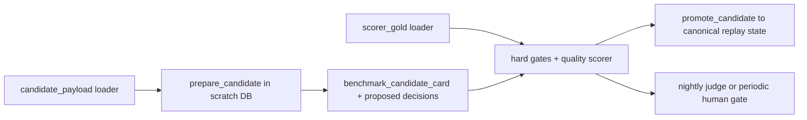

# Current daily view explanation benchmark

## Summary

### 사실

- 저장소에서 **오늘 기준 실제로 끝까지 실행되는 설명 생성 경로**는 [`src/alphamale/events/etf/view_loop.py`](../../../src/alphamale/events/etf/view_loop.py)의 `CompleteFn -> day_prompts -> parse_explain/parse_updates -> commit_day -> run_day`이다.
- 현재 `parse_explain()`은 누락된 섹션을 빈 문자열로 허용하고, `parse_updates()`는 누락된 티커 블록을 `KEEP` + `parse_fail`로 조용히 치환한다.
- 현재 테스트는 [`tests/events/test_etf_view_loop.py`](../../../tests/events/test_etf_view_loop.py)에서 버전 증가, audit row, persistence를 검증하지만, 설명 의미론의 정오를 채점하지는 않는다.
- 기존 레거시 리포트 [`data/manifests/events/_etf_2021-06_report.json`](../../../data/manifests/events/_etf_2021-06_report.json)은 방향 정확도(`dir_acc_3way=0.333`, `dir_acc_updown=0.429`)만 보고한다.
- 기존 exploration bench의 측정된 한계는 다음과 같다: 36건 중 35건이 synthetic이고, 전량 English/news 단일 split이며, grounded case는 2건뿐이고, 72개 forbidden rule이 unchecked 상태였으며, trace presence만으로 full score를 받을 수 있었다. 따라서 기존 자산에서 재사용 가능한 것은 fixture/schema/report convention뿐이며, scoring semantics는 재사용하지 않는다.

### 승인된 결정

- 이 문서는 **current daily view explanation benchmark**의 authoritative engineering design이다.
- 평가 단위는 단일 거래일 케이스와 다일 trajectory를 함께 포함한다. D일 판단이 D+1 상태에 영향을 주므로 single-day만으로는 충분하지 않다.
- 운영은 세 층으로 나눈다: **deterministic PR core**, **live nightly model/prompt comparison**, **periodic blind expert evaluation**.
- v0의 주 게이트는 구조화 계약과 deterministic hard gate이며, reference paragraph나 LLM judge는 보조 신호일 뿐 deterministic safety gate를 대체하지 않는다.
- 정밀도 우선이다. 특히 **거짓 인과 귀속**, **거짓 UPDATE**, **거짓 gap 선언**을 omission보다 더 비싼 실패로 다룬다.
- nightly promotion PASS는 **bench/run validity ∧ deterministic hard gate ∧ absolute v0 floors ∧ non-regression gates ∧ required operational SLO**의 논리곱이다. 기존 절대 수용선과 non-regression delta는 그대로 유지한다.

### 설계 추론

- [설명 정당화 표준](explanation-justification-standard.md)과의 결합 없이는, 문장 품질을 잘 써 보이는 한국어와 실제 정당화된 설명을 구분할 수 없다. 따라서 벤치의 deterministic enforcement는 paragraph quality보다 먼저 **benchmark candidate card + scorer-owned justification verdict**를 본다.
- 현재 저장소에서 검증 가능한 생성 경로는 `view_loop.py`뿐이지만, 그 경로는 `run_day()` 안에서 validation 전에 commit한다. 따라서 벤치 실행 계약은 current path를 그대로 canonical state에 호출하는 방식이 아니라, **prepare_candidate -> validate_candidate -> promote_candidate**의 분리된 transaction 계약이어야 한다.
- 장래 FF6/final Explanation Engine adapter는 필요하지만, production artifact shape와 renderer는 owner 문서가 소유한다. 이 문서가 고정하는 것은 benchmark에서 채점 가능한 sidecar contract와 scorer behavior뿐이다.
- 이 벤치를 통과해도 [가격 변동 설명 요구사항](../../product/requirements/price-explanation.md) 또는 final Explanation Engine acceptance를 입증하지는 않는다. 그것들은 별도의 output/decomposition/reproducibility gate를 요구한다.

## Context and current state

### 범위 경계

- 이 문서가 소유하는 것은 **current daily view path를 평가하는 benchmark 설계**다.
- 설명 생성 시스템의 상위 컨테이너 로직은 [Explanation Engine](../baseline/analysis-engine-design.md)이 소유한다.
- 설명 문장의 정당화 조건과 언어 라이선스는 [설명 정당화 표준](explanation-justification-standard.md)이 소유한다.
- 제품 요구사항의 사용자-facing contract는 [가격 변동 설명 요구사항](../../product/requirements/price-explanation.md)이 소유한다.
- 메커니즘 가설 어휘와 playbook 공간은 [가격 변화 메커니즘 탐색공간](../../research/explanation/mechanism-search-space.md)이 소유한다.
- 현재 실행 경로는 [`view_loop.py`](../../../src/alphamale/events/etf/view_loop.py) 하나에 고정하며, 이 문서는 그 경로를 감싸는 benchmark adapter와 scorer의 계약만 정의한다.
- 이 문서의 `pass`는 **legacy current view-loop contract에 대한 benchmark pass**다. product requirement, final engine artifact, user-facing prose completeness, decomposition sum invariant, 동일 입력 재현성 acceptance까지 대신 증명하지 않는다.

### Current vs proposed status

| 항목 | 현재 상태 | 제안 상태 |
|---|---|---|
| 실행 대상 | [`view_loop.py`](../../../src/alphamale/events/etf/view_loop.py)의 일별 설명/업데이트 루프가 유일한 complete generation path | 같은 경로를 v0 benchmark의 legacy executable reference로 유지하되, benchmark 실행은 prepare/validate/promote 단계로 분리 |
| 설명 출력 계약 | 자유형 `SUMMARY`/`VIEW_READ`/`NEWS_CASE`/`COUNTERPOINTS`/`FINAL_VIEW`/`CONFIDENCE`/`DATA_GAPS` 문자열 파싱 | live candidate는 `benchmark_candidate_card` structured sidecar를 직접 출력해야 하며, prose는 보조 렌더링으로만 취급 |
| legacy current output 적합성 | structured refs, atomic assertions, certificate refs가 없어 scorer가 의미를 복원할 수 없음 | migration 전까지 current free-form output은 full semantic bench를 바로 통과하지 못하며 `HF_SCHEMA`가 예상되는 honest limitation |
| 업데이트 계약 | `[TICKER] KEEP|UPDATE` 블록을 파싱하고 누락 시 `KEEP`로 치환 | 누락/파싱 실패/근거 부족/expected-next-state divergence를 hard fail로 처리하고 promote 전 차단 |
| state mutation 시점 | `run_day()`가 `commit_day()`와 `conn.commit()`를 validation 전에 수행 | candidate 생성은 scratch DB/snapshot에서 수행하고 hard gate 통과 후에만 canonical replay state로 promote |
| 테스트 초점 | 버전, audit, persistence, state replay의 기초 동작 | gold firewall, adapter 비합성, claim/evidence/state matching, contrast sensitivity, rollback/promotion ordering, repeat dropout 차단 |
| 리포트 초점 | 방향성 accuracy 중심 | hard fail, claim/evidence/update quality, calibration scope, subgroup floors, trajectory divergence, 운영 메타데이터, verdict scope 중심 |
| OOT 운영 | 2021-06 golden month regression seed만 확인 가능 | ordinary nightly는 `dev + contrast`, genuine OOT는 sealed forward rotating lockbox shard로 별도 운영 |
| 정당화 표준 결합 | 현재 path에는 직접 결합되지 않음 | benchmark deterministic enforcement가 scorer-owned certificate/verdict를 필수 입력으로 사용 |
| 기존 exploration bench 재사용 | legacy scorer semantics가 낙관적이며 unsafe | fixture/schema/report convention만 재사용하고 scoring semantics는 재사용 금지 |
| 최종 엔진 연계 | current path와 final engine 경계가 섞여 있음 | benchmark sidecar contract만 공통으로 두고 production artifact/rendering owner는 분리 유지 |

### 현재 코드에서 벤치가 잡아내야 할 공백

1. `parse_explain()`은 필수 섹션 누락을 빈 문자열로 허용한다.
2. `parse_updates()`는 누락된 티커를 `KEEP`로 바꾸므로, 실제 parse failure가 무해한 KEEP처럼 보일 수 있다.
3. 현재 focused test는 설명 카드의 사실성, 근거 연결, UPDATE 정당성, D+1 state pollution 차단을 직접 검증하지 않는다.
4. 현재 경로는 validation 전에 store mutation을 수행하므로, benchmark가 그대로 호출하면 오염을 사후에만 발견하게 된다.
5. 현재 자유형 출력은 `claim_id`, `value_ref`, `evidence_ref`, `window_ref`, `justification_certificate_ref`, `language_license_level`을 직접 내지 않으므로, scorer가 prose에서 이를 합성하면 안 된다.
6. 기존 2021-06 리포트의 방향 정확도는 설명 correctness의 대리 지표가 아니다.

## Goals

- current daily view path를 **설명 품질 + 결정 품질 + 상태 전이 품질**까지 함께 평가하는 benchmark 계약으로 고정한다.
- 단일 거래일 점수와 다일 trajectory replay를 함께 평가해, 잘 쓴 하루 설명이 다음날 state를 오염시키는 상황을 차단한다.
- [설명 정당화 표준](explanation-justification-standard.md)의 S0–S8, N1–N7, `value_ref`, 언어 라이선스를 deterministic enforcement에 연결한다.
- PR, nightly, periodic human review의 운영 경계를 문서 수준에서 명확히 고정한다.
- current path와 future adapter 경계를 분리해, v0가 current implementation에 맞춰 설계되더라도 final engine으로 이식 가능한 benchmark contract를 유지한다.

## Non-goals

- FF6 또는 final Explanation Engine adapter를 지금 구현하지 않는다.
- [Explanation Engine](../baseline/analysis-engine-design.md), [설명 정당화 표준](explanation-justification-standard.md), [가격 변동 설명 요구사항](../../product/requirements/price-explanation.md), [가격 변화 메커니즘 탐색공간](../../research/explanation/mechanism-search-space.md)의 owner contract를 여기서 다시 소유하지 않는다.
- 정답 paragraph 하나를 gold로 삼는 style benchmark를 만들지 않는다.
- live model serving, prompt ops, judge calibration pipeline의 실제 코드 구현은 이 문서의 범위가 아니다.
- current benchmark pass를 product-level acceptance나 final Explanation Engine completion으로 등치하지 않는다.

## Proposed design

### 1. Primary benchmark architecture



핵심 경계는 다음과 같다.

- `candidate_payload`와 `scorer_gold`는 **물리적으로도, 타입으로도 분리**한다.
- `prepare_candidate`는 candidate-visible 입력만 사용해 output을 만든다.
- `deterministic validator`와 `quality scorer`만 `scorer_gold`를 연다.
- `promote_candidate`는 deterministic validation을 모두 통과한 경우에만 canonical replay state를 갱신한다.

### 2. Current path, benchmark adapter, future adapters

| 계층 | 역할 | 상태 |
|---|---|---|
| Current executable path | [`view_loop.py`](../../../src/alphamale/events/etf/view_loop.py)가 prompt 생성, 설명 파싱, KEEP/UPDATE 적용, `view_store` 상태 전이를 수행 | 현재 존재 |
| Benchmark adapter v0 | current path 또는 frozen candidate가 **`benchmark_candidate_card` structured sidecar + proposed ticker decisions + proposed next-state payload**를 직접 내도록 감싸는 benchmark-only boundary | 제안 |
| Future FF6/final engine adapters | [Explanation Engine](../baseline/analysis-engine-design.md) 또는 후속 최종 엔진이 같은 benchmark contract로 들어오게 하는 adapter boundary | 미래 경계만 정의, 구현 비범위 |

v0 adapter에 대한 비타협 조건은 다음과 같다.

- adapter는 **lossless field renaming만 허용**한다.
- adapter는 prose에서 atomic claim, evidence ref, value ref, certificate ref, license level을 **추론하거나 합성할 수 없다**.
- legacy current free-form output은 migration 전까지 structured sidecar를 직접 생성하지 않으므로, full semantic benchmark에서는 `HF_SCHEMA`가 예상되는 current limitation으로 다룬다.
- frozen structured candidates는 scorer/validator 개발의 부트스트랩 용도로 사용할 수 있다.
- user-facing prose는 auxiliary rendering일 뿐이고, production renderer의 최종 shape는 owner 문서가 소유한다.

### 3. Prepare -> validate -> promote transaction contract

benchmark trajectory는 `view_loop.run_day()`를 canonical replay state에 직접 호출해서는 안 된다. 실행 계약은 다음과 같이 고정한다.

1. `prepare_candidate`
   - `day_prompts -> CompleteFn -> raw parse -> structured sidecar parse`를 수행한다.
   - scratch DB 또는 rollback 가능한 isolated snapshot에서 실행한다.
   - canonical replay state와 canonical `view_store`에는 mutation을 쓰지 않는다.
2. `validate_candidate`
   - schema, PIT, numeric, evidence, claim matching, certificate resolution, decision correctness, expected-next-state divergence를 scorer-only gold로 검사한다.
   - hard fail 또는 any state divergence가 있으면 해당 trajectory는 contamination stop이다.
3. `promote_candidate`
   - fully validated candidate만 canonical replay state에 promote한다.
   - promote는 atomic transaction이어야 하며, 실패 시 전부 rollback한다.

추가 계약:

- frozen candidate scoring은 pure function이며 store mutation을 절대 수행하지 않는다.
- validation 전 state mutation 금지는 benchmark 핵심 계약이다.
- any hard failure 또는 expected-next-state divergence는 promotion 불가다.
- trajectory evaluator는 divergence acceptance를 **정확히 0**으로 둔다.

### 4. Benchmark candidate output contract

벤치는 자유형 paragraph를 1급 산출물로 보지 않는다. 1급 산출물은 **`benchmark_candidate_card` structured sidecar**이며, 한국어 prose는 그 card의 보조 표현이다.

#### 4.1 Candidate top-level fields

- `summary`
- `claims[]`
- `counterpoints[]`
- `data_gaps[]`
- `ticker_decisions[]`
- `proposed_state_transition`
- optional `rendered_prose`

#### 4.2 Atomic claim schema

각 candidate atomic assertion은 최소 다음 필드를 가져야 한다.

- `claim_id` — candidate-local stable ID
- `subject_ref`
- `predicate_id`
- `object_ref` 또는 `value_ref`
- `window_ref` — asset/window/asof scope를 포함하는 canonical window reference
- `kind` — `OBSERVED | ESTIMATED | HYPOTHESIS` semantic claim class이며 gold identity / deterministic matching tuple의 identity field
- `language_license_level` — semantic identity matching 대상이 아니며 scorer-owned justification certificate와 대조하는 justification / `HF_FORBIDDEN_LANGUAGE` hard-gate field
- `evidence_refs[]`
- `justification_certificate_ref`
- `confidence_probability` — `[0, 1]`
- `confidence_band`
- `calibration_ref`
- optional `text`
- 조건부 필드
  - `falsifier_clause`
  - `competitive_hypothesis_clause`
  - `residual_clause`

#### 4.3 Decision and state fields

`ticker_decisions[]` 각 항목은 최소 다음 필드를 가진다.

- `ticker`
- `decision` — `KEEP | UPDATE`
- `decision_claim_refs[]`
- `evidence_refs[]`
- `proposed_reason`

`proposed_state_transition`은 candidate가 기대하는 state delta를 구조화해 표현하되, gold와 중복된 answer key를 담지 않는다.

- `prior_view_version_ref`
- `candidate_next_effective_date`
- `candidate_next_version`
- `candidate_stance_payload`
- `contamination_guard_metadata`

이 카드가 없으면 paragraph 품질과 무관하게 deterministic 평가를 시작할 수 없다.

### 5. Deterministic enforcement linkage to justification standard

이 벤치는 [설명 정당화 표준](explanation-justification-standard.md)의 내용을 복제하지 않는다. 대신 아래 verdict를 **scorer-owned, versioned, immutable artifact**로 받아 deterministic gate에 연결한다.

| 외부 표준 verdict | 벤치 연결 방식 |
|---|---|
| S0–S8 충족 여부 | claim/card가 정당화 가능한 객체인지의 전제. 실패 시 quality metric 계산 전 hard fail |
| N1–N7 충족 여부 | 렌더 가능한 문장인지의 전제. 실패 시 hard fail |
| `value_ref` 린트 | 숫자 토큰이 등록 참조 없이 등장하면 hard fail |
| 언어 라이선스 등급 | 라이선스보다 강한 동사/확신 표현이면 hard fail |
| 필수 조항 검사 | N3 falsifier, N6 residual은 publishable causal explanation claim에서 무조건 필요하고, N4 competitive-hypothesis clause는 license-level 조건부다 |
| certificate / justification reference | claim이 어떤 scorer-owned certificate를 참조하는지 없거나 resolve되지 않으면 hard fail |

certificate trust root 계약:

- verdict/certificate는 candidate가 아닌 **scorer-owned artifact**다.
- 각 artifact는 `certificate_id`, `content_hash`, `policy_version`, `rubric_version`, `applicable_scope`를 가져야 한다.
- candidate는 certificate를 생성하거나 self-assert할 수 없고, 존재하는 artifact ID만 참조한다.
- reference가 case/claim/asof에 적용되지 않거나 resolve되지 않으면 hard fail이다.
- certificate 생성 또는 검증 재료가 빠져 scorer가 판정 자체를 할 수 없으면 candidate penalty가 아니라 **`BENCH_INVALID`**다.

## Dataset, gold, and splits

### 6. Candidate-visible payload vs scorer-only gold

fixture는 **물리적으로도, 타입으로도** 두 조각으로 분리한다.

#### 6.1 `candidate_payload`

`run_candidate` 또는 `prepare_candidate`가 볼 수 있는 것은 다음뿐이다.

- `case_id`
- `dataset_version`
- `rubric_version`
- `case_kind`
- `trajectory_id`, `trajectory_step`
- `asof`
- `initial_view_versions`
- 입력 컨텍스트
  - numbers
  - stocks
  - news
  - PIT lens
- candidate-visible evidence metadata
  - `evidence_id`
  - `available_at`
  - `source_authority`
- explicit input evidence로 노출된 certificate reference 목록이 있다면 그 reference ID

#### 6.2 `scorer_gold`

scorer만 여는 gold는 다음을 포함한다.

- `split`
- `blocking_ready`
- `activation_version`
- `canonical_assertions`
- `required_claims`
- `allowed_claims`
- `required_gaps`
- `forbidden_claims`
- `expected_decisions`
- `expected_next_state`
- `contrast_contract`
- `subgroup_labels`
- `resolution_labels` 및 calibration용 truth source/time
- certificate/verdict artifacts 또는 그것을 resolve하는 scorer-owned registry reference

#### 6.3 Gold firewall contract

- `run_candidate`는 `candidate_payload`만 받는다.
- split, required/allowed/forbidden claims, expected decisions/state, rubric answer key, scorer-owned certificate 내용은 candidate path, prompt, adapter, judge input에 들어가면 안 된다.
- prompt/input hash는 candidate-visible projection만 포함한다.
- gold leakage 또는 candidate path의 scorer_gold 접근이 감지되면 해당 run은 **non-promotable**이며 bench execution은 **`BENCH_INVALID`**다.
- 이 negative contract는 mutation test 대상이다.

### 7. Canonical gold claim model and matching

gold는 이상적인 paragraph 1개가 아니라 **versioned canonical assertion set**이다. deterministic matching은 자연어 유사도가 아니라 stable tuple로 수행한다.

#### 7.1 Gold assertion identity

각 gold assertion은 다음 중 하나로 식별된다.

- stable `canonical_claim_id`, 또는
- stable tuple `(subject_ref, predicate_id, object_ref|value_ref, window_ref, kind)`

rubric는 필요한 경우에만 명시적 alternative tuple set을 선언할 수 있다.

#### 7.2 Matching rules

- candidate는 combined prose를 스스로 atomic assertion으로 분해해야 한다. scorer는 prose를 semantic decomposition하지 않는다.
- deterministic equivalence는 `(subject_ref, predicate_id, object_ref|value_ref, window_ref, kind)` exact match와 rubric-declared alternative만 허용한다.
- `kind`는 `OBSERVED | ESTIMATED | HYPOTHESIS` semantic claim class이며 identity matching 대상이다.
- `language_license_level`은 semantic identity matching tuple에 포함되지 않으며 scorer-owned justification certificate와 대조하는 justification / `HF_FORBIDDEN_LANGUAGE` hard-gate field다.
- `value_ref`는 canonical registry value/unit를 기준으로 비교한다.
- contradiction 또는 forbidden predicate는 precision/recall 계산 전에 검사하며 hard fail이다.
- unmatched candidate assertion은 false positive다.
- unmatched required gold assertion은 false negative다.
- exact tuple duplicate는 denominator에서 collapse하고, rubric가 중복 민감 family로 표시한 경우 `HF_DUPLICATE_SENSITIVITY`를 발생시킨다.
- empty denominator는 pass로 간주하지 않고 `N/A`로 보고한다. safety-critical subgroup에서 `min_evaluable_cases=5`를 못 채우면 `INSUFFICIENT_DATA`로 readiness를 막는다.
- LLM judge와 human judge는 hard matching에 관여하지 않는다.

### 8. Contrast rows and relations

승인된 24 contrast case는 **12 pair groups / 24 case rows**로 고정한다.

- 8개 mandatory transformation family는 각각 최소 1개 pair를 가진다.
- 4개 highest-risk family는 추가 variant pair를 하나 더 가진다.
- same pair/group member는 동일 split과 동일 trajectory grouping에 남는다.

각 contrast case는 추가로 다음 필드를 가진다.

- `contrast_group_id`
- `member_role` — `base | variant`
- `transformation_kind`
- `changed_fields[]`
- `expected_relation`
  - assertion/field별 `MUST_CHANGE`
  - assertion/field별 `MUST_NOT_CHANGE`
  - assertion/field별 `ALLOWED_CHANGE`

v0 approved family는 다음과 같이 유지한다.

- duplicate count
- PRE_OPEN vs POST_CLOSE
- evidence present vs removed
- residual sign flip
- market-dominated vs idiosyncratic residual
- constituent vs non-constituent
- M&A rumor vs close
- complete vs missing lens

이 중 고위험으로 second variant를 갖는 family는 PIT timing, evidence removal, duplicate/rebroadcast, state UPDATE다.

### 9. v0 composition

| 묶음 | 구성 | 목적 |
|---|---|---|
| Real golden-month trajectory | 기존 2021-06 22 trading day를 순서 보존 상태로 포함 | 회귀 seed + state replay 기준선 |
| Minimal contrast cases | 12 pair groups / 24 case rows | invariance/sensitivity, duplicate, PIT timing, evidence removal, state UPDATE 등 관계 검증 |
| Boundary / error cases | 8건 | missing explanation section, invalid confidence, percent vs percentage-point confusion, no-news large residual, strong news but small residual, simultaneous positive/negative confounder, missing ticker update block, parser failure silently becoming KEEP |
| Multi-day trajectories | 4개, 각 2–5일 | valid structural UPDATE, repeated promo KEEP, invalid update blocked before state pollution, correction/rollback |

### 10. Split policy and hidden OOT lifecycle

- 분할은 `dev`, `hidden_oot`, `human_holdout` 세 개다.
- 다음 단위는 절대 분할하지 않는다.
  - 같은 trajectory
  - 같은 issuer/event chain
  - correction/follow-up 쌍
  - rebroadcast family
- split 기준 시각은 **tradeable/available timestamp**다.
- 2021-06은 regression seed이지 genuine OOT가 아니다.
- ordinary nightly tuning 데이터는 `dev + contrast`다.
- genuine OOT는 pinned model의 documented knowledge/training cutoff 이후에 발생한 **sealed forward shard**만 인정한다.
- `hidden_oot`는 rotating lockbox shard이며, promotion gate 또는 aggregate-only limited-disclosure run에 1회 사용한 뒤 retire/replace한다.
- case-level hidden_oot output은 prompt tuning이나 candidate selection에 사용하지 않는다.
- dataset은 `blocking_ready`와 `activation_version`을 가진다. valid sealed shard가 준비되기 전 hidden_oot 결과는 **explicitly non-blocking**이다.
- `human_holdout`은 candidate tuning, ordinary nightly, judge calibration에 사용 금지이며 periodic blind human gate 전용이다.

### 11. Gold policy

- gold는 **이상적인 paragraph 1개**가 아니라 **claim/evidence/state contract**다.
- 두 명의 금융 리뷰어가 독립적으로 주석하고, 불일치는 adjudication으로 해결한다.
- 사람이 합의하지 못한 항목은 모델 실패가 아니라 rubric/annotation quality 문제로 우선 취급한다.
- adjudication과 certificate artifact는 scorer-owned registry에 버전·해시와 함께 남는다.

## Scoring and gates

### 12. Hard failures

다음 hard failure는 quality metric 계산 전에 검사한다.

- `HF_SCHEMA`
- `HF_PIT`
- `HF_NUMERIC`
- `HF_EVIDENCE`
- `HF_CAUSAL_OVERCLAIM`
- `HF_DOUBLE_ATTRIBUTION`
- `HF_STATE_TRANSITION`
- `HF_UNSUPPORTED_UPDATE`
- `HF_PARSE_FAIL_AS_KEEP`
- `HF_DUPLICATE_SENSITIVITY`
- `HF_FORBIDDEN_LANGUAGE`

추가 원칙:

- [설명 정당화 표준](explanation-justification-standard.md)에서 온 `value_ref` 누락, 라이선스 위반, 필수 조항 누락, certificate reference 누락은 모두 hard fail이다.
- `unchecked` forbidden rule은 허용되지 않는다. 체크 불가능한 금지 규칙이 있으면 그 candidate가 아니라 **bench 자체를 `BENCH_INVALID`**로 본다.
- 숫자 truth 검증은 candidate string이 아니라 scorer-owned `value_ref` registry를 기준으로 한다. raw 값과 단위를 먼저 검사하고, rendering tolerance는 registry가 소유한 canonical display precision의 half-unit만 허용한다.
- candidate가 더 거친 precision으로 렌더링해 tolerance를 넓히려 하면 hard fail이다.
- `HF_STATE_TRANSITION`은 wrong KEEP, unsupported UPDATE, SCD-2 delta mismatch, expected-next-state divergence를 모두 포괄한다.
- any trajectory divergence는 contamination stop이며 다음 step promotion을 금지한다.

### 13. Quality metrics after hard gates

hard gate를 모두 통과한 경우에만 다음 지표를 계산한다. 계산은 **case-level 먼저, macro-average 나중** 순서로 수행하고, micro는 진단용으로만 보고한다.

| 차원 | v0 수용선 |
|---|---|
| hard failures | 0 |
| rule checkability | 100% |
| PIT / numeric / state invariants | 100% |
| unsupported high-confidence claims | 0 |
| allowed claim precision | >= 0.95 |
| required claim recall | >= 0.80 |
| evidence precision | >= 0.95 |
| data-gap recall | >= 0.90 |
| false-gap precision | >= 0.90 |
| UPDATE precision | >= 0.95 |
| KEEP/UPDATE macro F1 | >= 0.80 |
| required invariance/sensitivity contrast pairs | 100% |
| calibration | 아래 14절의 정의에 따라 보고 |
| subgroup reporting | 필수 |
| state divergence count | 정확히 0 |

추가 규칙:

- unjustified `UNKNOWN`/abstain은 required claim miss로 계수되므로 recall을 떨어뜨린다.
- all-KEEP shortcut은 UPDATE precision 하나만으로는 잡히지 않을 수 있으므로 KEEP/UPDATE macro F1과 exact state contract가 함께 막는다.
- empty denominator는 `N/A`로 보고하고 count를 명시한다.
- safety-critical subgroup(`PIT`, `no-news/unknown`, `confounded`, `missing-lens`, `update-eligible`, `contrast`)는 각자 절대 floor를 만족해야 한다. `min_evaluable_cases=5` 미만이면 `INSUFFICIENT_DATA`이며 `blocking_ready=false`다.
- **단일 총점은 hard failure를 가리면 안 된다.**

### 14. Numeric, confidence, and calibration rules

#### 14.1 Numeric policy

- `numeric_refs[]` 명칭은 사용하지 않고 `value_refs[]`로 통일한다.
- `value_ref`마다 scorer-owned registry가 raw value, unit, canonical display precision을 소유한다.
- numeric truth는 registry raw value/unit로 먼저 검사한다.
- rendering tolerance는 registry canonical display precision의 half-unit만 허용한다.
- candidate-selected precision downgrade는 tolerance 확대 수단이 될 수 없고 hard fail이다.

#### 14.2 Confidence policy

candidate field는 다음을 사용한다.

- `confidence_probability` in `[0,1]`
- `confidence_band`
- `calibration_ref`

v0 rubric band는 다음과 같다.

- `LOW`: `[0.0, 0.5)`
- `MEDIUM`: `[0.5, 0.8)`
- `HIGH`: `[0.8, 1.0]`

band mismatch, invalid range, required `calibration_ref` 누락은 owner applicability에 따라 invalid 또는 hard fail이다. `unsupported high-confidence claims = 0` 규칙은 `HIGH` band 및 rubric-declared high-confidence cutoff에 대해 평가한다.

#### 14.3 Calibration scope

- Brier/ECE는 **exogenous, versioned resolution label/source/time이 있는 claim class**에만 계산한다.
- unresolved item은 제외하되 count를 남긴다.
- causal attribution처럼 observable truth label이 없는 claim에는 truth-calibration Brier/ECE를 계산하지 않는다.
- expert-adjudicated support acceptance를 calibration할 때는 `support_acceptability_calibration`으로 따로 보고하며, causal truth calibration으로 오인하지 않는다.

## PR, nightly, and human operations

### 15. PR core

| 항목 | 계약 |
|---|---|
| 네트워크 | 금지 |
| live model | 금지 |
| candidate 입력 | frozen structured good/bad candidates |
| 필수 검증 세트 | schemas, all hard-fail mutations, gold firewall, adapter non-synthesis, certificate trust-root/hash, canonical claim matching/duplicates/empty denominators, candidate precision downgrade, all-gap/all-KEEP shortcuts, repeat dropout, hidden OOT access, state rollback/promotion ordering, 22-day state replay, byte-stable report, current focused tests에 대응하는 fixture regression |
| 목적 | deterministic correctness와 회귀 검출 |

### 16. Nightly live comparison

| 항목 | 계약 |
|---|---|
| 대상 | live pinned model |
| 기본 데이터 | `dev + contrast` |
| optional blocking shard | `hidden_oot`는 `blocking_ready=true`이고 activation version이 충족된 sealed forward shard일 때만 promotion gate에 사용 |
| 반복 | critical/contrast는 3 repeats, 기타는 1 repeat |
| 비교 | paired baseline vs challenger on identical eligible paired denominators |
| 운영 메트릭 | p50/p95/p99 latency, cost, tokens |
| judge | calibrated LLM judge를 canonical card rendering만 사용하는 criteria-specific blind paired A/B 및 B/A로 수행 |
| escalation | versioned near-tie 또는 A/B↔B/A inconsistency는 `REVIEW_REQUIRED` |

Nightly promotion PASS는 다음을 **모두** 만족해야 한다.

1. `bench_valid == true`
2. `run_valid == true`
3. 모든 deterministic hard gate 통과
4. 모든 absolute v0 floor 통과
5. 다음 non-regression formula 통과
   - `hard_fail_count == 0`
   - `false_update_count <= baseline`
   - `claim_precision_drop <= 0.02`
   - `claim_recall_drop <= 0.03`
   - `contrast_pass_rate >= baseline`
   - `cost_per_request <= 1.10 * baseline`
   - `p95_latency <= 1.20 * baseline`
6. required operational SLO 통과

추가 계약:

- baseline 자체도 **valid run**이어야 하며 동일 paired denominator에서 absolute v0 floor를 먼저 통과해야 한다.
- `false_update_count`는 count만이 아니라 denominator와 함께 기록한다.
- subgroup floor, state divergence zero, contrast relation은 baseline/challenger 모두에 동일하게 적용한다.

### 17. Repeat and operational dropout policy

attempt key는 `(run_id, case_id, candidate_role, repeat_index, seed)`다.

- baseline과 challenger는 complete identical paired schedule을 가져야 한다.
- required attempt 하나라도 missing/timeout/infra failure면 quality 승패를 내지 않고 **`RUN_OPERATIONAL_FAILURE`**로 blocking한다.
- 실패한 hard case를 quality denominator에서 떨어뜨리는 selective dropout은 금지한다.
- 모든 attempt와 retry는 cost/tokens/latency/error reporting의 분모에 포함한다.
- any hard failure in any repeat는 그 case와 run을 fail시킨다.
- critical/contrast relation은 모든 repeat에서 성립해야 한다.
- continuous quality는 repeat별 계산 후 case 내부 평균, 그 다음 case macro-average로 집계하고, worst repeat를 함께 보고한다.
- provider seed 지원 여부와 실제 seed honoring 여부는 attempt metadata로 남긴다.

### 18. Judge protocol

judge는 hard gate를 대체하지 않으며, nightly 품질 보조 신호와 escalation 신호만 담당한다.

- judge 입력은 **canonical card rendering only**다.
- model/candidate identity, hidden answer key, meta-instruction, self-rating 텍스트는 judge 입력에 포함하지 않는다.
- positional bias 완화를 위해 A/B와 B/A를 모두 수행한다.
- judge는 `model`, `model_version`, `prompt_hash`, `rubric_hash`, `order`, `criteria_evidence`, `abstention`, `injection_detected`를 기록한다.
- prompt injection 또는 invalid judge verdict는 win이 아니라 `REVIEW_REQUIRED`이며 promotion 불가다.
- near-tie margin과 inconsistency rule은 versioned rubric가 소유한다.
- periodic output은 expert-adjudicated judge anchor set과 activation version을 포함한다.

### 19. Periodic human evaluation

| 항목 | 계약 |
|---|---|
| 표본 | 30 stratified grounded cases |
| 평가자 | blind two-expert review |
| 방식 | pointwise 1–5 + blind pairwise |
| 합의 | adjudication 포함 |
| 핵심 기준 | factuality / grounding / causal restraint의 median >= 4/5 |
| pairwise 점수 | win=1, tie=0.5, loss=0 |
| estimand | `Δ = challenger preference rate - 0.5` |
| cluster | versioned rubric가 선언한 trajectory/event-chain key를 사용 |
| superiority | one-sided 95% cluster bootstrap lower bound `LB(Δ) > 0` |
| non-inferiority | one-sided 95% cluster bootstrap lower bound `LB(Δ) >= -0.05` |
| insufficient clusters | 독립 cluster가 10개 미만이면 `INSUFFICIENT_DATA`로 promotion 보류 |
| agreement handling | versioned Krippendorff alpha threshold와 최소 응답 수를 적용하며, v0는 `alpha >= 0.67` 미달 시 human gate invalidation 및 promotion 보류 |

추가 계약:

- equality는 non-inferiority를 통과한 것으로 본다.
- low inter-rater agreement는 model auto-pass가 아니라 **human gate invalid**다.
- critical pointwise medians gate와 pairwise NI/superiority gate는 conjunction이다.

## Data flow, interfaces, and file ownership

### 20. Data flow

1. **Case loader**가 `candidate_payload`와 `scorer_gold`를 별도로 읽는다.
2. **prepare_candidate**가 scratch DB/snapshot에서 candidate-visible projection만 사용해 `benchmark_candidate_card`와 proposed decisions/state를 생성한다.
3. **Deterministic validator**가 scorer-only gold, certificate registry, value registry를 열어 schema, PIT, numeric, evidence, claim matching, decision/state transition, justification-standard verdict를 검사한다.
4. hard gate를 통과한 candidate만 **quality scorer**와 **nightly judge**로 이동한다.
5. trajectory case는 contamination guard와 exact expected-next-state 검사를 통과한 경우에만 **promote_candidate**가 canonical replay state를 갱신한다.
6. report writer는 deterministic result, quality dimensions, calibration, judge, cost/latency, comparison을 합쳐 manifest를 쓴다.

### 21. Proposed Python API

다음 함수는 구현 ownership만 제안한다.

| 함수 | 역할 |
|---|---|
| `load_bench` | candidate_payload, scorer_gold, rubric, metadata 로드 |
| `validate_bench` | fixture/schema/hash/firewall/checkability 검사 |
| `prepare_candidate` | adapter를 통해 candidate output 생성 또는 frozen structured run 로드 |
| `validate_candidate` | hard fail + deterministic matching + expected-next-state 검증 |
| `promote_candidate` | validated candidate만 canonical replay state로 atomic commit |
| `score_candidate` | quality metric + report 생성 |
| `replay_trajectory` | multi-day state transition replay 및 contamination guard |
| `compare_runs` | baseline/challenger 비교와 nightly gate 계산 |

### 22. Proposed CLI

제안 CLI namespace는 다음과 같다.

```bash
uv run alphamale events benchmarks view-explanation validate
uv run alphamale events benchmarks view-explanation run
uv run alphamale events benchmarks view-explanation score
uv run alphamale events benchmarks view-explanation compare
```

### 23. File ownership proposal

이 문서가 지금 당장 만드는 파일은 **이 문서 하나**뿐이다. 아래는 추후 구현 ownership만 기록한다.

| 경로 | 역할 | 상태 |
|---|---|---|
| `docs/engineering/design/view-explanation-benchmark.md` | authoritative design | 현재 생성 대상 |
| `data/fixtures/events/view_explanation_bench/` | candidate_payload, scorer_gold, README, DATASET_CARD, cases, trajectories, rubric, evidence, schemas | 제안 |
| `src/alphamale/events/benchmarks/view_explanation.py` | benchmark runtime / validator / scorer | 제안 |
| `tests/events/test_view_explanation_bench.py` | focused deterministic and mutation tests | 제안 |
| `data/manifests/events/` | scored manifest reports | 기존 경로 재사용 |
| `data/interim/events/view_explanation_bench/` | generated run artifacts | 제안 |
| `data/processed/events/view_explanation_bench/` | trajectory SQLite / processed state replay | 제안 |

## State transition contract

### 24. SCD-2 invariants and promotion scope

benchmark가 평가하는 current-scope state contract는 [`view_store.py`](../../../src/alphamale/events/etf/view_store.py)의 SCD-2 invariant를 기준으로 한다.

- D일 explanation은 **pre-update views**를 기준으로 생성되어야 한다.
- `KEEP`
  - current open row와 version은 unchanged다.
  - exactly one audit decision row를 남긴다.
- `UPDATE`
  - prior open row를 `valid_to=next_trading_date`로 close한다.
  - `version+1` row를 `valid_from=next_trading_date`로 create한다.
  - new row는 candidate가 제안한 stance/thesis payload를 담는다.
  - audit row는 decision과 `new_version`을 남긴다.
- `HF_STATE_TRANSITION`은 wrong KEEP, wrong UPDATE, prior row close/create mismatch, version mismatch, effective date mismatch, audit mismatch를 모두 포함한다.
- any expected-next-state divergence는 contamination stop이며 acceptance는 정확히 zero다.

이 벤치가 보장하는 범위는 current legacy path의 D+1 state correctness까지다. 더 넓은 product-level decomposition, user rendering, cross-engine reproducibility acceptance는 별도 owner 문서에서 검증한다.

## Run metadata and verdict scopes

### 25. Run-level metadata

live run report는 최소 다음 run-level 메타데이터를 가져야 한다.

- `run_id`
- `run_version`
- `dataset_version`
- `rubric_version`
- `prompt_version`
- `prompt_hash`
- `provider`
- `model`
- `model_version`
- `temperature`
- `code_revision`
- `candidate_role_set`
- `paired_schedule_hash`

### 26. Attempt-level metadata

각 request attempt는 최소 다음 메타데이터를 가져야 한다.

- `run_id`
- `case_id`
- `trajectory_id`
- `candidate_role` — `baseline | challenger`
- `repeat_index`
- `seed`
- `provider_seed_supported`
- `request_id`
- `input_fingerprint`
- `prompt_hash`
- request timestamp
- response timestamp
- `input_tokens`
- `output_tokens`
- `total_tokens`
- normalized currency `cost`
- `latency_ms`
- `status`
- `error`
- `retry_count`

이 메타데이터가 하나라도 필요한 범위에서 비어 있으면 해당 run은 quality comparison 대상이 아니라 **`RUN_INVALID_METADATA`**다.

### 27. Error handling and verdict taxonomy

| 상황 | 판정 | 처리 |
|---|---|---|
| fixture/schema/hash/firewall 불일치 | `BENCH_INVALID` | 실행 중단 |
| 체크 불가능한 forbidden rule | `BENCH_INVALID` | 실행 중단 |
| certificate/value registry material 부족 | `BENCH_INVALID` | 실행 중단 |
| 필수 run/attempt metadata 누락 | `RUN_INVALID_METADATA` | quality/promotion 차단 |
| provider timeout / infra failure / required attempt missing | `RUN_OPERATIONAL_FAILURE` | paired comparison 차단, 품질 자동 승패 금지 |
| response parse failure 또는 sidecar 누락 | `HF_SCHEMA` | hard fail |
| missing ticker block | `HF_PARSE_FAIL_AS_KEEP` | hard fail |
| justification renderer/validator rejection | hard fail | candidate score 중단 |
| state divergence 또는 unsupported update | `HF_STATE_TRANSITION` 또는 `HF_UNSUPPORTED_UPDATE` | hard fail + contamination stop |
| judge inconsistency / judge injection / invalid judge verdict | `REVIEW_REQUIRED` | nightly 자동 승패 확정 금지 |
| subgroup denominator 부족 | `INSUFFICIENT_DATA` | blocking_ready=false, promotion 보류 |

핵심 원칙은 세 가지다.

1. **운영 실패와 품질 실패를 섞지 않는다.** timeout은 factuality failure가 아니다.
2. **오염 가능성이 있는 state는 다음날로 전파하지 않는다.** trajectory evaluator는 hard fail 또는 divergence 시점에서 replay를 멈춘다.
3. **`bench_valid`, `run_valid`, `quality_pass`, `promotion_eligible`를 분리한다.** 하나의 `valid` 필드에 의미를 과적재하지 않는다.

## Report contract

### 28. Top-level report fields

최종 report는 최소 다음 상위 필드를 포함해야 한다.

- `bench_valid`
- `run_valid`
- `quality_pass`
- `promotion_eligible`
- `hard_fails`
- `dimensions`
- `group_breakdowns`
- `trajectories`
- `calibration`
- `judge`
- `cost_latency`
- `comparison`

추가 계약:

- hard fail이 있으면 `quality_pass`는 거짓이어야 한다.
- `promotion_eligible`는 `bench_valid ∧ run_valid ∧ quality_pass ∧ human/judge gate status`를 반영한다.
- quality dimension은 hard gate 통과 후에만 채워진다.
- [`../../../data/manifests/events/model_metrics.yaml`](../../../data/manifests/events/model_metrics.yaml)에는 요약치만 반영한다.
- PR report는 byte-stable이어야 한다.
- nightly comparison report는 baseline/challenger의 동일 rubric, 동일 split, 동일 paired denominator, 동일 cost/latency 기준을 함께 기록해야 한다.

## Verification contract

### 29. Completion evidence required from future implementation

향후 구현이 이 문서를 만족했다고 주장하려면 최소 다음 증거가 필요하다.

- current focused tests에 대응하는 regression evidence
- scorer mutation tests가 모든 hard fail을 실제로 잡는 증거
- gold firewall과 adapter non-synthesis를 mutation test로 증명하는 증거
- certificate trust-root/hash mismatch를 rejection-grade로 잡는 증거
- canonical claim matching, duplicate collapse, empty denominator handling을 deterministic하게 재현하는 증거
- candidate precision downgrade, all-gap, all-KEEP shortcut이 차단되는 증거
- repeat dropout과 hidden OOT misuse가 promotion을 막는 증거
- 22-day replay가 exact state를 재현하고 validate-before-promote ordering을 지키는 증거
- frozen report가 byte-stable인 증거
- baseline/challenger comparison report가 absolute floors와 nightly formula를 모두 계산하는 증거
- leakage, circularity, scorer optimism에 대한 architect approval

이 문서는 구현 완료를 주장하지 않는다. 위 목록은 **후속 구현이 제출해야 할 completion evidence contract**다.

## Risks

| 위험 | 설명 | 완화 |
|---|---|---|
| 2021-06 과적합 | regression seed가 실제 OOT를 대표하지 못함 | 2021-06은 회귀 seed로만 유지하고, blocking gate는 sealed forward rotating hidden_oot shard가 준비된 뒤에만 활성화 |
| paragraph overfitting | 문장체만 맞추고 claim/evidence/state correctness를 회피할 수 있음 | paragraph를 보조 출력으로 강등하고 structured sidecar 직접 출력을 1급 계약으로 강제 |
| scorer optimism | scorer가 prose에서 refs/claims를 합성하면 candidate가 내지 않은 근거를 사후 창작하게 됨 | adapter non-synthesis 계약과 direct sidecar requirement를 hard rule로 고정 |
| gold leakage | candidate가 required/forbidden/state answer key를 읽으면 hidden_oot도 무력화됨 | candidate_payload/scorer_gold 방화벽, prompt hash scope, leakage mutation contract |
| false KEEP masking | parse failure가 KEEP처럼 보일 수 있음 | `HF_PARSE_FAIL_AS_KEEP`로 별도 hard fail |
| false gap gaming | 모든 것을 gap으로 선언해 precision cost를 회피할 수 있음 | false-gap precision floor와 recall penalty를 함께 적용 |
| state contamination | 잘못된 UPDATE가 D+1 view store를 오염시킴 | scratch generation, validate-before-promote, divergence zero, contamination stop |
| judge bias | LLM judge가 위치·표현 편향이나 injection에 흔들릴 수 있음 | deterministic gate 우선, canonical card only blind A/B 및 B/A, invalid judge는 `REVIEW_REQUIRED` |
| rubric drift | 사람 평가 기준이 흔들리면 모델 비교가 무의미해짐 | versioned anchors, low inter-rater agreement 시 human gate invalidation |

## Alternatives considered

| 대안 | 판단 |
|---|---|
| 단일 거래일만 채점 | D+1 상태 오염을 놓치므로 기각 |
| gold paragraph 하나와의 유사도 중심 평가 | 한국어 유창성 편향과 정답 서술 다양성을 잘못 처리하므로 기각 |
| LLM judge를 PR gate의 주 판정기로 사용 | 재현성과 안전성이 부족하므로 기각 |
| current path를 canonical state에 직접 호출한 뒤 사후 검증 | validation 전 mutation을 막지 못하므로 기각 |
| adapter가 자유형 prose에서 claim/evidence/value/certificate refs를 추론 | scorer optimism과 의미 합성을 초래하므로 기각 |
| current path와 final engine을 같은 artifact owner 없이 직접 비교 | 현재 코드 사실과 미래 설계가 섞여 회귀 기준선이 흐려지므로 기각 |
| unchecked forbidden rule 허용 | scorer가 모르는 금지 규칙을 가진 bench는 안전하지 않으므로 기각 |

## Methodology sources

이 벤치의 방법론 근거는 다음 문헌과 운영 표준에 둔다.

| 출처 | 링크 | 이 문서에서의 용도 |
|---|---|---|
| CheckList | [ACL 2020 CheckList](https://aclanthology.org/2020.acl-main.442/) | deterministic capability checklist와 invariance/sensitivity 사고방식 |
| Contrast Sets | [Findings EMNLP 2020 Contrast Sets](https://aclanthology.org/2020.findings-emnlp.117/) | minimal contrast case 설계 |
| FActScore | [EMNLP 2023 FActScore](https://aclanthology.org/2023.emnlp-main.741/) | claim-level factual precision 관점 |
| ALCE | [EMNLP 2023 ALCE](https://aclanthology.org/2023.emnlp-main.398/) | evidence/citation grounding 관점 |
| RAGAS | [arXiv:2309.15217](https://arxiv.org/abs/2309.15217) | grounded answer 품질 차원 분해 참고 |
| MT-Bench / LLM judge biases | [arXiv:2306.05685](https://arxiv.org/abs/2306.05685) | judge 사용 범위를 보조 신호로 제한하는 근거 |
| Positional bias | [ACL 2024 positional bias](https://aclanthology.org/2024.acl-long.511/) | A/B와 B/A 둘 다 수행해야 하는 이유 |
| Best-Worst Scaling | [ACL 2017 Best-Worst Scaling](https://aclanthology.org/P17-2074/) | blind pairwise / comparative human eval 설계 참고 |
| Krippendorff alpha | [Krippendorff's Alpha reliability note](https://www.asc.upenn.edu/sites/default/files/2021-03/Computing%20Krippendorff%27s%20Alpha-Reliability.pdf) | inter-rater agreement 점검 |
| Calibration | [Guo et al. 2017 calibration](https://proceedings.mlr.press/v70/guo17a.html) | Brier/ECE와 confidence bucket accuracy |
| OpenTelemetry GenAI metrics | [OpenTelemetry GenAI metrics](https://github.com/open-telemetry/semantic-conventions-genai/blob/main/docs/gen-ai/gen-ai-metrics.md) | tokens/cost/latency 메타데이터 표준화 참고 |
| Google SRE SLOs | [Google SRE service-level objectives](https://sre.google/sre-book/service-level-objectives/) | nightly non-regression gate를 운영 objective로 다루는 근거 |

## Conclusion

이 설계의 핵심은 네 줄로 요약된다.

1. **현재 저장소의 유일한 실행 경로는 `view_loop.py`이지만, benchmark는 그것을 canonical state에 직접 호출하지 않고 prepare -> validate -> promote로 감싼다.**
2. **candidate-visible payload와 scorer-only gold를 분리하고, scorer가 gold를 모델이나 judge에 노출하지 않는 방화벽을 계약으로 고정한다.**
3. **legacy current free-form output은 full semantic bench를 바로 통과하지 못하며, live candidate는 structured sidecar를 직접 출력해야 한다.**
4. **PR은 deterministic safety, nightly는 absolute∧relative non-regression, periodic human eval은 blind NI/superiority와 rubric calibration을 담당하며, current-scope benchmark pass는 product-level acceptance를 대체하지 않는다.**
