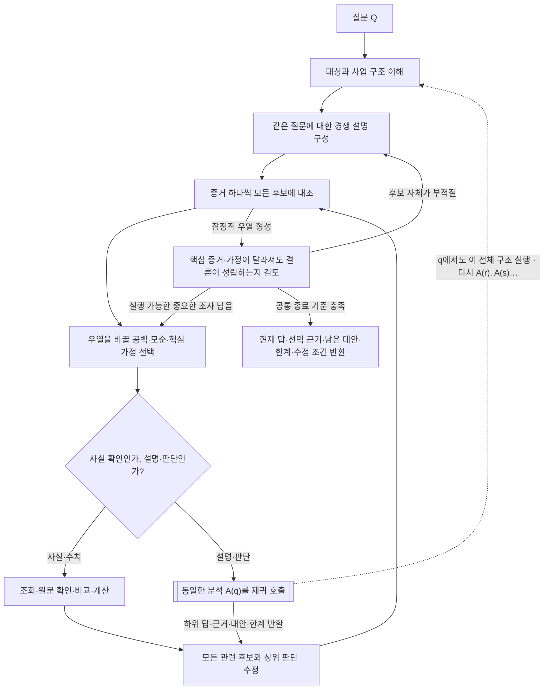

# 재귀 분석의 적용 방법

시스템 앞부분의 A(Q) 정의와 종료 조건을 적용한다. 작업 범위는 작업별 지시를 따른다. 이 스킬은 비교·질문 선택을 보충하며 스킬 재호출이나 하위 에이전트 생성을 요구하지 않는다. ACH를 재귀 구조로 확장한 설계이며 CIA 원문 자체의 알고리즘이라고 주장하지 않는다.

## 모든 깊이에 적용하는 구조

## 후보를 구별하는 관측 선택

- 후보는 같은 대상·기간·현상에 답해야 한다. 선호 설명만 상세화하거나 대안을 약한 반론으로 만들지 않는다. 함께 작용할 원인은 역할·규모·시점이 다른 설명으로 비교한다. 아직 사업을 모르면 구조부터 조사하고 억지 가설표를 만들지 않는다.
- 증거 하나씩 모든 후보에 대조한다: 양립·불일치·무관·판단 불가. 여러 후보가 모두 설명할 수 있는 관측보다 우열을 바꾸는 관측을 찾는다. 불일치는 출처 오류·시점·단위 차이를 확인한 뒤 설명에 반영한다. 후보 수·찬반 개수·기계적인 점수로 승자를 정하지 않는다.
- 핵심 자료의 접근성·전문성·이해관계·독립성·완전성을 본다. 기대한 흔적의 부재는 해당 출처·기간에서 관측 가능했을 때만 반증이다. 미입증과 반증을 구분한다. 모든 후보와 맞지 않으면 후보 묶음을 다시 구성한다.

## 재귀 질문과 복귀

- 하위 질문은 상위 후보의 우열이나 결론의 방향·크기·시점·범위를 바꿀 수 있어야 한다. 기업·기사 목록을 순서대로 수집하는 과제로 바꾸지 않는다. 고객·공급자·경쟁·정책에서 중요한 외부 관측도 찾는다.
- 답은 근거·남은 대안·범위·한계와 함께 모든 관련 후보에 되돌린다. 요청한 후보만 갱신하지 않는다. 상위 결론 변화로 다른 가지가 중요해지면 다시 연다. 결과가 기존 설명을 지지하면 유지할 이유를 설명하며 억지 반전을 만들지 않는다.
- 하위 판단은 새 관측이 아니다. 원래 근거와 가정을 연결하고 같은 자료를 여러 가지에서 독립 근거로 중복 계산하지 않는다. 계산의 정확성과 인과의 타당성을 구분한다. 고정 EPS에서 가격·PER의 동반 변화나 고정 배수로 역산한 EPS는 독립적인 원인·기대 증거가 아니다.

## 가상 적용 예

수주잔고 증가를 신규 수요·납품 지연·복합 원인으로 비교한다. 잔고 증가 자체는 셋 모두와 양립한다. 신규 주문·인도 일정에서 고객 반입 지연을 찾았다면, 그 이유를 공장 준비·투자 축소·검수 문제로 다시 비교한다. 이를 가르는 중요한 설명이 또 필요하면 같은 A를 적용한다. 하위 답은 지연 기간→최초 후보의 우열→이익 시점→ETF 전망을 수정하며 새 공백을 다시 열 수 있다. 예시 원인을 실제 답으로 복사하지 않는다.

관계도는 인과 입증 자체가 아니다. 서로 다른 시장·통화·기간 수익률의 차이를 원인별 기여로 해석하지 않는다. ETF 환매만으로 구성종목 매도 압력이나 투자 의도를 입증하지 않는다. 고객에게는 기존 출력 계약으로 현재 결론·필요한 근거·중요한 대안을 전달한다.
