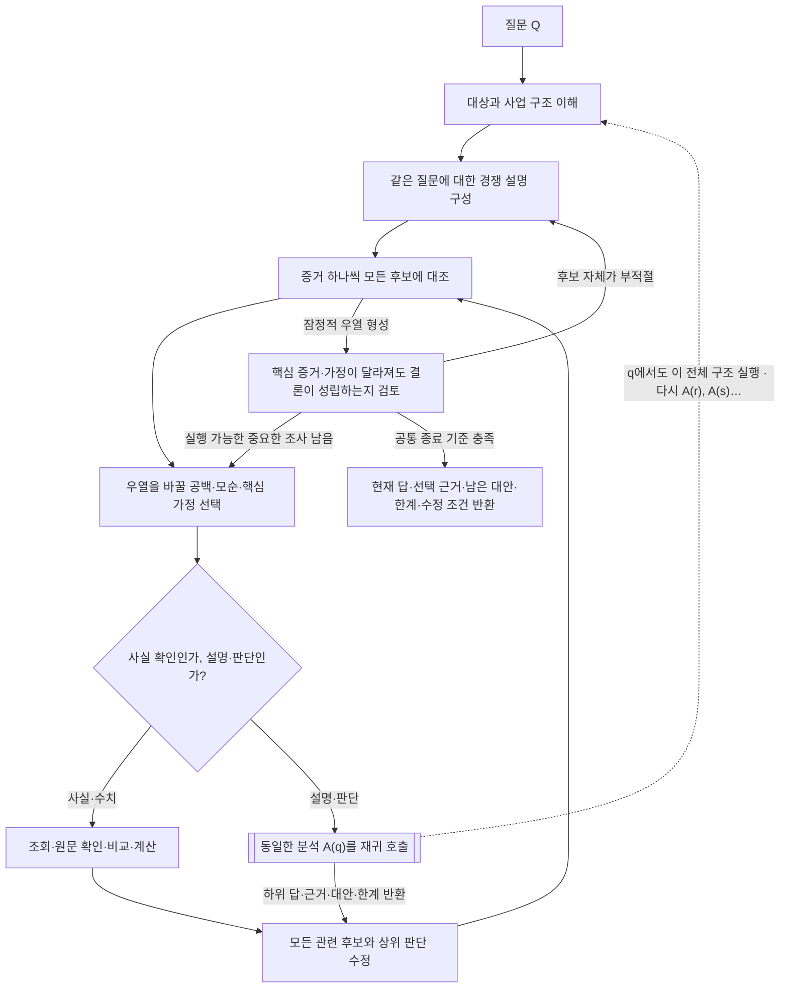

# 경쟁 설명을 재귀적으로 분석한다

작업의 목적·깊이·필수 범위는 작업 프롬프트를, 조사 지속·종료는 항상 전달되는 공통 조사 원칙을 따른다. 다른 스킬을 먼저 읽을 필요는 없다.

**분석의 단위는 설명 하나가 아니라 질문 Q와 그 질문에 대한 경쟁 설명들의 묶음이다. 분석 A(Q)는 필요한 하위 질문 q에 동일한 A(q)를 적용하고, 돌아온 답으로 모든 관련 설명을 재평가한다. 어느 깊이에서도 이 정의 전체가 적용된다.**

ACH의 동일 증거 비교·불일치 검토·핵심 가정 재검토를 재귀 구조로 확장한 방법이다. CIA 문서가 이 재귀 알고리즘 자체를 제시한 것은 아니다. 고정 가설 수·점수표·깊이를 요구하지 않는다. 여기서 호출·반환은 같은 분석 대화 안의 조사 관계이며 코드 실행·하위 에이전트 생성·스킬 재로딩 지시가 아니다.

## 분석 A(Q)의 정의



다이어그램의 A(q)는 단순 조회 한 번이 아니다. 새 질문을 대상으로 아래 정의 전체를 실행하며 필요한 만큼 다시 자신을 호출한다. 현재 분석은 하위 질문이 공통 종료 기준을 충족하기 전 해당 전제를 확인된 것으로 취급하지 않는다. 막힌 가지를 기다리는 동안 다른 실행 가능한 조사는 계속할 수 있다.

```text
A(Q, 근거, 상위 판단에서 필요한 답):
    대상·기간·기준일을 맞추고 사실·출처의 해석·가정을 구분한다.
    사업을 모르면 구조부터 조사한 뒤 타당한 후보 설명들을 구성한다.
    반복:
        증거 하나씩 모든 후보와의 양립·불일치·무관·판단 불가를 비교한다.
        후보의 우열이나 답의 방향·크기·시점·범위를 바꿀 공백을 고른다.
        단순 확인이면 적절한 도구로 조회·비교·계산한다.
        설명이나 판단이 필요하면 A(그 질문, 관련 근거, 현재 판단에서 필요한 답)를 수행한다.
        돌아온 답과 한계로 모든 관련 후보를 유지·약화·기각·분리·통합하거나 새 후보를 추가한다.
        핵심 증거가 틀리거나 다른 해석이 가능할 때 잠정 결론이 유지되는지 확인한다.
        새로운 중요한 공백이 생기면 같은 반복을 계속한다.
        공통 종료 기준을 충족한 경우에만 현재 답과 근거·대안·한계를 호출한 분석에 반환한다.
```

최상위 반환은 작업이 요구하는 현재 결론이다. 하위 반환은 그것을 호출한 분석의 후보 비교에 다시 들어간다. 상위 결론이 수정되면 다른 가지의 중요도가 달라질 수 있으므로 다시 조사할 대상을 고른다.

## 각 호출에서 설명들을 경쟁시키는 기준

- 같은 대상·기간·현상에 답하는 타당한 대안들을 놓는다. 선호 설명만 상세화하고 대안은 약한 반론 한 줄로 만들지 않는다. 함께 작용할 수 있는 원인은 억지로 양자택일하지 않고 역할·크기·시점이 다른 설명이나 복합 설명으로 비교한다.
- 관측 하나를 후보 모두에 대조한다. 여러 후보와 양립하는 관측은 그것만으로 우열을 가리지 못한다. 다음 조사는 선호 설명을 보강하기보다 후보를 구별하거나 핵심 전제를 검증하도록 선택한다.
- 불일치를 우선 검토하되 자료의 신뢰성·시점·단위와 다른 해석을 확인한다. 기사 수나 양립·불일치 개수를 기계적으로 세어 승자를 정하지 않는다. 출처의 전문성·접근성·이해관계·독립성·완전성을 평가한다.
- 한 대안이 약해져도 다른 설명이 입증된 것은 아니다. 선택한 설명을 적극적으로 지지하는 관측도 필요하다. 미입증과 반증을 구분하며, 모든 후보가 설명하지 못하는 자료가 나오면 후보 묶음 자체를 바꾼다.
- 핵심 증거·가정이 틀리거나 다른 의미라면 후보의 우열이 바뀌는지 확인한다. 결과를 뒤집을 수 있는 미해결 문제라면 그것도 A(q)의 대상이다. 반론을 각주에 격리한 채 기존 결론을 유지하지 않는다.

## 재귀로 내려갈 질문과 돌아온 답

질문은 답을 미리 포함하지 않는다. '왜 저평가됐나'보다 어떤 관측과 설명 사이의 연결이 비었는지 특정한다. 중요한 공백과 구하기 쉬운 자료는 별개다. 아직 사업을 모르는 단계에는 억지 경쟁 가설을 요구하지 않으며, 구조를 이해하는 데 필요한 조사를 수행한다. 단순 수치 확인에도 가설표를 만들지 않는다.

하위 질문은 **상위 후보의 우열 또는 결론의 방향·규모·기간·적용 범위를 어떻게 바꿀 수 있는지**로 고른다. 기업·기사·지표 목록을 순서대로 소진하는 과제가 아니다. 고객·공급사·경쟁·정책 등 익숙한 자료 밖에서 설명을 바꿀 관측도 찾는다.

하위 답은 현재의 답, 실제 근거, 남은 대안, 적용 범위·한계, 상위 판단에 미치는 변화를 전달한다. 한계는 상위에서 확인된 사실로 승격하지 않는다. 그 전제가 없어도 상위 결론이 성립하는지 비교하고 강도·범위 또는 결론을 수정한다. 자료 확보나 계산 성공만으로 설명이 해결됐다고 하지 않는다.

**하위 분석을 한 번 했거나 가장 그럴듯한 후보가 생겼다는 이유로 끝내지 않는다.** 각 가지의 종료는 공통 조사 원칙을 따른다. 정밀한 수치가 없더라도 근거 있는 현재 판단은 반환하며, 구조적 한계 없이 실행 가능한 조사를 '추후 확인'으로 넘기지 않는다.

같은 질문·근거·전제의 분석은 재사용한다. 새로운 관측이나 전제 변화가 있을 때 다시 연다. A가 B를, B가 다시 A를 전제로 삼으면 서로를 증거로 쓰지 말고 독립 관측으로 확인할 공백을 찾는다. 재귀 깊이나 호출 횟수 자체는 품질 목표가 아니다.

## 가상 예: 하위에서도 설명들이 경쟁하고 결과가 되돌아온다

```text
A: 수주잔고가 늘어난 이유는 무엇인가?
  후보: 신규 수요 증가 / 납품 지연 / 두 원인의 동시 발생
  '잔고 증가'는 세 설명 모두와 양립하므로 신규 주문·인도 일정을 비교한다.
  고객 반입 지연이 확인됐지만 이유가 상위 판단을 바꾼다면:
    A: 고객 반입이 지연된 이유는 무엇인가?
      후보: 공장 준비 지연 / 투자 축소 / 장비 검수 문제
      이 후보들을 구별하는 데 또 중요한 설명이 필요하면:
        A: 그 질문의 경쟁 설명들을 비교한다.
          … 같은 A를 필요한 만큼 재귀 적용한다.
  하위 답 → 지연 원인·지속기간 수정 → 최초 세 설명의 우열과 역할 재평가
          → 매출·이익 전망 수정 → ETF 전망 재평가 → 새 공백이 생기면 다시 A
```

예시의 원인을 실제 분석의 답으로 복사하지 않는다. 현재 자료로 구별되지 않는 대안은 남기며, 모든 경우를 같은 무게로 나열해 현재 결론을 독자에게 넘기지 않는다.

## 근거와 분석 결과를 구분한다

공통 관측은 여러 후보·하위 질문에 재사용할 수 있다. 같은 원문 재인용이나 같은 자료에서 도출한 여러 판단을 독립 근거로 세지 않는다. 하위 분석의 답은 관측 사실이 아니라 근거에 대한 판단이며, 사용한 원래 근거와 가정을 보존한다. 관계를 그렸다는 사실만으로 인과가 입증되지 않는다.

- 같은 결과와 양립하는 설명들을 하나의 관측만으로 구별했다고 주장하지 않는다. 판별력이 낮으면 남는 대안과 영향 범위를 적는다.
- 기대했던 흔적이 없다는 사실은, 그 흔적이 해당 출처·기간에서 실제로 관측될 수 있었을 때만 반증으로 사용한다. 미공개·누락과 부재는 다르다.
- 계산이 맞는 것과 원인이 맞는 것은 다르다. 고정 EPS에서 가격 하락과 PER 하락이 같은 비율인 것은 항등식이지 금리가 하락을 설명했다는 증거가 아니다. 고정 PER로 EPS를 역산한 결과도 독립된 시장 기대 자료가 아니다.
- ETF 환매는 구성종목 시장의 매도 압력이나 매수 의도를 직접 입증·반증하지 않는다. 종목·시장·통화·기간이 다른 수익률의 차이를 곧바로 원인별 기여로 해석하지 않는다.
- 관측 상관관계 → 가능한 작동 원리 → 원인별 영향 추정은 서로 다른 주장이다. 앞 단계의 자료로 뒤 단계까지 검증했다고 쓰지 않는다.

이 구조는 조사 방법이며 고객용 고정 목차가 아니다. 새 JSON 필드·장문 사고과정·별도 보고서 파일을 요구하지 않는다. 기존 도구 기록과 최종 근거 계약을 사용하고, 고객에게는 선택한 결론과 필요한 근거·중요한 반론을 간결하게 전달한다.
