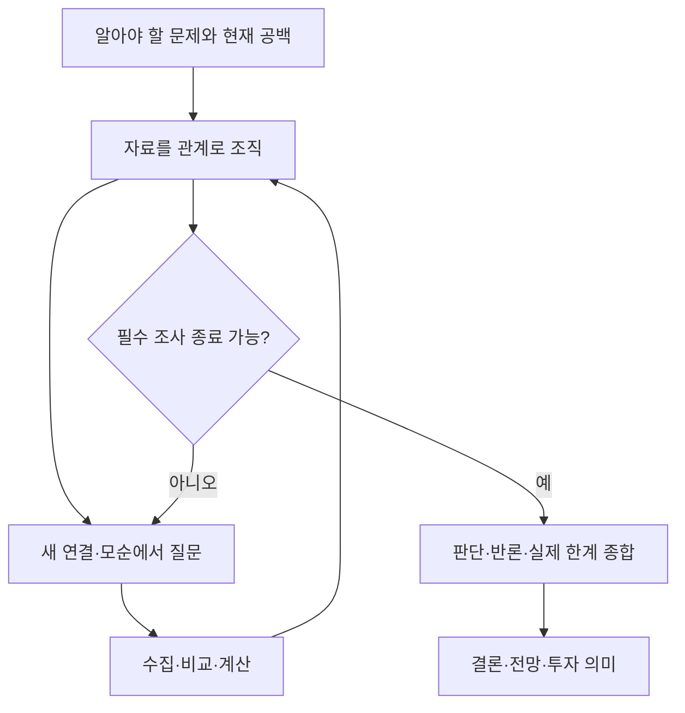

# 가설 기반 분석: 조사에서 종합 판단까지

**좋은 결론을 먼저 요구하지 않는다.** 알아야 할 문제를 정하고, 자료를 조직하면서 무엇을 모르는지 더 정확히 알아낸다. 그 공백을 조사하고 관계와 설명을 다시 구성하는 과정에서 판단이 생긴다. 내부 추론을 길게 출력하는 것이 아니라 실제 관측과 설명의 갱신을 계속한다. ETF 보고서의 작성·범위 계약은 `etf-hypothesis-analysis`를 따른다.

## 근거와 역할

이 파일은 독립적으로 읽을 수 있는 조사 규율이다. 별도 메모나 로컬 설계 문서를 실행 의존성으로 삼지 않는다.

- Pirolli·Card, 2005, [Sensemaking Process](https://andymatuschak.org/files/papers/Pirolli,%20Card%20-%202005%20-%20The%20sensemaking%20process%20and%20leverage%20points%20for%20analyst%20technology%20as.pdf), §2.2·2~5쪽: 자료 수집과 의미 형성은 서로 오간다. 자료를 재표현하면 맞지 않는 조각(residue)이 드러나며, 새 관계·가설·후속 검색 또는 표현 틀의 수정으로 이어진다. 예비 인지과제분석이지 성능을 보장하는 알고리즘은 아니다.
- 미국 정부, 2009, [Tradecraft Primer](https://www.cia.gov/resources/csi/static/Tradecraft-Primer-apr09.pdf): 27~30쪽의 발산·수렴과 Outside-In Thinking으로 중요한 외부 요인을 빠뜨리지 않는다. 10~11쪽으로 출처 품질을 확인하고, 설명 후보가 생기면 14~16쪽처럼 같은 증거를 대조한다. ACH를 모든 초기 질문의 전제나 출력 양식으로 삼지 않는다.
- [ICD 203](https://www.dni.gov/files/documents/ICD/ICD-203.pdf) D.6.e.(1)~(7): 출처·가정·판단·불확실성을 구분하고 대안과 수정 이유를 설명하며 종합 메시지를 전달한다.
- 아래 순환·종료 기준은 이 자료들의 프로젝트 적용안이지 CIA 공식 표준 절차나 실증된 ETF 예측법이 아니다. 출처는 매번 내려받는 실행 의존성이 아니다.

## 분석 구조

새 자료가 문제 자체를 바꾸면 A도 갱신한다. 그림의 마지막으로 갔다고 전체 분석이 완료된 것은 아니다. 확보하지 못한 필수 근거가 있으면 아래 기준에 따라 범위 한계 내 완료 또는 미완료를 명시한다. 관측이 더 필요한데 문장만 다듬어 전달 단계로 가지 않는다.

## 1. 알아야 할 문제와 지금 모르는 것을 정한다

대상·기준일·기간·비교 기준을 확인하고 **무엇을 설명해야 독자의 판단에 도움이 되는가**를 한 문장으로 정한다. '왜 저평가됐나'처럼 답을 포함하지 않는다. ETF에서는 사업의 변화, 그 변화가 이익에 도달하는 과정, 공개 기대와 가격의 의미까지 연결할 문제를 정한다.

초기 자료를 **확인한 사실 / 다른 사람이 제시한 해석 / 아직 모르는 것**으로 나눈다. 사업 작동 방식이나 중요한 변수를 모르면 먼저 사업·계약·회계 구조 또는 실제 사례를 조사한다. 아직 결론도 설명 후보도 없다는 이유로 이 질문을 탈락시키지 않는다.

**필수 조사 범위와 실행 과제는 다르다.** 전체 구성·상위 5종목 등 범위는 누락 방지 기준으로 유지하되, 다음 과제는 현재 이해를 막는 질문 하나를 해결하도록 만든다. 회사·문서·지표는 조사 대상이지 완료 기준이 아니다. 무엇을 모르며 답에 따라 어느 설명·판단이 달라지는지 특정한다. 아직 사업을 모르면 작동 방식부터 탐색하고 초기 방향이나 경쟁 가설을 강요하지 않는다.

과제는 **질문에 대한 답·핵심 근거·답의 적용 범위·남은 공백**을 반환한다. 자료를 확보했어도 질문에 답하지 못하면 미완료다. 예를 들어 '정유 3사 실적 수집' 대신 '정제마진 상승이 반복 가능한 현금창출로 전달됐는가, 처리량·정비·재고효과 중 무엇이 연결을 제한하는가?'를 조사한다. 이 질문은 예시이지 모든 기업에 적용할 고정 질문이 아니다.

공백은 '불확실'이 아니라 다음 중 무엇이 비었는지로 특정한다. 이는 고정 출력 필드가 아닌 질문 생성 기준이다.

- **사실:** 어느 기업·계정·기간의 무엇을 아직 확보하지 못했나?
- **연결:** 어느 두 관측 사이의 관계·중간 과정·시차가 설명되지 않나?
- **범위:** 어느 기업·사업·기간까지 같은 설명이 적용되는지 모르나?
- **의미:** 관측이 공개 기대·가치평가·분석 기간에 무엇을 뜻하는지 모르나?

중요한 공백과 자료 접근성은 별개다. 당장 구하기 어렵다는 이유로 문제에서 빼지 않는다. 대상·요청 범위·기준일은 유지하되 문제의 표현과 이해는 새 증거로 수정할 수 있다. 초기 요약을 나중에 빈약하게 고쳐 통찰을 만들어내거나, 이후 발표 자료로 당시 공백을 메우지 않는다.

## 2. 자료를 주제가 아니라 관계로 조직한다

먼저 기간·통화·단위·대상을 맞춘다. 연결하려는 조각에는 출처와 관측일이 있어야 한다. 같은 원문 재인용을 독립 확인으로 세지 않는다. 각 조각은 사실일 수도, 출처의 해석일 수도 있으므로 섞지 않는다.

기존 근거 기록에 문제를 설명하는 데 필요한 연결만 짧게 적는다. **어느 조각과 어느 조각이 어떤 관계인지, 확인된 관계인지 추정인지**를 드러낸다. 키워드가 같다는 이유만으로 연결하거나 모든 조각의 모든 조합을 만들지 않는다.

| 관계를 살펴보는 관점 | 발견할 것 |
|---|---|
| 시간·순서 | 무엇이 먼저 바뀌었나? 발표일과 실제 발생일·비교 기간이 같은가? |
| 사업 과정 | 주문 → 생산 → 출하 → 매출 → 이익·현금 중 어디에서 연결이 끊기나? |
| 대상 간 비교 | 같은 환경인데 왜 결과가 다른가? 같은 결과가 서로 다른 원인에서 생겼나? |
| 노출·규모 | 업종이 달라도 같은 고객·계약·정책에 의존하는가? 실제 확인 범위와 펀드 비중은 무엇인가? |
| 증거·기대 | 서로 확인·반박하는가? 공개 전망의 전제와 새 사실이 다른가? 단순 재인용인가? |

Outside-In 관점으로 익숙한 회사 자료 밖의 고객·공급사·경쟁·정책·금융 조건에서 중요한 누락이 있는지도 살핀다. 가능한 요인을 떠올리는 것과 실제 영향이 있다고 채택하는 것은 분리한다. 모든 외부 요인을 같은 분량으로 조사하지 않는다.

**틀에 맞지 않는 조각을 버리지 않는다.** 출처 오류·시점 차이인지 먼저 확인하고, 자료가 유효하면 업종 묶음·사업 과정·원인 설명을 바꿀 필요가 있는지 본다. 관계를 새로 그렸다는 사실만으로 인과가 입증된 것은 아니다.

## 3. 드러난 공백에서 다음 질문을 만든다

질문은 새 연결, 모순, 빠진 중간 과정, 기존 틀로 설명되지 않는 자료에서 나온다. 조사 단계에 맞는 질문을 고른다.

- **대상을 모를 때:** 무엇이 매출·비용을 결정하며 어떤 자료에서 확인할 수 있나?
- **연결을 모를 때:** 이 조각들은 실제로 어떤 과정으로 이어지나? 같은 대상·기간의 자료가 맞나?
- **설명 후보가 있을 때:** 어떤 관측이 후보들을 구별하거나 함께 작용한 범위를 밝혀주나?
- **판단이 생겼을 때:** 어느 전제·반례가 방향·크기·시점·범위를 바꾸나?

처음 두 종류에는 예상 결론이나 경쟁 가설을 미리 요구하지 않는다. 대신 **어느 공백을 해소하며 왜 독자의 문제에 필요한지**를 말할 수 있어야 한다. 단순 수치 확인에는 가설표를 만들지 않는다.

설명 후보가 생기면 **같은 증거를 기존 설명과 강한 대안에 대조**한다. 둘 다 설명할 수 있는 관측은 선택 근거로 세지 않고, 무엇을 더 보면 구별되는지 질문한다. 반대 증거를 반영해 방향·크기·시점·범위 중 무엇이 바뀌는지 갱신한다. 결론을 유지하려면 그 증거까지 포함해 대안보다 현재 설명이 강한 비교 근거를 제시한다. '이미 알려졌다'·'불확실하다'라는 말로 반론을 별도 절에 격리하지 않는다. 구별 자료가 실제로 없으면 남는 대안과 판단에 미치는 영향을 보존한다.

먼저 요청 범위를 충족하는 데 필요한 공백과 설명을 막는 연결을 고른다. 다음으로 중요한 반례·공통 노출·놓친 외부 요인을 본다. 비슷하게 중요할 때 더 직접적이고 구별력 있는 자료를 우선한다. 새로운 이야기나 결론 반전을 만들어내려고 질문을 고르지 않는다.

## 4. 관측을 실행하고 이해를 다시 구성한다

1. **관측 전:** 현재 공백과 확인할 자료·비교·계산을 특정한다. 설명 후보가 있으면 어떤 결과가 무엇을 구별할지도 적는다. '새 자료를 찾는다'가 아니라 실제 다음 도구 호출로 이어져야 한다.
2. **실행:** 출처의 기간·접근성·전문성·이해관계·완전성을 확인하며 수집·비교한다. 한 출처가 실패하면 대체 원문·공시·자료 경로를 찾는다. 이미 확보한 자료로 충분하면 재수집하지 않는다.
3. **갱신:** 의미 있는 관측이 들어올 때마다 현재 설명의 어느 관계가 확인·약화·변경됐는지 반영한다. 모든 회사의 수집이 끝날 때까지 종합을 미루지 않는다. 기존 설명과 충돌하면 출처·시점을 맞춘 뒤 설명의 조건·범위를 수정한다. 아직 판단이 없으면 이해와 공백을, 판단이 있으면 이유·방향·크기·시점·확실성을 갱신한다.
4. **다음 실행:** 수정된 설명에서 가장 중요한 미해결 연결을 골라 다음 관측으로 간다. 예정된 회사 순서나 자료 목록을 기계적으로 소진하지 않는다. 일부가 막혀도 나머지 실행 가능한 핵심 조사를 계속한다.

각 순환은 자료의 반복 요약이 아니라 **공백 해소, 관계의 확인·수정, 실제 한계 확인** 중 하나를 남겨야 한다. 기존 근거 기록의 현재 설명을 갱신하고, 바뀐 관계와 근거·다음 질문을 짧게 연결한다. 숫자만 늘었으면 설명이 진척됐다고 하지 않는다. 새 자료가 기존 설명을 확인할 뿐이면 그대로 기록하며 억지로 반전시키지 않는다. 같은 질문이 해결됐으면 다른 중요한 공백으로 이동하고, 더 이상 필요한 공백이 없으면 끝낸다. 질문 수·검색 수·문서 길이 자체를 목표로 삼지 않는다.

### 나눠 조사해도 설명의 통합을 미루지 않는다

병렬화는 독립적으로 풀 수 있는 공백에만 사용한다. 위임 시 현재 설명·공통 가정·기준일과 맡은 질문이 전체 문제의 어느 연결을 확인할지 전달한다. 회사별 담당을 고정하지 않고 기업 간 비교·전달 경로·개별 사건 중 질문에 맞는 단위로 나눈다. 선행 결과가 필요한 질문은 그 결과를 받은 뒤 만든다.

반환은 자료 묶음이 아니라 **질문의 답·근거·적용 범위와 예외·전체 설명에서 확인하거나 수정할 관계**다. 상위 분석자는 결과들의 시점·가정·중복·충돌을 대조하고 현재 설명을 갱신한 뒤 다음 질문을 고른다. 개별 조사자의 완료 표시는 전체 문제의 해결이 아니다. ETF의 클러스터·기업별 관측 왕복은 `etf-hypothesis-analysis`의 연결 규칙을 따른다.

### 가상 예: 조각의 연결이 다음 질문을 만든다

수주잔고 증가·출하 정체·납기 장기화를 따로 나열하지 않고 주문→인도 과정에 놓으면, '잔고가 새 주문 때문에 늘었나, 출하 지연으로 쌓였나, 둘 다인가?'라는 공백이 생긴다. 가동률·인도일 변경·취소를 확인해 생산능력 제약인지 고객 인수 지연인지 구별한다. 후자면 고객의 자금·수요·허가 중 무엇이 바뀌었는지로 이동한다. 여러 업종의 편입기업이 같은 고객에 묶여 있으면 업종별 분류를 공통 노출 중심으로 수정한다. 그다음 계정·시차·공개 기대·ETF 중요도를 확인한다. **이 예시의 원인을 다른 사례의 답으로 복사하지 않는다.**

### 증거를 잘못 강하게 만들지 않는다

- 같은 결과와 양립하는 설명들을 하나의 관측만으로 구별했다고 주장하지 않는다. 판별력이 낮으면 남는 대안과 영향 범위를 적는다.
- 기대했던 흔적이 없다는 사실은, 그 흔적이 해당 출처·기간에서 실제로 관측될 수 있었을 때만 반증으로 사용한다. 미공개·누락과 부재는 다르다.
- 계산이 맞는 것과 원인이 맞는 것은 다르다. 고정 EPS에서 가격 하락과 PER 하락이 같은 비율인 것은 항등식이지 금리가 하락을 설명했다는 증거가 아니다. 고정 PER로 EPS를 역산한 결과도 독립된 시장 기대 자료가 아니다.
- ETF 환매는 구성종목 시장의 매도 압력이나 매수 의도를 직접 입증·반증하지 않는다. 종목·시장·통화·기간이 다른 수익률의 차이를 곧바로 원인별 기여로 해석하지 않는다.
- 관측 상관관계 → 가능한 작동 원리 → 원인별 영향 추정은 서로 다른 주장이다. 앞 단계의 자료로 뒤 단계까지 검증했다고 쓰지 않는다.

## ETF 네 질문의 완결성

출력 목차나 고정 조사 순서가 아니다. 최종 문장들이 다음 질문의 답으로 이어지는지 확인한다.

| 질문 | 필요한 연결 |
|---|---|
| 무엇이 변했거나 지속됐고 왜인가? | 비교 대상·날짜, 관측 → 원인 → 사업 효과, 지속 전제 검증 |
| 시장은 무엇을 기대하고 가격에 무엇을 반영했는가? | 공개 전망·가격 반응·역산 기대의 구분, 출처·범위·형성일·가정·대안 해석 |
| 이익·가치평가·향후 한 달에 어떻게 도달하는가? | 계정·현금흐름·배수에서 현재 가격 대비 상승 여력·하락 위험까지, 기업별 효과의 ETF 합산, 해당 기간의 기본 전망·가정·반대 시나리오 |
| 차이가 남는다면 왜인가? | 차이와 지속 이유의 근거. ‘차이 없음’과 ‘아직 확인 못 함’의 구분, 미충족 검증의 실행 또는 실제 한계 |

같은 호재가 이미 공개 전망에 포함됐으면 새로운 상향 근거로 재사용하지 않는다. 전망에 포함됐다는 것과 가격에 반영됐다는 것도 다르다. 기회를 발견할 의무는 없고, 기대 차이 미확인을 중립 전망으로 바꾸지 않는다.

ETF 전망·투자 판단 요청에서는 `etf-hypothesis-analysis`의 가격 연결 절차로 **사업 이해 → 이익·가치 추정 → 현재 가격과 비교 → 해당 기간의 가격 판단**까지 조사한다. 사업 설명 뒤에 ‘선반영 정도 미확인’을 붙이거나 PER 계산을 했다는 이유로 종료하지 않는다. 비어 있는 연결을 다음 질문으로 삼고, 확보 가능한 가격·전망·평가 근거로 가정과 민감도를 계산한다. 완벽한 기대 식별을 기다리지 않되 근거 없는 수익률·방향을 만들지 않는다.

## 실행 규칙: ‘계속 조사’는 보고서 항목이 아니라 미완료 상태다

**‘계속 조사’가 하나라도 있으면 최종 답변을 보내지 않는다. 같은 작업에서 다음 수집·비교·계산을 실행한다.** 항목 기록, 실행 계획, 진행 설명, 사용자에게 계속할지 묻는 것은 실행이 아니다.

1. 질문마다 다음 실행을 특정한다. 결과를 읽고 현재 이해·공백·관계를 갱신한다. 판단이 형성됐으면 그 판단까지 수정한다.
2. 도구 한 번 호출했다고 해결이 되지 않는다. 답이 안 나왔고 다른 경로가 있으면 계속한다.
3. 하나가 실제로 막혀도 나머지 실행 가능한 조사를 진행한다. 한 출처의 실패로 전체를 중단하지 않는다.
4. 최종 답변 직전에 ‘계속 조사’와 미분류 공백을 확인한다. 하나라도 남으면 조사로 돌아간다.

‘관찰 필요·후속 과제·자료 한계’로 이름을 바꾸거나 요청 범위를 줄여 종료하지 않는다. 한계로 바꾸려면 실제 실패·비공개·미발표·미래 일정·실제로 적용되어 소진된 제한이 확인되어야 한다. 단순히 문서가 길어졌다는 것은 한계가 아니다. 사용자가 중단을 요청하면 따른다.

미래 실적·정책 결정을 지금 알아내라는 뜻이 아니다. **지금 가능한 핵심 조사와 그 결과의 판단 반영**을 끝내라는 뜻이다. 현재 전망과 전제, 공개된 사업 지표와 노출을 확인하지 않은 채 ‘다음 실적이 알려줄 것’이라고 끝내지 않는다.

지시가 모순되거나 부족하다고 주장하기 전에 원문을 다시 읽는다. 종료·범위·중립 금지를 실행하지 않은 문제를 지시 탓으로 돌리지 않는다.

## 미해결 질문의 처리 상태

질문은 '지속성 불확실'이 아니라 '공급 복구가 공개 예상의 전제보다 늦어지는가?'처럼 확인 가능하게 쓴다. 기존 기록에 해소할 공백·필요한 관측·실제 시도와 상태를 남긴다. 닫을 때는 **질문에 대한 답과 적용 범위, 그 답을 성립시키는 근거·관계, 현재 설명에 반영한 내용**을 짧게 연결한다. 자료명·계산 목록과 ‘해결’ 표시만으로 닫지 않는다. 아직 답하지 못한 탐색 질문도 미분류로 방치하지 않는다.

| 상태 | 인정 조건 |
|---|---|
| **계속 조사** | 요청 범위·사업 이해·관계 설명·판단에 필요한 공백이며, 다음 수집·비교·계산이 지금 실행 가능함. 작성 전에 실행 |
| **해결** | 질문의 답이 근거에서 어떻게 성립하는지 설명하고 현재 이해·관계·판단에 반영함. 확보 자료·산술 검산·방향 문장의 존재만으로는 불충분 |
| **현재 답에 영향 없음** | 해당 전제를 제거해도 별도 증거로 답이 성립하거나, 근거 있는 대안 결과들을 비교해 같은 답이 성립함을 보임. ‘작은 비중’만으로 인정하지 않음 |
| **한계로 중단** | 필요한 자료·계산과 지금 확보할 수 없는 이유를 특정하고 실제 시도·대안 경로를 기록. 미시도나 단일 출처 실패는 불충분 |

어떤 자료가 필요한지 모르겠다면 1차 문서·공시·데이터의 존재와 사업 작동 방식을 확인하는 것이 다음 조사다. '해도 같을 것'으로 닫지 않는다. 중요한 공백을 근거로 해소한 뒤에는 새 관계나 기회를 억지로 만들기 위해 조사하지 않는다.

## 미래 관측은 현재 판단의 수정 조건이다

미래 실적·정책은 그 자체로 종료 장애가 아니다. 공개 기대·노출·전제를 조사한 뒤, 중요한 사건의 확인된 날짜와 **결과에 무관하게 유지되는 판단 / 특정 결과에서 수정되는 판단**을 내부 기록에 연결한다. 날짜나 수치 임계값이 확인되지 않았으면 만들어 넣지 않는다.

이 연결을 마치면 조건부 분석이 완료될 수 있다. 지금 확인 가능한 필수 전제가 미검증이면 여전히 미완료다. 고객용 보고서에서는 중요한 조건만 자연스럽게 설명한다. 모든 미래 관측을 표의 한 행으로 출력하거나 미래 일정으로 현재 판단을 대신하지 않는다.

## 종료와 전달은 두 개의 별도 관문이다

### 조사 종료 판정

- **완료:** 네 질문이 필요한 근거로 연결되고, 남은 질문이 모두 해결 또는 근거 있는 ‘현재 답에 영향 없음’이다. 모든 가능성을 조사했다거나 전망의 적중을 보증한다는 뜻은 아니다.
- **범위 한계 내 완료:** 실제 한계에 의존하는 주장을 제거해도 명시된 좁은 대상·기간에서는 네 답이 성립한다. 제외 범위를 밝힌다. 일부 회사만 분석했다면 ETF 전체 전망을 완료했다고 하지 않는다. 투자 판단 요청에서 가격 판단을 제외한 사업 설명은 이 상태로 요청 완료를 대신할 수 없다.
- **미완료:** 실제 한계로 네 답 중 필수 답을 뒷받침할 수 없다. 성립하는 답과 성립하지 않는 답, 재개에 필요한 자료·사건을 밝힌다. 실행 가능한 조사가 남아 있으면 이 상태를 선언하고 끝내는 대신 계속 실행한다.

종료는 특정 도구 호출 수나 자기평점으로 정하지 않는다. 필수 범위·주요 공백·중대한 반례마다 답과 성립 근거가 있어야 한다. **한 출처의 실패, 많은 자료, 방향 문장만으로 닫지 않고, 정밀 수치가 없다는 이유만으로 근거 있는 정성 판단까지 미완료로 만들지도 않는다.** 핵심 연결이 비었고 실행 가능한 관측이 있으면 편집·출처 정리·파일 저장 대신 조사한다. 미래 사건의 미실현과 현재 전제의 미검증, 전망의 정확성과 조사 종료 여부를 구분한다.

### 전달 품질 판정

조사가 닫혀도 보고서가 가설표·자료 나열·관측 일정이면 전달은 미완료다. `etf-hypothesis-analysis`의 작성 매뉴얼로 종합한다.

- 첫 문단만 읽어도 **현재 가격에서 해당 기간의 상승 여력·하락 위험에 대한 기본 판단과 결정적 이유**를 이해하는가? 사업 원인만 요청했다면 그 원인 판단인가? 분석의 의미를 독자가 다시 조립하게 하지 않는가?
- 상충하는 결과의 상대적 중요도를 판단했는가? 불확실성 때문에 못 정한 부분과 그래도 정할 수 있는 부분을 구분했는가?
- 가장 강한 반대 증거와 중요한 가정이 본문의 판단에 실제로 반영됐는가?
- 회사별·가설별 표와 미래 일정을 가려도 무엇이 일어나며 어떤 힘이 더 중요하고 왜 현재 가격에 그런 의미를 갖는지 본문에서 이해되는가? 독자가 숫자들을 다시 조합해야 하면 전달은 미완료다.

이것은 문장 수나 평가 점수의 통과 기준이 아니다. 실패한 연결을 고치는 편집 규율이며, 근거가 비어 있으면 조사로 돌아간다.

## 기록과 검증

기존 조사 기록 한 곳에 **알아야 할 문제 / 현재 확인한 사실과 관계 / 중요한 공백 / 다음 관측 / 확보 증거와 달라진 이해·종료 이유**를 갱신한다. 최초 상태도 비교 기준으로 남긴다. 판단은 형성된 뒤 기록한다. 새 저장 구조·그래프 DB·출력 필드·고객용 체크리스트·장문의 사고 독백을 만들지 않는다.

사람은 질문의 중요성, 반례, 판단 수정, 종합 설명, 독자에게 전달되는 의미를 검토한다. 코드는 계산·증거 연결·기준일·중복 호출·시간·비용을 검증한다. 모델 자체 채점이나 별도 런타임 의미 심사기는 추가하지 않는다.

개발 검증은 **조사 실행과 작성**을 나눈다. 조사 실행에는 불완전한 초기 자료와 조회 도구만 제공하고 실제 질문·응답을 보존한다. 질문이 바뀐 이유, 관측이 수정한 관계, 다음 조사와 종료 근거를 확인한다. 완성된 증거 묶음으로 글만 다시 쓰는 것은 작성 검증이다. 그 실행의 첫 문단과 본문은 표를 가리고도 전망·이유·투자 의미가 연결되는지 따로 읽는다. 조회 완주·산술 검산·금지 표현 통과를 의미 품질의 합격으로 바꾸지 않는다.

최소한 다음 동작을 사례로 확인한다. 특정 방향이나 스킬 문구 재현을 정답으로 삼지 않는다.

- 사업은 개선됐지만 가격 연결이 비어 있으면 평가 자료를 추가 조사한다. 같은 사업 가치에서도 현재 가격이 다르면 상승 여력 판단이 달라져야 하며, 입력이 충분한데 완벽한 기대 식별을 요구하며 회피하면 실패다.
- 새 관측이 기존 설명에 불리하면 설명·범위·다음 질문을 수정한다. 같은 초기 관측에 원인이 다른 경우를 포함하고, 기존 설명을 확인하는 자료에는 억지 반전을 만들지 않는다.
- 일부 기업의 결과와 전체 ETF의 효과가 다르면 나머지 노출과 전파 경로를 조사한다. 작은 편입기업·비편입기업 사건이 공통 조건을 바꾸는 사례에서 클러스터를 수정하고 중복 합산하지 않는지 확인한다.
- 핵심 자료 접근이 막히면 대체 원문·공개 자료·근거 있는 추정 경로를 실제로 시도한다. 끝내 답할 수 없는 부분을 보합·해결로 바꾸지 않고 성립하는 판단과 구분한다.

가상 자료는 가상으로 명시한다. 통제 자료실에서의 조사·계산·작성 동작을 자유로운 실수집, 현실 인과 입증, 예측 정확도·투자성과 검증으로 보고하지 않는다. 실행별 지침·입력·질문·응답·보고서와 검토 근거를 보존하되 새 평가 프레임워크나 런타임 의미 심사기는 만들지 않는다.

다음 분석에서는 새 자료가 바꾼 논점과 전제를 다시 열고 모든 수치의 관측일을 확인한다. 편입 비중이 바뀌면 상위 5종목 조사 대상도 다시 확인한다.

## 최종 확인

1. ‘계속 조사’와 미분류된 중요한 공백 0개. 나머지 상태에는 해결 증거·전제 제거 검증·실제 한계가 있다. 모르는 사실과 모르는 연결을 구분했다.
2. 네 답이 근거와 사업 효과로 연결되고 반대 효과를 비중·크기·시점·확실성으로 비교했다. 맞지 않는 자료를 버리지 않았고 일부 회사의 답을 전체로 확장하지 않았다.
3. 미래 정보·재인용·항등식으로 검증이 늘었다고 하지 않았고, 기대 차이 미확인을 중립으로 바꾸지 않았다.
4. 미래 관측을 현재 판단의 수정 조건으로 연결했으며, 현재 가능한 조사를 독자의 다음 과제로 넘기지 않았다.
5. 실제 완료 범위와 제외 범위를 밝혔고, 최초 자료보다 무엇을 더 이해했는지 또는 새 이해가 없었는지를 정직하게 기록했다.
6. 내부 기록이 아닌 **근거 있는 종합 판단**을 전달한다. 조사 종료 판정만으로 보고서 품질을 통과시키지 않는다.
