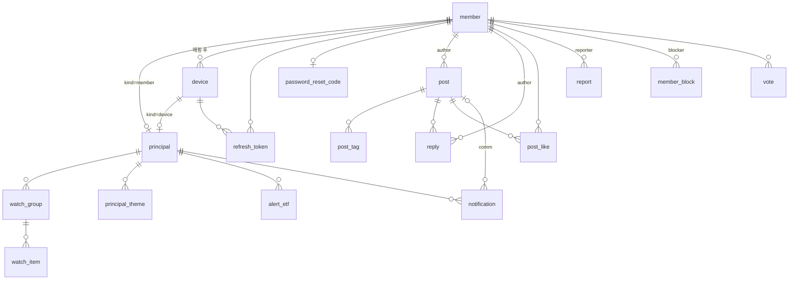
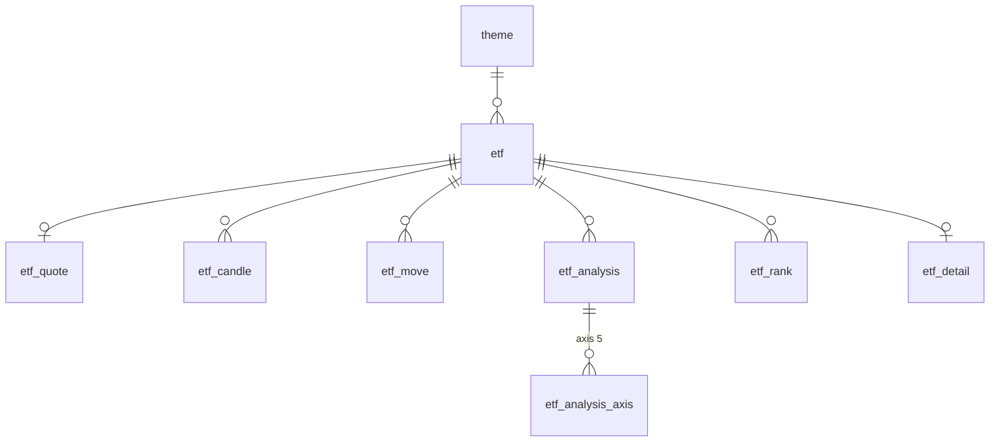

# app-api 데이터 모델 (설계 초안)

계약 [openapi.yaml](../openapi.yaml) 이 요구하는 테이블. 확정되면 `db/etf-migration/V3__app_schema.sql` 로 옮기고 그 파일이 정본이 된다. Hibernate 는 validate 만 한다.

결정(2026-09-28): 소유자는 `principal` 테이블 하나 / 기본 키 bigint identity / 게시물 소프트 삭제 / 기존 `forecast_vote` 는 V3 에서 `vote` 로 재정의 / 동기화 테이블은 앱 DB 안에 따로 두고 표 데이터는 정규화, 분석 산출물은 키 컬럼 + JSONB 원문 / 탈퇴 시 식별 정보 NULL.

세 묶음이다.
- **쓰기 소유**: 앱이 만든다. 사용자·디바이스·토큰·관심·알림·커뮤니티·투표.
- **읽기 전용 동기화**: 파이프라인 산출물과 시장 데이터를 앱 DB 로 옮긴 것. 앱은 읽기만 한다.
- **화면 전용 응답**(HomeBrief·EtfSummary)은 테이블 없이 위 둘을 조합한다.

## 공통 규칙

이름 규칙.
- 테이블은 단수 snake_case. 회원은 `member`(`user` 금지), 게스트 기기는 `device`, 둘을 묶은 소유자는 `principal`.
- 쓰기 소유의 자식·연결 테이블은 부모 이름을 접두사로(`watch_item`·`post_tag`·`post_like`·`principal_theme`). 자체 정체성이 있는 것은 제 이름(`reply`·`notification`·`vote`).
- 동기화 테이블은 단위를 접두사로. ETF 단위 발행본·시장 데이터는 `etf_`(`etf_move`·`etf_analysis`·`etf_analysis_axis`·`etf_rank`·`etf_detail`·`etf_quote`·`etf_candle`). 마스터는 이름 그대로(`etf`·`theme`).
- 참조 컬럼은 `<테이블>_id`(`member_id`·`device_id`·`principal_id`·`post_id`·`etf_analysis_id`). ETF 와 테마는 자연키라 `etf_code`·`theme_key`. 파이프라인 키는 원래 이름 유지(`instrument_id`·`concept_id`).
- 시각 컬럼은 `_at`(`created_at`·`updated_at`·`deleted_at`·`published_at`·`synced_at`), 기준일은 `as_of`.
- enum 값은 소문자 varchar + CHECK.

- id `BIGINT GENERATED BY DEFAULT AS IDENTITY`. API 의 `id: string` 은 숫자를 문자열로 준다.
- 시각은 `TIMESTAMPTZ`. `created_at NOT NULL DEFAULT now()`, 변경 있는 테이블만 `updated_at`.
- ETF 식별은 `etf_code VARCHAR(6)`(KRX 코드). 존재 검증은 서비스(`ETF4001`).
- **FK 제약은 걸지 않는다.** 표의 `→ 테이블` 은 논리 참조이며 컬럼은 ID 만 저장한다. 인덱스·UNIQUE·CHECK 는 유지한다. 이유: 동기화가 테이블을 통째로 바꿔도 사용자 데이터가 막히지 않고, 마이그레이션 순서·락 부담과 대량 쓰기의 FK 검사 비용이 없다. 대신 자식 정리(그룹 삭제 시 `watch_item`, 게시물 삭제 시 `post_tag`·`post_like`, 발행본 교체 시 `etf_analysis_axis`)는 서비스가 같은 트랜잭션에서 직접 한다. JPA `@ManyToOne` 은 DB FK 없이 동작하고 Hibernate validate 는 FK 를 보지 않는다.
- 소프트 삭제는 `deleted_at TIMESTAMPTZ NULL`. 목록 조회는 `deleted_at IS NULL` 부분 인덱스.
- 커서는 `(created_at DESC, id DESC)` 키셋. 인덱스도 그 순서로.

## 쓰기 소유

### principal
게스트(디바이스)와 회원을 한 종류의 소유자로 본다. 관심·알림·온보딩 테이블은 `principal_id` 하나만 가진다.

| 컬럼 | 타입 | 비고 |
|---|---|---|
| id | bigint PK | |
| kind | varchar(10) | `member` \| `device` |
| member_id | bigint → member NULL | kind=member 일 때 |
| device_id | bigint → device NULL | kind=device 일 때 |
| created_at | timestamptz | |

제약: `CHECK ((kind='member' AND member_id IS NOT NULL AND device_id IS NULL) OR (kind='device' AND device_id IS NOT NULL AND member_id IS NULL))`, `UNIQUE(member_id)`, `UNIQUE(device_id)`.

로그인 매핑(PRD 게스트 데이터 정책): 계정 principal 에 관심 데이터가 없으면 디바이스 principal 의 소유 행(`watch_group`·`alert_etf`·`principal_theme`)을 계정 principal 로 `UPDATE principal_id`. 있으면 매핑하지 않는다. 디바이스 행은 남기고 `device.member_id` 만 연결한다. 응답 `guestMapped` 는 이 UPDATE 가 일어났는지다.

### member
| 컬럼 | 타입 | 비고 |
|---|---|---|
| id | bigint PK | |
| email | varchar(255) UNIQUE NULL | 소셜 가입은 없을 수 있음 |
| password_hash | varchar(100) NULL | 이메일 가입만. bcrypt |
| provider | varchar(10) | `email` \| `apple` \| `google` |
| provider_subject | varchar(255) NULL | 소셜 sub. `UNIQUE(provider, provider_subject)` |
| nick | varchar(30) | |
| handle | varchar(30) UNIQUE | 아바타 색은 앱이 handle 로 매핑 |
| disclaimer_accepted_at | timestamptz NULL | 면책 동의 |
| created_at, updated_at | timestamptz | |
| deleted_at | timestamptz NULL | 탈퇴. 글·답글은 남기고 작성자 익명 표시 |

회원 테이블은 `member`. `user` 는 PostgreSQL 예약어이기도 하다.

탈퇴(`DELETE /me`): `deleted_at` 을 채우고 같은 트랜잭션에서 `email`·`password_hash`·`provider_subject` 를 NULL 로 지운다. 행은 남겨 글·답글·투표의 작성자 참조를 유지하고, `nick`·`handle` 은 그대로 둔다(익명 표시는 `deleted_at` 으로 판단). 식별 정보를 비우므로 같은 이메일·소셜 계정으로 다시 가입할 수 있다. `UNIQUE(email)`·`UNIQUE(provider, provider_subject)` 는 NULL 을 중복으로 보지 않는다. 함께 `refresh_token` 전부 revoke, `device.member_id` NULL. 액세스 토큰은 서명만 검증하므로 만료(1시간)까지 좋아요·투표 같은 쓰기가 통과한다. 투표 경로에 회원 조회를 붙이지 않기 위한 허용.

### device
| 컬럼 | 타입 | 비고 |
|---|---|---|
| id | bigint PK | |
| device_key | varchar(64) UNIQUE | 앱이 보내는 `X-Device-Id` |
| member_id | bigint → member NULL | 매핑 후 연결. 로그아웃 시 NULL 로 되돌리고 소유 데이터 초기화 |
| push_token | varchar(255) NULL | |
| created_at, last_seen_at | timestamptz | |

### refresh_token
| 컬럼 | 타입 | 비고 |
|---|---|---|
| id | bigint PK | |
| member_id | bigint → member | |
| token_hash | varchar(64) UNIQUE | 원문은 저장하지 않음(sha-256) |
| device_id | bigint → device NULL | 기기별 세션 |
| expires_at | timestamptz | |
| revoked_at | timestamptz NULL | 로그아웃·탈퇴·재발급 |
| created_at | timestamptz | |

인덱스 `(member_id)`. 탈퇴 시 전부 revoke.

### password_reset_code
| 컬럼 | 타입 | 비고 |
|---|---|---|
| member_id | bigint PK → member | 회원당 1행, 재요청 시 덮어쓰기 |
| code_hash | varchar(64) | 6자리 코드의 sha-256 |
| attempts | smallint | 틀린 시도 수, 5회면 무효 |
| expires_at | timestamptz | 발송 후 10분 |
| created_at | timestamptz | 마지막 발송 시각, 60초 재발송 간격 판정 |
| sent_count | smallint | 24시간 창 안의 발송 수, 5회면 429 |
| window_started_at | timestamptz | 24시간 창 시작 시각 |

재설정 성공 시 행 삭제와 회원 `refresh_token` 전부 revoke.

### signup_code
| 컬럼 | 타입 | 비고 |
|---|---|---|
| email | varchar(255) PK | 이메일당 1행, 재요청 시 덮어쓰기 |
| code_hash | varchar(64) | 6자리 코드의 sha-256 |
| attempts | smallint | 틀린 시도 수, 5회면 무효 |
| expires_at | timestamptz | 발송 후 10분 |
| created_at | timestamptz | 마지막 발송 시각, 60초 재발송 간격 판정 |
| sent_count | smallint | 24시간 창 안의 발송 수, 5회면 429 |
| window_started_at | timestamptz | 24시간 창 시작 시각 |

가입 요청의 코드 확인은 가입 트랜잭션 전에 따로(틀린 시도 수 확정 저장), 행 삭제는 회원 저장과 같은 트랜잭션. 회원이 되기 전이라 member 참조 없음. 두 코드 표 모두 확인·재발송 때 행 잠금.

### mail_daily
| 컬럼 | 타입 | 비고 |
|---|---|---|
| day | date PK | KST 날짜 |
| sent | integer | 그날 메일 발송 수 |

코드 메일은 300통 초과 시 429, 신고 운영자 메일은 세기만 한다. Gmail 하루 한도(약 500통) 보호용.

### watch_group
| 컬럼 | 타입 | 비고 |
|---|---|---|
| id | bigint PK | |
| principal_id | bigint → principal | |
| key | varchar(20) | API 의 group key. 기본 그룹은 `base` |
| label | varchar(30) | |
| position | smallint | 표시 순서 |
| is_default | boolean | principal 당 정확히 1개 |
| created_at, updated_at | timestamptz | |

제약: `UNIQUE(principal_id, key)`, 부분 유니크 `UNIQUE(principal_id) WHERE is_default`. 사용자 그룹 최대 10개(WATCH4002)는 서비스가 센다. 기본 그룹은 principal 생성 시 만들고 삭제 불가(WATCH4001). 첫 진입 시 전망 상위 3종을 담는다(PRD).

### watch_item
| 컬럼 | 타입 | 비고 |
|---|---|---|
| group_id | bigint → watch_group | |
| etf_code | varchar(6) | |
| position | smallint | |
| created_at | timestamptz | |

PK `(group_id, etf_code)`. 인덱스 `(etf_code)`(관심 여부·`watchMembership`). 사용자 그룹 삭제 시 그 종목이 기본 그룹에 없으면 기본 그룹에 넣는다(PRD "삭제 시 기본 그룹에 유지").

### principal_theme
온보딩 선택 테마. `POST /onboarding/complete` 의 themes.

| 컬럼 | 타입 |
|---|---|
| principal_id | bigint → principal |
| theme_key | varchar(30) |
| created_at | timestamptz |

PK `(principal_id, theme_key)`.

### alert_etf
알림 종목. 관심과 독립(PRD).

| 컬럼 | 타입 |
|---|---|
| principal_id | bigint → principal |
| etf_code | varchar(6) |
| enabled | boolean |
| created_at, updated_at | timestamptz |

PK `(principal_id, etf_code)`. 계약에 아직 엔드포인트가 없다(노션 "알림 종목 목록·토글", 화면 잔여 "알림 설정 상세"). 테이블은 먼저 둔다.

### notification
| 컬럼 | 타입 | 비고 |
|---|---|---|
| id | bigint PK | |
| principal_id | bigint → principal | |
| kind | varchar(10) | `watch` \| `comm` |
| etf_code | varchar(6) NULL | |
| post_id | bigint → post NULL | comm |
| title, body | text | |
| read_at | timestamptz NULL | API `read` = `read_at IS NOT NULL` |
| created_at | timestamptz | |

인덱스 `(principal_id, created_at DESC, id DESC)`, 부분 인덱스 `(principal_id) WHERE read_at IS NULL`(unread-count).

### post
| 컬럼 | 타입 | 비고 |
|---|---|---|
| id | bigint PK | |
| author_id | bigint → member | 쓰기는 회원만 |
| etf_code | varchar(6) | 대표 ETF. API `Post.etf`. 태그 첫 번째 |
| title | varchar(100) NULL | |
| body | varchar(280) | PRD 280자 |
| quote_tag | varchar(30) NULL | |
| like_count, reply_count, view_count | integer DEFAULT 0 | 비정규화 카운터. 갱신은 같은 트랜잭션 |
| created_at, updated_at | timestamptz | |
| deleted_at | timestamptz NULL | 소프트 삭제 |

인덱스: `(created_at DESC, id DESC) WHERE deleted_at IS NULL`(피드), `(etf_code, created_at DESC, id DESC) WHERE deleted_at IS NULL`(ETF 탭), `(author_id, created_at DESC)`(내 글). 인기순(`scope=hot`)은 `like_count` 와 시간의 조합이라 계산식은 서비스에 둔다.

### post_tag
| 컬럼 | 타입 |
|---|---|
| post_id | bigint → post |
| etf_code | varchar(6) |
| position | smallint |

PK `(post_id, etf_code)`. 최대 3개(POST4003)는 서비스가 센다. 인덱스 `(etf_code)`.

### reply
| 컬럼 | 타입 |
|---|---|
| id | bigint PK |
| post_id | bigint → post |
| author_id | bigint → member |
| body | varchar(280) |
| created_at | timestamptz |
| deleted_at | timestamptz NULL |

인덱스 `(post_id, created_at, id)`.

### post_like
| 컬럼 | 타입 |
|---|---|
| post_id | bigint → post |
| member_id | bigint → member |
| created_at | timestamptz |

PK `(post_id, member_id)`. PUT 은 `INSERT ... ON CONFLICT DO NOTHING`, DELETE 는 삭제. 둘 다 `post.like_count` 를 같은 트랜잭션에서 증감. API `liked` 는 요청자 기준 존재 여부.

### report
| 컬럼 | 타입 | 비고 |
|---|---|---|
| id | bigint PK | |
| reporter_member_id | bigint → member | |
| target_type | varchar(10) | CHECK `post`·`reply` |
| target_id | bigint | post 또는 reply id |
| reason | varchar(10) | CHECK `spam`·`abuse`·`sexual`·`scam`·`etc` |
| created_at | timestamptz | |

UNIQUE `(reporter_member_id, target_type, target_id)`. 삽입은 `ON CONFLICT DO NOTHING`, 새 행일 때만 운영자에게 원문 메일. 처리는 운영자가 대상 행의 `deleted_at` 을 채우는 소프트 삭제(관리 화면 없음).

### member_block
| 컬럼 | 타입 |
|---|---|
| blocker_id | bigint → member |
| blocked_id | bigint → member |
| created_at | timestamptz |

PK `(blocker_id, blocked_id)`. 단방향: blocker 의 피드(전체·내 관심·인기·ETF 탭)와 답글 목록에서 blocked 의 글·답글을 빼고, blocked 의 답글로 blocker 에게 가는 알림을 만들지 않는다. 글 상세는 `blocked=true` 로 그대로 준다. 차단 해제는 1차 범위 밖.

### vote (기존 forecast_vote 재정의)
| 컬럼 | 타입 | 비고 |
|---|---|---|
| id | bigint PK | |
| etf_code | varchar(6) | 구 forecast_id |
| member_id | bigint → member | |
| choice | varchar(5) | `buy` \| `wait` \| `sell` (구 BUY/HOLD/SELL) |
| created_at, updated_at | timestamptz | |

제약 `UNIQUE(etf_code, member_id)`, `CHECK (choice IN ('buy','wait','sell'))`. V3 는 `DROP TABLE forecast_vote` 후 생성(실험 데이터 폐기). 함께 바꾼 것: `Vote` 엔티티·`VoteChoice`(값은 소문자, JPA 컨버터)·집계 필드 `buys/waits/sells`·dirty 집합 `vote:dirty-etfs`·실험 스크립트. Redis 키 `vote:{code}:*` 형식은 그대로다. 분포 `pct` 는 집계, `mine` 은 요청자 행.

## 읽기 전용 동기화

원천은 셋이다.
- 분석 산출물: analysis-engine-v2 엔진 테이블(`movement_*`·`outlook_*`, 파이프라인 RDS). `data_source = 'database'` 인 완료 발행본만 옮긴다.
- 앱 관리 값: `etf_curation`(선별 목록과 원천 없는 표시 값)과 `theme`, 마이그레이션으로 채운다.
- 마스터·시장 데이터: 파이프라인 마트 스키마 `src/libs/schema/migrations-cloud`. ETF 정체성은 `instrument.instrument_id`(ULID)이고 자연키는 `UNIQUE(market_code, ticker)`(MIC `XKRX` + 6자리 코드). 이름은 `entity.display_name`, 테마는 `etf_profile.primary_theme_concept_id → concept`, 일별 가격은 `price_daily`, 구성종목은 `etf_holding_snapshot`.

| 앱 테이블 | 파이프라인 원천 | 비고 |
|---|---|---|
| etf | instrument + entity + etf_curation | `code`=ticker, 테마·부제·hot 은 선별 표 |
| theme | 없음 | 마이그레이션 시드, 선별 ETF 가 쓰는 테마만 |
| etf_candle | price_daily | close·volume 만 있고 **open·high·low 없음**(선 차트) |
| etf_quote | price_daily 최근 두 종가 | 등락률은 두 종가로 계산, 장중 시세 없음 |
| etf_detail | etf_holding_snapshot + 구성종목 price_daily + etf_curation | weight_ratio 0~1 |
| etf_move | movement_analyses + movement_items | 거래일마다 최신 1건 |
| etf_analysis·etf_analysis_axis | outlook_analyses + outlook_items·factors·conclusion_keywords·factor_metrics·issue_items | KST 날짜마다 최신 1건 |
| etf_rank | etf_analysis | 동기화가 계산 |

규칙.
- 쓰기는 `sync` 스케줄러 하나(10분 주기, ShedLock). 다른 도메인은 읽기만.
- 파이프라인 RDS 는 읽기 전용 롤로 읽기.
- 원천이 같으면 다시 쓰지 않음.
- 선별 목록 밖 코드와 원천 30일 창 밖 날짜의 행은 삭제.
- 표 데이터(`etf`·`theme`·`etf_quote`·`etf_candle`)는 정규화. 키·범위·검색으로 조회하기 때문이다.
- 분석 산출물은 키 컬럼 + `payload JSONB`. payload 는 동기화가 엔진 테이블에서 조립한 문서. 엔진이 정규화 테이블로 저장해 원문 문서가 없다.
- 한글 enum 접기 같은 계약 변환은 서비스가 읽을 때.
- 키 컬럼은 정렬·달력·존재 여부·전일 비교에 쓰는 것만 뽑는다. payload 안을 WHERE 로 뒤지지 않는다.
- `as_of DATE` 는 KST 거래일, `published_at TIMESTAMPTZ` 는 파이프라인 발행 시각, `synced_at TIMESTAMPTZ NOT NULL DEFAULT now()` 는 동기화 시각. 발행본은 (대상, as_of) 당 최신 1행으로 upsert 한다. 발행 이력은 파이프라인이 보존하고 앱 DB 는 최신본만 둔다.
- 엔진 `outlook_sticker` 5단계는 `Signal` 5단계로 1:1 매핑. 값이 없으면 그 전망은 건너뜀.
- 요인 `sticker` 5단계는 앱 `Dir` 3단계로 접는다. 강력상승·상승→`help`, 중립→`neutral`, 하락·강력하락→`burden`. 오늘 움직임 `sentiment` 는 positive→`help`, neutral→`neutral`, negative→`burden`.

### etf_curation (선별 목록, 앱 관리)
| 컬럼 | 타입 | 비고 |
|---|---|---|
| etf_code | varchar(6) PK | 이 표의 행이 곧 앱 ETF 목록 |
| theme_key | varchar(30) → theme | |
| sub | varchar(100) NULL | 부제 |
| hot | boolean DEFAULT false | |
| manager | varchar(50) | 운용사 |
| expense_ratio | numeric(5,2) | 총보수 연 % |
| listed_on | date | 상장일 |
| leverage | numeric(3,1) NULL | 레버리지 배수, 해당 없으면 NULL |
| hedged | boolean NULL | 환헤지 여부, 해외 자산이 아니면 NULL |
| blurb | varchar(200) | 한 줄 소개 |

- 마이그레이션이 쓰는 표. 값 수정은 새 마이그레이션.
- 동기화가 여기서 `etf`·`etf_detail` 로 복사. 한 행을 시드와 동기화가 나눠 쓰지 않기 위함.
- 파이프라인 `etf_profile` 운용사·보수는 비어 있어 미사용(2026-10-01 조회).

### etf
| 컬럼 | 타입 | 비고 |
|---|---|---|
| code | varchar(6) PK | 앱 키. 파이프라인 `instrument.ticker` |
| instrument_id | text UNIQUE | 파이프라인 키(ULID). 동기화 조인용, 앱에 안 내려감 |
| market_code | varchar(30) | MIC. 코드는 시장 안에서만 유일 |
| name | varchar(100) | `entity.display_name` |
| theme_key | varchar(30) → theme | `EtfSummary.theme`. 로고 색은 앱이 매핑 |
| sub | varchar(100) NULL | 부제 |
| hot | boolean DEFAULT false | |
| synced_at | timestamptz | |

`GET /etfs?q=` 는 name·code 부분 일치. 유니버스가 수십 종이라 검색 인덱스는 두지 않는다. 앱의 다른 테이블은 `etf_code` 만 쓰고, 파이프라인 키 해소는 동기화가 이 표를 거쳐 한 번 한다.

### theme
| 컬럼 | 타입 | 비고 |
|---|---|---|
| key | varchar(30) PK | 앱 키 |
| concept_id | text UNIQUE NULL | 파이프라인 `concept.concept_id`. 동기화 조인용 |
| label | varchar(30) | `entity.display_name` |
| group | varchar(10) | `industry` \| `asset` CHECK |
| hot | boolean DEFAULT false | |
| position | smallint | 표시 순서 |
| synced_at | timestamptz | |

`ThemeFeedItem.count` 는 `etf.theme_key` 집계. 별도 매핑 테이블은 두지 않는다(ETF 당 테마 하나).

### etf_quote
| 컬럼 | 타입 | 비고 |
|---|---|---|
| etf_code | varchar(6) PK → etf | 최신 1행. `price_daily` 최근 종가 |
| price | numeric(14,2) | |
| change_pct | numeric(6,2) | 전일 대비 |
| as_of | timestamptz | 최근 거래일 15:30 KST. `HomeBrief.asOf` 는 그룹 최대값 |
| synced_at | timestamptz | |

### etf_candle
| 컬럼 | 타입 |
|---|---|
| etf_code | varchar(6) → etf |
| trade_date | date |
| open, high, low | numeric(14,2) NULL |
| close | numeric(14,2) |
| volume | bigint NULL |

PK `(etf_code, trade_date)`. 원천 `price_daily` 에는 close·volume 만 있어 open·high·low 는 NULL 로 두고 응답에서 생략한다(앱은 종가 선 차트). `ChartData` 의 range(`1W..1Y`)는 trade_date 범위, `ma5`·`ma20` 은 서비스가 앞 19행을 더 읽어 계산, `axis` 라벨도 서비스. 5요인 상세의 차트 지표 계산은 파이프라인 몫이라 여기서 하지 않는다.

### etf_move (오늘 움직임 발행본)
| 컬럼 | 타입 | 비고 |
|---|---|---|
| id | bigint PK | |
| etf_code | varchar(6) → etf | |
| as_of | date | 거래일 |
| published_at | timestamptz | `MoveInfo.at` |
| payload | jsonb | `{summary, items[]}` |
| synced_at | timestamptz | |

`UNIQUE(etf_code, as_of)`. payload 의 `items[]` 는 `{type, title_keyword, sentence, sentiment}`, `selected_item_ids` 가 있으면 그 항목만 그 순서로. 매핑: `text`=summary, `groups`=items 를 type(이슈·차트·수급·매크로) 별로 묶어 `head`=type 라벨·`t`=title_keyword·`sub`=sentence·`dir`=sentiment 접기. `foot`·`sheetTitle` 은 서비스 고정 문구. `summary` 가 null 이면 화면에 카드가 없다.

### etf_analysis (전망 발행본)
| 컬럼 | 타입 | 비고 |
|---|---|---|
| id | bigint PK | |
| etf_code | varchar(6) → etf | |
| as_of | date | 분석 기준일. `DailyAnalysis.date` |
| published_at | timestamptz | |
| signal | varchar(10) | 5단계. `outlook_sticker` 매핑(위 규칙) |
| payload | jsonb | `{summary_card, detail, factors, conclusion}` |
| synced_at | timestamptz | |

`UNIQUE(etf_code, as_of)`. 조립: summary_card=`{title: summary_title, summary}`, detail=`{title: detail_title, items[]: outlook_items(detail){title_keyword, sentences: bullets}, updates.items[]: outlook_items(update).sentence}`, conclusion=`{title, sentence, change_condition, supports[], burdens[]}`(conclusion_keywords), factors[]=`{axis, sticker, summary: sentence}`. 매핑: `dates`=조회한 as_of 가 속한 주의 월~일 7칸(`hasDaily`=그날 as_of 행 존재), `prevWeek`·`nextWeek`=그 주 앞·뒤로 가장 가까운 as_of 가 속한 주의 월요일, `now`=signal, `prev`=직전 as_of 행의 signal, `headTitle`=as_of 가 오늘(KST)이면 "오늘 발행", 아니면 "M월 d일 발행", `question`=summary_card.title, `dateline`=published_at, `synth`=summary_card.summary, `axes`=factors(sticker→Dir, `hasPage`=`etf_analysis_axis` 행 존재), `title`=detail.title, `args`=detail.items(`no` 순번, `claim`=title_keyword, `body`=sentences[].sentence), `todayDate`·`today`=detail.updates, `closingTitle`=conclusion.title, `pos`=supports[].label, `neg`=burdens[].label, `close`=conclusion.sentence(+change_condition). `id`·`tool_run_ids`·`is_updated`·`reason` 은 앱에 내려가지 않는다. 최신 signal 은 `EtfSummary.signal`·`HomeBrief.band`·`IssueDetail.affected[].prev` 에도 쓴다.

### etf_analysis_axis (5요인 상세)
| 컬럼 | 타입 | 비고 |
|---|---|---|
| etf_analysis_id | bigint → etf_analysis | |
| axis | varchar(6) | `issue` \| `chart` \| `macro` \| `value` \| `flow` CHECK |
| dir | varchar(8) | sticker→Dir |
| payload | jsonb | 수치 축 `{sticker, headline, metrics[]}`, 이슈 `{sticker, headline, items[]}` |

PK `(etf_analysis_id, axis)`. 이슈 항목(outlook_issue_items)이나 대응표에 있는 지표(outlook_factor_metrics)가 있는 축만 행을 만든다. headline 은 이슈=issue_headline, 수치=요인 문장. 지표 라벨·단위·표시 포맷은 동기화의 `metric_key` 대응표(없는 키는 건너뜀), 지표별 sticker 는 없다. 행이 없으면 `ANALYSIS4001`. `MetricPage`: `verdict`=headline, `tiles`=metrics(카드 이름·단위·표시 포맷은 `key` 별 서비스 상수, `note`=subject·observed_at). `metrics: []` 이면 tiles 도 빈 배열. `FactorPage`(issue): `headline`, `events`=items(`k`=title_keyword, `body`=sentence, `dir`=sentiment).

### etf_rank (탐색 순위)
| 컬럼 | 타입 | 비고 |
|---|---|---|
| as_of | date | |
| rank | smallint | |
| etf_code | varchar(6) → etf | |
| title | varchar(100) | |
| chips | jsonb | string[] |
| ready | boolean | |

PK `(as_of, rank)`. 최신 as_of 만 조회.
- 대상: ETF 별 최신 전망 중 가장 최근 발행일.
- 순서: `Signal` 강한 순, 같으면 최근 발행 순.
- title=요약 제목, chips=결론 support 키워드 최대 2개, 없으면 burden.

### etf_detail
| 컬럼 | 타입 | 비고 |
|---|---|---|
| etf_code | varchar(6) PK → etf | |
| as_of | date | |
| payload | jsonb | `EtfDetailData` 모양(stocks·holdings·stockCount·info·blurb) |
| synced_at | timestamptz | |

최신 구성 스냅샷 기준.
- stocks: 비중 상위 10개와 두 종가 등락률. holdings: 전 종목 이름·비중.
- info·blurb: `etf_curation`.
- 원천 없는 insight·themes·themeRows·방향·설명은 생략.
- 역조회 엔드포인트가 없어 `etf_holding` 정규화 안 함.

### 조합 (테이블 없음)
- `EtfSummary` = etf + etf_quote + 최신 etf_analysis.signal.
- `HomeBrief` = 관심 그룹의 EtfSummary 목록. `band`·`changePct` 는 그룹 종합이며 규칙은 서비스에 둔다.

## ER 다이어그램 (쓰기 소유)

## ER 다이어그램 (읽기 전용 동기화)

## 열린 질문
- `Post.etf.short`(ETF 짧은 이름)·`Post.author.name` 은 조인으로 만든다. 탈퇴 회원은 name 을 "탈퇴한 사용자" 로.
- 파이프라인에 요청할 것: `outlook.direction` 5단계 enum 동봉. 오늘 움직임 `summary` null 발행본을 `GET /etfs/{code}/move` 가 어떻게 답할지(404 코드 vs 빈 응답)는 계약 확인.
- 원천 갭: `etf_candle` 의 open·high·low(`price_daily` 는 close·volume 만), `etf_quote` 의 장중 시세(마트에 없음), 구성 해석·테마 비중·구성종목 방향과 설명.
- 상장폐지 등으로 `etf` 에 없는 코드가 관심·게시물에 남으면 조인이 빈다. 숨길지 표시할지는 서비스 규칙으로 정한다.
